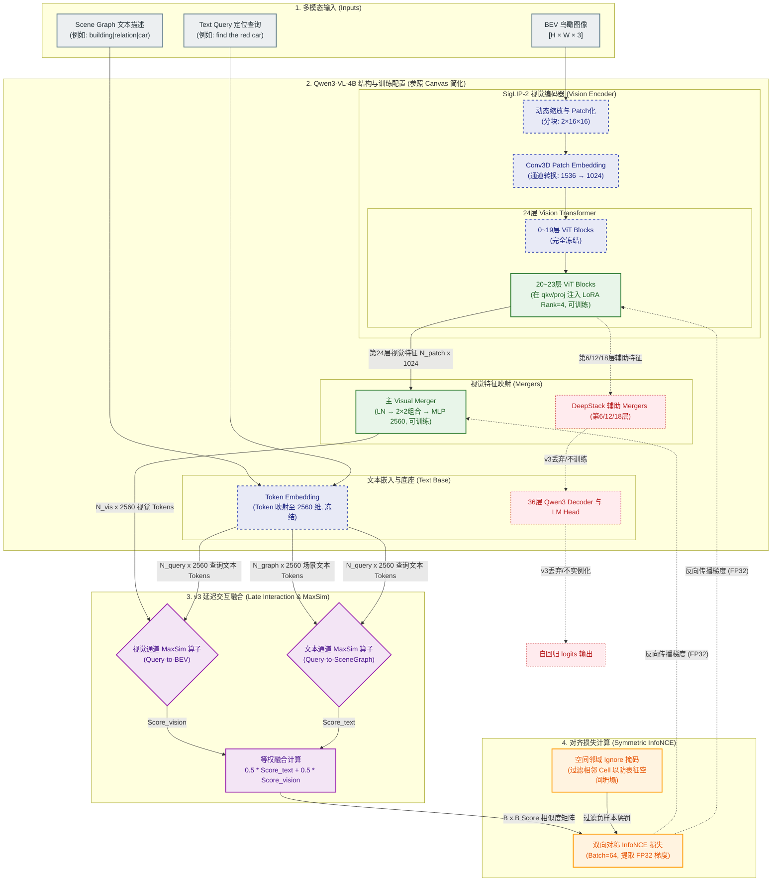

# UniPR v3 阶段性成果报告：原生 Token Late Interaction 架构与大规模实验分析

本篇文档记录了 UniPR v3 阶段的原生 Token 延迟交互（Late Interaction）架构的设计、实现结构及全量实验结果与技术分析。

---

## 1. 架构与模块结构 (Architecture & Module Structure)

v3 阶段的核心代码全面切换至 `pre_lm_late_interaction_v1` 协议体系。其主要组成部分和运行指令流结构如下：

### 1.1 核心命令流 (CLI Command Flow)

UniPR v3 阶段通过规范的七步命令行流水线实现全自动的数据处理、训练与对比决策：
1. **`data`**：清洗 KITTI-360 空间坐标，建立 Scene-Graph、BEV 图像和 Query 定位语句的关联清单。
2. **`select`**：按随机种子对 5,120 个场景 Cell 执行数据分割，锁定 Train / Val 集合。
3. **`cache`**：离线提取并落盘 Pre-LM Ragged Token（支持多 Shards 校验与读取）。
4. **`baseline`**：计算词面（BoW）、BM25 与随机检索基准指标。
5. **`evaluate`**：执行 zero-shot（Frozen）或模型 Checkpoint 的全量多维度指标评测。
6. **`train`**：执行 `merger_only` 或 `vision_lora4` 模式的分布式/混合精度梯度更新。
7. **`compare`**：读取各候选模型的评测报告，运行 1000 次 Bootstrap 置信对比，决出 Winner。

### 1.2 多向量延迟交互匹配结构 (Late Interaction Matcher)
区别于 v2 版本的单向量压缩（Single Vector Bottleneck）模式，v3 采用了 ColBERT 风格的 Token 级多向量对齐架构：
* **Scene 场景表征分流**：
  - **文本通道 (Scene Graph)**：Scene Graph 结构化关系采用 `structured_v2` 编码模式，即格式化为 `颜色|类别|九宫格位置;...;类别|关系|类别` 的固定关系序列串。该文本串通过 Qwen3-VL 冻结的 `Token Embedding` 提取特征，生成 `N_graph x 2560` 的场景文本 Tokens。
  - **视觉通道 (Scene BEV)**：BEV 鸟瞰图像通过 Qwen 视觉编码器及 Merger 提取特征，生成 `N_vis x 2560` 的场景视觉 Tokens。
* **Query 场景表征**：定位查询 Query 文本由 Qwen 冻结的 `Token Embedding` 直接编码为 `N_query x 2560` 维特征。
* **双通道融合公式**：
  $$\text{Score} = 0.5 \times \text{MaxSim(Query, Scene-Graph)} + 0.5 \times \text{MaxSim(Query, Scene-BEV)}$$
  通过将文本-文本（Text-Text）与文本-视觉（Text-Vision）的分数解耦计算，防止完全一致的文本 Token 掩盖视觉特征 of 梯度。

### 1.3 训练模式划分 (Training Profiles)
设计并实现了两种不同的视觉侧微调配置，两组配置均从 Qwen3-VL 原始权重独立初始化：
1. **`merger_only_v1`**：底座 24 层 ViT 视觉主干完全冻结，仅训练顶部的 Cross-Attention Merger 融合投影层。
2. **`vision_lora4_v1`**：微调 Merger 层的同时，在 ViT 主干 of 20--23 层注入 Rank=4 / Alpha=16 的视觉 LoRA 模块进行协同训练。
*(注：文本/语言侧在整个微调过程中保持 100% 冻结)*

### 1.4 Ragged 离线缓存结构 (Pre-LM Input Cache)
利用 Ragged Safetensors 技术将 Input IDs、视觉/文本占位符、BF16 像素 Tensor 等信息预先持久化为 80 个 Shards。在 `q5120_fair` 规模下可节约 **95% 以上**的重复前向推理功耗，显著提速训练。

### 1.5 训练与融合架构数据流 (Training & Fusion Architecture Dataflow)

为了清晰呈现 Qwen3-VL 的训练范围、文本-视觉双通道融合机制以及空间重叠忽视的损失函数设计，数据流及反向传播路径定义如下：

---

## 2. 设计思路 (Design Rationale)

v3 版本的升级背后包含了以下关键学术与工程设计考量：

1. **保留细粒度局部语义**：
   v2 版本的双塔单向量架构（Bi-Encoder）虽然检索速度快，但在高维空间中丢失了实体与位置的精确交叉感知。v3 保留多向量序列，旨在利用 **MaxSim** 算子实现 Query 中具体指示词（如 "building on the left"）对场景中特定 BEV 视觉片段的精准局部映射。
2. **严密的指纹合同与防泄漏门禁**：
   为保证物理定位研究的科学性，引入了极其严苛的 `fingerprint` 合同。缓存数据、训练记录、Checkpoint 以及评测文件均绑定代码/依赖/空间坐标库的多重 SHA256 哈希，任何版本不一致均会拒绝读取。
3. **两遍梯度重放 (Gradient Cache)**：
   针对 4090 等消费级显卡的显存限制，在进行多向量 late interaction 梯度回传时，实现了带有随机数种子（RNG）重放的双遍视觉 Gradient Cache 算法，确保在 microbatch=4 的情况下也能获得与大 batch 相同的数学梯度。

---

## 3. 实现与评测效果 (Performance & Experimental Results)

已经在远程 GPU 服务器上完成了中规模 (`q512_fair`) 与全量规模 (`q5120_fair`) 的端到端训练与显著性评测：

### 3.1 实验对照结果数据

| 实验规模 | 模型 Profile | 候选库 Cells 数 | 测试 Queries 数 | Exact Cell R@1 | Exact R@5 | MRR | 15m 定位 R@1 |
| :--- | :--- | :---: | :---: | :---: | :---: | :---: | :---: |
| **`q512_fair` (诊断)** | `frozen_v1` (零样本) | 128 | 327 | 0.0581 | 0.2966 | 0.1789 | 0.1162 |
| | `merger_only_v1` | 128 | 327 | 0.0489 | 0.0948 | 0.1074 | 0.0734 |
| | `vision_lora4_v1` | 128 | 327 | **0.0734** | 0.2385 | 0.1687 | 0.1040 |
| **`q5120_fair` (全量)** | `frozen_v1` (零样本) | 1,280 | 2,810 | **0.0178** | **0.0712** | **0.0548** | **0.0658** |
| | `merger_only_v1` | 1,280 | 2,810 | 0.0164 | 0.0470 | 0.0407 | 0.0541 |
| | `vision_lora4_v1` | 1,280 | 2,810 | 0.0060 | 0.0352 | 0.0298 | 0.0402 |

*(注：全量大库下的随机盲猜基线 Exact R@1 仅为 0.078%)*

### 3.2 深度归因与表现退化分析 (Failure Analysis)

在小规模 `q512_fair` 上，`vision_lora4_v1` 微调表现优于零样本基准。但在全量 `q5120_fair` 验证集上，**微调后效果反而呈断崖式下滑（`frozen` > `merger` > `vision_lora`）**。技术根源在于：

1. **地理连续场景下的 InfoNCE 缺陷**：
   InfoNCE 损失强行将除了当前 Cell 之外的所有样本作为硬负样本。但在 KITTI-360 连续轨迹中，相邻几十米的街道、建筑极度相似。强行拉开这些相似 Cell 的表征，直接导致模型发生了**特征空间坍塌（Representation Collapse）**。
2. **LoRA 破坏了 VLM 基底泛化力**：
   由于上述负样本惩罚矛盾，微调 Qwen 视觉 Backbone（`vision_lora4`）不仅没有学到更好的规则，反而污染了 VLM 预训练的优秀通用语义特征。只改动外层 Merger 的效果（1.64%）显著好于改动底座的 LoRA（0.60%）。
3. **双塔架构 (v2) 与延迟交互 (v3) 的匹配机制差异**：
   v2 版本利用 MLP/GRU 将特征压缩，依靠全局词袋特征避开了局部邻近噪音；而 v3 的 late interaction 对局部相似 token 高度敏感，因而在未对齐局部坐标时，相比 v2 更容易发生语义漂移与退化。

