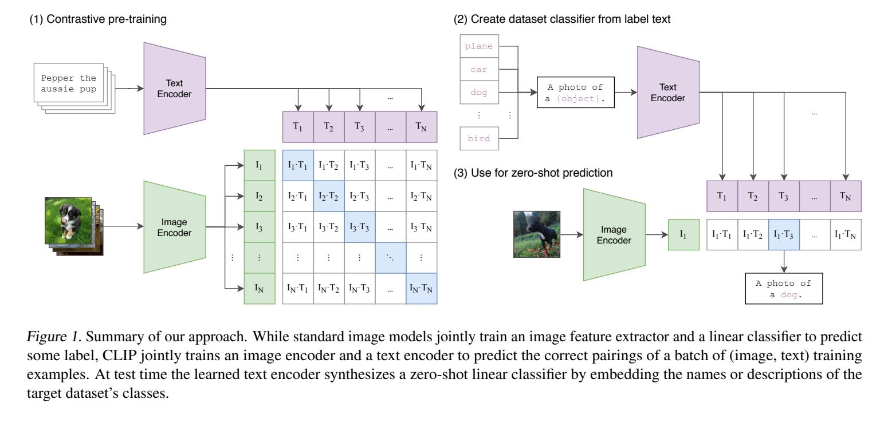

**原文**: [本地](../论文原件/CLIP.pdf) [arXiv](https://arxiv.org/abs/2103.00020)

# 一句话记忆

CLIP 在 4 亿组互联网图文对上训练图像—文本双编码器，用对称交叉熵识别批内正确配对；推理时把自然语言类别描述编码为分类器权重，从而无需针对每个分类数据集重新训练参数即可进行零样本迁移。

# 研究问题

## 以前的方法

以前主流的计算机视觉系统通常在固定的、预定义的对象类别集合（如 ImageNet 1000 类）上进行有监督训练，随后通过微调特征层迁移到下游任务。

## 存在的问题

1. **泛化性与扩展性受限**：由于类别集合固定，模型无法泛化到预定义类别之外的视觉概念。每次添加新类别都需要昂贵的重新标注和微调过程。
2. **文本监督生成效率极低**：虽然此前有研究尝试从自由文本（如 Caption 任务）学习视觉表示，但自回归图像字幕生成模型必须预测精确的单词序列（如基于 Transformer 的语言模型），由于多样的表达方式使得任务过难，学习 ImageNet 零样本分类的效率极低（比词袋 BoW 慢 3 倍，比对比对齐慢 12 倍）。

## 论文试图解决什么

如何在不需要昂贵手工标注的前提下，利用海量无标签网络图文数据进行高效的大规模对比预训练，构建一个可进行灵活、开放的零样本转移的视觉表示模型。

# 核心洞察

- **研究洞察**：
  1. **把生成任务改写为配对判别**：作者先发现 Transformer 文本生成目标达到相同零样本 ImageNet 精度时，比词袋预测慢约 3 倍；再把词袋预测换成图文对比目标，效率又提高约 4 倍。常说的“约 12 倍”是这两个相对倍数的组合，不是端到端训练时长的直接测量。
  2. **将文本表征用作分类器权重**：在测试阶段，通过让文本编码器提取包含类别标签的 Prompt 的特征向量，直接作为最后一层分类器的分类权重，从而实现真正无需微调的开放式零样本图像分类。

- **工程实现**：
  1. **线性映射与共享嵌入空间**：两个编码器之后仅使用线性投影并进行 $L_2$ 归一化。作者称没有观察到线性与非线性投影的训练效率差异；这不是完整的下游性能消融，也不能推出非线性投影普遍无效。
  2. **可学习相似度温度裁剪**：相似度矩阵中乘上的温度参数 $\tau$ （以可学习的 $t = \log(1/\tau)$ 形式优化）必须被裁剪（限制为最陡峭 $\tau \ge 0.01$），以防止多模态训练时的梯度数值不稳定。
  3. **提示词工程与集成（Prompt Engineering & Ensembling）**：使用特定任务上下文模板（例如 `A photo of a {label}, a type of pet.`）解决多义词歧义，并将 80 个不同 Prompt 生成的文本嵌入特征在向量空间内求平均，构建集成特征，使 ImageNet zero-shot 分类精度提升了 3.5%。

- **普通组件**：
  - 图像编码器采用标准的 ResNet（加入注意力池化）或 Vision Transformer；文本编码器采用标准的 Decoder-only Transformer。

# 方法流程

方法流程的总体框架见首图 。

- **1. 训练阶段流程**：
  输入图像批次与文本批次 $\rightarrow$ 图像编码器 (ResNet/ViT) 与文本编码器 (Transformer) 提取原始特征 $\rightarrow$ 线性投影层各自进行线性变换映射至多模态共享空间 $\rightarrow$ 进行 $L_2$ 归一化 $\rightarrow$ 计算图像嵌入和文本嵌入的余弦相似度矩阵 $\rightarrow$ 乘以可学习温度度量参数 $e^t$ $\rightarrow$ 沿行与列同时计算交叉熵损失（对称 InfoNCE 损失）以优化模型。

- **2. 推理/零样本分类流程**：
  输入类别标签经 Prompt 模板格式化为文本描述 $\rightarrow$ 文本编码器与投影矩阵提取文本嵌入权重矩阵 $\rightarrow$ 输入待分类图像由图像编码器与投影矩阵提取图像嵌入向量 $\rightarrow$ 计算两者之间的余弦相似度得到 logits $\rightarrow$ 通过 Softmax 计算各类别的输出概率。

# 关键模块

- **图像编码器 (Image Encoder)**
  - 输入：图像 Batch $I \in \mathbb{R}^{N \times H \times W \times C}$ (图像模态)
  - 输出：视觉表示向量 $I_f \in \mathbb{R}^{N \times d_i}$ (特征向量)
  - 作用：提取高维空间和语义信息。ResNet 版本将全局平均池化（GAP）替换为多头 QKV 注意力池化（Query 以全局平均特征作为 Query 条件），以便更好地捕捉语义关键区域。
  - 为什么需要：视觉模态特征提取的基础。
  - 去掉后可能发生什么：模型无法理解和处理视觉输入；如果使用标准的 ResNet 且没有注意力池化，模型在相同算力下的训练效率和下游迁移表现会显著下降。

- **文本编码器 (Text Encoder)**
  - 输入：分词后的 Token 序列 $T \in \mathbb{R}^{N \times L}$ (文本模态，使用 49,152 vocab 的 BPE)
  - 输出：文本表示向量 $T_f \in \mathbb{R}^{N \times d_t}$ (特征向量)
  - 作用：对文本语义建模，并取文本最尾部 `[EOS]` token 的隐藏层激活值作为全局特征。
  - 为什么需要：把自然语言转化为与视觉特征维度可对齐的文本特征。
  - 去掉后可能发生什么：模型无法接收文本输入或将自然语言解释为离散的监督信号，丧失跨模态对比学习和零样本分类的能力。

- **共享线性投影层 ($W_i, W_t$)**
  - 输入：编码器输出特征 $I_f$ 与 $T_f$ (特征向量)
  - 输出：相同维度的多模态特征 $I_e, T_e \in \mathbb{R}^{N \times d_e}$ (多模态嵌入向量)
  - 作用：各自进行线性变换，并在投影后进行 $L_2$ 归一化。
  - 为什么需要：使文本和图像空间维度统一，支持计算内积（余弦相似度）。
  - 去掉后可能发生什么：由于图像和文本编码器的输出通道数不同，无法直接计算余弦相似度；如果采用非线性投影（如 SimCLR 风格的 MLP），消融实验表明预训练效率并不会提升。

# 训练目标或核心公式

令一批共 $N$ 个图文对的归一化图像向量为 $I_{e, i} \in \mathbb{R}^{d_e}$，归一化文本向量为 $T_{e, j} \in \mathbb{R}^{d_e}$。

计算 scaled 对比相似度：

$$\text{logits}_{i, j} = I_{e, i} \cdot T_{e, j}^T \cdot e^{t}$$

其中 $t = \log(1/\tau)$ 为可学习温度的对数值。

对称交叉熵损失为：

$$\mathcal{L} = \frac{1}{2} (\mathcal{L}_I + \mathcal{L}_T)$$

$$\mathcal{L}_I = -\frac{1}{N} \sum_{i=0}^{N-1} \log \frac{e^{\text{logits}_{i, i}}}{\sum_{j=0}^{N-1} e^{\text{logits}_{i, j}}}$$

$$\mathcal{L}_T = -\frac{1}{N} \sum_{j=0}^{N-1} \log \frac{e^{\text{logits}_{j, j}}}{\sum_{i=0}^{N-1} e^{\text{logits}_{i, j}}}$$

- **优化目标**：提高正确图文对在每一行、每一列 Softmax 中的相对概率，并压低批内错配对的概率。损失只约束相对 logits；即使余弦相似度有 $[-1,1]$ 的范围，也不要求正样本收敛到 1、负样本收敛到 -1。
- **正负样本定义**：对第 $i$ 张图而言，$T_{e, i}$ 是唯一的正样本，其余 $N-1$ 个文本均为负样本；对第 $j$ 个文本而言，$I_{e, j}$ 是唯一正样本，其余 $N-1$ 张图均为负样本。
- **温度变量 $t$**：$t$ 控制 logits 相似度的取值尺度。如果 $\tau$ 太小，模型对负样本分配的概率会极端自信；如果 $\tau$ 太大，概率分布会过度平缓。将其作为一个在训练中被直接优化的 log-parameterized 参数，并在训练中限制边界值 $\tau \ge 0.01$，以保证训练稳定性。
- **对特征空间的影响**：通过拉近配对图像与文本在共享嵌入空间中的距离，推远非配对图像与文本的距离，在嵌入空间中形成一个紧密对齐的多模态联合语义空间。

# 实验证明了什么

- **实验问题 1：零样本 CLIP 是否在视觉分类任务上具有良好的迁移能力？**
  - **比较对象**：Visual N-Grams 以及传统的有监督基线。
  - **观察结果**：零样本 CLIP 极大改善了开放域分类性能。ImageNet 上的 zero-shot 准确率达到了 76.2%（远超 Visual N-Grams 的 11.5%）。
  - **支持的结论**：使用网络规模的自然图文对进行预训练，可以学到可迁移到多种视觉任务的表征。
  - **不能支持的结论**：不能证明其可以在缺乏自然语言描述的纯特定工业检测或病理影像等极度特化的视觉领域上达到与专家监督模型匹敌的性能。

- **实验问题 2：零样本 CLIP 的性能与 few-shot 监督学习相比如何？**
  - **比较对象**：基于 CLIP 自身视觉特征微调的 linear probe（1-shot 到 128-shot），以及基于 SimCLRv2、BiT-M 等模型的 linear probe。
  - **观察结果**：零样本 CLIP 平均能与 4-shot 的线性探测分类器相媲美，接近 16-shot 的水平，且没有 few-shot 在极小样本集上训练时极易出现的过拟合现象。
  - **支持的结论**：CLIP 的零样本特征在大规模预训练中已经整合了极佳的泛化先验，使其在免微调时就具备超越少量样本监督学习的表现。
  - **不能支持的结论**：在拥有充沛标注样本的场景下，zero-shot 性能仍落后于全监督微调模型。

- **实验问题 3：零样本模型是否能提高对分布偏移（Distribution Shift）的有效鲁棒性？**
  - **比较对象**：在 ImageNet-1k 数据集上全监督训练的 ResNet-101 以及其他有监督适配器。评估在 5 个自然分布偏移的数据集上进行（ImageNet-V2, ImageNet-A, ImageNet-R, ObjectNet, ImageNet Sketch）。
  - **观察结果**：论文报告零样本 CLIP 在 5 个自然分布偏移数据集上将“有效鲁棒性差距”最多缩小 75%。在 CLIP 特征上用 ImageNet 训练 $L_2$ 正则 Logistic Regression 后，ImageNet 准确率提高 9.2 个百分点至 85.4%，但分布偏移下的平均准确率略有下降。
  - **支持的结论**：针对 ImageNet 的监督适配所得收益高度集中在接近 ImageNet 的分布上；该实验显示适配与鲁棒性下降相关。
  - **不能支持的结论**：论文明确提醒，这一结果不能单独证明监督学习导致鲁棒性差距；大规模多样数据与自然语言监督也可能是原因。`[AI分析]` 预训练与评估若共享同一虚假关联，零样本模型仍可能利用它，但不能把鲁棒性完全归因于 WIT 多样性。

# 局限与失效场景

- **局限 1：零样本性能在细粒度、抽象或系统性任务上表现疲软**
  - **产生原因**：网络爬取的噪声图文对较少包含特定的细粒度标签或复杂的计数与几何空间逻辑。
  - **可能失败的场景**：区分不同型号的轿车（Stanford Cars）、花卉品种（Flowers102）、飞机子类型（FGVCAircraft）；或进行更抽象的系统性任务，例如计算图像中物体的数量（CLEVRCounts）、估计与前车的距离（KITTI Distance）等，性能几近随机。
  - **对后续研究的意义**：后续工作需要研究如何引入更具组合性与结构化的多模态对齐损失，或针对细粒度属性进行局部特征增强。

- **局限 2：对真正域外数据（OOD）泛化性差**
  - **产生原因**：作者认为 CLIP 仍有脆弱泛化问题，并指出其高性能部分依赖于预训练数据覆盖足够广；但由于无法在 4 亿样本上彻底核查测试概念的覆盖，不能断言“绝大多数测试场景已经成为域内数据”。
  - **可能失败的场景**：在手写数字识别（MNIST）上零样本 CLIP 仅有 88% 准确率，连最简单的原始像素逻辑回归基线（90%+）都比不过。因为 WIT 中几乎没有 MNIST 这种风格的图文对。
  - **对后续研究的意义**：必须探索除了扩大数据量以外，模型结构和优化算法层面对真正 OOD 数据的泛化机制。

- **局限 3：数据和算力效率极其低下**
  - **产生原因**：论文估算训练过程共处理约 128 亿个图像样本（4 亿图文对按 32 个 epoch 计，包含重复访问），且 RN50x64 使用 592 张 V100 训练 18 天。这说明预训练计算量很高，但“看了 128 亿张不同图片”并不准确。
  - **对后续研究的意义**：启发了后续如数据高效型自监督学习（如 DINOv2）以及混合建模方法的研究。

# 与其他论文的关系

## 前置基础

- [[InfoNCE]]：提供对比对齐的核心损失函数（`uses-as-loss`）。
- [[Transformer]]：提供视觉与文本骨干网络的基础注意力机制（`uses-as-backbone`）。

## 同任务工作

- [[ALIGN-2021]]：同期的平行大规模图文对比预训练工作，使用包含 18 亿图文对的嘈杂数据集（`same-task`）。

## 后续改进

- [[VLM-Loc]]：在 3D 点云地图定位任务中借鉴了双塔跨模态对齐的思想，将 3D 点云 BEV 图像与文本描述进行对齐和微调（`extends-to`）。
- [[SpatiaLoc]]：利用空间关系描述与视觉特征进行交叉检索与定位（`extends-to`）。
- [[UniPR-3D]]：3D 地方识别，通过跨模态语义与 Token 对齐思路进行多帧特征聚合（`extends-to`）。
- [[DC-VLAQ]]：多模态长序列动作与视觉对齐（`extends-to`）。
- [[ColPali]]：将 CLIP 的双塔跨模态对齐思想扩展到基于图像的细粒度文档检索任务（`extends-to`）。

## 关键差异

- 与 [[ALIGN-2021]] 相比：CLIP 在数据清理上更为严苛，注重解决多义词与 Prompt 工程，而 ALIGN 则放宽了数据过滤条件以获取更大规模的嘈杂数据集。
- 与 [[SimCLR]] 相比：SimCLR 是单模态（视觉）自监督对比学习，通过图像增强构建正负样本；而 CLIP 是跨模态对比学习，天然地以配对的文本作为正样本。

# 对我的课题的启发

`[AI分析]`

1. **多模态对齐用于粗定位**：对于目前正在研究的 3D 地点识别与视觉/点云定位任务（如 [[VLM-Loc]]），CLIP 证明了双塔跨模态对齐是一种极佳的特征检索形式。可以使用预训练多模态编码器提取 BEV 图像（视觉）与场景描述（文本）特征，从而实现粗定位匹配。
2. **可学习温度的数值稳定性**：如果训练定制化的点云-文本匹配模块，余弦相似度的 Scaling 温度参数 $\tau$ 必须学习并约束边界（防止其变得过小），否则极易由于相似度矩阵的 Softmax 饱和而导致训练崩溃。
3. **鲁棒性权衡（Robustness Tradeoff）**：在利用有监督微调（如 Lora）对特定地图轨迹点位进行优化时，容易像 CLIP 在 ImageNet 上线性适配一样，导致模型丧失对光照、天气、季节等自然分布偏移的泛化鲁棒性。微调时需监控并在微调损失中引入正则化或混合微调。

# 主动回忆问题

## Level 1：主线恢复

- 简述 CLIP 是如何利用自然语言实现 zero-shot 图像分类的？推理时的输入和流程是什么？
- 什么是 WIT 数据集？它的规模是多少？

## Level 2：机制理解

- 为什么 CLIP选择对比学习损失（Contrastive Loss）而不是自回归的 Image Caption 生成损失？二者在预训练学习效率上差了多少倍？
- CLIP 在多模态投影（Projection）的设计上，与 SimCLR 等单模态自监督模型有什么不同？
- 提示词集成（Prompt Ensembling）为什么有用？它是如何进行的？

## Level 3：批判与迁移

- 为什么 CLIP 的 zero-shot 模型具有很强的分布鲁棒性，而一旦在 ImageNet 上拟合了 linear probe 之后，其对于分布偏移的有效鲁棒性就消失了？
- 在哪些视觉任务上，CLIP 表现出类似随机猜测的性能？这给我们的点云定位算法带来了什么警示？

# 尚未解决的问题

- 如何在 Few-shot 微调时既保持零样本模型极高的有效鲁棒性，又能大幅提升特定任务的精度（缓解鲁棒性丧失的 tradeoff）？
- 如何在对比表征中更好地引入组合性（Compositionality，如物体数量、空间方位关系等抽象逻辑，避免“词袋”效应）？

## 理解更新记录

- `2026-07-12`：由 AI 基于论文原件 PDF 自动生成并归档初始版本笔记。
- `2026-07-12`：由 Antigravity 依据新版 `paper-memory` 规范重构，将图片路径统一移至 `论文/images/CLIP/`，移除 Mermaid 流程图，并规范化了核心模块、公式、实验以及 Wiki 链接格式。
