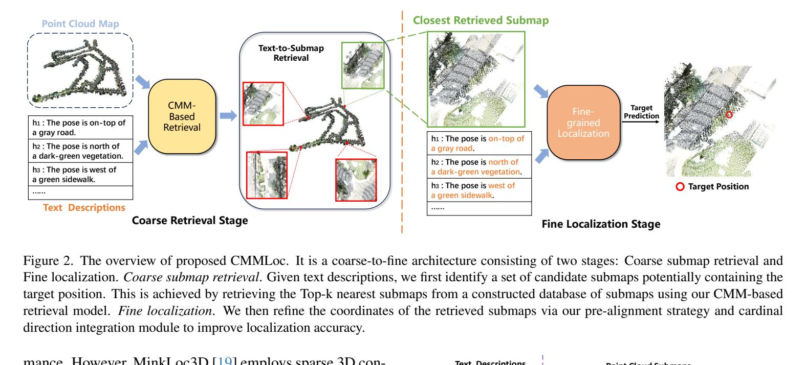
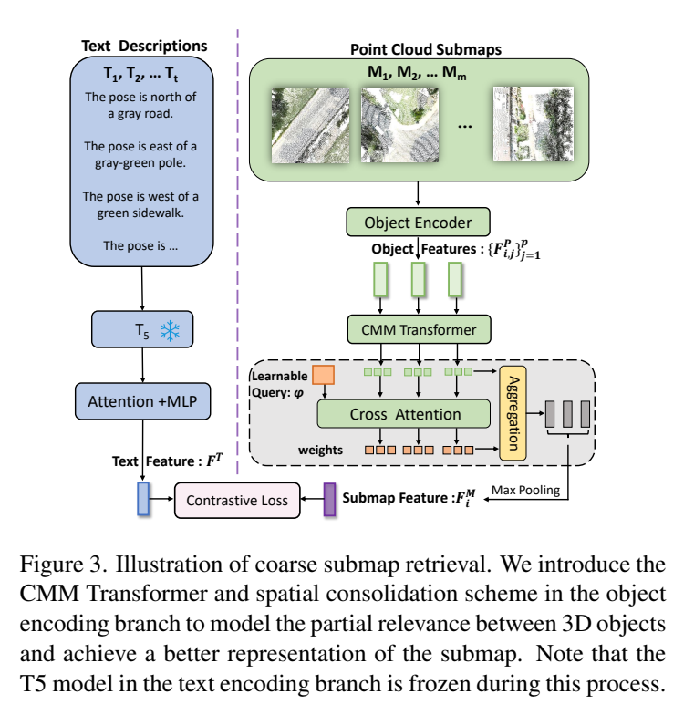
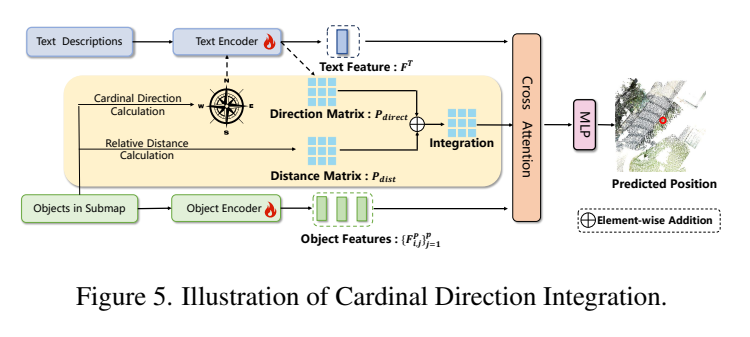
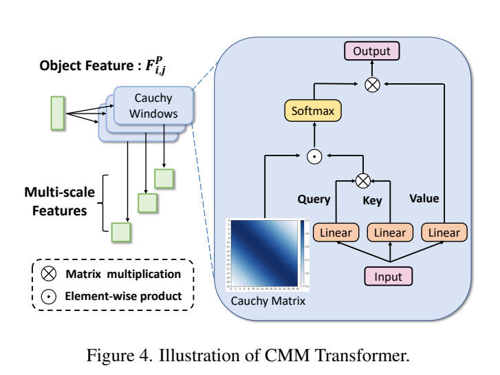

**原文**: [本地](../论文原件/CMMLoc.pdf) [arXiv](https://arxiv.org/abs/2503.02593)

**配套分析**：[[科研/论文/分析/CMMLoc|CMMLoc 公式分析]]

# 一句话记忆

CMMLoc 把“文本只描述子地图中少量显著物体”形式化为部分相关检索：粗阶段以多尺度 Cauchy 窗口和空间整合聚合子地图，细阶段在 [[Text2Loc]] 的免匹配回归上加入对象—文本预对齐与相对方向/距离偏置。

# 研究问题

## 以前的方法

以前主流的文本引导三维点云定位（Coarse-to-fine Pipeline，如 Text2Pos、RET、Text2Loc）通常先将大尺度城市地图划分为多个立方体子地图（Submaps），通过匹配文本查询与子地图中三维物体的全局描述符来检索候选子地图，再在细粒度阶段基于目标坐标回归预测最终位置。

## 存在的问题

1. **忽略了场景与文本的“部分相关性”（Partial Relevance）**：在网约车接送、货物派送等实际场景中，乘客或用户往往仅描述其周边最显著和最贴近的几个标志性环境（如：“我正站在一条黑色柏油路旁，东北方有一堵红砖墙”），而不会描述整个子地图内的所有 3D 物体（例如背景中的其他建筑物、车辆等不相关物体）。
2. **文本到三维物体匹配的不确定性**：这种选择性描述给匹配过程引入了极大的噪声和不确定性。由于现有的双塔匹配网络无法有效识别并滤除那些未在文本中提及的无关 3D 物体（Irrelevant Objects），导致粗检索阶段的子地图特征容易受到污染，从而降低了粗检索与细粒度定位的精度。

## 论文试图解决什么

如何从机制上显式建模文本与 3D 点云物体之间的局部相关性和语义匹配不确定性，在粗检索阶段过滤无关噪声物体的干扰，在细粒度定位阶段克服多模态语义鸿沟以及位置编码缺乏相对方位信息的问题，实现更精确的大尺度三维户外点云定位。

# 核心洞察

- **研究洞察**：
  1. **以重尾窗口保留弱关联**：柯西分布比高斯分布衰减慢，语义排序后即使对象索引相距较远也保留非零权重。论文的解释是：这可减弱无关对象影响而不将其硬删除；Table 3 的 CMMT 对 GMMFormer 小幅增益支持该设计，但不能证明对任意离群噪声都鲁棒。

- **工程实现**：
  1. **基于语义相似度排序的多尺度柯西窗口（CMMT-SC）**：自注意力权重与柯西掩码矩阵 $W_c$ 进行 Hadamard 积。由于按物理空间距离排序效果较差，CMMLoc 将语义分割后具有相同语义类别的物体进行归类分组并随机排序作为输入。利用 $N$ 个并行不同尺度的柯西窗口（CMMT）提取不同感受野的多尺度物体特征，并设计了一个基于可学习查询 $\phi$ 的交叉注意力空间整合方案（Spatial Consolidation Scheme, SC）来对多尺度特征进行自适应加权融合，最后通过 Max Pooling 生成子地图全局描述符。
  2. **跨模态预对齐（Pre-alignment）与基数方向整合（CDI）**：
     - **预对齐（PA）**：在微调定位模型前，利用 MSE 损失预训练拉近 3D 物体的颜色/类别特征与文本编码器提取的颜色/类别标签嵌入之间的空间距离，使得 3D 特征更加“像语言”，以克服模态差距。
     - **基数方向整合（CDI）**：计算子地图中物体之间的成对距离，并使用文本编码器将相对基数方向（如“东”、“西”等）编码为方向矩阵，两者结合作为偏置融入自注意力计算中（在 Softmax 前累加），以克服传统绝对坐标编码难以捕获物体相对几何方位的缺点。

- **普通组件**：
  - 文本端采用冻结的预训练 T5 语言模型，后接上下文 Attention 层与 MLP；3D 物体端采用 PointNet++ 提取物体的语义嵌入，结合颜色、位置、点数 MLP 编码器拼接而成。

# 方法流程

方法流程的总体框架见首图 。

## 1. 粗检索阶段（Coarse Submap Retrieval Stage）

在粗检索阶段，系统利用双塔结构对输入的文本和子地图进行匹配，其详细特征处理流程如图所示：

- **文本分支**：文本查询经冻结的 T5 编码器与 Transformer 上下文建模，得到全局文本特征 $F_T$。
- **点云分支**：子地图点云分割为多个 3D 物体，分别用 PointNet++ 和多层感知机提取语义、颜色、位置、点数特征并拼接。拼接后的物体特征通过 CMMT（多尺度柯西窗口自注意力）进行局部关联建模，然后由空间整合方案（SC）自适应融合多尺度特征，最后经 Max Pooling 提取全局子地图特征 $F_M$。
- **损失函数**：计算 $F_T$ 与 $F_M$ 的对称双向对比损失（InfoNCE）对齐特征空间。

## 2. 细粒度定位阶段（Fine Localization Stage）

在检索出候选子地图后，通过多模态特征交互和方位偏置回归预测具体的 $(x, y)$ 坐标，流程如图所示：

- **模态预对齐**：使用 MSE 损失最小化 3D 物体的颜色与类别特征在嵌入空间中与文本嵌入的距离。
- **基数方向整合（CDI）**：基于三维物体中心坐标计算成对距离，并使用文本编码器将物体间的相对基数方向编码为方向矩阵，组合成相对位置偏置 $P$。
- **注意力交互与回归**：对齐后的物体特征在自注意力计算中加入 CDI 偏置 $P$，对特征进行加权聚合后，通过回归器 MLP 预测最终的相对坐标 $(x, y)$。

# 关键模块

关键模块中柯西自注意力的计算结构如图所示：

- **CMM Transformer（柯西混合模型 Transformer）**
  - 输入：物体初始特征矩阵 $X_i \in \mathbb{R}^{p \times d}$（3D 点云模态，其中 $p$ 为物体数量，最大为 28，$d$ 为通道维度）
  - 输出：自注意力局部建模后的物体表征 $X^{\text{output}}_i \in \mathbb{R}^{p \times d}$（3D 点云模态）
  - 作用：在自注意力分数上施加柯西密度掩码矩阵 $W_c$，以此对子地图内的物体进行局部关联建模。
  - 为什么需要：在 Transformer 的多头注意力中显式处理局部相关性，利用柯西分布的重尾特征削弱非相关物体的匹配权重，增强对分割离群值的抗噪能力。
  - 去掉后可能发生什么：验证集粗检索 Top-1 召回率从 0.35 降低至 0.32。

- **空间整合方案（Spatial Consolidation Scheme, SC）**
  - 输入：$N$ 个并行不同尺度柯西窗口输出的多感受野特征矩阵 $\{X^{\text{output}}_{i,n}\}$
  - 输出：自适应融合后的特征表示 $\tilde{X}^{\text{output}}_i$
  - 作用：利用一个可学习查询向量 $\phi$ 生成交叉注意力分配权重，以此对不同尺度下的特征进行自适应加权整合。
  - 为什么需要：点云物体分布稀疏、形状不规则，不同尺度窗口的重要性不应固定。
  - 去掉后可能发生什么：验证集粗检索 Top-1 召回率从 0.35 降低至 0.33。

- **预对齐模块（Pre-alignment, PA）**
  - 输入：三维点云提取的颜色/类别特征 $F^P_{\text{color}}, F^P_{\text{object}}$；对应的文本颜色/类别信息编码特征 $F^T_{\text{color}}, F^T_{\text{label}}$
  - 输出：对齐初始化后的编码器权重
  - 作用：通过最小化二者的均方误差，在定位任务训练前将 3D 物体特征拉近到文本模态。
  - 为什么需要：点云和文本具有极大的跨模态差异，直接强行做定位对齐难度过大，预对齐能为精细定位提供优良的权重初始化。
  - 去掉后可能发生什么：精细定位（$\epsilon < 5m$）在测试集上的 Top-1 定位精度由 0.39 降低至 0.38。

- **基数方向整合模块（Cardinal Direction Integration, CDI）**
  - 输入：子地图内各个物体的中心点坐标
  - 输出：相对位置偏置矩阵 $P \in \mathbb{R}^{p \times p}$
  - 作用：计算对象对的距离，并将相对 cardinal direction 作为文本编码后与距离项相加；所得 $P$ 在 softmax 前加入注意力 logits。论文正文未枚举方向类别数，因此不写成确定的“八个方向”。
  - 为什么需要：常规的绝对坐标位置嵌入只反映单物体的绝对位置，不足以描述文本描述中频繁出现的“A 在 B 的西边”这种相对空间约束。
  - 去掉后可能发生什么：精细定位（$\epsilon < 5m$）在测试集上的 Top-1 定位精度由 0.39 降低至 0.38。

# 训练目标或核心公式

## 1. 柯西矩阵与掩码自注意力

CMM 掩码权重分配基于物体按语义类别分组后的索引差值：

$$W_c(i, j) = \frac{1}{\pi \gamma \left[1 + \left(\frac{j-i}{\gamma}\right)^2\right]}$$

其中 $\gamma$ 是柯西分布的尺度参数，控制窗口感受野。

CMM 掩码下的自注意力计算公式为：

$$X^{\text{attn}}_i = \text{Softmax}\left(\frac{W_c \odot \left(X_i W_q (X_i W_k)^{\top}\right)}{\sqrt{d_k}}\right) X_i W_v$$

- **优化目标**：通过乘以 $W_c$ 偏置调整自注意力分数，使得在类别分组中索引越近的物体自注意力权重越大。
- **正负样本定义**：此步骤为特征内部建模，不涉及正负样本。
- **关键变量**：$\gamma$ 调控柯西重尾分布的窗口尺度；$\odot$ 为 Hadamard 积，对权重进行空间约束过滤。
- **特征空间影响**：相比 Gaussian 窗口，Cauchy 的长尾让远索引对象保留更大权重。Table 3 显示 CMMT 的测试 Recall@1 为 0.31、GMMFormer 为 0.30；证据支持“小幅更优”，不足以外推为“极强抗噪”。

## 2. 粗检索阶段对比损失（Contrastive Loss）

采用对称 InfoNCE 对 Batch 规模为 $B$ 的特征进行约束：

$$l(i, T, M) = -\log \frac{\exp(F^T_i \cdot F^M_i / \tau)}{\sum_{j=1}^B \exp(F^T_i \cdot F^M_j / \tau)} - \log \frac{\exp(F^M_i \cdot F^T_i / \tau)}{\sum_{j=1}^B \exp(F^M_i \cdot F^T_j / \tau)}$$

- **优化目标**：最小化检索损失，拉近配对的文本与子地图在嵌入空间中的距离，推远非配对的样本。
- **正负样本定义**：对第 $i$ 个文本 $F^T_i$ 而言，配对的子地图特征 $F^M_i$ 为正样本，Batch 内其他 $B-1$ 个子地图特征为负样本；反之亦然。
- **关键变量**：$\tau$ 是预设的温度系数（设置为 0.1）。

## 3. 细粒度定位损失

- **预对齐 MSE 损失**：

$$\mathcal{L}_{\text{pre}} = \|F^P_{\text{color}} - F^T_{\text{color}}\|_2^2 + \|F^P_{\text{object}} - F^T_{\text{label}}\|_2^2$$

  - **优化目标**：最小化模态差距，使 3D 物理表征（颜色/类别）空间投影尽可能逼近文本语义向量。

- **坐标回归 MSE 损失**：

$$\mathcal{L}(P_{\text{gt}}, P_{\text{pred}}) = \|P_{\text{gt}} - P_{\text{pred}}\|_2^2$$

  - **优化目标**：最小化二维预测坐标 $P_{\text{pred}} = (x, y)$ 与真实坐标 $P_{\text{gt}}$ 之间的欧氏距离。

# 实验证明了什么

- **实验问题 1：CMMLoc 与现有的 SOTA 方法相比，定位和检索能力如何？**
  - **比较对象**：[[Text2Pos (Kolmet et al., 2022)]]、[[RET (Wang et al., 2023)]]、[[Text2Loc (Xia et al., 2024)]]。
  - **观察结果**：
    - **子地图粗检索召回率（SOTA）**：验证集 Top-1 达到 **0.35**（超越先前最佳方法 Text2Loc 的 0.32）；测试集 Top-1/3/5 分别达到 **0.32/0.53/0.63**（比 Text2Loc 分别提高 14%/9%/8%）。
    - **细粒度定位召回率（SOTA）**：在误差阈值 $\epsilon < 5m$ 下，验证集 Top-1 定位成功率达到 **0.44**，测试集达到 **0.39**（相比 Text2Loc 分别提升 19% 和 18%）。
  - **支持的结论**：在相同 KITTI360Pose 设置下，部分相关建模与细阶段增强共同改善结果；整条系统对比不能单独量化每个模块的因果贡献，需结合 Tables 3–4。
  - **不能支持的结论**：不能保证在没有高质量 3D 物体候选边界框（Bounding Box）的完全无约束点云场景中的鲁棒性。

- **实验问题 2：柯西分布相比高斯分布在处理部分相关性时是否确实更有优势？**
  - **比较对象**：Transformer 基线、GMMFormer（基于高斯混合模型的 Transformer）、CMMT（本文的柯西混合 Transformer）。
  - **观察结果**：CMMT（测试集 Top-1 召回率 0.31）不仅优于 Transformer 基线（0.28），而且也超越了 GMMFormer（0.30）。
  - **支持的结论**：在该数据集和实现下，CMMT 比 Gaussian 版本小幅更优；这与重尾设计动机一致，但不构成普遍优越性的证明。
  - **不能支持的结论**：在极端密集且不存在部分相关性（即文本描述完全覆盖场景）的简单场景中，柯西分布未必表现出绝对的优势。

- **实验问题 3：物体语义标签受到分割噪声污染时，CMMLoc 稳定性如何？**
  - **比较对象**：在不同噪声比率（0.0 至 0.3 随机替换物体标签）下评测 CMMLoc 与 Text2Loc。
  - **观察结果**：随标签噪声率上升，性能下降；噪声率 0.1 时仍高于 Text2Loc，0.2 时与 Text2Loc 相当（Fig. 7）。
  - **支持的结论**：模型对中等模拟标签噪声有一定容忍度，同时明确依赖语义标签。
  - **不能支持的结论**：论文只展示有限噪声区间，未验证 $>30\%$ 时会“急剧退化”，也未据此证明可直接部署。

# 局限与失效场景

- **局限 1：依赖对象级语义标签**。语义标签决定 Cauchy 窗口中的分组/排序；Fig. 7 已显示标签噪声越高性能越低。论文仅模拟标签替换，没有评测完整语义分割管线的跨域误差。
- **局限 2：证据范围单一**。训练和测试均来自 KITTI360Pose；跨城市、无颜色点云、自由人类描述及动态场景没有验证。因此 SOTA 结论仅限该 benchmark 和论文列出的基线。

# 与其他论文的关系

## 前置基础

- [[CLIP]]：提供跨模态对比学习和共享 embedding 空间的关系（`builds-on`）。
- [[PointNet++ (Qi et al., 2017)]]：作为 3D 语义特征提取的基础 3D Backbone（`uses-as-backbone`）。
- [[T5 (Raffel et al., 2020)]]：作为冻结的文本预训练编码器（`uses-as-backbone`）。

## 同任务工作

- [[Text2Pos (Kolmet et al., 2022)]]：首个将 3D 点云-文本定位形式化并提出 KITTI360Pose 数据集和 coarse-to-fine 定位路线的工作（`same-task`）。
- [[RET (Wang et al., 2023)]]：通过引入关系增强型 Transformer 改进跨模态对齐（`same-task`）。
- [[Text2Loc (Xia et al., 2024)]]：细粒度定位阶段使用回归定位网络，CMMLoc 在其基础上对粗阶段 CMMT 架构与细阶段方位注意力进行了多重改进（`improves`）。

## 思想相似

- [[GMMFormer (Wang et al., 2024)]]：面向视频部分相关检索设计的高斯混合模型，CMMLoc 将其概念迁移并泛化至 3D 定位领域，并改进为对异常值更鲁棒的柯西分布（`similar-idea`）。

# 对我的课题的启发

`[AI分析]`：

1. **重尾分布偏置用于处理交互中的不确定性**：在人机交互、具身智能定位或跨模态图像/点云检索中，用户描述由于语言表达的有限性总是表现出强烈的“部分相关性”。在注意力矩阵中加入具有重尾特性的分布掩码（如柯西分布、Student-t 分布），比单纯的高斯窗口能更鲁棒地抑制不相关背景噪声的权重，对处理输入信息的不完备性非常关键。
2. **显式相对方位矩阵偏置**：对于户外自动驾驶定位或机器人轨迹跟踪任务，单一的绝对位置编码难以捕捉物体间的几何约束。通过成对距离和相对基数方位信息计算出偏置矩阵 $P$ 直接修改 Softmax 前的 Attention Score，能为多模态网络提供强烈的几何相对感知力，是一个值得迁移到其他 3D 视觉定位任务中的通用模块。

# 主动回忆问题

## Level 1：主线恢复

- 什么是文本引导 3D 点云定位中的“部分相关性（partial relevance）”？它为什么会影响以往粗检索阶段的匹配表现？
- CMMLoc 在 coarse-to-fine 流水线中的粗检索与精细定位阶段，分别引进了哪些核心改进模块？

## Level 2：机制理解

- 为什么柯西分布比高斯分布更适合建模部分相关问题中的不确定性？它的重尾特性在注意力分配中起到了什么作用？
- CDI 模块是如何计算物体相对空间方位信息的？它最后是如何干预自注意力计算的？
- 为什么在 CMMT 编码 3D 物体时，需要先将物体按语义类别进行排序分组，而不是直接按物理空间距离排序？

## Level 3：批判与迁移

- 为什么在 CMMLoc 中连续堆叠两层 CMMT-SC 会导致定位性能的剧烈退化（低于单层甚至是 Baseline）？从物理机制上该如何解释？这给网络架构的深度设计带来了什么启示？
- 在极度嘈杂、未见过的混乱场景中，如果 semantic segmentation 准确度大幅下跌至 70% 以下，CMMLoc 的性能预计会如何退化？有什么机制可以用来缓解这种退化？

# 尚未解决的问题

- 如何设计出在多语义重复街区中更具辨识度（Discriminative）的全局子地图描述符，以克服类似于图 10 (d) 中由空间对称带来的混淆失效？
- 如何在完全脱离 3D 语义分割预处理（即不需要 ground-truth 类别标签）的情况下，自适应地学习部分相关性定位的特征聚合。

# 理解更新记录

- `2026-07-12`：由 AI 基于论文原件 PDF 自动生成并归档初始版本笔记。
- `2026-07-12`：由 Antigravity 依据新版 `paper-memory` 规范重构，将图片路径统一移至 `论文/images/CMMLoc/`，移除 Mermaid 流程图并替换为原图引用，规范化了核心模块、公式、实验以及 Wiki 链接格式。
- `2026-07-15`：添加公式分析笔记的双向导航链接。
