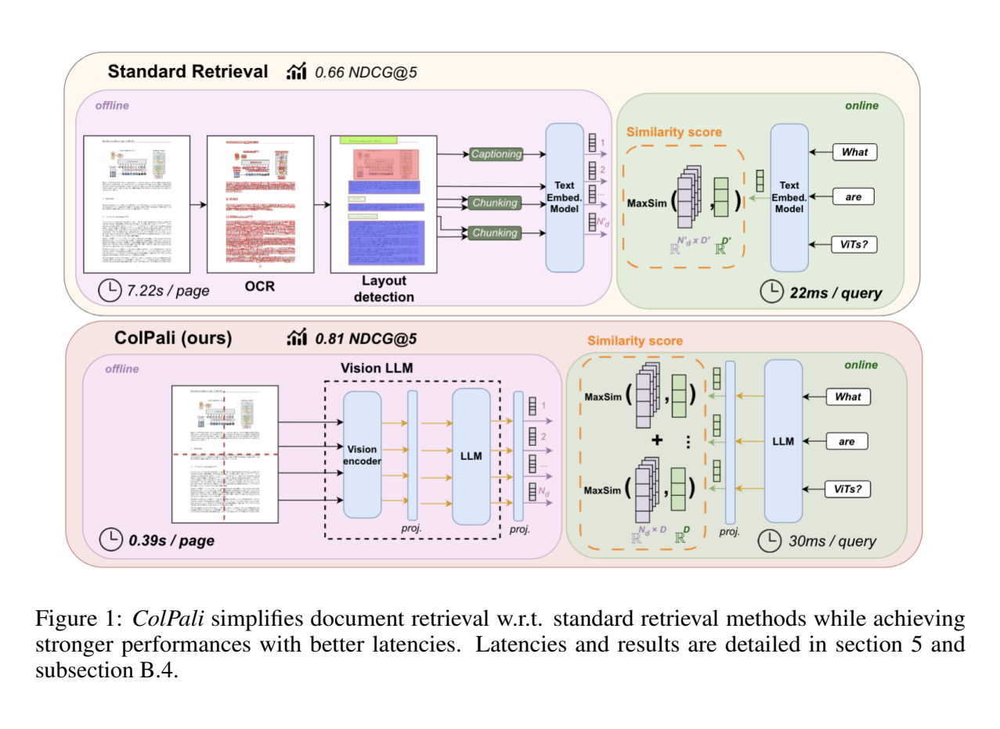
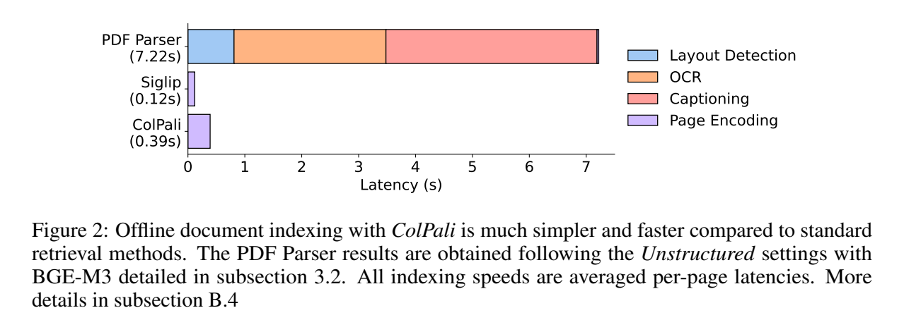
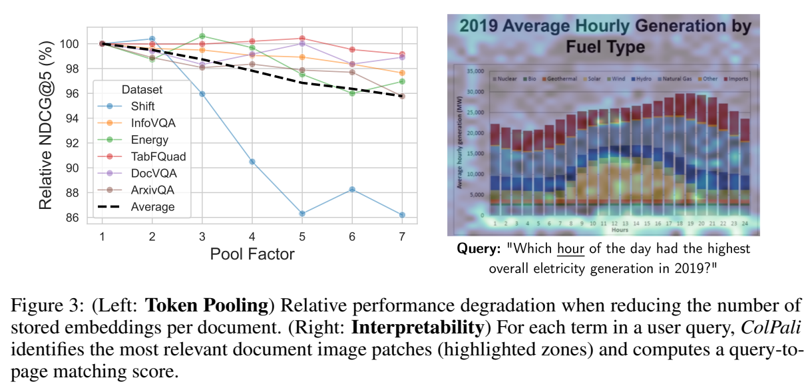

**原文**: [本地](../论文原件/ColPali.pdf) [arXiv](https://arxiv.org/abs/2407.01449)

# 一句话记忆

ColPali 将 PaliGemma-3B 改造成页面级多向量检索器：它直接编码文档页图像，并用 ColBERT 式晚期交互匹配文本查询，从索引流水线中移除解析、OCR、版面分析与分块，同时在 ViDoRe 上兼顾检索效果、建库速度和在线延迟。

# 研究问题

## 以前的方法

以前主流的文档检索系统（特别是针对 PDF 格式的文档）主要在文本空间进行。其典型工作流（如 RAG 管道）是：使用 PDF 解析器或 OCR 系统提取文字 $\rightarrow$ 用版面分析模型（Layout Detection）识别标题、段落、图表等 $\rightarrow$ 采用特定分块策略（Chunking）将文本划分为具有语义相干性的块 $\rightarrow$ 使用文本嵌入模型（如 BGE-M3 等）对分块进行向量化 $\rightarrow$ 建立索引并进行匹配。

## 存在的问题

1. **数据摄入流水线（Ingestion Pipeline）繁琐且脆弱**：前置的 PDF 解析、OCR、版面检测和文本分块不仅极其耗时，而且任何一个环节的错误（如 OCR 识别错误、表格排版被打乱）都会在后续检索中积累和放大，成为性能的瓶颈。
2. **丢失关键视觉信息**：图表、插图、版面布局、表格、字体等非文本视觉线索在过滤或转换过程中会丢失，导致传统的文本嵌入检索系统很难高效利用这些视觉线索来匹配复杂文档。
3. **引入复杂的描述步骤（Captioning）开销极大**：为了处理图片和表格，有些管道会调用大视觉语言模型生成文本描述，但这会极大增加索引构建的成本和延迟。

## 论文试图解决什么

如何摆脱繁杂脆弱的文本提取和分块流水线，直接从文档页面的原始图像（Vision Space）进行端到端的文档检索，以实现高精度、高建库吞吐量、低在线延迟的图文多模态文档检索。

# 核心洞察

- **研究洞察**：
  1. **基于视觉空间的文档检索范式（Retrieval in Vision Space）**：通过将文档的页面图像直接作为检索输入，将视觉与文本信息统一到 VLM 的特征表示空间中，实现“所见即所检索”。
  2. **多向量晚期交互（Late Interaction）对视觉细节的保留**：图像不同区域（Patch）蕴含不同的信息（如文字、图画、白底），单向量表征容易造成严重的信息丢失。使用多向量晚期交互能细粒度地对图像中每个 Patch 的特征与查询文本的每个 Token 计算相似度。

- **工程实现**：
  1. **VLM 与投影层结合的多向量提取（ColPali 架构）**：以 PaliGemma-3B 为基础，在 Gemma-2B 的文本/图像 token 输出后添加一个线性投影层，将输出嵌入映射到低维特征空间（$D=128$），从而构成轻量级的多向量 bag-of-embeddings 表示。
  2. **端到端检索训练**：晚期交互算子可微；训练时对每个查询比较配对页面与 batch 内得分最高的非配对页面，并优化二分类交叉熵形式的 pairwise loss。
  3. **查询扩展与重新加权（Query Augmentation）**：在查询文本后附加 5 个特殊的 `<unused0>` token，作为可微的查询扩展和重权机制。

- **普通组件**：
  - 视觉编码器采用标准的 SigLIP-So400m/14；语言模型采用标准的 Gemma-2B。

# 方法流程

方法流程的总体框架见首图 。

## 1. 离线文档索引阶段（Offline Indexing Pipeline）

离线时直接将 PDF 页面渲染为图像，无须 OCR、版面分析与分块：
页面图像 $\rightarrow$ PaliGemma 的 SigLIP 视觉编码器产生 1024 个 patch 表征 $\rightarrow$ 映射到 Gemma-2B 的词向量空间并与 6 个提示词 token（“Describe the image”）共同编码 $\rightarrow$ 将每个输出 token 线性投影到 $D=128$ 并归一化 $\rightarrow$ 得到 $E_d \in \mathbb{R}^{1030 \times 128}$ 并写入索引。

## 2. 在线查询与匹配阶段（Online Query Matching）

在线查询流程与 ColBERT 相似，其 latency 比较可见 ：
输入文本查询 $q$ $\rightarrow$ 附加 5 个 `<unused0>` token 并输入 Gemma 文本编码器 $\rightarrow$ 提取多向量查询嵌入 $E_q \in \mathbb{R}^{N_q \times D}$ $\rightarrow$ 计算 $E_q$ 与候选文档 $E_d$ 的晚期交互（Late Interaction）分数 $\rightarrow$ 排序并输出。

# 关键模块

- **图像多向量端到端编码器 (VLM Document Encoder)**
  - 输入：文档页面图像（大小通常为 $384 \times 384$ 或更高）
  - 输出：多向量表示 $E_d \in \mathbb{R}^{N_d \times D}$ ($N_d = 1030$, $D=128$)
  - 作用：利用 SigLIP 将图像分割为 $32 \times 32 = 1024$ 个 patch 并提取特征，将特征投射进 Gemma 的词嵌入空间，结合提示词“Describe the image”输入 Gemma 得到上下文语义融合后的 1030 个 token 嵌入，最后通过线性投影层降维至 128 维。
  - 为什么需要：直接将图像模态映射到与文本语义共享的联合向量空间中，保留文档的版面和图文排版细节。
  - 去掉后可能发生什么：如果不通过 VLM 进行语义融合，直接使用对比视觉编码器（如 SigLIP-Vanilla），在学术检索任务上的平均 nDCG@5 会从 81.3 暴跌至 51.4，且完全丧失细粒度的文本理解和多轮推理检索能力。

- **低维线性投影层 (Linear Projection Layer)**
  - 输入：Gemma 语言模型的输出 token 嵌入向量（维度通常为 2048 或 3072）
  - 输出：低维向量空间（$D=128$）的 token 嵌入
  - 作用：对输出的高维隐藏特征进行线性映射和 $L_2$ 归一化，得到低维紧凑的 bag-of-embeddings。
  - 为什么需要：降低存储和计算开销，使得多向量晚期交互检索能在工业级数据量下进行存储与快速检索。
  - 去掉后可能发生什么：如果不进行降维，每个文档页面将产生高达数兆字节的存储空间，导致离线索引大小膨胀数十倍，在线 late interaction 矩阵乘法的计算耗时和延迟急剧增加。

- **晚期交互相似度计算模块 (Late Interaction Operator)**
  - 输入：查询多向量 $E_q \in \mathbb{R}^{N_q \times 128}$，文档多向量 $E_d \in \mathbb{R}^{1030 \times 128}$
  - 输出：实数相似度得分 $s(q, d) \in \mathbb{R}$
  - 作用：对查询中的每一个 token 向量 $E_q(i)$，计算其与文档中所有 patch 向量 $E_d(j)$ 的最大点积，然后对所有查询 token 的最大点积求和（公式见下文）。
  - 为什么需要：在检索时建立细粒度的 Token 到 Patch 级别的语义对齐与匹配，从而可以精准地定位到图像中的特定文字或图表区域。
  - 去掉后可能发生什么：如果退化为普通的双塔模型（BiPali），通过 Average Pooling 将 1030 个向量压缩为一个全局单向量进行检索，其平均 nDCG@5 会从 81.3 降至 58.8（性能严重退化）。

# 训练目标或核心公式

## 1. 晚期交互相似度计算公式

$$\text{LI}(q, d) = \sum_{i=1}^{N_q} \max_{j=1}^{N_d} \langle E_q(i) | E_d(j) \rangle$$

其中 $\langle \cdot | \cdot \rangle$ 表示向量点积。

## 2. 粗检索阶段对比损失 (Contrastive Loss)

采用 In-batch Contrastive 交叉熵损失函数进行训练。对于大小为 $b$ 的 Batch，其中包含 $b$ 个配对的正样本 $(q_k, d_k)$。定义正样本得分 $s^+_k = \text{LI}(q_k, d_k)$，Batch 内最强负样本得分 $s^-_k = \max_{l \neq k} \text{LI}(q_k, d_l)$：

$$\mathcal{L} = \frac{1}{b} \sum_{k=1}^b \log (1 + \exp(s^-_k - s^+_k))$$

- **优化目标**：最小化该损失函数，拉大正样本相似度 $s^+_k$ 与最难负样本相似度 $s^-_k$ 之间的差距（即最大化配对图文对的分数，最小化非配对的分数）。
- **正负样本定义**：对第 $k$ 个查询 $q_k$，与其配对的文档页面图像 $d_k$ 为正样本；Batch 内其他 $b-1$ 个文档图像 $d_l$ 为负样本。
- **对特征空间的影响**：通过最大化每个查询 token 与文档中最匹配的图像 patch 之间的最大点积，促使模型学会在特征空间中将文字语义向量（如 "hour"）与图像中对应的视觉纹理 patch（如坐标轴上的数字或文本中的单词 "hourly"）进行空间对齐。
- **关于损失的变形**：作者在消融中以考虑全部 batch 内负样本的常规对比损失替代该 hardest-negative pairwise CE，ViDoRe 聚合 nDCG@5 下降 1.6。这里并不存在独立的“粗检索阶段”；该损失直接训练页面检索器。

# 实验证明了什么

关于 Token Pooling 以及模型的可解释性对齐，可见 。

- **实验问题 1：ColPali 直接从图像检索文档，在多模态页面检索上性能是否超越传统的文本检索流水线？**
  - **比较对象**：
    - 传统 ingestion 流水线：`Unstructured(text-only)`、`Unstructured+OCR`、`Unstructured+Captioning`，后接 `BM25` 或 `BGE-M3` 文本嵌入。
    - 传统双塔视觉嵌入：`Jina-CLIP`、`Nomic-vision`、`SigLIP(Vanilla)`。
  - **观察结果**：ColPali 在 ViDoRe 上的平均 nDCG@5 达到了 **81.3**，相比之前最强的传统流水线（`Unstructured+Captioning + BGE-M3` 的 67.0）提升了 **14.3** 个百分点，且在学术任务（如 ArxivQA 79.1 vs 35.7）和表格任务（TabFQuAD 83.9 vs 69.1）中领先优势巨大。
  - **支持的结论**：证明了“视觉空间检索”范式的可行性与卓越性能，多向量晚期交互能在大模型和视觉模型结合下实现极其强大的图文多模态特征检索。
  - **不能支持的结论**：这些结果不能证明页面图像检索在所有纯文本、长文档或其他粒度的检索任务上都优于文本检索；ViDoRe 的评价单位是页面。

- **实验问题 2：直接图像检索是否能有效降低 offline 索引的耗时和开销？**
  - **比较对象**：常规解析流水线（Layout Detection + OCR + Captioning + Page Encoding）。
  - **观察结果**：ColPali 的平均单页离线建库耗时仅为 **0.39 秒**（在 NVIDIA L4 GPU 上），而传统的 parser 检索管道耗时高达 **7.22 秒**（其中 layout detection + OCR + captioning 占了绝大部分时间）。
  - **支持的结论**：证明了 Vision-based 检索在 ingestion 效率上的革命性提升，极大简化了离线数据处理流水线。
  - **不能支持的结论**：虽然建库速度快，但 ColPali 在降维前每个 page 存储 $1030 \times 128$ 维向量（约 $257.5\text{ KB}$），其存储开销比普通 bi-encoder 的单向量（如 BGE-M3 产生一到数个 $1024$ 维向量，约几 KB）要大。

- **实验问题 3：是否可以通过 Token Pooling（Token 融合）来减少 ColPali 的多向量存储压力？**
  - **比较对象**：不同的 Pool Factor 缩减因子下的 ColPali 检索表现。
  - **观察结果**：`[Paper Facts]` 使用层次均值 Token Pooling 时，如果将 Pool Factor 设置为 3（即将多向量存储数量缩减 66.7%），检索模型仍能维持 **97.8%** 的原始 nDCG@5 性能。然而，在文本极其密集的 Shift 环保报告数据集上，由于冗余的白背景 patch 较少，性能降幅明显比其他图文混排的数据集更为严重。
  - **支持的结论**：在图文混合文档中，图像 patch 存在极大的空间冗余性，可以通过 Pooling 算法有效压缩索引体积；但对于高文本密度的文档，过度 pooling 会导致信息丢失。

# 局限与失效场景

- **局限 1：存储开销相比传统单向量模型显著增加**
  - **产生原因**：晚期交互机制要求为图像的每个 patch 存储一个低维特征向量，导致每页文档的索引体积为 $257.5\text{ KB}$，远远大于 bi-encoder 产生的单向量大小。
  - **可能失败的场景**：在超大规模（数十亿网页级别）且计算/存储预算极度有限的检索应用中，存储和检索这 1024 倍的向量会带来极高的硬件负担。
  - **对后续研究的意义**：后续工作需要探索更高效的向量量化（Quantization）、稀疏化（Sparsification）以及更高级的层次 Pooling 压缩技术。

- **局限 2：页面级固定 patch 预算形成信息瓶颈**
  - **产生原因**：页面被压缩为固定数量的视觉 patch；论文消融中将 patch 数从 1024 减至 512，聚合 nDCG@5 下降 24.8。
  - **可能失败的场景**：高文本密度页面的冗余更少，因此 token pooling 的损失更明显；低清扫描、小字号等情况可能同样困难，但论文没有按 DPI 给出失效阈值。
  - **对后续研究的意义**：需要在视觉分辨率、patch 数、索引体积与延迟之间做自适应取舍。

# 与其他论文的关系

## 前置基础

- [[CLIP]]：提供了跨模态对比预训练的图像-文本空间对齐基础（`builds-on`）。
- [[PaliGemma-3B]]：作为 ColPali 的主要视觉语言大模型 Backbone（`uses-as-backbone`）。
- [[ColBERT]]：提供了多向量晚期交互（Late Interaction）相似度计算与对比学习损失（`builds-on`）。

## 同任务工作

- [[BGE-M3]]：作为文本空间的多功能 Baseline（`same-task`）。

## 思想相似

- [[FIP (Yao et al., 2021)]]：将 Late Interaction 机制引入到图文对齐的 Vision-Language 模型中（`similar-idea`）。

## 后续改进

- [[ColQwen2-VL]]：作者使用 Qwen2-VL 2B 替换 PaliGemma-3B 训练的后续提升版，以更少向量实现更高精度（`improves`）。
- [[ColIdefics2]]：以 Idefics2-8B 为 Backbone 的大模型版本（`improves`）。

# 对我的课题的启发

1. **视觉大模型做检索是 RAG 领域的大势所趋**：传统基于 chunking 的 RAG 流水线在复杂的学术 PDF、年报、图表检索中存在严重的表现瓶颈。ColPali 这种 Vision-based 检索彻底解放了 ingestion 流水线，是构建下一代“多模态输入、多模态输出”的端到端视觉 RAG（Visual RAG）的关键底座。
2. **多向量晚期交互的细粒度空间感知**：在 3D 定位或场景分析中，将多维的空间特征（如 3D patch）与文本的词向量通过 late interaction 做最大池化相似度匹配，能天然地捕捉局部感知和物体的空间方位关系，这与 CMMLoc 中的局部空间约束思想不谋而合，且比全局单向量池化更具有可解释性和细粒度判别力。
3. **压缩与多模态冗余消除**：研究如何像 ColPali 中的 Token Pooling 那样，对 3D 场景或多帧 BEV 图片的特征向量进行自适应压缩，从而在保持高检索精度的情况下减少索引所占的空间，这是实现机器人实时定位与建图（SLAM）时的重要研究方向。

# 主动回忆问题

## Level 1：主线恢复

- 什么是 ColPali 提出的“视觉空间检索”（Retrieval in Vision Space）？它与传统的 PDF 检索流水线（如 Ingestion pipeline）最大的差异和优势是什么？
- 什么是 ViDoRe 基准？它包含了哪些类型的任务？

## Level 2：机制理解

- ColPali 是如何利用晚期交互（Late Interaction）计算查询与文档页面图像之间相似度的？请写出其核心公式。
- 为什么 ColPali 采用多向量 bag-of-embeddings 表示，而不是像常规 bi-encoder 那样对整张图提取一个全局特征向量？
- 什么是 Token Pooling？为什么在 Shift 环保报告这类文本密集的数据集上，Token Pooling 会导致更为明显的性能衰减？

## Level 3：批判与迁移

- 为什么在 ColPali 中不冻结视觉编码器（即 unfreeze 视觉部分进行反向传播训练）反而会导致检索性能出现轻微下降？这说明了什么？
- 在大尺度的多模态 3D 定位（如点云 BEV 特征匹配）中，如何借鉴 ColPali 的 late interaction 和降维投影层设计，实现文字查询与 3D 局部物体的高效交叉对齐？

# 尚未解决的问题

- 如何将 ColPali 极佳的视觉页面定位能力，与下游的 VLM 生成式回答器直接集成，实现完全不依赖文本提取的纯视觉端到端 RAG（Visual End-to-End RAG）？
- 如何设计出极致的索引压缩算法，彻底解决 late interaction 带来的存储空间敏感性问题。

## 理解更新记录

- `2026-07-12`：由 AI 依据论文原件 ColPali.pdf 自动提取内容，并通过 `pypdfium2` 高清渲染 PDF 裁剪图表，生成首个版本笔记。
