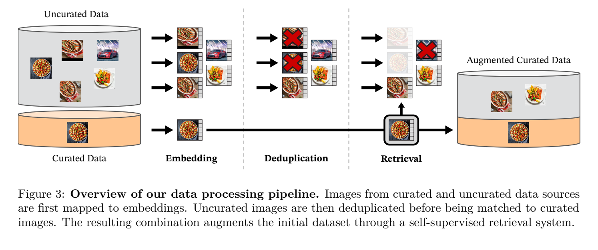

**原文**: [本地](../论文原件/DINOv2.pdf) [arXiv](https://arxiv.org/abs/2304.07193)

# 一句话记忆

DINOv2 在 1.42 亿张经过自动筛选的图像上联合使用图像级 DINO 自蒸馏、Patch 级 iBOT 掩码目标和 KoLeo 正则，训练可冻结使用的 ViT 特征；它同时覆盖分类、检索、分割和深度估计，但多数“开箱即用”结果仍需在冻结特征上训练轻量预测头。

# 研究问题

## 以前的方法

以前主流的基础视觉模型（Foundation Models）构建方法包括以 [[CLIP]] 为代表的**文本引导预训练**，通过海量互联网图文配对进行跨模态对比；或者以 [[DINO]]、[[iBOT]] 和 [[MAE]] 为代表的**无标签视觉自监督预训练**，从图像自身的空间结构中学习特征表达。

## 存在的问题

1. **文本对齐忽略细粒度像素信息**：文本对齐（如 CLIP）依赖粗粒度的图像字幕。这些字幕只对图像的主要全局概念进行描述，会漏掉细粒度的几何、边缘及密集的空间像素信息，限制了模型在下游语义分割、单目深度估计等密集预测（Pixel-level）任务上的泛化能力。
2. **自监督在无标签海量数据上的性能退化**：现有的自监督模型主要在 ImageNet-1k 这样的小规模精心人工标注数据集上设计。当尝试直接在大规模未清洗（Uncurated）的网络爬取数据集上进行扩展训练时，由于严重的概念倾斜、噪声干扰和长尾分布，特征表示质量会出现显著的退化。

## 论文试图解决什么

如何不使用文本监督或下游标签来优化视觉编码器，通过数据筛选、稳定的大规模自监督训练和蒸馏，得到兼顾图像级与像素级任务的冻结特征。需注意：LVD-142M 的筛选以多个人工整理数据集作为查询来源，因此“训练损失无标签”不等于整个数据构建过程完全没有人工策展先验；Frozen Linear Probe 也不同于严格的 zero-shot。

# 核心洞察

- **研究洞察**：
  1. **数据 curation 对自监督的根本性影响**：自监督模型并非在越乱、越庞大的无标签数据上效果越好。通过设计数据聚类与 Faiss 相似度去重管线（LVD-142M），在相同参数规模下，其特征表示泛化性显著优于直接在 uncurated raw web data 上训练。
  - `[AI分析]` 2. **多粒度判别对齐的优势**：全局图像对比（DINO CLS Token）提供了宏观的语义一致性，而局部掩码建模（iBOT Patch Token）捕获了精细的空间局部特征。这两者的结合是无需微调就能直接支持稠密像素级下游任务的关键。

- **工程实现**：
  1. **头网络（Heads）解耦设计**：在大规模（1B）预训练中，如果继续采用 iBOT 在小模型上共享 DINO 与 iBOT MLP 投影头参数的做法，会导致收敛表现退化。必须对这两个投影头进行参数解耦（Untying heads）。
  2. **大规模训练的数值稳定性优化**：针对 1B 判别自监督极易崩溃（NaN）的问题，引入了 LayerScale、Stochastic Depth（将 droprate 设为 40% 且跳过丢弃残差的计算以节省显存）、Sequence Packing（对长短 crop 序列进行打包并应用 Block-diagonal Mask 自注意力）以及 PyTorch FSDP float16 混合精度优化。
  3. **末期短时高分辨率适配**：最终训练在预训练末段把分辨率提高到 $518\times518$。用于验证该策略的消融是在 ImageNet-1k 上把 ViT-L/16 从 $224\times224$ 续训 10k 步至 $416\times416$；效果接近全程高分辨率训练，而成本只是其一小部分。论文没有把这一结论表述为“1/3 计算量达到相同检测效果”。

- **普通组件**：
  - 骨干网络使用标准的 Vision Transformer (ViT) 架构（微调了 ViT-g 以最大化 A100 计算效率）；Teacher 网络的权值通过 Student 网络的指数移动平均（EMA）进行更新。

# 方法流程

方法流程的总体框架见首图 。

- **1. 数据清洗流程**：
  约 13 亿张未筛选图像 $\rightarrow$ 自去重后约 11 亿张候选，并移除与评测集近重复的图像 $\rightarrow$ 用在 ImageNet-22k 上自监督训练的 ViT-H/16 提取嵌入并建立 Faiss 索引 $\rightarrow$ 以多个精选数据集为查询源，视数据集规模采用最近邻检索或先聚类再采样的策略 $\rightarrow$ 汇总、限额和平衡为 LVD-142M。最近邻数通常为 4，但 Google Landmarks v2 与 ImageNet-22k 等数据源使用了不同设置，不能把全流程简化为统一的 K-Means + $N=4$。

- **2. 师生自监督判别训练流程**：
  输入 LVD-142M 图像 $\rightarrow$ 提取大/小两种多尺度 crop 视图 $\rightarrow$ Student 网络输入被随机 Mask 的视图，Teacher 网络输入完整视图 $\rightarrow$ 通过 untied 的 DINO Head 和 iBOT Head 映射到高维 Prototype 概率分布空间 $\rightarrow$ 对全局特征施加 KoLeo 熵正则化约束分布均匀度 $\rightarrow$ 沿全局交叉熵与局部掩码交叉熵联合优化更新 Student，以 EMA 形式渐进更新 Teacher 权重 $\rightarrow$ 在预训练尾期引入 10k 步的 $518 \times 518$ 高分适配训练。

# 关键模块

- **DINO & iBOT MLP Head**
  - 输入：Class Token / Patch Tokens $h \in \mathbb{R}^{D}$ (图像特征)
  - 输出：高维 Prototype Scores 向量 $p \in \mathbb{R}^{K}$ (其中 $K = 65,536$ 或 $131,072$)
  - 作用：利用 MLP 投影层将视觉隐表征映射到超高维离散的聚类空间中，以便应用 softmax 和在线聚类对齐。
  - 为什么需要：DINO/iBOT 的训练目标定义在投影头输出的原型分布上，因此 Head 是把骨干特征变成可计算交叉熵目标的接口。论文将原型数扩至 128k 后主要改善 k-NN 指标，但没有证明“低维直接对比必然坍塌”。
  - 去掉后可能发生什么：模型无法使用判别式交叉熵损失进行对齐；如果在 1B 大规模训练中不进行解耦（继续共享两个 Head 权重），会导致 ImageNet 线性评估精度下降。

- **KoLeo 正则化器 (KoLeo Regularizer)**
  - 输入：Batch 内进行 $L_2$ 归一化后的特征向量 $\{x_1, \dots, x_n\}$ (图像特征)
  - 输出：标量正则化损失 $L_{\text{koleo}}$ (实数)
  - 作用：基于最近邻距离的负对数熵，推动 batch 内的所有样本在超球面表面均匀散开，防止表示坍塌。
  - 为什么需要：在大规模自监督中，特征容易坍塌到特定的高频几何方向，KoLeo 促使特征获得各向同性的均匀分布特性。
  - 去掉后可能发生什么：表 3a 中，移除 KoLeo 后 Oxford-M mAP 从 63.9 降至 55.6，即下降 8.3 个百分点；同一消融下 ImageNet-1k、ImageNet-A 和 ADE20K 的变化较小。该数值来自特定训练配置，不应视为所有检索任务的固定降幅。

- **Sinkhorn-Knopp 在线分配模块**
  - 输入：Teacher 网络的输出 Prototype scores (实数矩阵)
  - 输出：经过在线优化排布的平衡概率目标 $p_t$ (概率向量)
  - 作用：在每次迭代中，通过 3 次 Sinkhorn-Knopp 迭代算法快速求解传输优化问题，确保 batch 内不同样本被均匀指派给各个原型。
  - 为什么需要：替代原 DINO 的移动平均 centering，以批次归一化式的平衡分配构造 Teacher 目标。
  - 去掉后可能发生什么：论文表 1 中加入 Sinkhorn-Knopp 后 k-NN 与线性指标都没有变化，因此不能声称不使用它就必然塌陷；作者把它作为整体训练配方的一部分，而非单独证明其必要性。

# 训练目标或核心公式

DINOv2 的对称交叉熵与熵约束联合优化目标公式为：

$$\mathcal{L} = \mathcal{L}_{\text{DINO}} + \mathcal{L}_{\text{iBOT}} + \lambda \mathcal{L}_{\text{koleo}}$$

其中 DINO 全局对比损失为：

$$\mathcal{L}_{\text{DINO}} = -\sum p_t \log p_s$$

其中 $p_s$ 是 Student 经过 softmax 的概率特征，$p_t$ 是 Teacher 经过 Sinkhorn-Knopp 归一化后的原型指派概率。

iBOT 局部掩码重构损失为：

$$\mathcal{L}_{\text{iBOT}} = -\sum_i p_{t,i} \log p_{s,i}$$

其中 $i$ 表示 Student 被 Mask 掉的 patch 索引，对齐对应的 Teacher 局部 Patch 特征。

KoLeo 正则化熵损失为：

$$\mathcal{L}_{\text{koleo}} = -\frac{1}{n} \sum_{i=1}^n \log(d_{n,i})$$

其中 $d_{n,i} = \min_{j \neq i} \|x_i - x_j\|$ 是该批次中 $x_i$ 特征到其他特征的最小 $L_2$ 欧氏距离。

- **优化目标**：最小化全局与局部对齐损失以实现多尺度特征一致性，同时最小化 KoLeo 损失（即最大化最小间距）以拉开特征间距，促使嵌入在球面上各向同性地均匀分布。
- **目标定义**：DINOv2 不是以显式样本对构造 InfoNCE。Teacher 为同一图像的不同视图或可见 Patch 产生软目标分布，Student 去匹配该分布；Sinkhorn-Knopp 平衡批内原型使用，KoLeo 则直接拉开归一化 class token 的最近邻。
- **对特征空间的影响**：表 3 表明 KoLeo 显著改善实例检索，iBOT 掩码目标显著改善密集预测；由此可分别关联到全局特征分散性和局部信息质量。关于“语义流形边缘清晰”的更强几何描述需要额外表征分析，论文表格本身不能直接证明。

# 实验证明了什么

- **实验问题 1：DINOv2 提取的冻结特征（Frozen Features）在图像级分类上表现如何？**
  - **比较对象**：MAE, DINO, MSN, Mugs, iBOT, OpenCLIP, EVA-CLIP 等主流自监督与弱监督模型。
  - **观察结果**：在 ImageNet-1k 线性评估下，DINOv2 ViT-g 达到了 **86.5%** 的 Top-1 准确率，超越了以 20 亿图文对训练的 OpenCLIP-G (86.2%)。且在域外泛化集 ImageNet-A 上，线性鲁棒性比 iBOT 高出 **29.6%**（Table 6 所示）。
  - **支持的结论**：在论文采用的冻结特征线性评估设置中，大规模策展数据上的自监督特征可与强弱监督视觉模型竞争；这一比较不等于在所有任务、训练成本或多模态能力上全面超越。
  - **不能支持的结论**：不能保证在未经过滤（uncurated raw web data）的普通无标签数据集上获得相同的表现。

- **实验问题 2：LVD-142M 自动清洗数据集相比常规 ImageNet-22k 或未清洗 raw web data 效果如何？**
  - **比较对象**：ImageNet-22k、未清洗的 raw web data。
  - **观察结果**：在相同迭代步数下，LVD-142M 预训练模型在 iNaturalist、Places 等下游分布外数据集上全面超越 ImageNet-22k，而在 uncurated 网页图片上训练则会导致所有基准性能全线下跌（Table 2 所示）。
  - **支持的结论**：自监督模型高度依赖预训练数据的概念均衡与去重，自动检索清洗管线是保证多域特征质量的根本。

- **实验问题 3：知识蒸馏（Knowledge Distillation）在小 ViT 模型上的优势是什么？**
  - **比较对象**：从头训练的 ViT-L/14 vs. 以 ViT-g/14 为 Teacher 蒸馏训练的 ViT-L/14。
  - **观察结果**：经过蒸馏的 ViT-L 在所有 12 个评估任务（包括分类、分割、检索和深度估计）上全面超越了从头训练的版本（ImageNet Linear 达 86.3% vs 84.5%）。
  - **支持的结论**：在作者的 12 项评估和这组训练配方中，从 ViT-g 蒸馏优于相同架构从头训练；“最佳途径”需要与更多蒸馏和预训练方案直接比较后才能成立。

# 局限与失效场景

- **局限 1：无法原生支持多模态跨模态检索与交互**
  - **产生原因**：DINOv2 是纯粹的单模态视觉自监督训练，特征空间未与自然语言嵌入对齐。
  - **可能失败的场景**：无法直接接收类似“找出一只红色的鸟”这类自然语言指令做 zero-shot 图像检索，必须附加有监督的跨模态微调。
  - **对后续研究的意义**：促使了后继如 [[E5-V]] 等多模态模型的研究，探索将自监督视觉特征注入 LLM 共享文本空间的方法。

# 与其他论文的关系

## 前置基础

- [[DINO]]：继承了其基本的 Student-Teacher 架构、EMA 权重更新及 multi-crop 数据增强方案（`builds-on`）。
- [[iBOT]]：继承了其将 CLS 全局判别与 Patch 局部掩码建模联合优化的基本思路（`builds-on`）。
- [[SwAV]]：吸收了其在线聚类原型指派及 Sinkhorn-Knopp 的批次均衡思想（`uses-as-loss`）。

## 同任务工作

- [[MAE]]：代表生成式掩码重构自监督（`same-task`）。但在冻结特征评估（Linear Probe）下性能明显弱于 DINOv2。
- [[CLIP]]：代表强监督的跨模态对比对齐模型（`same-task`）。

## 后续改进

- [[E5-V]]：将 DINOv2 冻结作为其视觉底座（Vision Encoder），以多模态大语言模型作为表示对齐器（`improves`）。

## 关键差异

- 与 [[iBOT]] 相比：DINOv2 将 MLP 头参数进行了解耦（untying），并引入了 KoLeo 正则化项，同时通过工程加速手段克服了在 1B 参数量上训练判别自监督时极易发散的稳定性障碍。
- 与 [[MAE]] 相比：MAE 学习的是细粒度重构（重建像素），导致特征空间紧凑度较差，适合下游全参数微调；DINOv2 学习的是判别与聚类对齐，其学到的隐空间具有极强的线性可分性，开箱即用能力（Frozen linear evaluation）远强于 MAE。

# 对我的课题的启发

`[AI分析]`

1. **纯自监督大模型作为极强特征提取底座**：在 3D 地点识别（VPR）中，DINOv2 的 Patch 级表征在没有标签的语境下，显示出对环境中静态物理结构和纹理边界极强的判别力。将其作为视觉特征前端（如 [[VLM-Loc]]），可以生成对视角变化和光照偏移更稳健的地图嵌入。
2. **特征超球面均匀分布的正则化思想**：在构建文本-点云对比匹配空间时，可以引入 KoLeo 正则损失。通过拉大 Batch 内最近邻向量的距离，能有效克服跨模态对比微调中特征容易坍塌到少部分特异性维度（Anisotropy Problem）的通病。

# 主动回忆问题

## Level 1：主线恢复

- 简述 DINOv2 提出的自动数据清洗管线（LVD-142M）的主要步骤，它是如何进行去重和聚类均衡的？
- DINOv2 在预训练的尾期采用的“高分辨率适配训练”是如何在节约算力的同时，让模型获得高分辨率像素特征提取能力的？

## Level 2：机制理解

- DINOv2 中引入的 KoLeo 正则项优化公式是什么？为什么这个正则项只对 Oxford-M 图像检索等最近邻搜索任务有巨大增益（+8.3%），而对 ImageNet 分类和分割任务几乎无直接影响？
- 为什么在 1B 参数的 Vision Transformer (ViT-g) 上训练自监督判别模型比训练 MAE 重建模型更容易发生 NaN 崩溃？DINOv2 采取了哪些核心的工程策略来保障训练的数值稳定性？

## Level 3：批判与迁移

- 为什么说 DINOv2 实现了“Finetuning is optional”（微调是可选的）？在下游像素级密集估计任务（如分割、单目深度估计）上，它是如何在仅训练一个极简的线性投影头（Linear Probe）下达到或逼近 SOTA 的？

# 尚未解决的问题

- 纯判别式自监督模型在需要逻辑关系组合推理（如“左边有三辆红色的车，右边有一棵大树”）的高阶视觉问答及具身控制任务上的常识缺口。

## 理解更新记录

- `2026-07-12`：由 AI 基于论文原件 PDF 自动生成归档初始版本笔记。
- `2026-07-12`：由 Antigravity 依据 `paper-memory` 标准规范与 `CLIP.md`/`CMMLoc.md` 结构规范进行第二次全面重构，重新划分核心洞察、重写方法流程步骤，并完整补全了关键模块（输入、输出、作用、为什么需要、去掉后可能发生什么）、训练目标公式以及实验问题逻辑。
