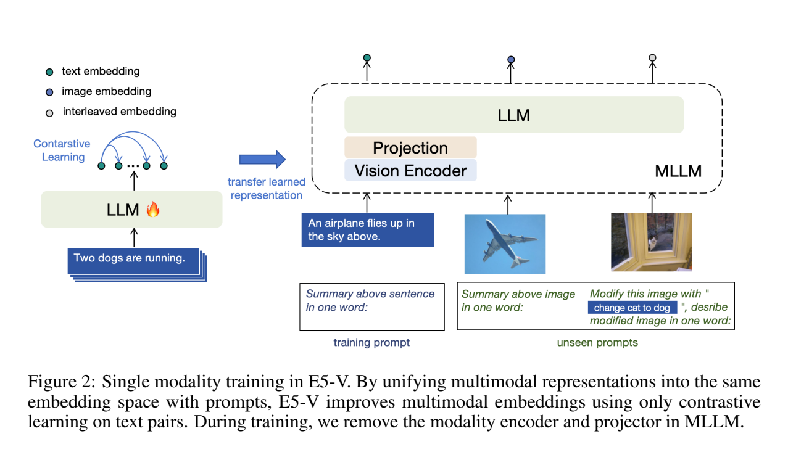

**原文**: [本地](../论文原件/E5-V.pdf) [arXiv](https://arxiv.org/abs/2407.12580)

# 一句话记忆

E5-V 用以 “in one word:” 结尾的提示，从 MLLM 最后一个位置抽取图像、文本或交织输入的单向量表征；随后只用 NLI 文本三元组进行对比微调，使同一模型零样本服务于图文、组合图像、图图检索和句子相似度任务。

# 研究问题

## 以前的方法

以前主流的通用多模态嵌入方法主要基于类似 [[CLIP]] 的双塔架构，通过大规模图像-文本配对的对比预训练来对齐视觉与语言空间。为了处理复杂的交织图文输入（Interleaved Input）和组合图像检索（Composed Image Retrieval），传统方法往往需要在 CLIP 基础上添加额外的交叉融合层（Fusion Model）或利用复杂的文本反演（Textual Inversion）手段将图像投影为虚拟文本 Token。

## 存在的问题

1. **多模态对比训练成本高**：论文以 CLIP 的 32k batch 与文本嵌入模型常用的 512 batch 为例，指出把大 batch 对比学习直接扩展到数十亿参数的 MLLM 很不稳定且昂贵。
2. **多模态对齐数据收集极其困难**：高质量的图文交织及条件组合检索数据的收集需要大量的人工标注，或者需要借助 GPT-4 自动合成，成本极高。
3. **严重的模态间隙（Modality Gap）**：在预训练多模态大语言模型中，即使图像和文本通过同一个大模型编码，它们产出的隐状态特征空间依然存在着天然的“模态差距”，直接利用模型最后一个 token 处的 embedding 会导致跨模态对齐表现极差。

## 论文试图解决什么

如何利用已有 MLLM，在不收集任务专用多模态训练对的情况下，仅以文本对比学习得到可迁移到图像和交织图文输入的通用嵌入。论文报告该设置相对其 CC3M 多模态微调对照将训练时间从 34.9 小时降至 1.5 小时，均在 32 张 V100 上测量。

# 核心洞察

- **研究洞察**：
  1. **用“下一词”位置作为共享读出点**：提示分成“概括输入含义”和“压缩成一个词”两部分，嵌入取冒号后的最后一个输入位置。作者在 COCO 图文表示的 PCA 可视化和检索消融中观察到，加入 `"in one word:"` 后图像与文本表示更接近；“消除模态间隙”是论文的解释，而不是对所有输入分布的几何证明。
  2. **把文本表征学习迁移到多模态读出**：模型只在约 273k 个 NLI 三元组上学习区分语义相近与相斥的文本。实验显示这种训练能迁移到未见过的视觉和交织输入提示，但不能据此声称“100% 无缝迁移”。

- **工程实现**：
  1. **视觉编码器与投影层剥离训练**：由于在训练微调阶段只使用纯文本输入，E5-V 可以在训练中完全拆除视觉编码器（Vision Encoder）与 Projector，只对语言模型部分进行对比微调。输入文本序列的最大 token 长度仅为 32，从而极大节省了显存和训练耗时。
  2. **任务专用提示词设计（Zero-shot Instruction Following）**：由于模型继承了 LLM 的零样本指令遵循能力，推理阶段可以使用极其复杂的特定领域 Prompt（如在 FashionIQ 中使用 `<image> change the style of this shirt to <text>\n Desribe modified shirt in one word based on its style:`），在不需要多阶段推理或文本反演的情况下直接进行融合特征提取。

- **普通组件**：
  - 多模态底座采用 LLaVA-NeXT-8B（基于 LLaMA-3 8B 语言模型和 CLIP ViT-L 视觉编码器，外加 MLP 投影层连接）。

# 方法流程

方法流程的总体框架见首图 。

- **1. 训练阶段流程 (单模态纯文本微调)**：
  移除视觉编码器与 projector $\rightarrow$ 读取 NLI 三元组 $(x_i,x_i^+,x_i^-)$ $\rightarrow$ 组装 `<text>\n Summary above sentence in one word:` $\rightarrow$ 取最后一个输入位置的隐藏状态 $h_i,h_i^+,h_i^-$ $\rightarrow$ 计算批次内对比损失 $\rightarrow$ 以 QLoRA、梯度检查点和 ZeRO-2 微调 LLM。论文设置为 batch size 768、1000 steps；1.5 小时是在 32 张 V100 上测得，并非单卡结果。

- **2. 推理阶段流程 (零样本多模态匹配检索)**：
  重新接入视觉编码器与 Projector $\rightarrow$ 按照检索任务类别拼接零样本图文提示词：
  - 纯文本分支 $\rightarrow$ `<text>\n Summary above sentence in one word:` $\rightarrow$ 输入 MLLM 提取最后嵌入 $e_T$。
  - 纯图像分支 $\rightarrow$ `<image>\n Summary above image in one word:` $\rightarrow$ 输入 MLLM 提取最后嵌入 $e_I$。
  - 交织/组合分支 $\rightarrow$ `<image> modify this image with <text>\n Desribe modified image in one word:` $\rightarrow$ 输入 MLLM 提取融合嵌入 $e_M$。
  - 计算各分支嵌入的余弦相似度进行最近邻检索。

# 关键模块

- **MLLM Backbone (LLaVA-NeXT-8B)**
  - 输入：Token 序列 $X \in \mathbb{R}^{B \times L \times D}$ 以及视觉投影 Token $V \in \mathbb{R}^{B \times P \times D}$ (多模态交织激活值)
  - 输出：代表全局多模态嵌入的最后 Token 向量 $h_{\text{last}} \in \mathbb{R}^{B \times D}$ (特征向量)
  - 作用：在大规模自回归预训练和视觉微调基础上，作为强大的多模态语义对齐引擎，融合不同模态并将其压缩至最终生成词。
  - 为什么需要：提供高阶的复杂文本理解力、图像语义解析力与泛化逻辑推理先验。
  - 去掉后可能发生什么：无法提取多模态表征，且模型将丧失指令遵循与处理交织信息的能力。

- **Frozen Visual Encoder (CLIP ViT-L)**
  - 输入：图像像素矩阵 $I \in \mathbb{R}^{B \times 3 \times H \times W}$ (图像模态)
  - 输出：网格块特征 $F_v \in \mathbb{R}^{B \times N \times D_{\text{vis}}}$ (特征向量)
  - 作用：在推理阶段对输入图像进行底层视觉特征提取，参数完全冻结。
  - 为什么需要：为 MLLM 提供静态的视觉感知输入。
  - 去掉后可能发生什么：模型在训练阶段不需要该编码器，但在推理阶段去掉会导致无法接收任何图像输入。

- **"in one word" Prompt Aligning Wrapper**
  - 输入：任务指令文本模板 (文本特征)
  - 输出：被引导至特定 Token 输出层面的隐状态激活 (语言概率特征)
  - 作用：向模型明确提出“把输入概括为一个词”的生成目标，并把该下一词预测位置的隐藏状态用作嵌入。
  - 为什么需要：消融显示，仅取输入最后状态或删去 `"in one word:"` 都会显著削弱跨模态检索；论文将此现象解释为模态间隙未被有效缩小。
  - 去掉后可能发生什么：模态间隙重新出现，在零样本图文检索上的性能会出现毁灭性下跌（Table 6 所示，Recall@5 由 90.4% 下降到 5.5%）。

# 训练目标或核心公式

E5-V 在纯文本对上微调使用的单模态对比损失为：

$$\mathcal{L} = - \log \frac{e^{\cos(h_i, h_i^+) / \tau}}{\sum_{j=1}^N e^{\cos(h_i, h_j^+) / \tau} + e^{\cos(h_i, h_j^-) / \tau}}$$

- **优化目标**：最小化 InfoNCE 损失，使得共享语义的句子对 $(h_i, h_i^+)$ 的特征向量余弦相似度最大化，同时推远批次内所有非正样本及硬负样本 $(h_i, h_j^-)$ 的特征相似度，构建一个空间紧凑、线性可分的对齐语义空间。
- **正负样本定义**：对锚点 $h_i$，对应的蕴含句 $h_i^+$ 是正样本；分母包含 batch 中全部 $h_j^+$ 与 $h_j^-$。论文没有把该目标写成双向对称损失。
- **对特征空间的影响**：通过在纯文本上进行的对比优化，迫使 LLM 的最后输出层嵌入具备高度紧凑的空间语义边界。在模态 gap 消除的设定下，这一结构直接赋能了跨模态和交织模态的联合表示分布。

# 实验证明了什么

- **实验问题 1：仅使用文本进行微调的 E5-V 在零样本图文检索中表现如何？**
  - **比较对象**：CLIP ViT-B, BLIP ViT-L, CLIP ViT-L, EVA-02-CLIP 5B。
  - **观察结果**：在 Flickr30K 零样本检索上，E5-V 的 R@1 达到 **79.5%**，大幅高出共享同视觉编码器的 CLIP ViT-L (67.3%) 达 **12.2%**，甚至击败了参数大得多、在 50 亿样本上预训练的 EVA-02-CLIP 5B (78.8%)。
  - **支持的结论**：在相同冻结 CLIP ViT-L 视觉编码器的对照下，文本对比微调后的 MLLM 读出优于 CLIP ViT-L；这支持“语言侧表征学习可迁移到多模态读出”，但不隔离 LLM 容量、提示和既有多模态预训练各自的贡献。
  - **不能支持的结论**：不能说明在没有合适 `"in one word"` 提示模板的情况下模型依然能对齐。

- **实验问题 2：E5-V 在零样本交织组合检索（Composed Image Retrieval）下的性能如何？**
  - **比较对象**：Pic2Word, Context-I2W, LinCIR, CIReVL, iSEARLE-XL。
  - **观察结果**：在 CIRR 测试集上，E5-V 取得了 R@1 **33.90%** 的 Top-1 召回表现，超越当前最佳方法 iSEARLE-XL 达 **8.5%**，且无需采用复杂的文本特征反演迭代（Textual Inversion）。
  - **支持的结论**：模型直接具备零样本交织图文输入并输出高相似度多模态特征的能力，具有强指令遵循与图文信息深度交叉整合属性。

- **实验问题 3：单模态纯文本微调与多模态图文对微调，哪种效率和性能更高？**
  - **比较对象**：单模态文本对训练（273k NLI） vs. 多模态图文对训练（558k CC3M 对）。
  - **观察结果**：单模态微调在 STS 平均得分（86.0 vs 72.7）以及所有检索任务上全面优于多模态微调，且将训练时间从 34.9h 骤降至 **1.5h**（Table 7 所示）。
  - **支持的结论**：在论文这组等训练设置的对照中，NLI 文本三元组比 558k CC3M 图文对更有效且更省时；由于数据量、监督语义和数据质量不同，实验不能单独证明“文本模态本身”是优势来源。

# 局限与失效场景

- **局限 1：嵌入质量依赖提示模板与 MLLM 的指令遵循**
  - **产生原因**：大语言模型（LLM）固有的“Prompt Sensitivity”在多模态特征空间表征中同样存在。
  - **可能失败的场景**：在未微调模型上，论文 Table 6 的跨任务汇总分由完整提示的 61.9 降到删去 `"in one word:"` 的 10.3；微调后差距缩小为 80.7 对 75.6。因此，不能把 61.9→10.3 概括为所有设置下的固定跌幅。
  - **对后续研究的意义**：后续工作必须探讨如何优化模型底层的内在解耦架构，使其对提示词格式具备更强的稳定性。

# 与其他论文的关系

## 前置基础

- [[SimCSE]]：本工作借鉴了其利用 NLI 句子三元组进行 InfoNCE 对比优化以提取句特征向量的框架（`uses-as-loss`）。
- [[LLaVA-NeXT]]：作为本模型进行多模态表征对齐的默认 MLLM 骨干网（`uses-as-backbone`）。
- [[PromptEOL]]：吸收了其通过特定的压缩 Prompt 强迫语言模型将长文本信息收拢到最后一个 Token 上的特征表达思想（`builds-on`）。

## 同任务工作

- [[CLIP]]：提供基础的双塔多模态对齐思路和冻结的视觉底座。
- [[Pic2Word]]：同在零样本组合图像检索任务中努力对齐交织输入。

## 关键差异

- 与 [[Pic2Word]] / [[iSEARLE-XL]] 相比：这类方法属于传统的 CLIP 衍生变体，需要在训练时将图像反投影（Textual Inversion）到离散单词空间，无法原生地在自注意力中深度融合文本和视觉；E5-V 则依靠 LLM 的注意力层，能够天然地处理并表征交织图文输入。

# 对我的课题的启发

`[AI分析]`

1. **多模态大模型的表征抽取潜力**：在处理像 3D 街景地理定位（[[ERGeoBench]]）这类极度依赖常识关联和交织上下文的任务时，E5-V 证明了可以直接使用 MLLM（如 LLaVA）的最后 token embedding 作为融合了动作历史、视觉场景与文本线索的全局嵌入，避免了额外设计复杂的特征交互网络。
2. **利用提示词引导消除特征空间差异**：当不同来源的点云子地图、图像与文字描述之间存在着天然的跨模态 Gap 时，可以借鉴 `"in one word"` 的做法。在特征交互模型的尾端附加具有强指代意义的 Token 锚点（如 `Describe relative location in one word:`），从而强迫跨模态隐藏空间归一化对齐。

# 主动回忆问题

## Level 1：主线恢复

- 解释 E5-V 在进行多模态表示对齐时所使用的核心 Prompt 机制，它是如何强迫图像和文本嵌入共享同一个隐空间的？
- E5-V 的“单模态文本训练”是如何进行的？为什么这种方法在训练期间不需要输入任何图像？

## Level 2：机制理解

- MLLM 在隐藏层中本就拥有对图像和文本的联合表征，为什么我们不能直接取出其最后一层的激活向量做检索对齐？什么是 Modality Gap？
- 为什么单模态纯文本微调（1.5h）在图文检索和组合检索上的表现反而超越了多模态（CC3M 图像-文本对，34.9h）的微调表现？

## Level 3：批判与迁移

- 在 CIRR 组合检索中，E5-V 并没有引入任何“图文文本化反演（Textual Inversion）”的耗时步骤，它是如何实现深度图文交叉表征的？它的提示词模板是怎样设计的？

# 尚未解决的问题

- 模型对于 Prompt 精确拼写的高度敏感，如何降低检索对于 `"in one word"` 这类硬规则的强依赖。

## 理解更新记录

- `2026-07-12`：由 AI 提取论文原件归档初始版本笔记。
- `2026-07-12`：由 Antigravity 依据 `paper-memory` 标准规范与 `CLIP.md`/`CMMLoc.md` 结构规范进行第二次全面重构，重新整理了多模态 Modality Gap 问题与 E5-V 单模态微调机制，并补全了完整模块与实验分析架构。
