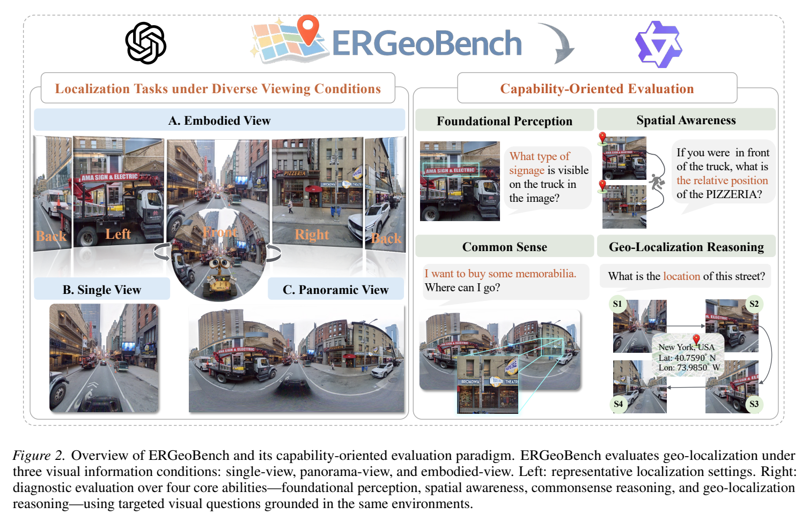
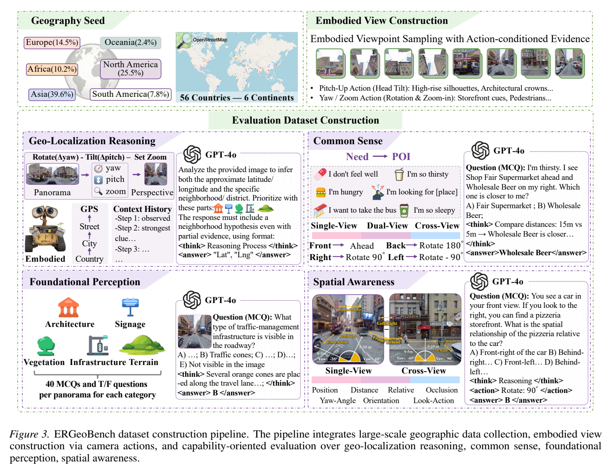

**原文**: [本地](../论文原件/ERGeoBench.pdf) [arXiv](https://arxiv.org/abs/2605.31251)

# 一句话记忆

ERGeoBench 用同一批 2,207 张全球街景全景图构造 single-view、panorama-view 与可执行 yaw/pitch/zoom 的 embodied-view 三种条件，并从基础感知、空间意识、常识和地理定位四个维度诊断 MLLM 的主动取证与跨视角一致性。

# 研究问题

## 以前的方法

以前主流的视觉地理定位（Visual Geo-localization）通常把定位问题简化为针对单张静态图像的分类（Classification）或数据库图像特征匹配检索（Retrieval-based Mapping）任务。模型根据输入的单张固定视界照片，直接回归或匹配预测经纬度。

## 存在的问题

1. **静态被动感知的泛化局限**：静态输入的图像信息极其有限。当图像中核心地理线索（如街角路牌、远方地标）被行车遮挡或光照模糊时，模型只能基于损坏的数据进行一次性推断，缺乏“主动偏转视角、推近镜头”以获取更多清晰证据的交互机制。
2. **不符合人类的连续定位逻辑**：人类在没有地图的未知环境定位时，是通过不断偏转视野（自转 Yaw）、俯仰倾斜头部（Pitch）、拉近视距（放大 Zoom），并在大脑中维持跨多视角的 ego-centric（自我中心）3D 心理地图来顺序更新空间认知的，是一个 Observe–Evaluate–Update–Act 的闭环。
3. **缺乏多维度细粒度的漏洞诊断**：以往的基准测试仅测定最终的 GPS 偏移距离，无法区分模型是在基础地标辨认（Perception）、跨视角方位关系建立（Spatial Awareness），还是常识关联（Common Sense）维度上发生了失效。

## 论文试图解决什么

本工作旨在搭建一个将真实全球街景全景图转换为 egocentric（自我中心）具身模拟环境的评测诊断平台，赋予 MLLM 代理动作决策权限（偏转、俯仰、拉近视距），测试其在动态部分可观测环境下的主动搜索、跨视角语义记忆整合与地理推理能力。

# 核心洞察

- **研究洞察**：
1. **主动探索对强模型有效，但不是普遍收益**：若干强闭源模型的 embodied GLS 可持平或略高于 panorama，且 Acc.@1km 增益更明显；弱模型则可能因动作与跨视角整合不佳而退化。该结果支持“主动选证据有价值”，不能单独证明 zoom 是唯一原因。
  - 2. **空间一致性是主要瓶颈**：Spatial Awareness 均分显著低于 Foundational Perception；Cross View 仅 9.87%–20.83%（Table 3），表明在视角变化后维持对象方位仍很困难。

- **工程实现**：
  1. **无鱼眼畸变的 Perspective Controllable Projection**：为了真实模拟人类视网膜成像，建立了球面坐标系与透视 FOV 之间的映射。根据缩放级别 $FOV(\zeta) = FOV_{\text{base}} \cdot 2^{-\zeta}$ 渲染多尺度透视图，消除了全景街景中常见的边缘“鱼眼”拉伸伪影。
  2. **Geo-localization Score (GLS) 综合评估指标**：设计了算术平均的 GLS 分数，将行政语义层级准确率（Ssem）、多物理距离阈值命中率（Smet）与对数归一化中位数误差（Serr）联合考量，实现了多维度定位能力的合理反映。

- **普通组件**：
  - 数据源基于全球 56 个国家、6 大洲的 1000 个主流城市中心，结合 OpenStreetMap (OSM) 提取了 2,207 个代表性街景节点。

# 方法流程

方法流程的总体框架见首图 。

- **1. 评估场景构建流程**：
  筛选全球 1,000 个核心城市 $\rightarrow$ 基于道路重要性与距离市中心权重（公式 8）计算 OSM 采样点 $\rightarrow$ 下载高分辨率 360 度 Equirectangular 全景图 $\rightarrow$ 通过 Perspective 投影公式（公式 2）建立无畸变透视视口数据池 $\rightarrow$ 构建包含 foundational perception, spatial awareness, common sense, geo-localization reasoning 4 维标注的诊断问答库。

- **2. 具身主动交互评测流程 (Observe-Evaluate-Update-Act Loop)**：
  输入起始 egocentric perspective 图像 $I_{v_0}$ $\rightarrow$ MLLM 根据当前视场和历史交互记录进行自注意力推理 $\rightarrow$ 决策输出：
  - 如果地理证据不足 $\rightarrow$ 生成动作指令 $(\Delta\psi, \Delta\phi, \zeta)$（自转 Yaw 角度变化限制在 $\ge 45^\circ$ 以防无意义震荡） $\rightarrow$ 模拟环境投影渲染出下一帧图像 $I_{v_t}$ $\rightarrow$ 循环。
  - 如果信心足够或达到轮数上限 $\rightarrow$ 输出最终包含 Lat/Lng 坐标及 hierarchical 行政名称的 JSON 回复。

# 关键模块

关键的具身数据生成与诊断计算结构如图所示：

- **Egocentric Controllable Camera Model**
  - 输入：动作空间参数 $v_t = (\psi_t, \phi_t, \zeta_t)$ (Yaw, Pitch, Zoom)
  - 输出：透视投影渲染出的局部图像 $I_{v_t} \in \mathbb{R}^{3 \times H \times W}$ (图像模态)
  - 作用：在模拟自转中以 discrete 步长改变水平和倾斜角度，并通过 zoom 缩放控制相机 FOV 区域。
  - 为什么需要：提供体察式的物理探索能力，迫使模型学会“何时偏转视线”以及“何时放大查验细节”。
  - 去掉后可能发生什么：评测会退化为被动的静态单图或静态全景匹配，无法测试模型的具身感知与动作闭环控制能力。

- **4-Dimensional Capability Diagnostic Suite**
  - 输入：MLLM 的动作交互链、各子任务的问答回答 (文本/坐标特征)
  - 输出：四个维度的解耦准确率数值及综合 GLS 得分 (实数分数)
  - 作用：
    1. **Foundational Perception (Perception)**: 评估 5-Slot 基础语义识别（Architecture, Signage, Vegetation, Terrain, Infrastructure）。
    2. **Spatial Awareness (Spatial)**: 测试 7 类几何关系认知（Yaw Estimation, 2D Positioning, Depth, Distance, Left/Right, Front/Back, Cross View）。
    3. **Common Sense (Commonsense)**: 评估 POIAffordance 满足 pedestrians 需求的能力。
    4. **Geo-localization Reasoning (Geolocation)**: 定位表现。
  - 为什么需要：为开发更像人类的、具备三维感知和逻辑的具身地图定位体提供精细的 Bug 诊断与评估分类。

# 训练目标或核心公式

ERGeoBench 是评测基准，不提出模型训练损失。本节公式都是评估指标。综合 Geo-localization Score (GLS) 为：

$$\text{GLS} = \frac{1}{3} (S_{\text{sem}} + S_{\text{met}} + S_{\text{err}})$$

其中语义行政层级对齐得分（Semantic Alignment Score）为：

$$S_{\text{sem}} = \frac{1}{3} \sum_{k \in \{\text{street, city, country}\}} \left( \frac{1}{N} \sum_{i=1}^N \mathbb{I}(y_i^{(k)} = \hat{y}_i^{(k)}) \right) \times 100$$

物理距离阈值精度得分（Metric Precision Score）为：

$$S_{\text{met}} = \frac{1}{|\mathcal{T}|} \sum_{\tau \in \mathcal{T}} \left( \frac{1}{N} \sum_{i=1}^N \mathbb{I}(d(g_i, \hat{g}_i) \le \tau) \right) \times 100$$

其中距离度量 $d(g_i, \hat{g}_i)$ 采用 Haversine 半正矢公式计算球面大圆距离；距离级阈值 $\mathcal{T} = \{1, 25, 200, 750, 2500\}$ km。

误差幅度对数惩罚得分（Error Penalization Score）为：

$$S_{\text{err}} = \max\left( 0, 1 - \frac{\ln(E_{\text{med}} + 1)}{\ln(D_{\text{max}} + 1)} \right) \times 100$$

其中 $E_{\text{med}}$ 是整个测试集上的中位数误差 MdDE（Median Distance Error），$D_{\text{max}} \approx 20,037.5$ km 是最大可能测距（半个地球赤道周长）。

- **指标物理含义**：Ssem 评估文字语义层面的地理范畴定位；Smet 评估细粒度物理命中表现；Serr 对低尺度距离偏移施加重惩罚，利用对数中位数机制消除由于个别 antipodal 失败（地球对称面错误）导致均值失效的 long-tail 偏差。

# 实验证明了什么

- **实验问题 1：当前主流多模态模型在具身定位与静态全景定位下的表现差异如何？**
  - **比较对象**：GPT-4o, Gemini 系列, Qwen-VL 系列, InternVL 系列在 Single, Panorama, Embodied 设定下的表现。
  - **观察结果**：Gemini-3-Flash 的 panorama/embodied GLS 为 68.19/68.81，Acc.@1km 为 20.87/22.96；Gemini-2.5-Pro 的 embodied GLS 最高，为 69.02。开源模型并非全部下降：例如 InternVL3 为 44.48→43.91，而 InternVL2.5 为 32.43→33.46（Table 2）。
  - **支持的结论**：强模型能通过序列取证弥补局部视野限制，但收益取决于模型；不能把所有开源模型概括为一致退化。

- **实验问题 2：现有的多模态大模型最显著的定位能力漏洞在哪？**
  - **比较对象**：Foundational Perception vs. Spatial Awareness vs. Common Sense。
  - **观察结果**：Foundational Perception 平均分为 61.52%–82.78%，而 Spatial Awareness 为 37.03%–52.55%；Cross View 为 9.87%–20.83%，2D Position 为 3.50%–29.73%（Table 3）。
  - **支持的结论**：相较基础语义识别，几何与跨视角一致性是更明显的短板。论文标题式提问“A Solved Problem?”不等于感知已被证明“完全解决”。

- **实验问题 3：哪款模型在维持空间一致性与几何感官上最为出色？**
  - **比较对象**：9 种被评估的主流多模态模型。
  - **观察结果**：Gemini-2.0-Flash 的 Spatial 平均分最高，为 **52.55%**，比 GPT-4o 的 43.86% 高 8.69 个百分点（Table 3）。
  - **支持的结论**：Gemini 独特的架构或多模态对齐过程赋予了其领先的自我中心空间连续性保持能力。

# 局限与失效场景

- **模拟而非物理部署**：环境由固定全景节点渲染，强调可复现性与全球覆盖，不能代表动态真实世界中的传感器噪声、遮挡变化和交互。
- **动作空间不含平移**：只支持固定节点上的 yaw、pitch、zoom；不评估街道节点间移动、避障或动态场景交互（Limitations）。
- **数据分布边界**：附录的 20 个极端 wilderness OOD 样本上所有受测模型 GLS 均大幅下降（Table 14）；该小规模压力测试说明城市街景结果不能直接外推到荒野。

# 与其他论文的关系

## 同任务工作

- [[IMAGEO-Bench]] / [[GLOBE]] / [[GAEA-Bench]] / [[GRE Suite]]：传统的视觉地理定位评测基准。但它们全都是被动的静态单图或静态全景匹配任务（Table 1 所示），没有任何具身交互和动作控制维度。

# 对我的课题的启发

`[AI分析]`

1. **跨视角空间几何连续性是 3D 重建与定位的核心难点**：本篇论文的数据证明，现有的 MLLM 并不会因为输入图像具有高质量和连续性就天然拥有 3D 方位感。如果我们要开发更鲁棒的户外定位智能体（如 [[科研/论文/memory/CMMLoc]] 之后的具身微调），必须在自注意力机制中增加类似 cardinality 基数方位偏置的硬约束，强制多视图特征绑定在物理空间的几何坐标系内。
2. **多尺度变焦（Zoom）对于细节排雷的启发**：在文本到点云的粗检索阶段，如果由于物理距离较远导致点云特征被过度平铺，我们可以借鉴 Zoom 机制，设计一种自适应感受野物体特征提取层（CMMT 的多尺度机制），在物体语义相似度高时“拉近”感受野，专门强化对该局部物体细节的编码。

# 主动回忆问题

## Level 1：主线恢复

- 简述 ERGeoBench 中的 GLS 指标由哪三部分构成？它是如何定义 Metric Precision Score ($S_{\text{met}}$) 的？
- MLLM 在 Embodied 视角评测时，其水平和垂直的动作界限分别是如何定义的？

## Level 2：机制理解

- 为什么在 Spatial 评测中，大语言模型在 Foundational Perception 上的高分（70%+）无法直接泛化到 Cross-view 方位推理中？这一缺陷会导致具身代理在导航过程中发生什么失败？
- 为什么在对数中位数误差计算 $S_{\text{err}}$ 中要采用 Earth's mean radius $R$ 和半周长 $D_{\text{max}}$ 进行尺度限制？

## Level 3：批判与迁移

- 论文表明“优秀模型在 Embodied 视角下的 Acc@1km 可以超越 Omni Panorama-view”，我们该如何利用这种“细节聚焦放大”的特性来改进自动驾驶或网约车场景下的视觉精细定位算法？

# 尚未解决的问题

- 将固定节点评测扩展到街道图上的连续平移、动态视频和障碍交互；并检验主动探索收益能否在更大规模 OOD 与真实机器人部署中复现。

## 理解更新记录

- `2026-07-12`：由 AI 提取论文原件归档初始版本笔记。
- `2026-07-12`：由 Antigravity 依据 `paper-memory` 标准规范与 `CLIP.md`/`CMMLoc.md` 结构规范进行第二次全面重构，重新整理了具身 Yaw/Pitch/Zoom 动作闭环和 GLS 指标定义，补全了模块架构与实验分析细节。
