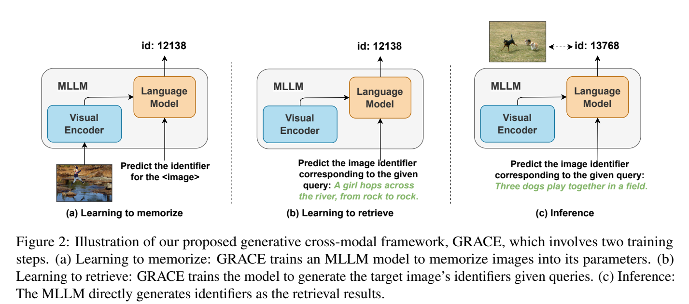
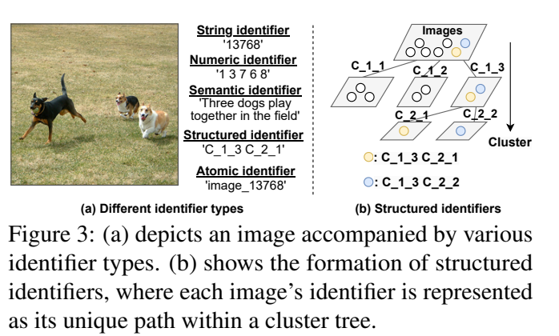

**原文**: [本地](../论文原件/GRACE.pdf) [arXiv](https://arxiv.org/abs/2402.10805)

# 一句话记忆

GRACE 为图库中的每张图分配唯一标识符，并分两步训练 MLLM 学习“图像→标识符”和“文本查询→标识符”；推理时用 Trie 约束 beam search 直接生成合法 ID，从而避免逐候选相似度计算，但代价是把图库写入模型参数及其标识符词表。

# 研究问题

## 以前的方法

以前主流的文本-图像跨模态检索通常被建模为判别式匹配任务，可分为单塔（One-Tower）和双塔（Two-Tower）架构。

- **单塔架构**：在早期阶段就进行精细的图文特征交互（如利用交叉注意力计算区域和单词匹配），检索精度高但推理计算代价极大，无法直接处理大规模图像库。
- **双塔架构**（如 [[CLIP]]）：分别使用独立的图像和文本编码器将两者映射到统一的共享嵌入空间，通过计算其余弦相似度或欧式距离来进行粗检索，其在大规模图像库上依赖外部向量数据库和近邻搜索（ANN）。

## 存在的问题

1. **多模态大模型（MLLM）缺乏视觉输出能力**：当前的 MLLM 仅能生成纯文本回复，无法直接响应需要视觉内容的查询（如“Sheldon Cooper 长什么样”）。
2. **外部合成工具易导致幻觉**：若利用扩散模型（Diffusion Models）或生成对抗网络（GANs）为 MLLM 提供视觉合成，容易生成不真实或有幻觉的图像，无法精确呈现真实的客观实体（如特定人物的照片）。
3. **大库仍有候选搜索成本**：论文实验中的 CLIP 基线对全部图像向量计算相似度，图库增大时查询吞吐下降。实际 ANN 索引不必线性扫描，因此论文结果不能外推为所有双塔系统都线性缩放。

## 论文试图解决什么

如何让 MLLM 摆脱对外部图像生成工具或外部向量检索数据库的依赖，将其转变为一个**参数化视觉记忆库**，能够直接在模型参数中记忆大量真实图片，并根据用户的文本查询通过生成对应的图像唯一标识符（Identifier）来直接“召回”目标图像。

# 核心洞察

- **研究洞察**：
  1. **将图像检索转化为序列生成任务**：通过为图像分配唯一的文本/Token 标识符字符串，将原本计算相似度的判别任务完美转化为自回归的文本预测任务，打破了对负样本训练和推理期相似度索引的依赖。
  2. **用生成路径代替全库打分**：生成步数主要由标识符长度和 beam size 决定。论文 Figure 4 中 GRACE 吞吐在测试规模内近似恒定，并在约 15 万图像后超过其穷举 CLIP 实现；这是一项经验结果，不是对图库大小严格 $O(1)$ 的复杂度证明。
  3. **参数内记忆的“视觉理解”泛化**：`[Paper Facts]` 实验表明，被 GRACE 记住的图像标识符不仅能用于检索，MLLM 甚至可以在完全不输入图像的前提下，仅输入其标识符，就能用自然语言详细描述图像的上下文（如“三女一男在桌子旁喝啤酒”），并进行问答。

- **工程实现**：
  1. **渐进式双阶段训练 (Memorize $\rightarrow$ Retrieve)**：不能直接从查询一步跨越到标识符。第一步“学习记忆”让模型学会看图生成 ID；第二步“学习检索”在模型已具备图-ID 映射的基础上，让模型学会根据文本 query 检索 ID。
  2. **基于前缀树（Trie）的约束生成（Constrained Generation）**：在推理时，使用包含所有候选图像 ID 的 Trie 树限制 Beam Search 的 Token 选择范围，确保生成的标识符必然对应图像库中真实存在的合法图像，使 Recall 指标获得成倍提升。

- **普通组件**：
  - 选用 Open-Flamingo 3B 作为基础架构骨干，其包含冻结的 CLIP 视觉编码器、可训练的门控交叉注意力层和自回归文本解码器。

# 方法流程

方法流程的总体框架见首图 ，图像标识符的选择见下图 。

- **1. 第一阶段：学习记忆 (Learning to Memorize)**：
  输入图像 $i$ 与记忆指令 $\text{inst-m}$（“Predict the identifier for the <image>”） $\rightarrow$ MLLM 中的 `<image>` 占位符通过交叉注意力融合图像特征 $\rightarrow$ 自回归文本预测层计算交叉熵损失，训练模型输出该图像对应的唯一标识符 $I$。

- **2. 第二阶段：学习检索 (Learning to Retrieve)**：
  输入用户文本查询 $q$ 与检索指令 $\text{inst-r}$（“Predict the image identifier corresponding to the given query”） $\rightarrow$ 在不提供图像的条件下 $\rightarrow$ 训练模型以自回归方式直接输出该关联图像的标识符 $I$。

- **3. 推理阶段 (Inference)**：
  输入待查询的文本 $q$ 与指令 $\text{inst-r}$ $\rightarrow$ 限制生成的自回归解码器利用 Beam Search 逐步产生 ID Token $\rightarrow$ **在每一步 Token 生成时，利用构建的 Trie 树过滤掉所有非法 Token** $\rightarrow$ 输出概率最高的 Top-K 个合法标识符字符串 $\rightarrow$ 映射回原图作为检索结果。

# 关键模块

- **视觉特征提取器 (Visual Encoder)**
  - 输入：原始图像 $i$
  - 输出：局部斑块特征（Patch Features）
  - 作用：将输入的图像信号进行分块和高维特征表示，作为 MLLM 的视觉输入。
  - 为什么需要：向大语言模型注入视觉模态的基础。
  - 去掉后可能发生什么：无法进行第一阶段“学习记忆”的训练。

- **前缀树约束搜索器 (Trie-Constrained Beam Search)**
  - 输入：当前 Beam 分支中已生成的 Token 前缀。
  - 输出：仅属于已有图像标识符集合的合法下一 Token 候选集。
  - 作用：限制自回归解码的搜索空间，屏蔽掉词表中的无关词汇。
  - 为什么需要：防止模型产生幻觉，生成不存在或格式错误的无效标识符字符串。
  - 去掉后可能发生什么：模型会自由生成语料库之外的词汇；论文消融中，Flickr30K 的 R@1 从 30.5% 降至 10.9%。

# 训练目标或核心公式

在两个训练阶段，GRACE 均采用标准的交叉熵损失函数进行最大似然估计（MLE）优化。

设图像 $i$ 的唯一标识符 Token 序列为 $I = (t_1, t_2, \dots, t_L)$。

- **记忆阶段损失**：

$$\mathcal{L}_{\text{mem}} = -\sum_{l=1}^L \log p(t_l \mid t_{<l}, i, \text{inst-m})$$

- **检索阶段损失**：

$$\mathcal{L}_{\text{ret}} = -\sum_{l=1}^L \log p(t_l \mid t_{<l}, q, \text{inst-r})$$

- **优化目标**：最小化上述自回归损失，在第一阶段使参数建立起 $i \to I$ 的强关联；在第二阶段使参数建立起 $q \to I$ 的条件概率对齐。
- **对特征空间的影响**：将高维图像特征和文本查询映射到参数化多模态解码器的离散标识符 Token 序列空间，图像在参数中被抽象压缩为特定的自回归生成路径。

# 实验证明了什么

- **实验问题 1：不同的图像标识符（Identifier）类型对生成检索的效果有何影响？**
  - **比较对象**：
    1. *String Identifier*（如 `"13768"`）：随机数字字符串。
    2. *Numeric Identifier*（如 `"1 3 7 6 8"`）：中间带空格的单数字，受词表分词限制小，只用 10 个数字 Token。
    3. *Semantic Identifier*（如用训练集生成的 caption 作标识符）。
    4. *Structured Identifier*（对 CLIP 嵌入进行层次 k-means 聚类，ID 为路径，如 `"C_1_3 C_2_1"`）。
    5. *Atomic Identifier*（为每张图新增一个专属词表 Token，如 `"I_13768"`）。
  - **观察结果**：
    - **Atomic Identifier** 最强：Flickr30K R@1 为 **68.4**，MS-COCO 5K 为 **41.5**，均略高于论文中的 CLIP 基线（58.4、37.8）。
    - **Structured Identifier** 次之（37.4、16.7），显示图像聚类先验有帮助，但需要为层级簇扩词表。
    - String 在 Flickr30K 尚有 30.5 R@1，却在更大的 MS-COCO 5K 上降至 0.12；Numeric 分别为 22.5 和 0.03。Semantic 在 MS-COCO 上为 13.3，但不同图像可能得到相同或相近描述，区分性不足。
  - **支持的结论**：标识符设计决定容量、序列长度、语义先验与词表规模之间的权衡；最佳实验结果来自 atomic ID，不能得出“简单数字字符串最佳”的结论。
  - **不能支持的结论**：实验无法证明在极度动态更新（频繁增删候选图）的业务场景中，静态字符串映射能保持稳定。

- **实验问题 2：GRACE 的生成式检索与传统的双塔判别检索（如 CLIP）相比效率和精度如何？**
  - **比较对象**：CLIP 以及其他的 one-tower / two-tower 判别模型。
  - **观察结果**：
    - 精度必须按 ID 类型区分：Atomic GRACE 在 Flickr30K/MS-COCO 5K 的 R@1 为 68.4/41.5，高于论文 CLIP 基线的 58.4/37.8；String GRACE 仅为 30.5/0.12。旧笔记只引用 String 结果，遗漏了最强设定。
    - 效率实验比较 GRACE 与穷举 CLIP 相似度计算：GRACE 在所测图库规模内吞吐近似不变，约 15 万图像后更快。论文没有与成熟 ANN 系统比较。
  - **支持的结论**：生成式检索可避免显式全库打分，且 atomic ID 在两个基准上可达到有竞争力的召回；是否优于实际大规模向量检索系统仍未被该实验验证。

# 局限与失效场景

- **局限 1：生成式检索对参数容量的强烈依赖**
  - **产生原因**：图像信息和映射关联完全被硬编码在 MLLM 的可训练参数中，因此检索精度极易受到参数量瓶颈的限制。
  - **可能失败的场景**：从 Flickr30K 扩到 MS-COCO 时，无语义的 string/numeric ID 已出现明显退化；但论文没有做百万或千万规模实验，也没有直接测量“灾难性遗忘”。

- **局限 2：对新增图像（Dynamic Insertion）难以灵活扩展**
  - **产生原因**：不同于向量库直接插入嵌入，GRACE 的图—ID 和查询—ID 映射由参数学习；新增图像至少需要分配 ID 并更新模型，atomic ID 还要扩展词表。
  - **可能失败的场景**：高频更新的实时图像库（如每日电商新品上架），重新训练和微调的开销不可接受。

# 与其他论文的关系

## 前置基础

- [[CLIP]]：提供图像的 CLIP Embedding，并在评测中用作主流对比基线（`uses-as-encoder`）。
- [[OpenFlamingo]]：提供基础的 MLLM 骨干网络与交叉注意力层级结构（`uses-as-backbone`）。

## 同任务工作

- [[MLP_Memory]]：平行思想，将外部 $k$NN 检索分布通过 MLP 神经网络进行参数化蒸馏与拟合，免去 RAG 的 document 检索过程（`similar-idea`）。

# 主动回忆问题

## Level 1：主线恢复

- 解释 GRACE 论文中“学习记忆”和“学习检索”两个训练阶段的具体流程。
- 推理（Inference）时，GRACE 是如何避免生成不存在的图像 ID 的？

## Level 2：机制理解

- 比较 String、Numeric、Semantic 和 Atomic 标识符的优缺点。为什么 Atomic 标识符在实际应用中受限？
- 为什么 GRACE 在论文实验中随图库增大仍保持近似稳定吞吐？为什么这还不足以严格证明相对图库大小为 $O(1)$？

## Level 3：批判与迁移

- 如果要在需要频繁更新、实时插入新图片的监控系统中应用生成式图像检索，你会面临什么挑战？如何结合判别式双塔和生成式检索的优势？
- GRACE 与近年来的判别式大模型在生成图像（如 Stable Diffusion）方面有何根本区别？

## 理解更新记录

- `2026-07-12`：由 Antigravity 依据 `paper-memory` 规范生成。提取了 GRACE Page 4 的框架图，并详细整理了参数化记忆检索机制、 identifier 对比、公式及局限性。
