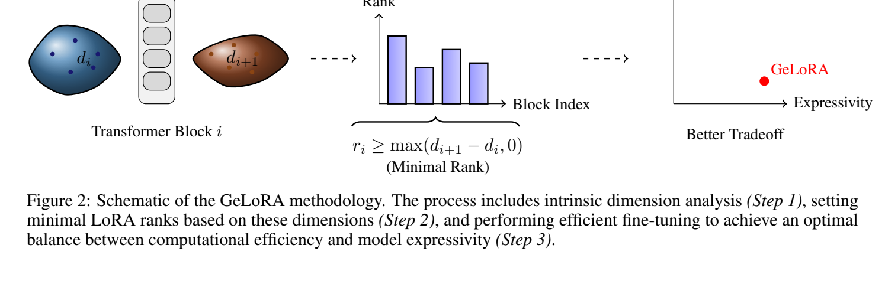

**原文**: [本地](../论文原件/GeLoRA.pdf) [arXiv](https://arxiv.org/abs/2412.09250)

# 一句话记忆

GeLoRA 在训练前用 Two Nearest Neighbors（2-NN）估计各层隐藏表示的内在维度，并按相邻层的维度增量 $r_i=\max(d_{i+1}-d_i,0)+1$ 静态分配 LoRA 秩，以较低的训练开销获得任务相关的层间容量配置。

# 研究问题

## 以前的方法

大语言模型（LLM）的全参数微调极其消耗算力与显存。低秩适应（[[微调#LoRA（Low-Rank Adaptation）|LoRA]]）通过冻结预训练权重并注入旁路低秩矩阵来分解增量参数，极大地降低了计算门槛。传统的 LoRA 通常在所有 Transformer 块中采用统一的固定秩（Uniform Rank）。自适应 LoRA 变体（如 [[AdaLoRA]] 和 [[SoRA]]）则通过计算隐特征的重要性分数或使用优化约束对不重要的增量矩阵秩进行动态调节和剪枝。

## 存在的问题

1. **秩分配缺少可解释依据**：统一秩忽略了不同 Transformer block 的表示变化；AdaLoRA、SoRA 等方法虽能动态调整秩，但主要依据重要性评分、剪枝或稀疏门控。
2. **自适应发生在训练期间**：SVD、近端梯度和持续重分配都会增加运行时成本。
3. **参数预算与表示几何脱节**：现有方法通常不能直接回答“某一层为什么需要更多可训练自由度”。

## 论文试图解决什么

论文尝试把隐藏表示流形的维度变化与每个 block 所需的可优化参数量联系起来，据此在正式微调前一次性确定各层 LoRA 秩，避免训练期的动态秩搜索。

# 核心洞察

- **研究洞察**：
  1. **用表示维度增量刻画层容量需求**：定理 3.2 给出 $d_i\leq\operatorname{rank}(T_i)$；推论 3.2.1 进一步给出 block 优化参数量的下界 $\max(d_i-d_{i-1},0)$。论文据此把相邻层的正向维度增量当作 LoRA 秩的分配信号。需要注意：理论下界约束的是优化自由度，实际把它直接映射为 LoRA rank 是方法设计，而不是定理本身的等价结论。
  2. **中间任务微调可改变维度剖面**：作者观察到先在 MRPC 上微调后，RTE、STS-B 的高层内在维度剖面发生压缩，并将其解释为后续任务所需参数下界可能降低。该部分是论文给出的解释与实验支持，不等于对所有任务都成立的普遍定理。

- **工程实现**：
  1. **静态预分配**：内在维度估计放在预处理阶段；训练期间秩保持不变，因此不需要反复执行 SVD 或稀疏优化。代价并未消失，而是部分转移到了预处理。
  2. **等比例调节缩放因子 $\alpha$**：为维持不同分配秩下的微调权重对整体更新的梯度贡献比例一致，在计算出 $r_i$ 后，令其对应的 LoRA 缩放因子满足 $\alpha_i = c \cdot r_i$（即 $\alpha_i / r_i = c$ 常数限制）。

- **普通组件**：
  - 选用 DeBERTaV3-base 作为 NLU 评估骨干，Phi-2 2.7B 作为 instruction-following 微调骨干；使用 Optuna 自动调整超参数（学习率、LoRA 丢弃率等）以保证公平比较。

# 方法流程

方法流程的总体框架见首图 。

- **1. 预处理阶段流程 (Ranks 静态计算)**：
  从训练集中提取小批代表性样本 $\rightarrow$ 喂入冻结的预训练 LLM，搜集每一 Transformer 层 $i$ 的隐藏状态激活集合 $X_i$ $\rightarrow$ 通过 Two Nearest Neighbors (2-NN) 算法拟合每个 $X_i$ 流形的内在维度 $d_i$ $\rightarrow$ 计算相邻层内在维度膨胀变化量 $\Delta d_i = \max(d_{i+1} - d_i, 0)$ $\rightarrow$ 添加常量偏置 $+1$，将该块内的 Query、Key、Value、Output 的 LoRA 矩阵秩固定为 $r_i = \Delta d_i + 1$ $\rightarrow$ 设置等比缩放因子 $\alpha_i$ $\rightarrow$ 锁定为模型的静态配置。

- **2. 运行时微调阶段流程**：
  基于预分配好的差异化静态 ranks 向量 $\vec{r}$ 与 $\vec{\alpha}$ 进行标准的旁路低秩矩阵初始化 $\rightarrow$ 使用标准的 AdamW 优化器，在 target 下游任务上开启 LoRA 微调 $\rightarrow$ 由于训练中没有动态秩更改和 SVD，训练以最高物理速度进行 $\rightarrow$ 微调收敛。

# 关键模块

- **Two Nearest Neighbors (2-NN) Estimator**
  - 输入：隐藏激活特征矩阵 $X_i \in \mathbb{R}^{n \times D_{\text{hidden}}}$ (文本特征)
  - 输出：该层激活所在局部流形的内在维度 $d_i$ (实数)
  - 作用：利用 batch 内每个点 xj 的最近邻距离 r1 与次近邻距离 r2，计算相对比例 $\mu_j = r_2/r_1$，利用 Pareto 分布性质通过对数回归快速拟合流形的内在维度。
  - 为什么需要：在不构造 Fisher 信息矩阵的情况下，为每层表示提供可计算的局部维度估计。它依赖局部均匀密度假设，结果应视为估计值而非“真实维度”。
  - 去掉后可能发生什么：无法确定各层特征流形的空间曲率和膨胀程度，GeLoRA 无法进行差异化参数分配。

- **Geometric Rank Assigner**
  - 输入：各层拟合的内在维度向量 $\vec{d}$ (实数列表)
  - 输出：各层的 LoRA 秩 $r_i$ 及缩放因子 $\alpha_i$ (整数和浮点列表)
  - 作用：在保证几何膨胀下界 $\Delta d_i$ 的基础上，为 Query/Key/Value/Output 矩阵计算静态 rank，并通过限制比例 $\alpha_i / r_i = c$ 提供等比例正则缩放。
  - 为什么需要：提供对 Transformer 各块容量特异的适配，使得参数分配与该块的实际表达要求紧密绑定。
  - 去掉后可能发生什么：GeLoRA 将失去任务相关的静态秩配置依据，只能改用统一秩或另一种秩搜索方法；具体性能变化取决于任务，不能由单一 GLUE 均值外推。

# 训练目标或核心公式

GeLoRA 秩分配的核心几何约束推导为：
对于 Transformer 块 $T_i : \mathbb{R}^{n_{i-1}} \times \mathbb{R}^{p_{i-1}} \to \mathbb{R}^{n_i}$，其所需的增量优化参数量下界 $N_{i-1}$ 满足（Corollary 3.2.1）：

$$\max(d_i - d_{i-1}, 0) \le N_{i-1}$$

在预处理拟合 $d_i$ 时，2-NN 算法基于比例分布：

$$\mu_j = \frac{r_2(j)}{r_1(j)}$$

其累积分布函数满足 Pareto CDF：

$$F(\mu | d) = 1 - \mu^{-d}$$

通过在 log-log 空间进行线性拟合：

$$\log(\mu_{\sigma(j)}) \quad \text{vs.} \quad -\log\left(1 - \frac{j}{N}\right)$$

其中斜率即为内在维度 $d_i$。

- **秩计算公式**：

$$r_{K}^i = r_{Q}^i = r_{V}^i = r_{O}^i = \max(d_{i+1} - d_i, 0) + 1$$

- **对特征空间的影响**：通过将低秩增量矩阵与流形维度膨胀挂钩，模型能够在有显著维度膨胀的 Transformer 块（通常在中高层语义抽象部分）提供更多可变自由度进行特异性调节，而在发生强压缩的块（往往是底层语法语义）维持极度轻量的足迹，使最终的隐表征流形高度贴合任务分布。
- **解释边界**：上述公式给出的是一种基于初始隐藏表示的秩启发式。论文没有证明该静态秩一定是全局最优秩，也没有证明维度膨胀只出现在固定的层段。

# 实验证明了什么

- **实验问题 1：GeLoRA 在 GLUE 自然语言理解基准上的表现是否优于传统固定秩 LoRA 与自适应 AdaLoRA？**
  - **比较对象**：Full FT, BitFit, Pfeiffer/Houlsby Adapters, LoRA (r=1, 2), SoRA, AdaLoRA。
  - **观察结果**：使用 DeBERTaV3-base 评估，GeLoRA 在 GLUE 测试集上取得了全场最佳的 **87.92** 平均分，超越固定秩 LoRA r=1 (86.95) 以及 AdaLoRA r=2 (86.90)。其在 CoLA (70.96) 和 MRPC (89.90) 上创造了新的 PEFT 记录。
  - **支持的结论**：在该实验配置下，几何秩分配取得更好的平均分；结果支持方法有效，但不足以证明它在所有模型和任务上都优于动态方法。

- **实验问题 2：GeLoRA 在微调训练耗时（Runtime）上的优势是否显著？**
  - **比较对象**：SoRA, LoRA, AdaLoRA, BitFit, Pfeiffer/Houlsby Adapters 运行 20 轮（RTE 为 50 轮）的时间。
  - **观察结果**：在所有 6 个 GLUE 子数据集上，GeLoRA 的运行速度均为最快。其平均训练 Runtime（245.5s）比 AdaLoRA（685.45s，受制于 SVD 计算）快了 **2.8 倍**，且快于 uniformly fixed 的 LoRA（283.73s，由于 GeLoRA 剪短了无关层的 rank）（Table 4 所示）。
  - **支持的结论**：静态分配减少了本实验中的训练期额外计算。该比较不包含预处理成本，且运行时结论依赖相同硬件、batch size 与秩预算。

- **实验 issue 3：在少样本可训练参数（Trainable Parameters）极限下，GeLoRA 的性能如何？**
  - **比较对象**：在 SQuAD v1.1 / v2.0 上与 Full FT 和各 PEFT 对抗。
  - **观察结果**：在 SQuAD v1.1 上，GeLoRA 仅动用 **8k** (8e-3M) 的超轻量可训练参数，取得了 EM/F1 = **86.72/92.84** 的表现，超越了拥有 183M 可训练参数的 Full Fine-tuning 基线（86.12/92.68）。
  - **支持的结论**：证明理论下界几何秩指导下的参数分配可以在极高压缩比下维持或超越完整监督特征的提取表现。

# 局限与失效场景

- **局限 1：依赖局部内在维度估计**
  - **产生原因**：2-NN 假设局部密度近似均匀，在高维环境中往往给出保守估计。
  - **可能失败的场景**：样本量不足、长尾或多簇分布可能导致维度估计偏低，进而使部分层容量不足；公式中的 $+1$ 只能避免零秩，不能消除估计误差。

- **局限 2：成本转移与验证范围**
  - **产生原因**：方法仍需额外前向传播、保存隐藏状态并运行 2-NN；论文主要验证 DeBERTaV3 和 Phi-2 上的语言任务。
  - **可能失败的场景**：数据分布频繁变化，或扩展到更大、多模态模型时，固定一次的维度剖面可能不再代表后续训练状态。

# 与其他论文的关系

## 前置基础

- [[微调#LoRA（Low-Rank Adaptation）|LoRA]]：直接继承了其增量权重低秩旁路分解的优化数学架构（`builds-on`）。
- [[TwoNN]]：采用其作为在隐藏特征集合上计算内在维度的首选轻量估算器（`uses-as-method`）。

## 同任务工作

- [[AdaLoRA]]：在微调期间依靠奇异值分解（SVD）剪枝调整 rank（`same-task`）。
- [[SoRA]]：在训练期间通过近端梯度优化 $l_0$ 稀疏门控（`same-task`）。

## 关键差异

- 与 [[AdaLoRA]] / [[SoRA]] 相比：前两者在训练期间根据重要性或稀疏目标调整预算，GeLoRA 则在训练前固定秩。它减少了训练循环内的自适应计算，但增加了隐藏状态提取与 2-NN 估计的预处理；理论为参数自由度给出下界，具体 LoRA 秩公式仍是作者的实现选择。

# 对我的课题的启发

`[AI分析]`

1. **点云定位微调的差异化秩分配**：可先在文本—点云数据上测各层隐藏表示的内在维度，再比较几何分支、文本分支和交叉注意力层是否需要不同秩。部署收益必须用统一参数预算和端到端延迟实测，不能由语言任务结果直接推出。
2. **中间任务微调（Intermediate Task Tuning）的几何解释**：这启发我们，如果想在极小点云定位数据集上微调，可以先使用大规模的图文检索或语义分割任务进行 Warm-up 预训。这会在几何上大幅压缩模型高层的特征歧义性，收窄其内在流形维度，从而降低目标小数据集上的 ranks 可训练自由度门槛，极大避免过拟合。

# 主动回忆问题

## Level 1：主线恢复

- GeLoRA 的基本自适应公式中，每个 Transformer 层的秩 $r_i$ 是如何通过相邻层内在维度 $d_{i+1}$ 与 $d_i$ 算出的？
- TwoNN 如何利用最近邻与次近邻距离估计内在维度？这一估计依赖什么假设？

## Level 2：机制理解

- 为什么 GeLoRA 规定在确定秩 $r_i$ 的同时，要保证其缩放系数 $\alpha_i$ 满足 $\alpha_i / r_i = c$？如果让 $\alpha_i$ 恒等于一个固定常量（如 32）会产生什么隐患？
- 为什么说定理 3.2 中 $d_{i+1} - d_i$ 的差值指代了“感受野空间的维度膨胀容量”？

## Level 3：批判与迁移

- SQuAD v1.1 中 8k 可训练参数的 GeLoRA 略高于全量微调，为什么这一单组结果不能直接推出“参数越少越好”？还需要哪些跨模型、跨任务验证？

# 尚未解决的问题

- 局部 2-NN 估算器对高噪声流形的敏感性，如何以低计算延迟引入持久同调（Persistent Homology）等全局拓扑维度建模。

## 理解更新记录

- `2026-07-12`：由 AI 提取论文原件归档初始版本笔记。
- `2026-07-12`：由 Antigravity 依据 `paper-memory` 标准规范与 `CLIP.md`/`CMMLoc.md` 结构规范进行第二次全面重构，重新梳理了 Jacobian 秩约束下界和 Pareto 回归公式，完善了全套实验性能指标与模块说明。

### [2026-07-27] 更新

- **原理解**：基础 LoRA 方法链接指向预期中的独立 `LoRA` 笔记。
- **新理解**：LoRA 的通用定义、公式与选择依据统一归入 [[微调#LoRA（Low-Rank Adaptation）|LoRA]]；GeLoRA 的论文分析保持不变。
- **修改原因**：统一微调方法的知识入口并修复维基链接目标。
- **证据**：知识库结构调整；未改变 GeLoRA 论文事实。
- **状态**：`confirmed`
