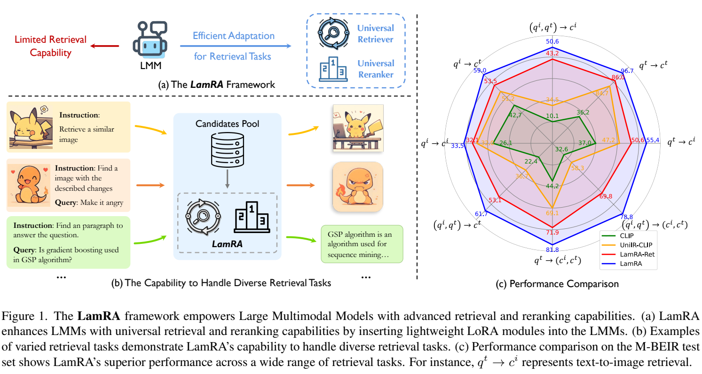

**原文**: [本地](../论文原件/LamRA.pdf) [arXiv](https://arxiv.org/abs/2412.04017)

# 一句话记忆

LamRA 在同一 Qwen2-VL 骨干上分别训练检索 LoRA 与重排 LoRA：前者经“文本检索预训练→多模态指令调优”输出单向量，后者联合学习 pointwise 与 listwise 判断，再把双塔检索分数与交叉编码重排分数融合。

# 研究问题

## 以前的方法

近年来，大语言模型和大型多模态模型（LMMs，如 GPT-4V、Gemini、Qwen2-VL）在生成式多模态任务上（如图像描述、视觉问答等）展现出极其强大的能力。但在多模态检索领域，主流方法依然是基于对比预训练的双塔模型（如 CLIP、SigLIP）。

## 存在的问题

1. **多模态语言模型不原生支持特征检索**：主流 LMM 是通过自回归的 next-token prediction 损失函数训练的，其隐藏状态并未针对向量相似度进行优化。如果直接提取 LMM 的表征来做检索（如直接使用未微调的 Qwen2-VL-7B 计算向量相似度），检索性能会非常差。
2. **多模态检索任务类型极度多样化**：真实的检索场景千差万别，包括：图像-图像检索（i2i）、图像-文本检索（i2t）、文本-图像检索（t2i）、图文混合检索（composed image retrieval）、图文-多模态文档检索（mixed-query to mixed-doc）等。传统的双塔模型结构单一，很难无缝支持任意交错的图文输入。
3. **自回归重排（Reranking）开销过大**：判别式 LMM 虽可作重排器，但点对重排（Pointwise Reranking）需要为每一个候选文本/图像进行单独的前向传播，在长序列文本下推理延迟极其高。

## 论文试图解决什么

如何有效利用 LMM 强大的多模态上下文理解能力，通过统一的轻量级 LoRA 适配层，让 LMM 既能作为**通用的图像-文本多模态检索器**（提取任意交错输入的向量特征进行快速粗检索），又能作为**高性能的重排器**（结合 pointwise 和 listwise 机制进行细重排），打造一站式先进多模态检索助手。

# 核心洞察

- **研究洞察**：
  1. **基于单字限制（EOL）的生成模型向量化表达**：通过提示词强制模型将复杂的图文输入压缩为一个“总结单词”（即 `<emb>` Token），利用该 Token 前一个位置的隐藏层状态作为输入语义特征。这使生成式模型能输出高质量的高维稠密检索特征向量。
  2. **先学“向量检索”，再学“按指令检索”**：Stage I 用 NLI 文本对让自回归隐藏状态适合余弦检索；Stage II 用 M-BEIR 的 8 类检索任务、10 个数据集学习多模态组合与任务指令。论文没有直接测量或证明微调后“不会丢失通用知识”。
  3. **Pointwise 与 Listwise 联合训练**：将 pointwise YES/NO 二分类损失与 listwise 选择题损失（让模型直接输出正确选项序号）进行联合优化，充分发挥了大模型处理长序列和多个候选的能力，提升重排的准确度与效率。

- **工程实现**：
  1. **共享 Backbone 与多头 LoRA**：LamRA-Ret 和 LamRA-Rank 都基于同一个 Qwen2-VL-7B 骨干，各自挂载极轻量级的 LoRA 旁路。重排模型训练时，利用 LamRA-Ret 提取的 Top-100 作为 hard negatives。
  2. **混合分数融合推理**：在推理阶段，最终的重排得分 $S$ 是检索得分（Cosine 相似度）与重排得分（模型输出 YES 词或选项序号的概率）的加权融合。

- **普通组件**：
  - 基于 Qwen2-VL-7B 多模态架构（包括 ViT 图像编码器、二维旋转位置编码的文本-图像 Projector）。

# 方法流程

方法流程的总体框架见首图 。

- **1. 特征提取流程 (EOL 机制)**：
  根据输入模态拼接 Prompt：
  - 纯图像：`<image> Summarize above image in one word: <emb>`
  - 纯文本：`<text> Summarize above sentence in one word: <emb>`
  - 图文混合：`<image1><text1>... Summarize above image and sentence in one word: <emb>`
  $\rightarrow$ 喂入 LMM $\rightarrow$ 提取 `<emb>` Token 前一个位置的 Hidden State 向量作为该输入的表征。

- **2. 粗检索阶段 (LamRA-Ret)**：
  使用检索 LoRA 分别提取 query $q$ 与整个候选库 $\Omega$ 中各候选 $c_i$ 的向量表征 $\rightarrow$ 计算 Cosine 相似度 $S_{\text{ret}}$ $\rightarrow$ 排序并截取 Top-K 候选集 $C_1$。

- **3. 精细重排阶段 (LamRA-Rank)**：
  - **Pointwise 流程**：将 query 和单个候选 $c_i$ 联合输入，模型输出 YES/NO，以 YES 的概率作为 $S_{\text{rank}}$；对 Top-$K$ 需要 $K$ 次推理。
  - **Listwise 流程**：将 query 和 Top-$K$ 候选一次联合输入，模型直接输出最相关候选的序号。训练时每组随机采样 2–5 个负例并随机插入真值；推理可减少调用次数，但受上下文长度约束。

- **4. 混合得分排序**：
  $S = \alpha \times S_{\text{ret}} + (1-\alpha) \times S_{\text{rank}}$ $\rightarrow$ 对 $C_1$ 重新排序，输出最终重排结果 $C_2$。

# 关键模块

- **Explicit One-word Limitation (EOL) 提取层**
  - 输入：LMM 最后一层的隐藏状态序列 $H \in \mathbb{R}^{L \times d}$
  - 输出：代表整体语义的单向量特征 $v \in \mathbb{R}^{d}$
  - 作用：定位到 Prompt 中 `<emb>` Token 的位置，提取其前一个位置的隐藏状态作为输出。
  - 为什么需要：强制使自回归语言模型将序列中的分散注意力集约压缩到单一的向量表征中，供计算余弦相似度。
  - 去掉后可能发生什么：仍可用其他池化方式获得定长向量，因此不能说 InfoNCE 必然“失效”；论文采用 EOL 是为了复用生成式模型的下一词语义汇聚位置。

- **LamRA-Ret (检索 LoRA 模块)**
  - 作用：在 NLI 和 M-BEIR 训练集上通过对比学习优化的 LoRA 旁路，负责拉近相关多模态对的距离。
  - 为什么需要：弥补自回归大模型在稠密检索能力上的先天劣势。

- **LamRA-Rank (重排 LoRA 模块)**
  - 作用：在大模型的自回归推理下进行 pointwise 二分类和 listwise 排序训练的 LoRA 旁路。
  - 为什么需要：利用 LMM 的交叉注意力层对 query 和 candidates 进行深度交互重排，克服双塔无法交互的局限。

# 训练目标或核心公式

- **LamRA-Ret 训练损失（InfoNCE 损失）**：
  给定批大小 $B$，查询为 $q_n$，正样本为 $c_n$，特征提取向量为 $\text{LMM}(q_n)$ 和 $\text{LMM}(c_n)$。

$$\mathcal{L}_{\text{ret}} = -\frac{1}{B} \sum_{n=1}^B \log \frac{\exp(\kappa(\text{LMM}(q_n), \text{LMM}(c_n)) / \tau)}{\sum_{m=1}^B \exp(\kappa(\text{LMM}(q_n), \text{LMM}(c_m)) / \tau)}$$

  其中 $\kappa$ 是 Cosine 相似度，$\tau$ 是温度参数。

- **LamRA-Rank pointwise 损失**：

$$\mathcal{L}_{\text{point}} = \mathcal{L}_{\text{ce}}(\text{YES}, \text{Reranker}(q, c^{\text{pos}})) + \mathcal{L}_{\text{ce}}(\text{NO}, \text{Reranker}(q, c^{\text{neg}}))$$

- **LamRA-Rank listwise 损失**：

$$\mathcal{L}_{\text{list}} = \mathcal{L}_{\text{ce}}(\text{GT-POSITION}, \text{Reranker}(q, c^{\text{pos}}, c_1, \dots, c_M))$$

- **重排总损失**：

$$\mathcal{L}_{\text{rank}} = \mathcal{L}_{\text{point}} + \mathcal{L}_{\text{list}}$$

# 实验证明了什么

- **实验问题 1：EOL 单字限制策略在 Qwen2-VL-7B 上的有效性如何？**
  - **比较对象**：直接使用 Qwen2-VL-7B 提取特征（未经检索预训练），以及其他平均池化（Mean Pooling）提取特征的方法。
  - **观察结果**：论文 Table 5 直接使用未训练 Qwen2-VL 的 M-BEIR 平均 recall 为 **23.0**；只做 NLI 预训练为 **36.2**，只做 M-BEIR 指令调优为 **53.6**，两阶段均使用为 **56.6**。
  - **支持的结论**：两阶段都带来增益，其中任务内多模态指令调优贡献更大；该消融比较的是训练阶段组合，并未系统比较 mean pooling 等所有读出方式，因此不能据此断言 EOL 是“最佳工程实践”。

- **实验问题 2：Pointwise 与 Listwise 联合训练重排效果如何？**
  - **比较对象**：仅进行 Pointwise 训练，或仅进行 Listwise 训练。
  - **观察结果**：Table 7 比较的是同一个联合训练后的 LamRA-Rank 在两种**推理模式**下的结果，而不是“只 pointwise 训练”对“只 listwise 训练”的消融。Top-5 上两者 R@1 接近；listwise 在部分任务更快，但图文候选任务中耗时也可能接近。
  - **支持的结论**：论文证明两种推理接口都能提升初检结果；由于没有报告单独训练的对照，不能把增益归因于两种训练目标的互补性。

# 局限与失效场景

- **局限 1：重排延迟制约（Computational Latency）**
  - **产生原因**：pointwise 对 Top-$K$ 候选需要 $K$ 次 LMM 推理。Top-100 是训练时采集 hard negatives 的候选池；论文在 M-BEIR 默认重排 Top-50、未见任务重排 Top-10，不能把 Top-100 说成默认线上设置。
  - **可能失败的场景**：高吞吐量、低延迟要求（如 < 50ms 响应时间）的工业检索排序系统。

- **局限 2：Listwise 模式下的上下文窗口限制（Context Length Constraint）**
  - **产生原因**：当 $M$（候选样本数）增加时，拼接的图像和文本数量会使得 LMM 提示词长度急剧增加。
  - **可能失败的场景**：一旦超出大模型能够接受的视觉 token 上限，会导致显著的注意力分散，进而选择失败。

# 与其他论文的关系

## 前置基础

- [[Qwen2-VL]]：提供原始的大型多模态语言模型骨干网络（`uses-as-backbone`）。
- [[InfoNCE]]：作为第一阶段检索微调的对齐损失函数（`uses-as-loss`）。

## 同任务工作

- [[ColPali]]：同样关注基于图像表征的细粒度多模态文档检索（`same-task`）。
- [[E5-V]]：用 LLaVA 架构的最后一层 embedding 进行 Pooling 提取检索向量的同类检索工作（`same-task`）。

# 主动回忆问题

## Level 1：主线恢复

- 简述 LamRA 提取任意图文交错输入特征向量的 EOL 提示词机制。
- 检索得出的相似度分数 $S_{\text{ret}}$ 与重排分数 $S_{\text{rank}}$ 是如何进行最终融合的？

## Level 2：机制理解

- 两阶段检索微调（Stage I & II）分别在什么数据集上进行？它们各起到了什么作用？
- Pointwise Reranking 和 Listwise Reranking 在 LamRA-Rank 中的具体损失函数和训练数据是如何构建的？

## Level 3：批判与迁移

- 为什么在未经过 retrieval 预训练时，大模型的最后一个 token 隐藏状态用于计算余弦相似度的检索效果极差？这与它的训练目标（自回归生成）有什么内在联系？
- 你会如何将 LamRA 的检索与重排逻辑移植到 3D 地点识别（VPR）领域？比如对于全景图和定位文本的对齐。

## 理解更新记录

- `2026-07-12`：由 Antigravity 依据 `paper-memory` 规范生成。详尽提取了 LamRA 的 EOL 嵌入机制、双阶段检索、联合 pointwise/listwise 重排以及 Qwen2-VL 的适配细节。
