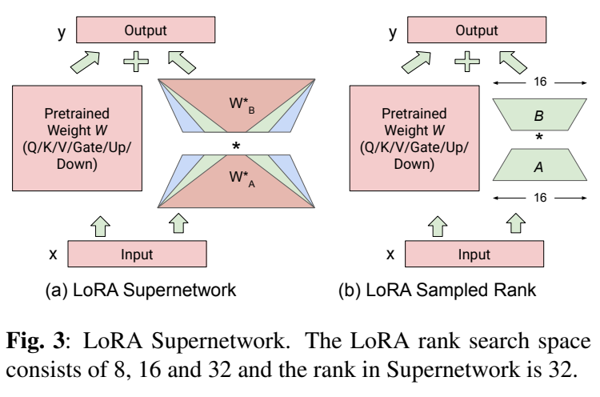
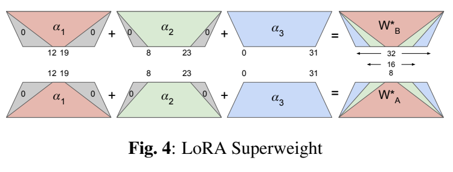

**原文**: [本地](../论文原件/LoRA_NAS.pdf) [arXiv](https://arxiv.org/abs/2412.03040)

# 一句话记忆

LangVision-LoRA-NAS 把每个目标线性层的 LoRA 秩作为可搜索架构变量：它用最大秩矩阵的嵌套中心切片共享参数，交替优化 LoRA 权重与秩概率，离散化后再微调混合秩适配器；在 LLaMA-3.2-11B-Vision-Instruct 上主要验证了参数压缩与评估困惑度基本持平。

# 研究问题

## 以前的方法

低秩自适应（[[微调#LoRA（Low-Rank Adaptation）|LoRA]]）是微调大语言模型和多模态视觉-语言模型（VLMs）的最主流参数高效微调（PEFT）方法。它冻结预训练的主干权重，仅向线性层注入两个小型的低秩增量矩阵 $A$ 和 $B$。通常情况下，常规的 LoRA 会在模型的所有注意力投影矩阵（如 `q_proj`, `v_proj`）和 MLP 矩阵（如 `gate_proj`, `up_proj`）中采用统一的固定秩（Uniform Rank，如统一设为 8 或 16）。

## 存在的问题

1. **统一秩忽略了不同模块的参数敏感度差异**：VLM 中各层和各子模块的特征表示能力不同。简单的网络层可能只需要很低的秩（如 4 或 8），而复杂层或视觉-文本对齐的关键瓶颈层则需要更高的秩（如 32 或 64）。使用统一秩会导致“简单层参数冗余，复杂层容量不足”的低效问题。
2. **人工秩调优的空间极其庞大**：以包含数十层的 VLM 为例，如果每个矩阵都有 5 种秩的选择，整个网络的秩配置空间呈指数增长。对每种配置都从头训练一遍再评估是完全不可行的。
3. **传统神经架构搜索（NAS）开销不可承受**：使用进化算法（Evolutionary Search）或强化学习的传统 NAS 方法需要反复采样和评估成百上千个微调模型，即使使用 LoRA，在大模型上的整体搜索开销依然非常昂贵。

## 论文试图解决什么

如何为 LLaMA-3.2-Vision 这类 ViT+LLM 模型的各目标 FC 矩阵自动选择不同 LoRA 秩，并以一次权重共享超网络搜索代替逐配置完整训练，在保持评估困惑度的同时减少适配器参数与每 epoch 微调时间。

# 核心洞察

- **研究洞察**：
  1. **基于参数中心共享（Central Weight-Sharing）的超网络设计**：将超网络的秩直接初始化为搜索空间中的最大值（如 32）。较小秩的 LoRA 参数并非独立存在，而是**直接共享最大秩参数的中心对称切片**。这使得任意采样秩的子模型都能更新和复用核心参数。
  2. **将秩分配建模为可微架构参数的 Softmax 概率**：为每种候选秩分配一个连续的架构参数 $\alpha_i$。在搜索阶段，通过 Softmax 归一化 $\alpha$ 并对相应的权重切片进行加权求和（Superweights），将离散的秩选择转化为了对可微超权重的优化。

- **工程实现**：
  1. **双层交替梯度优化（Bilevel Alternate Optimization）**：在搜索步骤中，每个 mini-batch 分两步更新：步骤 1 冻结架构参数 $\alpha$，在训练集上优化 LoRA 权重 $A$ 和 $B$；步骤 2 冻结 $A, B$，在验证集上优化架构参数 $\alpha$。
  2. **搜索后离散化并微调**：搜索结束后，每个模块选择 $\arg\max_i\alpha_i$ 对应的秩，再对选定的混合秩 LoRA 配置做端到端微调。论文未明确说明最终阶段是否重新随机初始化，因此不应写成“从头重训”。

# 方法流程

超权重的对称切片机制见下图 。

- **1. 超权重（Superweights）构建流程**：
  给定搜索空间，如秩选择 $\{8, 16, 32\}$，最大秩为 32。
  - 提取架构参数 $\alpha_1, \alpha_2, \alpha_3$，通过 Softmax 归一化为概率 $\bar{\alpha}_1, \bar{\alpha}_2, \bar{\alpha}_3$。
  - 对 LoRA 权重 $W_A$ 提取中心对称切片：
    - 秩 8 切片：$W_A[:, 12:20]$（32 维空间中间的 8 列）
    - 秩 16 切片：$W_A[:, 8:24]$（中间的 16 列）
    - 秩 32：全权重 $W_A$
  - 将较小切片按 Figure 4 放回最大秩坐标、其余位置补零，再加权求和得到固定形状的超权重。论文 Equations 2–3 省略了补零/嵌入算子；若按字面直接相加，8、16、32 秩张量维度不一致：

$$W^*_A = \bar{\alpha}_1 W_A[:, 12:20] + \bar{\alpha}_2 W_A[:, 8:24] + \bar{\alpha}_3 W_A$$

$$W^*_B = \bar{\alpha}_1 W_B[12:20, :] + \bar{\alpha}_2 W_B[8:24, :] + \bar{\alpha}_3 W_B$$

- **2. 搜索阶段（Bilevel Search）**：
  在一个 mini-batch 的前向传播中只进行一次矩阵乘法：$y = Wx + W^*_B W^*_A x$ $\rightarrow$ 第一步：根据 $\nabla_W \mathcal{L}_{\text{train}}$ 更新 $A, B$ $\rightarrow$ 第二步：根据 $\nabla_{\alpha} \mathcal{L}_{\text{val}}$ 更新 $\alpha$ $\rightarrow$ 循环直至搜索 Epoch 结束。

- **3. 最优采样与微调**：
  为每个模块取 $\arg\max(\alpha_1,\dots,\alpha_n)$ 锁定秩 $\rightarrow$ 对所得混合秩 LoRA 配置继续做端到端微调 $\rightarrow$ 获得最终模型。

# 关键模块

- **LoRA Supernetwork (LoRA 超网络)**
  - 输入：隐藏激活 $x$ 和预训练权重 $W$
  - 输出：包含各秩加权结果的输出 $y$
  - 作用：提供全网共享参数空间，用最大秩的旁路容纳所有候选子路径。
  - 为什么需要：支持无损的参数复用和共享，避免了分别为每个候选秩单独实例化矩阵的巨大内存开销。
  - 去掉后可能发生什么：无法在单个大模型微调过程中完成搜索，不得不退回高延迟的多轮独立微调评估。

- **Differentiable Superweights Slice Assigner**
  - 作用：负责计算中心对称切片，并根据 Softmax 的概率分配加权求和，生成超权重 $W^*_A$ 和 $W^*_B$。
  - 为什么需要：保证前向和反向传播中只有**一次**矩阵乘法操作，确保超网络搜索速度与直接训练最大秩 LoRA 相当。
  - 为什么必须让 A 和 B 的权重共享相同的 $\alpha$：确保对应的低秩旁路在相乘时，维数是匹配且一致的。

# 训练目标或核心公式

- **Softmax 架构概率归一化**：
  设第 $i$ 个候选秩的架构参数为 $\alpha_i$，一共有 $N$ 个候选秩。

$$\bar{\alpha}_i = \frac{e^{\alpha_i}}{\sum_{n=1}^N e^{\alpha_n}}$$

- **中心切片参数共享求和**：

$$W^*_A = \sum_{i=1}^N \bar{\alpha}_i\,\operatorname{Pad}_{r_{\max}}\!\left(W_A[:, \text{slice}_i]\right)$$

$$W^*_B = \sum_{i=1}^N \bar{\alpha}_i\,\operatorname{Pad}_{r_{\max}}\!\left(W_B[\text{slice}_i, :]\right)$$

  这里的 $\operatorname{Pad}_{r_{\max}}$ 是根据论文 Figure 4 补出的显式记号，用来使不同秩切片维度一致；原文公式未写出。对称中心切片建立了嵌套共享关系，但论文没有证明中央通道天然比边缘通道更“核心”。

- **交替梯度下降（Bilevel Alternation）**：
  - 更新权重时：

$$\theta_{\text{LoRA}} \leftarrow \theta_{\text{LoRA}} - \eta_w \nabla_{\theta_{\text{LoRA}}} \mathcal{L}_{\text{train}}(\mathcal{D}_{\text{train}}, \theta_{\text{LoRA}}, \alpha)$$

  - 更新架构时：

$$\alpha \leftarrow \alpha - \eta_{\alpha} \nabla_{\alpha} \mathcal{L}_{\text{val}}(\mathcal{D}_{\text{val}}, \theta_{\text{LoRA}}, \alpha)$$

# 实验证明了什么

- **实验问题 1：LangVision-LoRA-NAS 搜索出的可变秩微调效果与统一秩（Uniform Rank）LoRA 相比如何？**
  - **比较对象**：固定 Uniform Rank $r \in \{8, 16, 32, 64\}$ 的传统 LoRA。
  - **观察结果**：论文比较的是统一 $r=64$ 与搜索空间 $\{8,16,32,64\}$ 得到的混合秩模型，并报告**评估困惑度、LoRA 参数量和每 epoch 时间**，未报告 ai2d、ChartQA、VSR 等任务的准确率。全适配器设置下，参数由 268.7M 降到 103.3M（2.6×），各数据集困惑度接近；DocVQA 每 epoch 由 1815.3s 降到 1786.2s（约 1.6%）。
  - **支持的结论**：搜索能在该模型与这些数据集上显著压缩 LoRA 参数并大致保持困惑度；由于缺少任务指标，不能据此声称 VQA/推理准确率优于固定秩。

- **实验问题 2：LoRA-NAS 的搜索成本和训练时间是否可接受？**
  - **观察结果**：论文只说超网络搜索训练“a few epochs”，未给出统一的 3–5 epoch 数值。Table 1 的每 epoch 时间明确**不包含搜索时间**，最终模型均微调 10 epochs。
  - **支持的结论**：权重共享避免了逐个秩配置完整训练；但论文未报告端到端 wall-clock 搜索成本，因此不能断言搜索开销“几乎可忽略”。

# 局限与失效场景

- **局限 1：嵌套中心切片带来的共享偏置**
  - **产生原因**：小秩候选总是复用最大秩矩阵中央的嵌套通道，中央参数得到来自更多候选路径的梯度；这是一种权重共享设计偏置，而非已验证的“中央通道更重要”先验。
  - **可能失败的场景**：超网络中不同秩候选相互干扰，导致共享权重下的排序不能可靠预测独立训练后的排序。论文没有与独立训练的全部秩配置做排序相关性验证。

- **局限 2：对验证集（Validation Set）的强依赖**
  - **产生原因**：架构参数 $\alpha$ 必须在独立的 Validation 数据集上更新以防止过拟合，这在大模型微调数据紧缺的场景下，分流了训练样本。

# 与其他论文的关系

## 前置基础

- [[微调#LoRA（Low-Rank Adaptation）|LoRA]]：作为最基础的低秩矩阵增量自适应微调方案（`builds-on`）。
- [[LLaMA-3.2-Vision]]：作为评估的主要多模态模型骨干（`uses-as-backbone`）。

## 同任务工作/对比

- [[GeLoRA]]：同为自适应秩分配方法。**关键差异**：GeLoRA 是完全静态的、基于数据几何内在维度在微调前计算秩（Training-free），无需交替超网络训练；而 LoRA-NAS 是基于超网络梯度优化的动态搜索方案（NAS-based）（`peer-work`）。
- [[AdaLoRA]]：利用重要性度量（如梯度与权重乘积）在训练中动态修剪奇异值以调整秩（`peer-work`）。

# 主动回忆问题

## Level 1：主线恢复

- 解释 LangVision-LoRA-NAS 中的“超权重（Superweights）”是如何通过架构参数 $\alpha$ 以及中心切片构建的？
- 在搜索阶段，LoRA 权重与架构参数 $\alpha$ 是如何交替更新的？

## Level 2：机制理解

- 为什么在构建超权重时，矩阵 A 的列切片和矩阵 B 的行切片必须使用完全相同的架构参数 $\alpha$ 进行加权？
- 为什么超网络设计需要对大模型参数进行“中心切片”而不是随机切片？这与 Weight Sharing 有何关系？

## Level 3：批判与迁移

- 相比于 GeLoRA 不需要任何超网络训练、仅用 2-NN 计算流形内在维度即可预分配秩的做法，LoRA-NAS 这种基于梯度 NAS 的方案在实际工业部署中有何利弊？
- 在 3D 目标检测等纯 CV 任务中，如果我们要对 Backbone 注入 LoRA，你会怎么设计其搜索空间和交替优化策略？

## 理解更新记录

- `2026-07-12`：由 Antigravity 依据 `paper-memory` 规范生成。详尽整理了 VLM 低秩神经架构搜索（NAS）机制、中心切片、双层交替更新及与 GeLoRA 的关键对比。

### [2026-07-27] 更新

- **原理解**：基础 LoRA 方法链接指向预期中的独立 `LoRA` 笔记。
- **新理解**：LoRA 的通用定义、公式与选择依据统一归入 [[微调#LoRA（Low-Rank Adaptation）|LoRA]]；LoRA-NAS 的论文分析保持不变。
- **修改原因**：统一微调方法的知识入口并修复维基链接目标。
- **证据**：知识库结构调整；未改变 LoRA-NAS 论文事实。
- **状态**：`confirmed`
