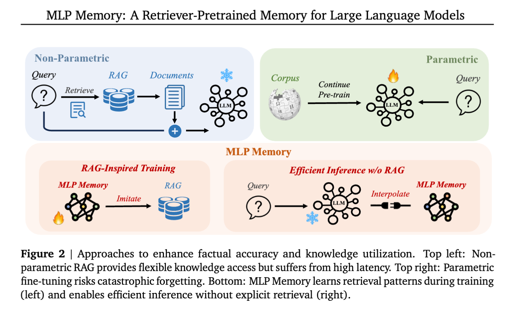
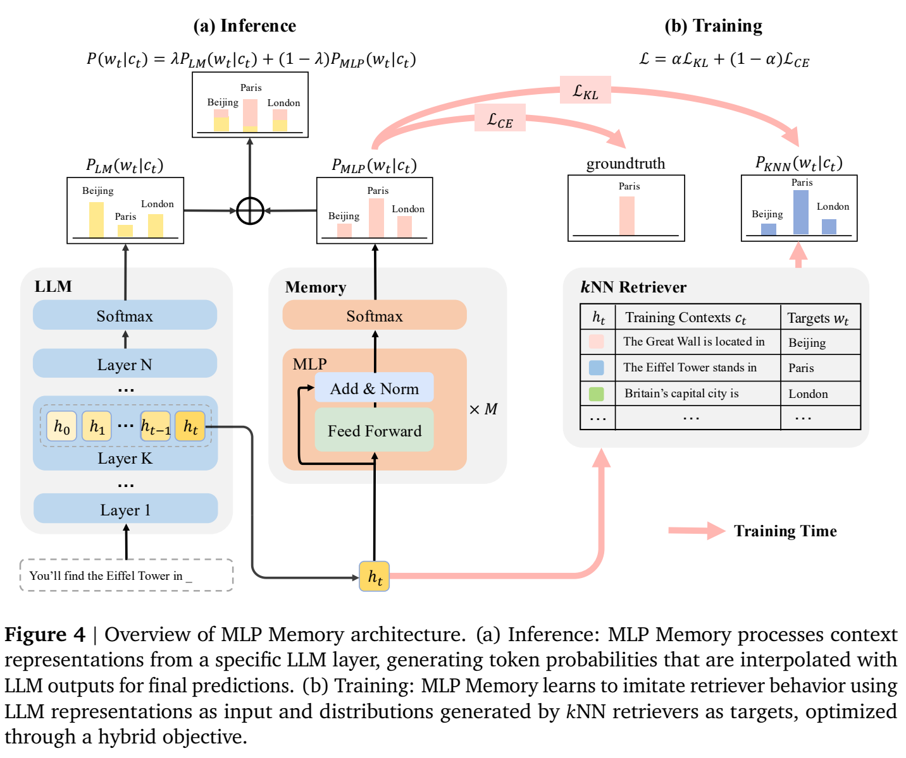

**原文**: [本地](../论文原件/MLP_Memory.pdf) [arXiv](https://arxiv.org/abs/2501.02189) (Note: metadata references 2025 Lumia Lab, arXiv preprint).

# 一句话记忆

MLP Memory 先用完整语料上的 $k$NN-LM 分布监督一个独立的全 MLP 模块，再把它的词表分布与冻结底座 LM 的分布插值；它把推理时的查库压缩成一次参数化前向传播，在论文的五个 QA 基准上同时优于同语料的 RAG、$k$NN-LM、CPT 与 LoRA 对照。

# 研究问题

## 以前的方法

提升大语言模型（LLM）的事实准确性并缓解幻觉，主流的方法分为两类：

- **非参数化检索增强生成**（如 [[RAG]] 和 [[kNN-LM]]）：在推理时从外部大规模向量数据库中检索相关文档，并拼接进上下文（RAG）或在词表层插值（kNN-LM）。
- **参数化微调**（如增量预训练 Continued Pre-training 或 [[微调#LoRA（Low-Rank Adaptation）|LoRA]]）：直接在特定领域的语料库上对 LLM 参数进行微调，将知识内化进模型权重中。

## 存在的问题

1. **RAG 与 kNN-LM 推理开销极其高昂**：RAG 极大地拉长了输入上下文，导致推理的 Attention 计算复杂度按序列长度二次方增加，增加了“首字时间”（Time-to-First-Token）；kNN-LM 则需要在每一次 Token 生成时都在千万级甚至亿级的 Key-Value 数据集上进行昂贵的向量最近邻（ANN）搜索。
2. **微调带来灾难性遗忘与泛化退化**：直接对 LLM 进行增量微调，极易破坏模型预训练阶段习得的通用对齐和高阶推理逻辑，发生灾难性遗忘（Catastrophic Forgetting）。
3. **“浅层对齐”限制表征深度**：RAG 将外部知识作为上下文直接输入，LLM 只能在浅层进行条件概率建模，无法做到知识的隐式深度语义融合。

## 论文试图解决什么

如何融合参数化（微调）与非参数化（RAG）的优势，既能让大模型免除检索数据库的延迟和存储负担、在推理时保持极高的响应速度，又能拥有 RAG 高质量的事实召回精度，同时不破坏大模型原生的通用推理泛化能力。

# 核心洞察

- **研究洞察**：
  1. **参数化蒸馏 $k$NN 检索模式（Retriever Imitation）**：将非参数化的 $k$NN 检索分布抽象为一个连续的、可微的深度映射函数 $\mathcal{M}: \mathbb{R}^d \to \mathbb{R}^{|V|}$。通过神经网络（MLP）逼近这一映射，使知识检索行为直接固化为前向传播。
  2. **大模型 Feed-Forward 网络（FFN）作为 Key-Value 记忆体的性质**：受前人发现的 “Transformer 的 FFN 层本质是键值存储器”的启发，设计一个不含 Token-Mixing（无 Self-Attention）的纯 MLP 堆栈。它只针对单位置的隐藏表征（Hidden Representation）进行深度语义映射，非常适合用于记忆事实模式。
  3. **检索拟合的概率插值推理**：MLP Memory 不参与大模型底座的文本生成建模。它是一个外挂的概率预测头。在推理时，通过将底座 LM 的输出概率分布与 MLP 的输出概率分布进行简单的线性加权插值（Interpolation），保持了大模型核心推理参数不被破坏。

- **工程实现**：
  1. **混合目标优化（KL 散度 + 交叉熵）**：KL 让 MLP 拟合 $k$NN 软分布中多个候选后继词，CE 则约束真实下一词。$\alpha=0.4$ 的消融最好；“完美保留检索分布”并不准确，附录显示 MLP 输出仍比 $k$NN 分布更平滑。
  2. **首字延迟与吞吐量的重大突破**：`[Paper Facts]` 实验数据表明，相较于 RAG，MLP Memory 将首字生成延迟缩短了 **2.5 倍**；相较于 kNN-LM，缩短了 **5.6 倍**。吞吐量（Tokens per second）比 RAG 高出 1.5 倍，仅比 Base LM 多出 1.2 倍的极小开销。

- **普通组件**：
  - 骨干底座选用 Llama-2-7B 或 Mistral-7B-v0.3；MLP Memory 堆栈默认由 8 层全连接层（FFN，没有 Token 混合）组成，参数量约 1B。

# 方法流程

方法流程的总体框架见首图 ，以及 MLP 的层级接入机制 。

- **1. 离线数据构建阶段 (Offline Datastore Preparation)**：
  预训练语料 $\rightarrow$ 喂入冻结的 base LLM $\rightarrow$ 搜集每个位置的上下文表示向量和下一真实 Token，构建全局 Datastore $(K, V)$ $\rightarrow$ 针对训练集中的每一个样本 $(c_t, w_t)$，利用 base 向量在 Datastore 中检索 $k$ 个最近邻（排除 query 自身），计算对应的 $k$NN 概率分布 $p_{kNN}(\cdot \mid c_t)$ $\rightarrow$ 缓存这批（隐藏层向量，检索分布）键值对。

- **2. 检索器拟合训练阶段 (MLP Memory Pre-training)**：
  输入 base LLM 某个中间层的激活 $f(c_t)$ 到默认 8 层的 MLP Memory $\rightarrow$ 预测词表分布 $p_{\text{MLP}}(\cdot \mid c_t)$ $\rightarrow$ 以 KL 与 CE 联合优化 MLP、保持 base LM 冻结。GPT-2 消融显示约在网络深度 70% 处接入最好，不能把某个固定“第 24 层”推广到所有骨干。

- **3. 推理插值阶段 (Inference)**：
  输入 Context $\rightarrow$ 前向传播至 base LLM 的第 $K$ 层，截取隐藏特征 $f(c)$ 喂入 MLP Memory $\rightarrow$ base LLM 继续前向传播并输出最终 logits $\rightarrow$ 对 base LLM 的最终概率 $p_{\text{LM}}$ 与 MLP Memory 输出概率 $p_{\text{MLP}}$ 进行插值：

$$p_{\text{final}} = \lambda p_{\text{MLP}} + (1-\lambda) p_{\text{LM}}$$

  $\rightarrow$ 根据 $p_{\text{final}}$ 采样生成下一个 Token。

# 关键模块

- **All-MLP Memory Stack (纯全连接记忆栈)**
  - 输入：base LLM 第 $K$ 层的隐藏状态激活值 $f(c) \in \mathbb{R}^d$
  - 输出：词表空间概率分布 $p_{\text{MLP}} \in \mathbb{R}^{|V|}$
  - 作用：不包含 Token 混合（无 Self-Attention）的 8 层 MLP 序列，以残差连接的形式实现由语义隐藏向量向检索分布的参数化射影。
  - 为什么需要：比包含自注意力的 Transformer 层更轻量、更易于提取和固化静态的 Key-Value 关联事实知识。

- **Offline Retriever Target Cache (离线目标检索缓存)**
  - 作用：在训练前预先计算出整个语料的 $k$NN 软标签（Soft Targets），作为拟合数据提供给 MLP 训练。
  - 为什么需要：彻底消除训练期间进行实时 ANN 近邻搜索的物理开销，使得在 32 块 A800 显卡上以普通训练速度进行预训练成为可能。

# 训练目标或核心公式

- **KL 散度损失（拟合检索分布的分布形状）**：

$$\mathcal{L}_{\text{KL}}(c_t) = \text{KL}(p_{kNN}(\cdot \mid c_t) \parallel p_{\text{MLP}}(\cdot \mid c_t))$$

- **交叉熵损失（逼近真实地标签词）**：

$$\mathcal{L}_{\text{CE}}(c_t) = -\log p_{\text{MLP}}(w_t \mid c_t)$$

- **混合优化目标**：

$$\mathcal{L}(c_t) = \alpha \cdot \mathcal{L}_{\text{KL}}(c_t) + (1-\alpha) \cdot \mathcal{L}_{\text{CE}}(c_t)$$

  其中权重 $\alpha$ 默认设为 0.4。

- **推理期插值公式**：

$$p_{\text{final}}(w_t \mid c_t) = \lambda \cdot p_{\text{MLP}}(w_t \mid c_t) + (1-\lambda) \cdot p_{\text{LM}}(w_t \mid c_t)$$

  其中 $\lambda$ 按任务验证集调优，并不存在统一的 0.1 默认值；附录 HaluEval 敏感性实验的最佳值位于 0.35–0.55。0.1 是论文为 $k$NN-LM 基线采用的设置。

# 实验证明了什么

- **实验问题 1：MLP Memory 相比于传统的增量微调（Continued Pre-training）或 LoRA 在知识留存上有什么优势？**
  - **比较对象**：使用相同算力资源进行增量预训练（CPT）的大模型，以及使用同等参数量（1B）优化注意力/MLP 层的 LoRA 模型。
  - **观察结果**：
    - 五个 QA 基准的平均分：Llama-2-7B 上 MLP Memory 为 **35.38**，高于 RAG 32.94、$k$NN-LM 33.16、CPT 29.66 与 LoRA 31.34；Mistral-7B-v0.3 上为 **36.06**，同样高于 RAG 33.38 等对照。
    - 通用能力评估并非 GSM8K/MMLU，而是 9 个分类/蕴含任务。MLP Memory 平均 **73.07**，高于底座 67.86，且 9 项均未下降；CPT 与 LoRA 则有升有降。
  - **支持的结论**：在这些任务与训练预算下，冻结底座、独立训练记忆模块并在输出层插值，避免了 CPT/LoRA 在部分任务上的退化。`[AI分析]` “防火墙式隔离”是有用的直觉，但不是对所有能力不会遗忘的证明。

- **实验问题 2：为什么不能只用 Cross-Entropy 损失函数来训练 MLP？**
  - **比较对象**：仅采用 $\mathcal{L}_{\text{CE}}$ 优化，或仅采用 $\mathcal{L}_{\text{KL}}$ 优化。
  - **观察结果**：在 WikiText-103、三种 GPT-2 规模的消融中，$\alpha=0$（仅 CE）和 $\alpha=1$（仅 KL）都不如中间权重，$\alpha=0.4$ 最佳。该实验支持两种监督互补，但论文图中没有给出足以支持“严重坍缩”的统一数值阈值。

# 局限与失效场景

- **局限 1：知识更新的“重训壁垒”（Retraining overhead for knowledge updates）**
  - **产生原因**：RAG 可通过更新索引改变知识源；MLP Memory 把检索模式压入参数，新知识需要重新构造监督并继续训练。论文没有测量“几毫秒更新”或高频增量学习成本。
  - **可能失败的场景**：高时效性的热点新闻检索、需要秒级实时纠偏的事实检索。

- **局限 2：参数容量的额外开销（Parameter Overhead）**
  - **产生原因**：虽然推理速度极快，但 1B 参数的 MLP 栈对于 7B 的模型底座而言，增加了约 14% 的模型物理大小和显存占用。

# 与其他论文的关系

## 前置基础

- [[kNN-LM]]：提供离线 $k$NN 检索分布构建的原始参考和推理插值框架的出发点（`builds-on`）。
- [[RAG]]：作为被替代的非参数化检索方案基线（`replaces`）。

## 同任务/思想相似工作

- [[GRACE]]：将图像映射为数字字符串以实现 MLLM 的参数化视觉检索。本质上，二者都试图将原本“外部查库”的非参数化操作映射到“自回归/网络前向生成”的参数化结构中（`similar-idea`）。

# 主动回忆问题

## Level 1：主线恢复

- MLP Memory 的训练过程分为哪两个主要步骤？
- 推理时，MLP Memory 的输出概率分布与大语言模型的输出概率分布是如何融合的？

## Level 2：机制理解

- 为什么在训练 MLP Memory 时需要引入 KL 散度损失，而不是单纯进行 Cross-Entropy 优化？
- 为什么 MLP Memory 的首字生成时间（Time-to-First-Token）可以明显快于 RAG 方案？

## Level 3：批判与迁移

- 针对 MLP Memory 无法灵活进行热知识（新产生的事实）秒级更新的局限，你会怎么设计一个混合检索系统（Hybrid Retriever），既保留 MLP Memory 极低的常识检索延迟，又具备 RAG 的秒级动态更新能力？
- 类似于 Transformer 的 FFN 层充当 Key-Value 记忆，如果我们将 MLP Memory 的输入源从大模型中段隐藏特征更换为最开头的 Word Embedding，会带来什么影响？

## 理解更新记录

- `2026-07-12`：由 Antigravity 依据 `paper-memory` 规范生成。详尽整理了 MLP Memory 的参数化检索拟合机制、KL+CE 联合损失设计、插值推理算法以及与 RAG/kNN-LM 的延迟/吞吐实验对比。

### [2026-07-27] 更新

- **原理解**：LoRA 方法链接指向预期中的独立 `LoRA` 笔记。
- **新理解**：通用 LoRA 知识统一归入 [[微调#LoRA（Low-Rank Adaptation）|LoRA]]，本文的论文结论和比较关系不变。
- **修改原因**：统一微调方法的知识入口并修复维基链接目标。
- **证据**：知识库结构调整；未改变 MLP Memory 论文事实。
- **状态**：`confirmed`
