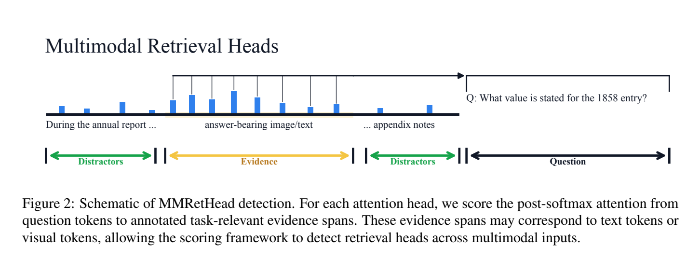
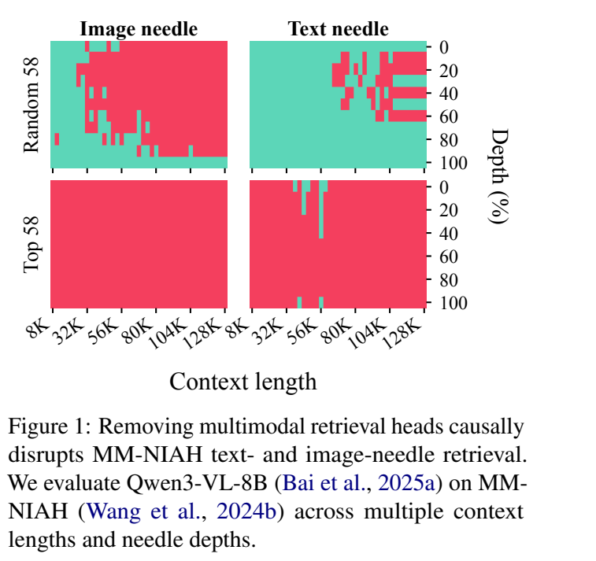

**原文**: [本地](../论文原件/MMRetHead.pdf)

# 一句话记忆

论文用“问题到证据的注意力质量减去空问题基线”识别多模态检索头，发现少量注意力头承担了大部分长上下文图文检索，并通过屏蔽实验验证其因果重要性。

# 研究问题

## 以前的方法

在纯文本长上下文大海捞针（Needle-in-a-Haystack, NIAH）任务中，大模型主要依赖某些特定的注意力头（称为“检索头”，Retrieval Heads）来定位并拷贝相关的证据 token。

## 存在的问题

以前的研究采用基于拷贝的判别标准（Copy-based Criterion）来找检索头，但这**不适用于多模态场景**。因为图像事实无法直接通过文本字符的精确匹配或简单拷贝进行追踪。同时，模型在超长 interleaved 上下文中如何协同文本和图像针尖证据检索尚不明晰。

## 论文试图解决什么

论文要回答三个可检验问题：LVLM 中是否存在多模态检索头；这些头是否稀疏、稳定且具有因果作用；它们的注意力能否直接用于真实文档重排。

# 核心洞察

- **研究洞察**：
  1. **多模态检索头是真实存在的且高度稀疏**：只有大约 4.4%–10.2% 的头解释了 50% 的问题-证据注意力。
  2. **跨任务因果作用**：屏蔽排名前 5% 的检索头，会显著损害 MM-NIAH、长文档问答和多模态推理；同量随机屏蔽的影响更小。
  3. **检索头并非固定集合**：文本与图像检索头平均重合约 0.51；检索内容、上下文长度和图文比例都会改变入选的头。

- **工程实现**：
  1. **空问题校准（Null-Question Calibration）**：设计空白问题“N/A”作为对比，计算真实问题与空白问题在证据区域上的注意力差值，有效剔除因标点符号、图片占位符无条件汇聚注意力的“假检索头”。
  2. **混合注意力模型筛选**：在具有滑动窗口（Sliding-window）和全局混合注意力的模型中（如 Gemma3），仅针对具有全局视野的注意力层进行检索头分析。

- **普通组件**：
  - 以 Qwen2.5-VL, Qwen3-VL 和 Gemma3 作为实验骨干。

# 方法流程

方法流程的总体框架见首图 。

- **1. 输入构筑**：
  构建输入样本 $x = (C, q, G_x)$。其中 $C$ 是 interleaved 图文长上下文（Haystack），$q$ 是任务问题，$G_x = \{g_i\}_{i=1}^m$ 是包含正确答案的针尖证据跨度（Token区间）。

- **2. 检索得分计算**：
  在生成答案或提取问题时，计算注意力头 $h$ 从问题 Token 到证据区域 Token 上的 Attention Mass（即 $S_h(x)$）。

- **3. 空白对照与校准**：
  将问题替换为“N/A”，得到 $S^{null}_h(x)$。最终校准检索得分为 $S^{cal}_h(x) = S_h(x) - S^{null}_h(x)$。

- **4. 检索头确定与应用**：
  在检测集上平均校准得分并选取前 5% 的头作为 **MMRetHeads**（见下图 ）。在文档重排实验中，作者聚合这些头从问题 token 指向候选页面或版面区域的注意力，作为相关性分数。

# 关键模块

- **Null-Question Calibrator (空问题校准器)**
  - 输入：正常问题 $q$ 和空问题 $q_{\emptyset}$（固定字符串 "N/A"）
  - 输出：校准后的检索头得分矩阵 $S^{cal}_h$
  - 作用：过滤掉由于相对位置偏置或图片特殊符号无视语义汇聚注意力而造成的干扰。
  - 为什么需要：学术 PDF 或长图像输入中，图片首尾 token 天生会吸引很多注意力，不进行 calibration 会误把这些对图像本身敏感但对问题无贡献的头误判为检索头。
  - 去掉后可能发生什么：检测出的检索头中充斥着大量无语义的位置偏置头，降低了对真正因果检索头的追踪精度。

- **Head Masking（注意力头干预）**
  - 输入：选定头集合，以及这些头的 post-softmax 注意力权重。
  - 输出：将选定头权重置零后的模型行为。
  - 作用：区分“与证据位置相关”与“对任务确有因果贡献”。论文同时在 prompt prefill 和答案解码阶段施加掩码。

# 训练目标或核心公式

- **检索得分 (Retrieval Score)**：
  $$S_h(x) = \frac{1}{|q|} \sum_{t_q \in q} \sum_{g_i \in G_x} \sum_{t=s_i}^{e_i} A^h_{t_q \to t}$$
  其中 $A^h_{t_q \to t}$ 表示注意力头 $h$ 的 post-softmax 注意力得分。

- **校准检索得分 (Calibrated Retrieval Score)**：
  $$S^{cal}_h(x) = S_h(x) - S^{null}_h(x)$$

- **稀疏度度量 ($\rho_{0.5}$)**：
  $$\rho_{0.5} = \frac{1}{|H|} \min \left( k : \sum_{i=1}^k s_{(i)} \ge 0.5 \sum_{h \in H} s_h \right)$$
  其中 $s_h = \max(\bar{S}^{cal}_h, 0)$，是对所有样本取平均后的非负得分，表征了解释一半以上注意力检索量所需要的最少注意力头比例。

# 实验证明了什么

- **实验问题 1：MMRetHeads 对多模态超长文本检索起因果作用吗？**
  - **比较对象**：不屏蔽（No masking）、屏蔽 Top-5% 检索头（Mask Top-5%）、随机屏蔽同等比例的头（Random masking）。
  - **观察结果**：在 Qwen3-VL-8B 上，屏蔽 Top-5% 的多模态检索头后，在 MMLongBench-Doc（长文档问答）上的精度由 **48.2% 崩塌至 5.7%**，而在 SlideVQA 上由 **71.2% 跌至 8.9%**。相比之下，随机屏蔽的影响微乎其微。
  - **支持的结论**：这些头对所测模型与任务具有显著因果作用；论文也明确指出，完整机制还可能涉及 MLP、残差流和未入选的头。

- **实验问题 2：图像检索头和文本检索头是同一批吗？**
  - **比较对象**：在文本针尖（Text Needle）上测出的检索头 vs 图像针尖（Image Needle）上测出的检索头。
  - **观察结果**：两组检索头表现出“部分共享、模态敏感”的动态特性。虽然在一部分通用长检索层中共享，但在面对具体的图片 haystack 占比和任务变化时，检索头的分布表现出动态转移。
  - **支持的结论**：检索头既有模态无关部分，也有模态/内容特异部分；渲染文字与原生文本的头集合平均重合 0.79，高于文本与普通图像的 0.51。

- **实验问题 3：选出的头能否用于文档检索？**
  - **观察结果**：Qwen3-VL-8B 的 MMRetHeads 在 MMDocIR 页面级 Macro/Micro Recall@1 为 64.7/64.5，版面级为 39.0/39.3，均高于论文列出的最强基线；页面级也优于聚合所有头的 61.8/61.2。
  - **支持的结论**：选定头的注意力不仅可用于解释和干预，也能形成可用的无训练重排信号。

# 局限与失效场景

- **局限 1：静态 Needle 区间依赖**
  - **产生原因**：评估需要明确定义针尖事实在 context 中的 token 边界。
  - **可能失败的场景**：无法有效检测需要全局模糊多处融合（如 "计算这篇论文里所有图表的均值"）等复杂逻辑下的检索头，只能测试精确位置定位。
  - **后续意义**：未来需要针对非定点定位的聚合注意力头进行研究。

- **局限 2：注意力不是完整计算电路**
  - **产生原因**：方法把注意力分数作为检索代理；屏蔽实验能证明行为依赖，却不能给出包含 MLP、残差流在内的完整电路解释。
  - **可能失败的场景**：模型架构、上下文长度或模态比例变化时，固定检测集得到的前 5% 头集合可能迁移不足。

# 与其他论文的关系

## 前置基础

- [[CLIP]]：多模态视觉对齐的前置基础（`uses-as-encoder`）。

## 同任务工作

- [[PVM]]：从模型架构上直接修改注意力分区函数，以避免长上下文稀释的方案（`parallel-work`）。

# 对我的课题的启发

`[AI分析]`

1. **多模态关键特征的可解释性分析**：在多重模态的自动驾驶/具身智能场景中，模型如何利用传感器进行“目标检索”是一大难题。借鉴 MMRetHead 的 Calibration 方法，我们可以通过输入“无语义问题（如 N/A）”或“随机点云遮挡”，对交叉注意力的激活分布进行校准，找出真正起到“决策路由”作用的关键注意力头。
2. **不要直接把解释结果当作剪枝方案**：论文只证明屏蔽关键头会破坏能力，并未证明其余 95% 的头可以安全删除。更可行的后续实验是保留检索头、逐层稀疏化其余头，再测通用任务是否退化。

# 主动回忆问题

## Level 1：主线恢复

- 什么是多模态检索头？它是如何从 interleaved 图文语料中被检测出来的？
- Null-Question Calibration 是怎么工作的？为什么要减去 “N/A” 的注意力？

## Level 2：机制理解

- 实验中屏蔽检索头和随机屏蔽有什么明显的区别？这证明了检索头的什么属性？
- 图像检索头与文本检索头在注意力层分配上是共享的还是完全割裂的？

## Level 3：批判与迁移

- 既然检索头如此稀疏且具有因果主导性，能否基于检索头开发一种用于超长图文文档的“稀疏注意力（Sparse Attention）”机制来加速大模型长上下文的推理？你需要考虑哪些设计瓶颈？

# 尚未解决的问题

- 在跨模态多点模糊逻辑推理（Multi-hop Multimodal Reasoning）下的检索头定位与识别。

## 理解更新记录

- `2026-07-12`：由 AI 基于论文原件 PDF 自动生成并归档初始版本笔记。
