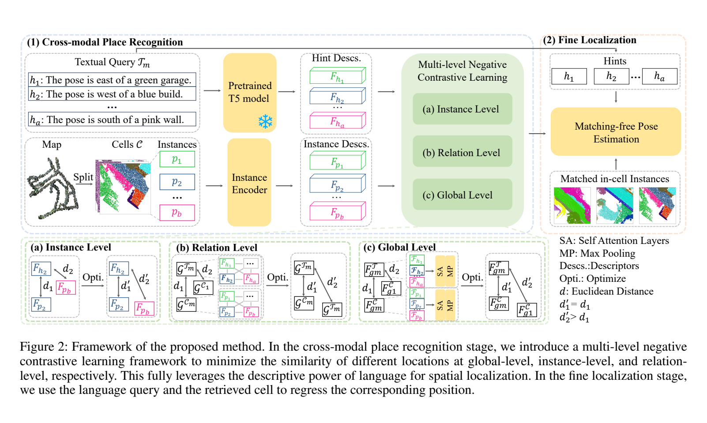

**原文**: [本地](../论文原件/MNCL.pdf)

# 一句话记忆

MNCL 把语言视作“排除错误地点”的过滤器：粗阶段在全局、实例、关系三个层次仅惩罚非配对位置的跨模态相似度，细阶段保持 [[Text2Loc]] 的 cross-attention + MLP 回归器不变，从而把性能变化主要归因于候选检索质量。

# 研究问题

## 以前的方法

[[Text2Pos]] 和 RET 使用 pairwise ranking loss，[[Text2Loc]] 使用 CLIP 式双向对比损失。它们的共同点是把正确文本—cell 对拉近；MNCL 质疑的是这种“强制正对齐”在文本只覆盖 cell 局部信息时是否合适，而非声称所有前作都使用同一种正对比损失。

## 存在的问题

1. **文本描述的固有歧义性（Linguistic Ambiguity）**：自然语言在描述地理空间时通常是粗糙且具有多义性的（例如“在一个红色的建筑物附近”，整个城市可能存在数十个类似的地方）。
2. **正对齐可能削弱点云判别力**：文本只描述 cell 的局部区域，而点云包含更多实例；直接拉近整幅 cell 与局部文本会造成信息不平衡，使相似但不同地点更难区分。论文将其作为方法动机，并通过损失消融支持，但没有直接测量“特征坍塌”。
3. **负样本挖掘不充分**：先前的模型主要依赖粗糙的全局对齐，缺乏对不同地点间局部细节和拓扑关系差异（Negative instances/relations）的显式对比挖掘。

## 论文试图解决什么

如何在不损害 3D 点云几何表达力的前提下，充分利用文本描述的排他性排查能力（即“语言能指出目标绝对不在哪里”），设计一种多层级的负对比学习架构，实现在大尺度城域点云地图下的精确绝对定位。

# 核心洞察

- **研究洞察**：
  1. **语言作为过滤器（Language as a Filter）**：语言虽然不能百分之百指出你在哪，但能非常明确地排除你在哪（例如“我站在河边”，那么所有不包含“河”的候选网格都可以被排除）。因此，应该将对比学习的重点从“拉近正样本”转向“推开负样本”。
  2. **多级差异挖掘（Multi-level Negative Discrepancy）**：为了让排他性过滤器更加稳健，差异对比不能仅停留在全局描述子层面，必须从三个尺度级联推进：全局语义级（Global-level）、局部物体级（Instance-level）、以及物体的几何拓扑级（Relation-level）。

- **工程实现**：
  1. **Multi-level Negative Contrastive Loss**：设计了一种改进型负对比损失函数，引入尺度参数 $a$ 和权重参数 $d$，使得模型能够重点聚焦并放大对极其相似但实际上不匹配的“困难负地点（Hard Negative Places）”的排斥力。
  2. **时空几何图神经网络 (GCN Relation Encoding)**：对于关系级，使用共享 MLP 将点云中各个实例间的绝对空间几何位移向量编码为几何边，使用拼接 hints token 编码为文本边，随后经过多层 GCN 和外部空间注意力（ESA）进行长程关联建模。

- **普通组件**：
  - 3D Backbone (PointNet++)、文本编码器 (预训练 T5)、3 层 MLP。

# 方法流程

方法流程的总体框架见首图 。

- **1. 跨模态地点检索阶段 (Cross-modal Place Recognition)**：
  - *输入*：描述文本经预训练的 T5 提取特征，点云地图分割为多个 Cells，使用 PointNet++ 提取各 Cell 内的 3D 实例特征。
  - *全局级对齐 (Global-Level)*：利用 Attention 配合 Max Pooling 聚合得到全局文本描述子 $F^T_g$ 和全局子地图描述子 $F^C_g$。
  - *实例级对齐 (Instance-Level)*：使用 FC 层将实例特征投射至公共子空间，计算实例特征集合之间的匹配度。
  - *关系级对齐 (Relation-Level)*：构建 Cell 场景图 $G^C$ 和文本场景图 $G^T$。点云实例的几何三维中心位移作为边输入 GCN 更新节点，利用外部空间注意力（ESA）将局部与全局拓扑融合。
  - *多级对比优化*：使用 Multi-Level Negative Contrastive Loss 最小化非配对点云与文本之间的相似度，训练网络检索出 Top-$k$ 个候选 Cell。

- **2. 细定位阶段 (Fine Localization)**：
  - 沿用 [[Text2Loc]]：候选 cell 与文本先做 cross-attention 融合，再由 MLP 预测 $C_{pred}=(x,y)$。MNCL 不改细定位架构，因此最终提升主要来自更好的候选 cell。

# 关键模块

- **Instance-Level Negative Contrastive Loss (实例级负对比损失)**
  - 输入：实例嵌入特征集合 $\{F^T_o\}, \{F^C_o\}$
  - 作用：度量不同 Cell 间所含物体的属性差异，对于不含对应地标的负样本 Cell 进行排斥。
  - 为什么需要：比全局特征更细粒度地捕捉物体属性，确保如“绿色的邮筒”和“红色的邮筒”之间因为实例特征冲突而被强力推开。

- **Relation-Level Negative Contrastive Loss (关系级负对比损失)**
  - 输入：利用 GCN 编码的拓扑几何场景图 $G^C$ 和文本图 $G^T$
  - 作用：利用实例间的相对空间几何向量（如 $\Delta c = c_i - c_j$）编码拓扑，排除那些包含相同实例但相对朝向/几何布局完全相悖的负 Cell。
  - 为什么需要：在大尺度城区中，很多路口都包含“一棵树和一栋楼”，仅靠实例难以区分；必须利用其几何排布（树在楼的东侧还是西侧）作为辨识符。

- **External Space Attention (ESA, 外部空间注意力)**
  - 作用：引入全局共享的类间投影矩阵，捕捉整个数据集级别的通用场景关联特征，克服传统自注意力仅关注单样本局部关系的局限。

# 训练目标或核心公式

- **多级负对比总损失 (Total Loss)**：
  $$L_{mncl} = L_{glo} + L_{ins} + L_{rel}$$

- **负对比损失通用公式 (以全局级为例)**：
  $$L_{glo} = -\frac{1}{K} \sum_{i,j=1}^K f_{ij}(1-d)^{1/a}\log(1-S_{ij})$$
  - **公式解构**：
    - $S_{ij}$ 是位置 $i$ 和位置 $j$ 之间的跨模态全局相似度（由公式 (4) 对称计算得出）。
    - $f_{ij}$ 是掩码指示器：当 $i \neq j$ （即代表不同的地点，负样本对）时 $f_{ij} = 1$，否则为 $0$。
    - $a$ 是尺度参数（实验取 $a=2$ 最优），$d$ 是权重参数；$(1-d)^{1/a}$ 调节负对排斥强度。
    - **对模型行为的影响**：该公式**不包含**拉近正样本的 $\log(S_{ii})$ 项，而是纯粹对负样本对计算 $\log(1 - S_{ij})$。它迫使网络将优化的重心全部倾斜在“如何让负样本位置的相似度趋向于 0”上，有效化解了文本歧义造成的强制对齐崩塌。

- **细定位回归损失 (L2 Loss)**：
  $$L_{fine} = \|C_{gt} - C_{pred}\|^2$$

# 实验证明了什么

- **实验问题 1：负对比学习对比传统正对比学习在地点检索上的召回率提升？**
  - **比较对象**：将 MNCL 损失替换为传统 CLIP 式正对比损失（w/o $L_{mncl}$，即拉近正样本 + 推开负样本的 vanilla 损失）。
  - **观察结果**：在 KITTI360Pose 验证集上，使用 MNCL 负对比损失相比于 vanilla 损失，检索 Top-1 召回率从 45% 大幅飙升至 50%；在测试集上表现同样优异。
  - **支持的结论**：证明了“语言作为排他过滤器”的负对比学习能更有效地解决多义性问题，避免特征坍塌。

- **实验问题 2：多级特征（全局、实例、关系）对定位精度的消融贡献？**
  - **比较对象**：仅使用全局级 ($L_{glo}$)、全局+实例级 ($L_{ins} + L_{glo}$)、全局+关系级 ($L_{rel} + L_{glo}$)。
  - **观察结果**：KITTI360Pose 验证集上，单独全局级 Recall@1 为 0.40；全局+实例为 0.44；全局+关系为 0.46；三者合用为 0.50（Table 3）。论文没有在 Pitts30k 上做这项实验。
  - **支持的结论**：物体的语义属性和空间相对拓扑结构是极其有效的细粒度场景识别特征。

- **实验问题 3：整体定位框架在 KITTI360Pose 的 SOTA 对比？**
  - **比较对象**：Text2Pos (2022), RET (2024), Text2Loc (2023)。
  - **观察结果**：在完整定位精细度上，在 $5m$ 门限下，MNCL 取得了 54% (Val) / 50% (Test) 的召回率，大幅超越前作 Text2Loc（37% / 33%），检索阶段 recall 同样刷新记录。

# 局限与失效场景

- **论文明确限制**：由于缺少其他可用数据集，全部实验只在 KITTI360Pose 上完成；跨城市、跨传感器和真实自由文本的泛化没有被验证（Conclusion）。
- **实例图依赖**：实例级与关系级分支需要对象实例、中心坐标及语义属性；语义分割/聚类误差会改变节点和边，但论文没有单独量化这一敏感性。
- **规模扩大仍有退化**：数据库半径从 200 m 增至 300/400/500 m 时，Top-1 相对下降 4.9%/6.8%/9.6%；虽优于 Text2Loc 的 14.3%/16.8%/19.2%，仍未消除规模效应（Fig. 5）。

# 与其他论文的关系

## 前置基础

- [[PointNet++]]：作为提取 Cell 中三维地标物体特征的基础 3D Backbone（`uses-as-backbone`）。
- [[Text2Loc]]：继承了其 coarse-to-fine 的双阶段定位框架和细定位阶段的坐标回归头（`builds-on`）。

## 同任务工作

- [[TER]] (RET)：同样是在 KITTI360Pose 上进行 text-to-point cloud 定位，RET 重点在于利用 RSA 注意力机制编码显式关系，而 MNCL 重点在于多级负对比损失（`peer-work`）。
- [[Text2Pos]]：点云定位的开山鼻祖，但未能考虑多级实例和关系（`peer-work`）。

# 对我的课题的启发

`[AI分析]`

1. **歧义场景下的负对比过滤**：在做复杂城市场景导航时，用户常说“在红绿灯处左转”，但前向视场里可能同时出现三个红绿灯（不同路口）。常规的拉近训练会把这三个红绿灯的特征强行与这句话对齐，造成网络特征模糊。应借鉴 MNCL 思想，采用负对比学习，重点去学“红绿灯右侧有加油站”与“红绿灯右侧是公园”这两者特征在拓扑上的**不匹配性**，通过排他性过滤排除错误路口。
2. **三维位移边编码**：可用 MLP 编码质心差 $\Delta c=c_i-c_j$ 作为关系边；它天然对全局平移不变，但并不对旋转不变。若迁移到 BEV，应统一坐标朝向或显式加入旋转等变/不变设计。

# 主动回忆问题

## Level 1：主线恢复

- 为什么在文本到 3D 点云定位中，强行使用正对比对齐会导致点云特征坍塌？MNCL 是如何解决这一痛点的？
- MNCL 的三级负对比学习分别是在哪三个层级展开的？

## Level 2：机制理解

- 写出 MNCL 的负对比损失公式。其中的掩码指示器 $f_{ij}$ 是如何保证损失函数只作用于负样本对的？
- 在关系层级（Relation-Level）中，点云和文本的“实例关系”分别是如何被提取和对齐的？

## Level 3：批判与迁移

- 论文指出，由于维持了与 Text2Loc 相同的细定位网络，这证明了“语言过滤器”的有效性。但这也限制了细定位的精度。如果让你重新设计细定位头，你如何将关系级 GCN 拓扑特征直接引入到 $(x, y)$ 坐标的回归中以进一步减少回归误差？

# 尚未解决的问题

- 在其他城市、传感器和自由文本上的可迁移性；以及在不依赖高质量实例图时如何保留多级负对比的判别能力。

## 理解更新记录

- `2026-07-12`：由 AI 基于论文原件 PDF 自动生成并归档初始版本笔记。
