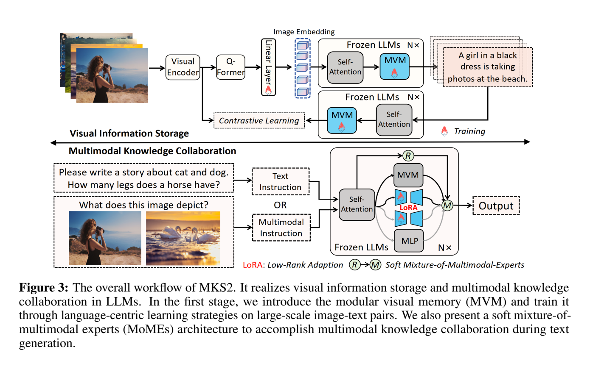
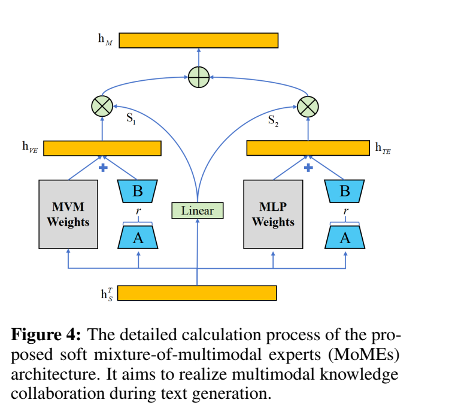

**原文**: [本地](../论文原件/MVS2_MVM.pdf)

# 一句话记忆

MKS2 在 LLM 的每个 Transformer block 中加入模块化视觉内存（MVM），先单独写入图文知识，再用软混合多模态专家（MoMEs）按 token 融合视觉专家与原有语言 MLP，目标是让视觉知识补充而非覆盖语言能力。

# 研究问题

## 以前的方法

主流 MLLM 多采用 “LLMs for Vision” 路线：把视觉编码器输出经线性层、MLP 或 Q-Former 投到语言空间，再利用 LLM 完成生成。

## 存在的问题

1. **视觉知识主要作为输入条件**：许多方法强调如何让 LLM 读取图像，却较少研究视觉经验能否反过来增强纯文本的物理与常识推理。
2. **联合训练可能干扰语言能力**：直接更新 LLM 主干会让视觉任务与原有文本知识共享同一参数空间，带来知识覆盖风险。

## 论文试图解决什么

如何在不损害 LLM 原有文本生成和推理能力的前提下，将海量视觉常识高效地内嵌存贮在 LLM 内部，并在文本生成过程中实现多模态知识的高效共享与协同。

# 核心洞察

- **研究洞察**：
  1. **独立的视觉知识存储库**：大模型应如同人脑一样拥有独立的“视觉联想与记忆区”。通过在 LLM 内部并联注入“模块化视觉内存”(MVM)，专门用来存放海量图像中的实体、颜色、空间关系等常识。
  2. **混合多模态专家协同**：将预训练的 MVM 和大模型原装的 MLP 视为“视觉专家”和“语言专家”。在推理生成时，通过门控网络实现 token 级的多模态动态调度，从而保护模型纯文本推理路径不受破坏。

- **工程实现**：
  1. **两阶段训练机制**：
     - *第一阶段（存储）*：冻结 LLM 参数，仅在 Transformer 的 Self-Attention 后插入 MVM (2层 FFN) 进行训练，采用图文描述生成和文本-图像检索的自监督对齐损失。
     - *第二阶段（协同）*：冻结 MVM 和 LLM 原参数，只训练作用于 MVM、MLP 的 LoRA 增量与 Soft MoMEs 路由器；训练数据同时包含文本指令和图文指令。

- **普通组件**：
  - 基线采用 Llama-2-7B/13B，图像特征提取使用 CLIP 视觉编码器，使用低秩自适应 (LoRA)。

# 方法流程

方法流程的总体框架见首图 。

- **1. 第一阶段：视觉知识存储 (Visual Information Storage)**：
  输入图像 $I$ 经 CLIP 和线性投影投射为 soft image embedding $h_I$ $\rightarrow$ 经 Self-Attention 得到 $h^T_s$ $\rightarrow$ $h^T_s$ 通过并联插入的 Modular Visual Memory (MVM) 提取特征：
  $$h^T_F = h^T_s + \text{MVM}(\text{Layernorm}(h^T_s))$$
  - 通过描述生成损失 $L_c$ 和图文双向检索损失 $L_{t2i}$ 联合训练，仅更新 MVM。

- **2. 第二阶段：多模态协同推理 (Multimodal Knowledge Collaboration)**（见下图 ）：
  输入 token 序列 $X \in \mathbb{R}^{m \times d}$ 分别流向：
  - *视觉专家通路*：$h_{VE} = \text{LoRA-MVM}(X)$。
  - *语言专家通路*：$h_{TE} = \text{LoRA-MLP}(X)$。
  - *专家选择路由器*：利用 Softmax 门控计算 token 级权重 $S = \text{Softmax}(w_s X + b_s)$，最后通过 $h_M = S_1 h_{VE} + S_2 h_{TE}$ 动态混合输出。

# 关键模块

- **Modular Visual Memory (MVM, 模块化视觉内存)**
  - 输入：Self-Attention 的隐藏特征 $h^T_s$
  - 输出：视觉增益特征 $h^T_F$
  - 作用：由两层 FFN 构成；在第一阶段接收图像与文本 token 的隐藏状态，通过图像描述生成和文到图检索监督学习图文关联。
  - 为什么需要：提供专属的视觉存储参数块，使得视觉知识的写入不会覆盖大语言模型原本在 MLP 中固化的语言先验。
  - 去掉后可能发生什么：消融中，移除预训练 MVM 与 MoMEs 后，多个常识任务平均分下降；这说明视觉内存提供了补充信息，但不能据此断言模型完全失去图文联想。

- **Soft Mixture-of-Multimodal Experts (MoMEs, 混合多模态专家)**
  - 输入：Token 特征序列 $X$
  - 输出：混合知识特征 $h_M$
  - 作用：在 Token 级，利用动态 Softmax 路由器自动分配视觉专家 (MVM) 和文本专家 (MLP) 的结合比例。
  - 为什么需要：大语言模型处理不同单词时所需的模态知识不同（如处理 "apple" 更需要视觉常识，而处理 "is" 等功能词仅需要语言学规律）。
  - 去掉后可能发生什么：模型退化为纯多模态全量微调，导致纯文本推理任务上发生灾难性遗忘。

# 训练目标或核心公式

- **第一阶段联合存储损失**：
  $$L_{Stage1} = L_c + L_{t2i}$$
  - 其中图文描述生成损失（交叉熵）：
    $$L_c = - \frac{1}{N} \sum_{i=1}^N l_c(IMG_i, D_i)$$
  - 文本-图像检索损失 (InfoNCE Loss)：
    $$L_{t2i} = - \frac{1}{N} \sum_{i=1}^N \log \frac{e^{sim(D_i, IMG_i)/\tau}}{\sum_{j=1}^N e^{sim(D_i, IMG_j)/\tau}}$$
    这里以短语结束符 `</s>` 的输出表征作为匹配 Query，拉近其与 CLIP 图像全局特征的余弦相似度。

- **第二阶段专家组合输出**：
  $$S = \text{Softmax}(w_s X + b_s)$$
  $$h_M = S_1 \cdot \text{LoRA-MVM}(X) + S_2 \cdot \text{LoRA-MLP}(X)$$

# 实验证明了什么

- **实验问题 1：视觉内存能否改善纯文本常识任务？**
  - **比较对象**：使用相同文本指令数据的 Llama-2-INST-LoRA，以及移除多模态 SFT/MoMEs 的消融模型。
  - **观察结果**：Llama-2-7B 上，MKS2 在七个文本基准的平均分为 54.10，INST-LoRA 为 47.02；13B 上分别为 62.30 和 57.28（Table 1）。不同子任务增益不一致。
  - **支持的结论**：在论文的数据和训练设置中，MVM/MoMEs 与混合指令训练能改善若干依赖物理常识的文本任务。实验没有证明“完全无损”，也不能把提升全部归因于单一模块。

- **实验问题 2：MVM 模块对外部视觉常识的存储能力？**
  - **观察结果**：用 2.3M 图文对训练的模型在 COCO caption 上取得 B@4=40.0、Flickr30K 文到图检索 R@1=80.0（Table 3）；作者还展示了连接到图像生成器后的定性案例。
  - **支持的结论**：MVM 学到了可用于图文关联的表征，但其检索/描述性能仍落后于使用更大规模图文数据训练的专门模型，定性生成案例也不是“高保真存储”的充分证据。

# 局限与失效场景

- **局限 1：多阶段训练开销与复杂度**
  - **产生原因**：模型为了兼顾无损和存储，设计了分步冻结和 LoRA 拼接，使得整个训练流程周期较长，且对检索对齐的数据配对质量敏感。
  - **可能失败的场景**：流程需要先训练约 410M 参数的 MVM（Llama-2-7B 配置），再训练 LoRA 与路由器，存储和调参成本并不等同于轻量适配器。

- **局限 2：视觉能力与数据分布受限**
  - **产生原因**：第一阶段只用约 2.3M 图文对，论文也报告混合指令数据会损害部分场景文字识别任务。
  - **可能失败的场景**：细粒度 OCR、专业图表或分布外视觉概念可能超出 MVM 的存储与路由能力。

# 与其他论文的关系

## 前置基础

- [[CLIP]]：提供图像表示编码器（`uses-as-encoder`）。

## 同任务工作

- [[PVM]]：针对自回归中视觉稀释提出旁路设计的平行工作（`peer-work`）。

# 对我的课题的启发

`[AI分析]`

1. **多源多专家控制**：在文本指令与 3D LiDAR 特征协同决策时，可把 LiDAR 适配器与原语言 MLP 视作两个专家，用软门控观察不同 token 的模态权重。是否优于直接投影拼接，需要在相同数据量和参数预算下做消融。

# 主动回忆问题

## Level 1：主线恢复

- 解释 MKS2 框架下的两个训练阶段（Visual Information Storage 和 Multimodal Knowledge Collaboration）分别做了什么？
- MVM 模块在第一阶段是以哪两种自监督任务被强制“存储”视觉知识的？

## Level 2：机制理解

- MoMEs 中的专家路由器 S 是如何决定 token 级权重的？为什么需要 token 级而不是 sequence 级的路由？
- 为什么将 MVM 并联引入 Attention 之后，就能防止多模态训练对纯文本推理路径的侵蚀？

## Level 3：批判与迁移

- 相比于普通的 Mixture of Experts (MoE)（通常由离散门控将 token 路由到不同的 FFN 上），MKS2 的 MoMEs 采用 Soft MoE (用 Softmax 连续混合视觉和文本 expert 的 LoRA 特征) 有什么训练和部署上的优势？

# 尚未解决的问题

- 极高容量的细粒度视觉常识在小参数模型 MVM 内部存储的容量瓶颈。

## 理解更新记录

- `2026-07-12`：由 AI 基于论文原件 PDF 自动生成并归档初始版本笔记。
