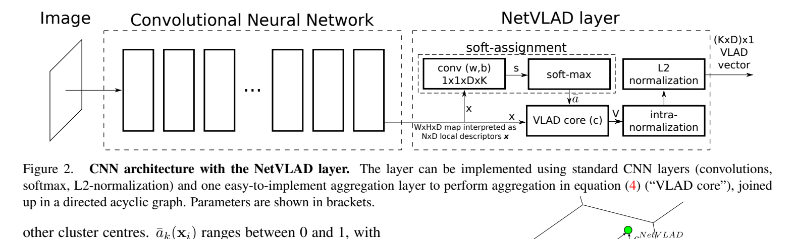

**原文**: [本地](../论文原件/NetVLAD.pdf)

# 一句话记忆

NetVLAD 把 VLAD 的硬分配改写为可学习的软分配与残差聚合层，使 CNN 可针对地点识别端到端训练；配套的多实例排序损失只要求一组 GPS 近邻候选中至少有一个真正匹配，从而利用有噪声的地理监督。

# 研究问题

## 以前的方法

传统的视觉地点识别 (Visual Place Recognition, VPR) 或图像检索算法主要基于手工设计的局部特征（如 SIFT），并使用多维聚合算子（如 Bag of Words, VLAD, Fisher Vector）将其压缩为全局图像向量进行匹配。

## 存在的问题

1. **手工特征泛化差**：SIFT 等手工描述符对剧烈的光照、天气、季节以及视角变化非常敏感，无法适应长期大范围导航。
2. **通用 CNN 表征未针对地点检索优化**：分类预训练的 FC 或池化特征并非为欧氏距离检索设计；简单最大池化也没有显式编码局部描述子相对视觉词的残差分布。NetVLAD 聚合的是无序局部特征统计，并不保留局部地标的显式空间布局。
3. **缺少大范围监督标注**：收集大尺度城市 VPR 的精准图像级配对标签极其困难，而 GPS 数据本身存在较大噪声和朝向歧义。

## 论文试图解决什么

如何构建一个完全可微分的图像特征聚合层，使得网络可以直接从像素输入，端到端学习并优化专用于地点识别的紧凑全局图像表征；同时，如何利用包含噪声的弱监督地理标注数据进行稳定训练。

# 核心洞察

- **研究洞察**：
  1. **可微分软聚类 (Differentiable Soft Assignment)**：经典 VLAD 算子中的硬分配（每个特征点仅归属于一个质心）在数学上是不可导的。通过使用 Softmax 转换，将局部特征对每个聚类中心的隶属度转化为概率连续值（即软分配），使整个聚合过程能通过反向传播计算梯度。
  2. **弱监督多实例学习 (Weakly Supervised Multiple Instance Learning)**：对于包含噪点和多视角的地理图像数据库，将问题建模为“包（Bag）级别”的排序——对于查询街景图像，只需约束其与“最近的地理邻近图像（潜在正样本包）”的特征距离小于其与“地理遥远图像（确切负样本）”的特征距离。

- **工程实现**：
  1. **NetVLAD Meta-Layer**：将 NetVLAD 的软分配公式分解为 $1 \times 1$ 卷积（对应聚类中心投影）、Softmax 激活以及残差聚合三个标准深度学习算子的组合，构成一个即插即用（Pluggable）的元图层（Meta-Layer）。
  2. **Weakly Supervised Triplet Ranking Loss**：对每个查询，从 GPS 近邻候选包中选当前特征距离最近者作为潜在正样本，再要求它比每个确定负样本至少近一个 margin。这样避免把所有地理近邻都强制当成视觉正匹配；论文没有把它表述为“防止网络收敛崩塌”。

- **普通组件**：
  - Base CNN（如 VGG-16 作为特征提取器）、$L_2$ 归一化层。

# 方法流程

方法流程的总体框架见首图 。

- **1. 密集局部特征提取 (Feature Extraction)**：
  - 输入图像 $I \rightarrow$ 通过裁剪去除了全连接层的 CNN（如 VGG-16 的 conv5 之后），输出大小为 $W \times H \times D$ 的特征图 $\rightarrow$ 将其视为 $N = W \cdot H$ 个 $D$ 维的局部特征描述子 $\{x_i\}$。

- **2. 软分配与残差累加 (NetVLAD Layer)**：
  - *通道划分与特征对齐*：局部描述子送入含有 $K$ 个通道的 $1 \times 1$ 卷积，偏置为 $b_k$，得到每个描述子分配到第 $k$ 个聚类中心的权重 $w_k^T x_i + b_k$。
  - *Softmax 归一化*：在通道维度上进行 Softmax，计算软分配系数 $\bar{a}_k(x_i)$。
  - *残差聚合 (VLAD Core)*：计算每个局部描述子 $x_i$ 与对应的 trainable 聚类中心 $c_k$ 的残差 $(x_i(j) - c_k(j))$，并以分配系数为权重进行全局加权累加，输出大小为 $K \times D$ 的特征矩阵 $V$。

- **3. 双重归一化与全局输出 (Dual Normalization)**：
  - 对聚合矩阵 $V$ 首先进行列内（聚类维度） $L_2$ 归一化 $\rightarrow$ 展平为大小为 $(K \cdot D) \times 1$ 的一维向量 $\rightarrow$ 进行全局 $L_2$ 归一化，输出最终的全局图像描述子。

# 关键模块

- **NetVLAD Layer (软分配特征聚合层)**
  - 输入：$W \times H \times D$ 特征图
  - 输出：$K \times D$ 特征矩阵 $V$
  - 作用：利用软 assignments 计算每个空间特征向量到聚类质心的加权残差和。
  - 为什么需要：取代了传统的硬划分 VLAD 算子，使得聚类权重和聚类中心直接参与反向传播，实现特征聚合端的端到端联合优化。
  - 去掉后可能发生什么：可换成 Max Pooling 等聚合器，但论文图 5 中，匹配训练条件下 NetVLAD 整体优于 Max Pooling；降幅随骨干、数据集和输出维度变化，不能概括为固定“下降数倍”。

- **Trainable Cluster Centers ($c_k$) 与投影参数 ($w_k, b_k$)**
  - 参数：在传统聚类中 $w_k = 2\alpha c_k, b_k = -\alpha\|c_k\|^2$ 是绑定的。但在 NetVLAD 中，解耦并独立学习这两组参数。
  - 作用：提供了对特征分布更强的解耦表达能力，允许聚类边界和残差计算独立适配任务目标。

- **Hinge Margin Triplet Selector (三元组选择算子)**
  - 输入：查询图像 $q$、一组地理邻近的潜在正样本 $\{p^q_i\}$、一组遥远的确定负样本 $\{n^q_j\}$
  - 作用：训练时自适应挖掘当前的“难样本”，选取距离 $q$ 最近的潜在正样本（Best Positive）来构建三元组计算损失。
  - 为什么需要：GPS 近并不保证画面重叠，候选包与 best-positive 选择把“哪一张真正匹配”保留为潜变量。
  - 去掉后可能发生什么：若把全部 GPS 近邻视为确定正样本，会引入朝向和遮挡造成的假正例；具体精度与收敛影响取决于替代损失，论文未报告“必然无法收敛”的消融。

# 训练目标或核心公式

- **可微分 NetVLAD 聚合公式**：
  $$V(j, k) = \sum_{i=1}^N \frac{e^{w_k^T x_i + b_k}}{\sum_{k'} e^{w_{k'}^T x_i + b_{k'}}} (x_i(j) - c_k(j))$$
  其中 $x_i(j)$ 是第 $i$ 个局部描述子的第 $j$ 维， $c_k(j)$ 是第 $k$ 个聚类质心的第 $j$ 维。

- **弱监督三元组排序损失 (Weakly Supervised Triplet Ranking Loss)**：
  $$L_\theta = \sum_j \max\left(0, \min_i d^2_\theta(q, p^q_i) + m - d^2_\theta(q, n^q_j)\right)$$
  - **公式解构**：
    - $q$ 为查询图，$p^q_i$ 是潜在地理近邻图像， $n^q_j$ 是地理远端图像， $m$ 是 Margin 常数， $d_\theta$ 是 Euclidean 距离。
    - 在每个训练 tuple 内，取潜在正样本中与 $q$ 当前特征距离最近的一张；它是优化过程选出的“最佳候选”，不是经人工核验的事实正样本。
    - **对模型行为的影响**：仅惩罚那些距离“最佳匹配正样本”不够近、或距离负样本不够远的特征空间分布，这有效实现了多模态朝向下弱监督学习的稳定性。

# 实验证明了什么

- **实验问题 1：NetVLAD 与传统手工描述符及 off-the-shelf CNN 的效果对比？**
  - **比较对象**：SIFT + Fisher Vector/VLAD、VGG-16 全连接层（FC6/FC7）、GAP（全局均值池化）。
  - **观察结果**：论文给出的明确例子是 Pitts250k-test：训练后的 AlexNet+NetVLAD Recall@1 为 81.0%，而 off-the-shelf AlexNet + 标准 VLAD 为 55.0%，相对提升 47%。在 Pittsburgh 与 Tokyo 24/7 的完整比较中，训练后的 NetVLAD 也整体优于 Max Pooling、RootSIFT+VLAD 和所列方法。
  - **支持的结论**：针对地点识别联合训练骨干与聚合层，比直接使用分类预训练特征更有效；NetVLAD 聚合在这些基准上优于所比较的 Max Pooling。

- **实验问题 2：表示压缩后是否仍保持检索能力？**
  - **比较对象**：完整 NetVLAD、PCA whitening 后的低维 NetVLAD，以及同维或更高维 Max Pooling。
  - **观察结果**：PCA + whitening 降至 4096 维后与完整 NetVLAD 表现接近；在 Tokyo 24/7 上，128 维 NetVLAD 的 Recall@1 为 42.9%，而 512 维 Max Pooling 为 38.4%。最佳 VGG-16 NetVLAD 还以 256 维表示在 Oxford5k、Paris6k 和 Holidays 上分别取得 63.5%、73.5% 和 79.9% mAP。
  - **支持的结论**：NetVLAD 的残差统计在大幅压缩后仍有竞争力。论文没有在 Nordland 或 GardensPoint 上实验，因此旧笔记关于季节鲁棒性的段落不能由该 PDF 支持。

# 局限与失效场景

- **局限 1：参数和计算开销大**
  - **产生原因**：最终的全局描述符维度为 $K \cdot D$（当 $K=64, D=512$ 时高达 32768 维）。在海量地图库检索中，如此超高维度的全局向量会带来庞大的检索存储开销和在线相似度计算开销。
  - **可能失败的场景**：在需要超快毫秒级响应、内存极度受限的车载端侧定位检索中，直接使用原始 32k 维度的向量极其低效。
  - **后续意义**：工业界常结合 PCA 进行降维（如降至 4096 维或 512 维），这也催生了后续对 compact NetVLAD（如 NetVLAD+PCA 或更轻量化的池化层）的研究。

# 与其他论文的关系

## 后续改进

- [[Text2Loc]]：使用 NetVLAD 的思想在 coarse-to-fine 地点定位中做全局检索召回，但 MNCL 与 RET 等室外 3D 文本定位工作进一步利用 3D 实例和关系来做细化回归（`peer-work`）。

## 同任务工作

- [[VPR_Tutorial]]：NetVLAD 是视觉地点识别教程中的代表性经典全局特征检索算子（`peer-work`）。

## 前置基础

- [[CLIP]]：NetVLAD 的对比微调思想在后期跨模态对比检索模型中被吸收（`extends-to`）。

# 对我的课题的启发

`[AI分析]`

1. **点云特征下的 NetVLAD 扩展**：在 3D 点云定位（LiDAR VPR）中，除了直接对原点云使用 PointNet 提取外，我们还可以先用 3D 主干网络提取每个 voxel 的局部描述子，再插入 NetVLAD 层聚合局部几何残差。`[AI分析]` 这能提供固定长度检索表示，但 NetVLAD 只对局部描述子的排列不敏感，并不在数学上保证对点云旋转或密度变化不变。
2. **多视角弱监督训练**：智能驾驶常面临“自车多次经过同一区域但行车道、朝向不同”的定位数据采集现状。借鉴 NetVLAD 的潜在正样本包（Multiple Instance Learning）的弱监督三元组机制，可以使用前后 15 米内的图像序列构成 Positive Bag，仅拉近最佳匹配对，能极大避免不同行车道下前向相机的视场角不重合所引起的强行对齐损失，使模型在真实大尺度混合朝向轨迹上收敛得更稳健。

# 主动回忆问题

## Level 1：主线恢复

- NetVLAD 是如何通过 soft-assignment 将经典的硬聚类 VLAD 改造为完全可导的神经网络层的？
- 弱监督三元组排序损失（Weakly Supervised Triplet Ranking Loss）中，为什么要在正样本集合中取“$\min$”距离？

## Level 2：机制理解

- NetVLAD 层在最后的输出中执行了两次归一化，分别是什么？它们的具体数学意义何在？
- 为什么解耦 trainable cluster centers $c_k$ 与投影参数 $w_k, b_k$ 会比传统的硬分配更具表达灵活性？

## Level 3：批判与迁移

- NetVLAD 输出的 32k 维全局描述子过于庞大。如果你要在车载端侧实时部署 NetVLAD，你会采用什么方法在尽量不损害 Recall@1 精度的前提下对其进行压缩？

# 尚未解决的问题

- 极长轨迹库在大维度检索时的显存占用与计算开销瓶颈。

## 理解更新记录

- `2026-07-12`：由 AI 基于论文原件 PDF 自动生成并归档初始版本笔记。
