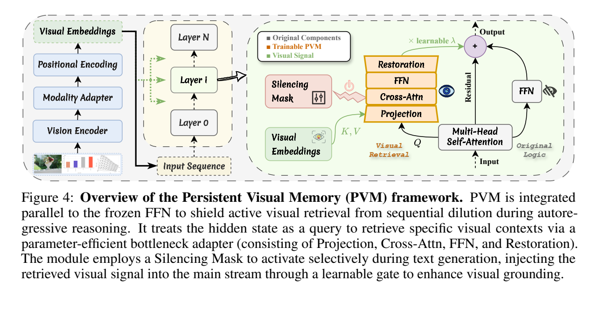
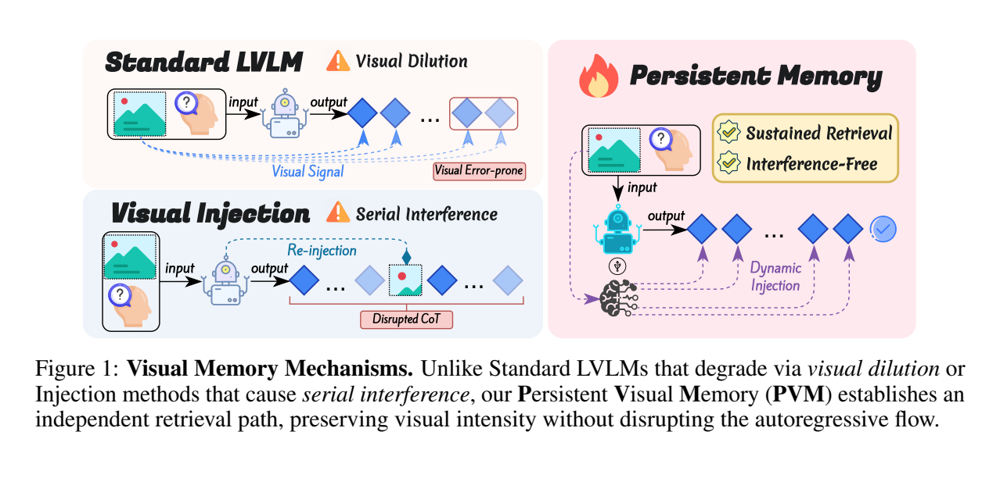

**原文**: [本地](../论文原件/PVM.pdf)

# 一句话记忆

PVM 在冻结 FFN 旁增加低维跨注意力分支，让文本状态只对固定视觉 token 集合做独立归一化和按需检索，从结构上减轻长答案生成时的视觉信号稀释。

# 研究问题

## 以前的方法

自回归大型视觉语言模型 (LVLM) 依靠统一的自注意力机制在同一注意力空间中同时处理 interleaved 图像和文本。

## 存在的问题

**视觉信号稀释 (Visual Signal Dilution) 现象**：
在论文的假设下，文本历史增长会持续扩大混合注意力的文本分区质量，使固定数量视觉 token 的总注意力上界按 $O(t^{-1})$ 衰减。这里不是“指数膨胀”，而是由线性增长的文本项推得反比例上界；它描述结构性风险，不等于所有头、所有样本都严格按同一曲线退化。

## 论文试图解决什么

如何在不进行昂贵的模型全量微调和不损害预训练能力的前提下，确保 LVLM 在深层自回归生成过程中对视觉证据具备持续、按需、不受文本长度干扰的高效访问，缓解视觉稀释。

# 核心洞察

- **研究洞察**：
  1. **打破统一 Softmax 空间竞争**：图像 Token 的数量 $M$ 是固定的，而文本 Token 数量 $t$ 是动态增长的。必须将视觉检索通道从统一的文本-图像混合注意力中解耦出来，对视觉特征进行“独立注意力归一化”（Independent Attention Normalization），才能规避来自文本文档的无限累加干扰。
  2. **并行 Looking Path**：保留原 FFN 的 reasoning path，同时让同一隐藏状态通过独立视觉分支重新查询原始视觉嵌入。

- **工程实现**：
  1. **低维瓶颈投影自注意力适配器**：将主干中高维的隐藏状态投影到低维隐空间（$d' < d$），在低维空间中以文本特征为 Query，视觉特征为 Key 和 Value 进行 Cross-Attention 检索，然后用低维 FFN 进一步精炼并还原投影，大幅削减参数。
  2. **视觉静默掩码（Visual Silencing Mask）**：设计二值掩码 $M_{txt}$，只在生成文本 Token 时激活旁路，在处理图像输入阶段将其静默，避免引入多余开销和噪声。

- **普通组件**：
  - 基线采用 Qwen3-VL-Instruct 4B/8B 主干，使用标准 RMSNorm 和投影线性层。

# 方法流程

方法流程的总体框架见首图 。

- **1. 分支分流 (Information Bifurcation)**：
  输入 Transformer 层的隐藏状态 $x \in \mathbb{R}^d$ 同时流向两个并行旁路：
  - *Reasoning Path*：流向原装的 FFN 模块以提取预训练逻辑 pattern。
  - *Looking Path (PVM)*：将 $x$ 作为 Query，视觉特征 $V_{img}$ 作为 Key/Value。

- **2. 瓶颈低维检索 (Bottleneck Latent Retrieval)**（见下图 ）：
  利用 $W_{txt}^{down}$ 和 $W_{vis}^{down}$ 将 $x$ 和 $V_{img}$ 降维到隐空间 $d'$（即 $x_{lat}, V_{lat}$） $\rightarrow$ 在视觉域进行独立注意力归一化的交叉自注意力检索，提取 $h_{attn}$ $\rightarrow$ 通过隐 FFN 加固得到 $h_{lat}$。

- **3. 还原与门控注入 (Restoration & Gated Fusion)**：
  用 $W_{up}$ 将 $h_{lat}$ 还原到原维度 $d$ 得到 $h_{pvm}$ $\rightarrow$ 结合视觉静默掩码 $M_{txt}$ 进行过滤 $\rightarrow$ 通过可学习的门控参数 $\lambda$ 将视觉信息残差累加回主路径。

# 关键模块

- **Looking Path (PVM旁路适配器)**
  - 输入：隐藏状态 $x \in \mathbb{R}^d$ 和视觉特征 $V_{img} \in \mathbb{R}^{M \times d}$
  - 输出：视觉记忆特征 $h_{pvm} \in \mathbb{R}^d$
  - 作用：利用轻量级注意力瓶颈将视觉信号独立于文本历史长度进行归一化和过滤。
  - 为什么需要：将视觉检索从自回归的 Softmax 竞争中解放出来，保证视觉特征的表征强韧度。
  - 去掉后可能发生什么：随着文本生成步数增加，视觉注意力和感知精度呈 $O(t^{-1})$ 级别严重退化。

- **视觉静默掩码 (Visual Silencing Mask)**
  - 输入：当前 Token 索引和类型
  - 输出：二值掩码 $M_{txt} \in \{0, 1\}$
  - 作用：控制 PVM 分支仅在生成文本 Token 时起作用，在输入预填充（prefill）视觉阶段乘 0 屏蔽。
  - 为什么需要：防止在视觉编码和初级多模态表示提取阶段引入无关噪声或干扰主干原始图像对齐。

# 训练目标或核心公式

- **视觉信号稀释定理 (Theorem 3.1)**：
  $$\Omega_V(t) \le \frac{\beta}{\beta + \mu \cdot t} = O(t^{-1})$$
  其中 $\beta$ 是视觉 unnormalized attention 的上界常数，$\mu$ 是文本 attention 的下界常数。

- **独立视觉分区函数**：
  $$\beta_k(x) = \frac{\exp(x W_Q (v_k W_K)^\top / \sqrt{d'})}{Z_{pvm}(x)}$$
  $$Z_{pvm}(x) = \sum_{j \in V} \exp(x W_Q (v_j W_K)^\top / \sqrt{d'})$$
  这里求和项完全局限在固定大小为 $M$ 的视觉集 $V$ 内，避开了文本长度 $t$。

- **局部稀释消除定理 (Theorem 4.1)**：
  $$\frac{\partial \|h_{pvm}\|}{\partial t} = 0$$
  该结论以“固定局部 query $x$”和固定视觉集合为条件：文本长度 $t$ 不再直接出现在 PVM 的分区函数中。它没有证明真实自回归过程中会随历史变化的 query 完全不受长度影响。

- **混合公式**：
  $$y = x + \text{FFN}(x) + (\lambda \cdot h_{pvm}) \cdot M_{txt}$$

# 实验证明了什么

- **实验问题 1：PVM 在长序列复杂多模态推理中的效果？**
  - **比较对象**：Qwen3-VL 基线、其他长上下文微调适配器。
  - **观察结果**：在 Qwen3-VL 4B/8B 实验中，随着上下文和输出步数增加，在 Long 难度组上，PVM 带来了 **+27.3%** 的显著相对增益。
  - **支持的结论**：输出更长时相对增益更大，与“持续视觉检索有助于长推理”的解释一致；相关性仍不能单独证明全部增益均来自稀释机制。

- **实验问题 2：PVM 引入了多少开销？**
  - **比较对象**：全量微调、LoRA。
  - **观察结果**：PVM 在 8B 模型中加入 27.92M 可训练参数（约 0.32%）。论文附录在单张 H200 上报告了额外推理开销；“参数占比低”不等于在所有部署环境中吞吐和显存都可忽略。
  - **支持的结论**：瓶颈投影使参数增量较小，但实际延迟仍需按实现、层数和视觉 token 数复测。

# 局限与失效场景

- **局限 1：静态图像限制**
  - **产生原因**：目前的 PVM 在分区求和时假设视觉 Token 集合 $V$ 的尺寸 $M$ 恒定。
  - **可能失败的场景**：应用于高帧率的长视频或实时流媒体分析时，随时间推移视频 Token $M$ 也会不断膨胀，这超出了 PVM 静态视觉集合的设计范畴。
  - **后续意义**：未来需研究基于时空窗口的动态 PVM。

- **局限 2：理论条件与模型范围有限**
  - **产生原因**：局部不变性证明固定了 query；实验只覆盖 Qwen3-VL 4B/8B。
  - **可能失败的场景**：query 在极长生成中显著漂移，或换用不同视觉接口与注意力结构时，当前结论可能不能直接迁移。

# 与其他论文的关系

## 前置基础

- [[CLIP]]：提供了基础图像表征（`builds-on`）。

## 同任务工作

- [[MMRetHead]]：从注意力头的可解释性角度探索长上下文 MLLM 的检索机制（`peer-work`）。
- [[MVS2_MVM]]：采用类似内部 Memory Block（MVM）结构，但侧重于常识存储而非解决稀释（`peer-work`）。

# 对我的课题的启发

`[AI分析]`

1. **防注意力稀释架构设计**：当地图、点云和文本共享同一注意力空间时，应先测量关键模态的注意力质量是否随生成长度下降。若存在该现象，可借鉴 PVM 为局部地图或 LiDAR 特征增加独立归一化的 Cross-Attention 旁路，再用可学习门控融合。

# 主动回忆问题

## Level 1：主线恢复

- 解释什么是“视觉信号稀释”现象，它是由什么数学结构导致的？
- PVM 是如何设计独立的视觉检索通道来解决这一稀释过程的？

## Level 2：机制理解

- 为什么在 Looking Path 中要使用瓶颈（Bottleneck）降维投影？不降维会有什么代价？
- 视觉静默掩码 $M_{txt}$ 在什么阶段开启，什么阶段关闭？这样设计的作用是什么？

## Level 3：批判与迁移

- 相比于普通的 Cross-Attention，为什么 PVM 要采用与 FFN 并行、由 $\lambda$ 进行门控残差连接的结构，而不是像一般多模态模型那样将交叉注意力塞在 Self-Attention 前面？

# 尚未解决的问题

- 在极长视频理解（视频 Token 数量也随着帧数增长而动态稀释）下的持久视觉记忆保证。

## 理解更新记录

- `2026-07-12`：由 AI 基于论文原件 PDF 自动生成并归档初始版本笔记。
