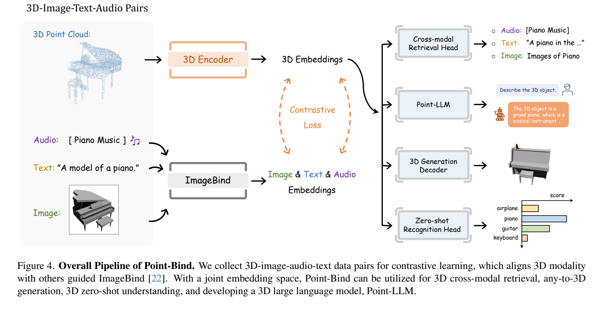
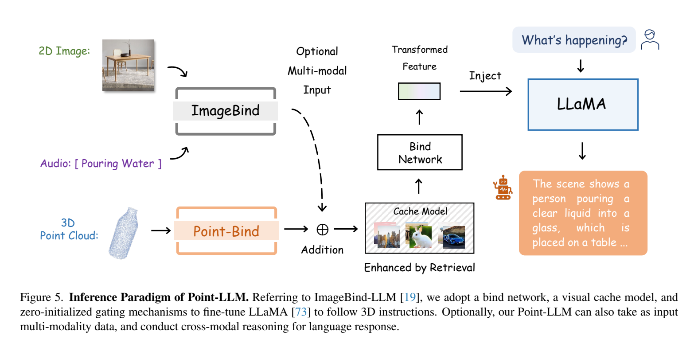

**原文**: [本地](../论文原件/Point-Bind & Point-LLM.pdf) [arXiv](https://arxiv.org/abs/2309.00615)

# 一句话记忆

Point-Bind 用 3D—图像—文本—音频配对数据把点云编码器接入 ImageBind 的共享空间；Point-LLM 再借助已完成的 2D 图文指令对齐，把 3D 特征注入 LLaMA，从而在不使用 3D 指令微调数据的情况下展示 3D 问答能力。

# 研究问题

## 以前的方法

以前的 3D 跨模态学习通常聚焦于将 3D 点云投影为 2D 深度图来直接调用预训练好的 CLIP 空间进行零样本识别，或者通过 3D-图像-文本三元组预训练专门的 3D 骨干网络（如 [[ULIP]]）。

## 存在的问题

1. **模态局限性**：绝大多数 3D 跨模态对齐模型仅局限于将 3D 与 2D 图像或文本进行对齐，忽略了现实世界中丰富的其他模态（如音频、视频等）与 3D 点云的自然关联。
2. **3D 指令数据昂贵**：直接训练具备 3D 指令跟随能力的 LLM 通常需要专门的 3D—问答配对，而此类数据比公开图文指令数据更少。

## 论文试图解决什么

如何将 3D 点云统一对齐到多模态共享嵌入空间（ImageBind），以及如何在完全不使用 3D 指令微调数据的前提下，高效地为大语言模型注入 3D 几何特征和空间推理能力。

# 核心洞察

- **研究洞察**：
  1. **共享空间带来的跨模态迁移**：若 3D 与图像、文本、音频已位于同一嵌入空间，再把图像嵌入接入 LLM，可在推理时复用同一接口输入 3D 或音频。这里是由共同表征带来的迁移，不是严格保证的“自动对齐”，所以论文又加入 Visual Cache 缓解 2D/3D 分布差异。

- **工程实现**：
  1. **两层投影与模板平均**：用两个线性层和中间 LayerNorm 把 I2P-MAE 特征投到 ImageBind 维度；对 64 个文本模板的嵌入取平均，减少单一措辞的影响。
  2. **推理阶段的 Visual Cache 机制**：由于 LLaMA 预训练时仅与 ImageBind 的 2D 图像进行过对齐，而推理阶段使用的是 Point-Bind 3D 特征，这会导致一定的跨模态差距。Point-LLM 在推理时通过检索包含 3M 训练图像的 Cache Model，提取 top-k 相似的 2D 特征并以残差连接的形式与 3D 编码融合，显著缓解了 2D-3D 编码器之间的语义鸿沟。

- **普通组件**：
  - 3D 编码器使用预训练的 I2P-MAE；大语言模型使用预训练的 LLaMA 7B；多模态提取器使用预训练且冻结的 ImageBind。

# 方法流程

方法流程的总体框架见首图 。

- **1. Point-Bind 多模态对比预训练流程**：
  输入 3D-图像-音频-文本对 $\rightarrow$ 冻结的 ImageBind 编码器提取 2D 图像、文本（对 64 个模板取平均）、音频特征 $F_{2D}, F_T, F_A$ $\rightarrow$ learnable 3D 编码器 (I2P-MAE) 提取 3D 特征并通过 2 层线性 projection 得到 $F_{3D}$ $\rightarrow$ 计算 $F_{3D}$ 与 $F_{2D}, F_T, F_A$ 之间的对称对比损失 $L_{total}$ $\rightarrow$ 更新 3D 投影与编码器参数。

- **2. Point-LLM 问答推理流程**（参见下面 ）：
  输入 3D 点云与文本问题 $\rightarrow$ Point-Bind 编码器提取 3D 特征 $\rightarrow$ **Visual Cache 检索**：以 3D 特征检索 top-k 相似的 cached 2D 图像特征并残差相加 $\rightarrow$ 经过微调的 Bind Network 映射至大模型 Token 空间 $\rightarrow$ 通过零初始化门控机制（Zero-initialized Gating）注入 LLaMA 7B $\rightarrow$ 输出最终文本回答。

# 关键模块

- **3D 投影网络 Proj**
  - 输入：3D 编码特征 $f_{3D} \in \mathbb{R}^{D_{3D}}$ (由 I2P-MAE 提取)
  - 输出：投影后的 3D 嵌入 $F_{3D} \in \mathbb{R}^{C}$ (其中 $C = 1024$ 匹配 ImageBind 空间)
  - 作用：两层线性层与中间 LayerNorm 结构，映射 3D 特征。
  - 为什么需要：除维度匹配外，还要学习 3D 表征到 ImageBind 语义坐标系的映射；它不只是机械的维度变换。
  - 去掉后可能发生什么：无法直接计算对比损失，3D 点云无法对齐到联合空间。

- **Visual Cache (视觉缓存模型)**
  - 输入：Point-Bind 编码的当前 3D 特征 $F_{3D} \in \mathbb{R}^{C}$ (作为 Query)
  - 输出：加权聚合后的 Cached 2D 图像特征 $F_{2D\_cache} \in \mathbb{R}^{C}$
  - 作用：在推理阶段，通过余弦相似度在包含 3M 图像特征的键值缓存中检索 top-k 个最相似的图像，将其与原始 3D 特征相加（残差结构）。
  - 为什么需要：Point-LLM 仅在 2D 图文对上进行过对齐微调，在推理阶段换成 3D 输入会因为模态偏差而导致特征空间发生偏移。缓存以 training-free 方式弥合了 2D-3D 编码器语义鸿沟。
  - 去掉后可能发生什么：推理时的 3D 特征无法与大模型对齐，导致 3D 空间几何和语义理解性能出现下降。

# 训练目标或核心公式

对比损失计算：

$$\mathcal{L}_{total} = \mathcal{L}(F_{3D}, F_{2D}) + \mathcal{L}(F_{3D}, F_T) + \mathcal{L}(F_{3D}, F_A)$$

其中对于任意两个模态表征 $x$ 和 $y$，采用标准的对称对比对齐损失（InfoNCE）：

$$\mathcal{L}(x, y) = -\frac{1}{2} \left[ \log \frac{e^{\cos(x, y)/\tau}}{\sum e^{\cos(x, y_{neg})/\tau}} + \log \frac{e^{\cos(x, y)/\tau}}{\sum e^{\cos(x_{neg}, y)/\tau}} \right]$$

- **优化目标**：最小化 3D 特征与对应的图像、文本、音频之间的余弦距离，将其拉入 ImageBind 共享的多模态超球面上。
- **正负样本定义**：对角线处的配对 3D-多模态为正样本，Batch 内的其他样本为负样本。音频模态中，没有发声属性的类别（如 planter, couch）将直接在计算损失时被忽略。

# 实验证明了什么

- **实验问题 1：Point-Bind 在 3D 跨模态检索上表现如何？**
  - **比较对象**：PointCLIP, PointCLIP-V2, ULIP 等。
  - **观察结果**：在 ModelNet40 数据集上，Point-Bind 在 3D-to-3D, 2D-to-3D, 3D-to-2D, text-to-3D 任务上均大幅领先，比此前最强基线 (ULIP) 分别提升了 +2.65%, +14.29%, +13.08%, +13.99% 的 mAP。
  - **支持的结论**：这些结果支持共享多模态空间用于 3D 跨模态检索；由于训练数据、编码器与监督信号同时变化，不能把增益单独归因于音频或某一种对齐关系。

- **实验问题 2：投影网络设计和 3D 编码器选择对零样本分类有何影响？**
  - **比较对象**：One Linear vs Two Linear vs Three Linear；PointNeXt vs Point-BERT vs I2P-MAE。
  - **观察结果**：在 ModelNet40 零样本分类下，使用两层线性层获得了最高性能（78.00%），优于单层（76.46%）和三层（76.78%）。I2P-MAE 编码器显著优于 PointNeXt (67.96%) 和 Point-BERT (76.70%)。
  - **支持的结论**：适度的非线性层数和使用含有 2D 蒸馏预训练的 3D Transformer 架构是高质量 3D 表征对齐的关键。

# 局限与失效场景

- **局限 1：严重依赖 2D-to-3D 检索缓存进行对准**
  - **产生原因**：大模型的参数高效微调只使用 2D 图文指令数据，3D 输入依赖共享空间迁移和推理时的 Visual Cache 纠偏。
  - **可能失败的场景**：当输入全新的、在 Visual Cache 中没有相似 2D 图景的冷门 3D 几何物体时，检索失效，模型将无法正确描述该 3D 物体。

- **局限 2：3D 指令能力主要由定性案例展示**
  - **产生原因**：Point-LLM 部分没有在专门的 3D QA 基准上报告系统性量化结果；论文的核心量化证据集中在检索、零样本分类与投影消融。
  - **可能失败的场景**：复杂空间关系、精确尺寸和室内外场景点云不能由 ShapeNet CAD 物体上的结果直接保证。

# 与其他论文的关系

## 前置基础

- [[ImageBind]]：提供 3D 点云对齐的目标多模态共享特征空间（`builds-on`）。
- [[I2P-MAE]]：用作 learnable 的 3D 点云特征提取网络（`uses-as-backbone`）。

## 同任务工作

- [[ULIP]]：以往经典的 3D 跨模态图文对齐网络（`same-task`）。

## 后续改进

- [[Point-LLM]]：本论文直接衍生的 3D 指令理解大语言模型（`improves`）。

# 对我的课题的启发

`[AI分析]`

1. **模态绑定的间接泛化思想**：在建立 3D 场景描述与轨迹定位对齐时，可利用图像作为桥接模态，先对齐图像—轨迹与图像—文本，再测试点云输入能否迁移。该方案可能减少专门标注，但不能预设会自然获得零样本指令定位能力。

# 主动回忆问题

## Level 1：主线恢复

- 简述 Point-Bind 的传递性绑定思想，为什么 Point-LLM 可以在不需要 3D 问答对数据的情况下实现 3D 指令遵循？
- Point-Bind 在预训练阶段输入的数据对包含哪些模态？如何处理不发出声音的 3D 物体？

## Level 2：机制理解

- 推理阶段 Visual Cache 模块的具体工作机制是什么？它是如何弥合 2D 和 3D 编码特征间的差异的？
- Point-Bind 的投影网络（Projection Network）为什么要使用两层线性层与 LayerNorm 的组合，而不是单层线性映射？

## Level 3：批判与迁移

- 如果要在我们的 3D 点云定位任务中应用 Point-Bind 的思路，在面临没有图像对应的纯激光点云（如 KITTI）时，应该如何设计缓存或代理模态？

# 尚未解决的问题

- 3D LLM 在复杂空间相对距离估计与精确定位中的数值敏感度缺口。

## 理解更新记录

- `2026-07-12`：由 AI 基于论文原件 PDF 自动生成并归档初始版本笔记。
