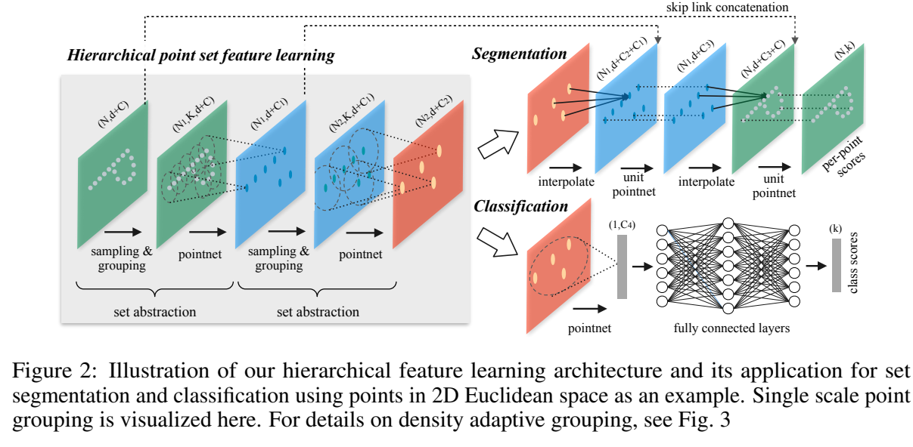

**原文**: [本地](../论文原件/PointNet++.pdf)

# 一句话记忆

PointNet++ 把 [[PointNet]] 递归地应用于度量空间中的局部邻域，形成从局部到全局的层级表示；MSG/MRG 与随机输入丢弃缓解采样密度变化，特征传播层则把粗层语义插值回原始点分辨率。

# 研究问题

## 以前的方法

PointNet 是处理原生点云的先驱，但它使用全局最大池化 (Global Max Pooling) 直接将所有点的信息聚合成一个全局向量。

## 存在的问题

1. **局部上下文缺失**：PointNet 缺乏局部邻域的级联提取能力，无法像 CNN 那样从小的局部感受野逐步过渡到大感受野，导致难以捕捉精细的空间几何细节。
2. **难以处理密度不均**：在现实环境中，由于视角、遮挡、距离等因素，3D 点云的密度往往极不均匀。直接在变密度数据上训练单尺度网络会导致在稀疏区域性能急剧崩塌。

## 论文试图解决什么

如何在点云数据上引入类似于 CNN 的层级特征提取（Hierarchical Feature Learning）架构，使其在保留排列不变性的同时，能够自适应捕捉多尺度的局部几何结构，并在面对极具变化的采样密度时保持鲁棒。

# 核心洞察

- **研究洞察**：
  1. **层级抽象架构 (Hierarchical Abstraction)**：将点云在度量空间（Metric Space）中的距离作为聚类依据，递归地将点集划分为重叠的局部邻域，并在各局部邻域内应用 mini-PointNet 提取特征，形成“局部特征 $\rightarrow$ 局部中尺度特征 $\rightarrow$ 全局特征”的层级结构。
  2. **密度自适应学习机制 (Density-Adaptive Grouping)**：局部特征的 descriptiveness 与点集密度密切相关。在稀疏区域，应侧重于更大空间尺度的宏观特征；在稠密区域，应利用小尺度提取精细几何。通过多尺度分组并在训练中应用随机输入点丢弃（Random Input Dropout），强制网络学会根据局部点云密度自适应调整不同感受野下的权重。

- **工程实现**：
  1. **Set Abstraction (SA) 模块**：由采样 (Sampling)、分组 (Grouping) 和特征提取 (PointNet) 三层级联组成，实现点数的下采样和通道数维度提升。
  2. **Feature Propagation (FP) 模块**：针对点级分割任务，通过基于欧氏空间距离的逆距离加权插值（Inverse Distance Weighted Interpolation）将下采样点特征插值回原点云，配合 Skip Links 拼接（Concatenate）低层特征以恢复精细几何定位。

- **普通组件**：
  - 最远点采样 (FPS) 算法、K 最近邻 (KNN) 或球空间检索 (Ball Query) 邻域搜索、共享 MLP。

# 方法流程

方法流程的总体框架见首图 。

- **1. 降采样与层级抽象 (Set Abstraction Stage)**：
  - *输入*：$N \times (d + C)$ 的点云特征（$N$ 个点，$d$ 维坐标，$C$ 维特征）。
  - *Sampling Layer*：使用最远点采样 (Farthest Point Sampling, FPS) 从输入中挑选出 $N_1$ 个质心点。
  - *Grouping Layer*：以质心点为圆心，设定半径 $r$，利用 Ball Query (球查询) 筛选出每个质心邻域内的 $K$ 个邻近点，输出大小为 $N_1 \times K \times (d + C)$。
  - *PointNet Layer*：先把邻域点坐标转换为相对质心坐标，再用共享 MLP 编码并做 Max Pooling，得到每个质心的局部区域特征；与质心坐标合并后，输出可写为 $N_1 \times (d + C_1)$。
  - *堆叠*：将上述 SA 层递归堆叠数次（如 $SA_1 \rightarrow SA_2 \rightarrow SA_3$），点数不断收缩，感受野不断扩大。

- **2. 任务特定解码 (Classification / Segmentation Head)**：
  - *分类任务*：最后一层 SA 将所有剩余点融合成单个 $1 \times C_{global}$ 全局向量，直接送入 FC 层输出分类置信度。
  - *分割任务 (Feature Propagation)*：为了获得逐点预测，网络必须恢复原点云分辨率。
    - 采用插值层，将 $N_l$ 个点的特征插值至更密集的 $N_{l-1}$ 个点上。
    - 插值特征与 SA 阶段同分辨率的 Skip Link 原始特征进行通道拼接。
    - 送入 Unit PointNet (MLP) 进一步提取混合特征，直到恢复至原始点数 $N$。

# 关键模块

- **Farthest Point Sampling (FPS, 最远点采样)**
  - 输入：含有 $N$ 个点的坐标集合 $X = \{x_1, \dots, x_N\}$，目标点数 $N'$
  - 输出：$N'$ 个质心坐标集合
  - 作用：每次迭代选择与当前已选质心集合中距离最远的那个点，直到选满 $N'$ 个。
  - 为什么需要：FPS 对整个点集有较好的覆盖性。论文据此选择它而不是随机采样，但没有证明其在所有不均匀点云上都达到“最均匀”或保证每个稀疏区域被覆盖。
  - 去掉后可能发生什么：随机采样可能更偏向高密度区域，使覆盖更不稳定；影响大小取决于点分布和采样预算，论文未给出独立 FPS 消融数值。

- **Ball Query (球查询)**
  - 输入：质心点坐标、输入点坐标、球体搜索半径 $r$、最大邻近点数 $K$
  - 输出：每个质心对应的 $K$ 个局部点索引
  - 作用：在质心的欧氏距离半径 $r$ 内寻找点，并在实现中设置邻居数上限 $K$。原文未在方法正文明确规定“点数不足时复制最近点”的具体策略。
  - 为什么需要：相比 KNN（$K$ 最近邻），Ball Query 保证了局部感受野在物理空间尺寸上的绝对一致性，使模型学到的特征具有空间尺度稳定性。
  - 去掉后可能发生什么：KNN 在稀疏区会扩大实际空间尺度，而 Ball Query 保持固定半径。补充实验在均匀采样的 ModelNet40 上只显示 Ball Query 略优，作者对强非均匀数据上的优势属于有依据但未直接量化的判断。

- **Density Adaptive Grouping (MSG/MRG, 密度自适应分组)**
  - *Multi-Scale Grouping (MSG)*：在同一个 SA 层，使用不同半径（如 $r_1, r_2, r_3$）的多个 Grouping 层分别运行 PointNet，最后将多尺度特征拼接。
  - *Multi-Resolution Grouping (MRG)*：通过层级间特征与直接对底层大感受野特征处理后的向量进行拼接，以解决极度稀疏区域特征不可靠的问题。
  - 作用：自适应捕获不同点云采样密度下的几何模式，配合 Random Input Dropout 提升模型鲁棒性。
  - 去掉后可能发生什么：论文图 4 表明，未使用密度适应策略的 SSG 对稀疏测试采样泛化较差；但下降幅度取决于点数和数据集，不能直接外推为所有雷达场景中的 Recall “严重下跌”。

# 训练目标或核心公式

- **逆距离加权插值公式 (Inverse Distance Weighted Interpolation)**：
  在特征传播层 (FP) 中，对于位置 $x$ 处的未知特征，通过其在下采样层中最临近的 $k$ 个已知点（默认 $k=3$）的特征 $f(x_i)$ 进行插值：
  $$f^{(l)}(x) = \frac{\sum_{i=1}^k w_i(x) f^{(l)}(x_i)}{\sum_{i=1}^k w_i(x)}, \quad w_i(x) = \frac{1}{d(x, x_i)^2}$$
  - **作用**：基于欧氏距离平滑地在点集之间传递高维特征，保证特征回归的空间连续性。

- **Random Input Dropout (随机输入点丢弃)**：
  在训练中，对于每个输入的训练点集，以概率 $\theta \sim [0, p]$（其中 $p \le 1$，通常 $p=0.95$）随机丢弃点云中的点。
  - **作用**：模拟现实中各种变采样密度的扫描效果，迫使多尺度网络自适应调整权重，使网络学会：当点云极其稀疏时，降低细尺度感受野的权重，提升粗尺度/宏观感受野的权重。

# 实验证明了什么

- **实验问题 1：PointNet++ 在 3D 点云分类和分割上的精度提升？**
  - **比较对象**：PointNet (Qi et al., 2017)、OctNet、Kd-Network等。
  - **观察结果**：在 ModelNet40 上，坐标输入的 PointNet++ 为 90.7%；加入法向量并把输入点数增至 5000 后为 91.9%。原论文表 2 没有把这两个数字分别标成 SSG 与 MSG，因此旧笔记的对应关系不成立。论文还在 SHREC15、ScanNet 与 ShapeNet Part 上报告了优于所列基线的结果。
  - **支持的结论**：引入层级局部邻域提取极大地增强了网络提取精细空间细节和描述复杂 3D 几何特征的能力。

- **实验问题 2：密度自适应分组 (MSG/MRG) 抵御点云稀疏化的效果？**
  - **比较对象**：不使用随机输入丢弃的 Single Scale Grouping (SSG)。
  - **观察结果**：图 4 比较 1024、512、256、128 点等不同测试密度；正文明确给出的结论是 MSG+DP 从 1024 降到 256 点时性能下降不足 1%，且在几乎所有采样密度上优于替代方案。旧笔记中的“SSG 跌至 40% 以下”和“256 点仍大于 90%”未在正文中明确报告，故删除。
  - **支持的结论**：MSG/MRG 配合随机输入丢弃能显著提高对该实验所模拟采样密度变化的鲁棒性；是否能“完美应对”真实自动驾驶雷达的距离衰减、遮挡和传感器噪声，论文实验不能证明。

# 局限与失效场景

- **局限 1：计算开销高昂（特别是 MSG 模式）**
  - **产生原因**：MSG 机制需要在每一个质心点上用多个感受野半径拉取邻域并运行独立的 mini-PointNets。由于在低层点云的质心点数 $N_1$ 较大，且需要重叠采样，点云局部搜索与 MLP 升维的计算量和显存开销非常大。
  - **可能失败的场景**：在资源受限的边缘嵌入式设备（如车载计算平台）上，进行大范围、高频次的实点云帧层级特征提取时，MSG 架构可能导致难以满足实时性要求。
  - **后续意义**：这启发了后续关于稀疏体素卷积（Sparse Convolution）及高效 3D 算子（如 Point-Voxel CNN）的硬件友好性改进。

# 与其他论文的关系

## 前置基础

- [[PointNet]]：PointNet++ 继承了 PointNet 的共享 MLP 升维和 Max Pooling 作为对称函数来处理无序局部点集的基础设计（`builds-on`）。

## 后续改进

- [[Point-Bind & Point-LLM]]：采用 PointNet++ 作为其 3D 特征提取器的同领域跨模态模型（`extends-to`）。
- [[Text2Loc]]：使用 PointNet++ 作为 3D backbone，提取子地图中的 3D 物体实例并融合其语义、颜色、空间中心点和点数信息，以与文本进行对齐匹配定位（`uses-as-backbone`）。
- [[Text2Loc++]]：在 Text2Loc 的基础上，同样以 PointNet++ 作为 3D backbone，引入了 MIT 模块以过滤点云实例噪点（`uses-as-backbone`）。

## 思想相似

- [[DINOv2]]：在提取密集语义特征时采用多尺度/层级化注意力（`similar-idea`）。

# 对我的课题的启发

`[AI分析]`

1. **多尺度地图地标聚合**：在城域大尺度文本定位任务中，文字描述的范围多变（如“在一条几百米长的灰色道路南侧”或“在绿色的邮筒西侧”）。我们可以借鉴 PointNet++ 的 MSG 思想，在构建子地图 the 3D 地标节点图时，对每个中心地标提取不同球半径 $r$ 内的邻域，分别聚合出细粒度物体特征和宏观街道特征，能极大地改善多模态定位中尺度失配（Scale Mismatch）的问题。
2. **变分辨率数据抗扰**：城市激光雷达点云由于车载雷达的旋转扫描，近处物体极其稠密，远处建筑物则稀疏到仅有寥寥数点。在做跨模态实例对齐时，必须引入 PointNet++ 的 random input dropout 训练机制，使我们在面对退化的、点数稀疏的远处关键地标时仍能识别出其稳定的语义类别，防止细定位阶段出现严重的位置漂移。

# 主动回忆问题

## Level 1：主线恢复

- PointNet++ 是如何通过三个嵌套子层（Sampling, Grouping, PointNet）组合成一个 Set Abstraction (SA) 层的？
- MSG（Multi-Scale Grouping）和 MRG（Multi-Resolution Grouping）在应对点云采样密度不均时的处理逻辑有什么关键差异？

## Level 2：机制理解

- Feature Propagation (FP) 层中是如何利用“逆距离加权插值”来恢复点云分辨率的？写出其核心计算权重 $w_i(x)$。
- 为什么在 Grouping 层中推荐使用 Ball Query（球查询）而不是 KNN（K最近邻）？

## Level 3：批判与迁移

- 点丢弃（Random Input Dropout）在训练中起到了什么关键的正则化作用？如果在自动驾驶室外场景中，如何调整 Dropout 的上限概率 $p$ 以模拟超长距离雷达物体的退化？

# 尚未解决的问题

- 极度稀疏、甚至发生大面积动态遮挡（如川流不息的车辆遮挡路面建筑物）时的层级拓扑几何稳定性。

## 理解更新记录

- `2026-07-12`：由 AI 基于论文原件 PDF 自动生成并归档初始版本笔记。
