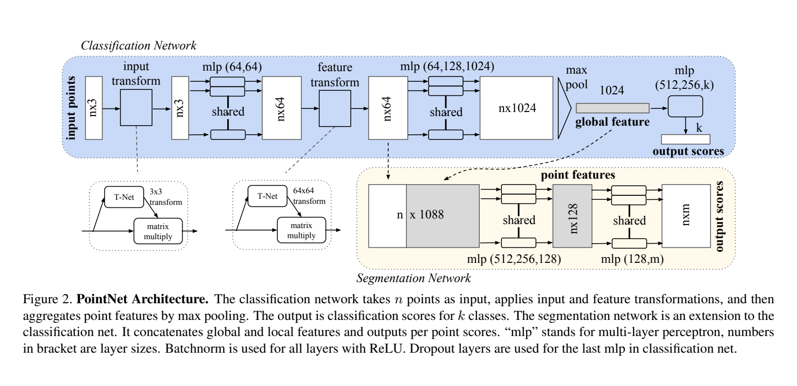
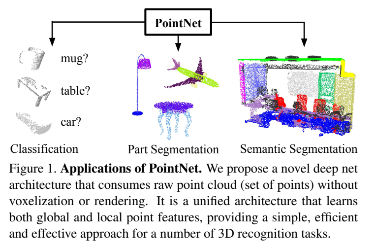

**原文**: [本地](../论文原件/PointNet.pdf)

# 一句话记忆

PointNet 直接以无序点集为输入：共享 MLP 编码每个点，对称最大池化保证输出不随点的排列变化，再用 T-Net 学习输入与特征对齐；它以很少的结构假设同时支持分类、部件分割和场景分割。

# 研究问题

## 以前的方法

3D 点云具有不规则和非网格化的空间分布。以前的研究通常先将不规则的 3D 点云转换为规则的 3D 体素网格 (Voxel Grid) 或者是渲染多视角图像集合 (Multi-view Images)，然后再应用成熟的 3D/2D 卷积网络。

## 存在的问题

1. **数据臃肿与计算量大**：转体素后数据往往存在大量空余空间（体素稀疏性强），导致无效运算开销极大。
2. **量化误差与特征丢失**：体素化会限制三维空间的分辨率，带来显着的量化截断误差；多视角渲染则在捕捉精细的 3D 几何（如局部点云法线、连接关系）时会丢失深度和拓扑特征。

## 论文试图解决什么

如何直接处理不规则、无序的点集，使网络对输入排列严格不变，并通过学习式对齐降低特定几何变换带来的表示差异。

# 核心洞察

- **研究洞察**：
  1. **无序集的对称逼近理论**：任何定义在点集上的排列不变（Symmetry）函数，可以通过“先对单点进行高维非线性变换（$h$），再在点维度上应用一个一维对称聚合函数（$g$）”来无限逼近：
     $$f(\{x_1, \dots, x_n\}) \approx g(h(x_1), \dots, h(x_n))$$
  2. **局部与全局的多级融合**：在分类任务中只需全局语义；而在点级分割任务中，必须将聚合得到的全局特征复制并拼接（Concatenate）回单点高维特征后面，使每个点都能同时感知其局部位置和全局轮廓语义。

- **工程实现**：
  1. **对称最大池化 (Symmetric Max Pooling)**：利用共享权值的 MLP 实现单点升维 $h$，并在点云数量维度进行最大值池化（即对称算子 $g$），获得长度为 1024 维的全局形状描述子（Global Feature）。
  2. **空间与特征对齐网络 (T-Net)**：输入端的 T-Net 预测 $3 \times 3$ 线性变换，对点坐标做学习式对齐；中间的 T-Net 预测 $64 \times 64$ 特征变换，并用近似正交约束避免高维变换任意拉伸或压缩信息。由于这里不是齐次坐标矩阵，它不直接表示平移；论文也没有证明由此获得对所有仿射变换的严格不变性。

- **普通组件**：
  - 标准多层感知机 (MLP)、批归一化 (Batch Normalization)、全连接分类器。

# 方法流程

方法流程的总体框架见首图 。

- **1. 输入对齐 (Input Alignment)**（见下图 ）：
  输入含有 $n$ 个点的 3D 点云（$n \times 3$） $\rightarrow$ 经 3D 空间变换对齐网络 (T-Net) 回归 $3 \times 3$ 空间变换矩阵，乘回输入点以进行 canonical 空间对齐。

- **2. 逐点提取与特征对齐 (Point-wise Embedding & Feature Alignment)**：
  对齐点送入共享参数的 MLP (64, 64) 映射为 $n \times 64$ 高维点特征 $\rightarrow$ 经 64 维特征变换网络 (T-Net) 预测 $64 \times 64$ 特征对齐矩阵并乘以特征矩阵 $\rightarrow$ 送入共享 MLP (64, 128, 1024) 投影至 $n \times 1024$。

- **3. 对称聚合与下游头 (Symmetric Aggregation)**：
  - *最大池化*：沿点数维度进行 Max Pooling，聚合出 $1 \times 1024$ 的全局形状特征向量。
  - *分类头 (Classification Net)*：全局特征直接输入 3 层 FC (512, 256, k) 输出 $k$ 个类别的置信度。
  - *分割头 (Segmentation Net)*：将 $1 \times 1024$ 全局特征与第二步得到的 $n \times 64$ 点特征进行拼接 $\rightarrow$ 组成 $n \times 1088$ 点特征 $\rightarrow$ 送入共享 MLP (512, 256, 128) 回归 $n \times m$ 的点级分割掩码。

# 关键模块

- **Symmetric Max Pooling (对称最大池化)**
  - 输入：$n \times K$ 点云高维点特征
  - 输出：$1 \times K$ 全局特征向量
  - 作用：在点维度上取最大值，实现通道级的特征聚合。
  - 为什么需要：彻底消除点云输入顺序的干扰，确保排列不变性（$\text{Max}(x_1, \dots, x_n) = \text{Max}(P(x_1, \dots, x_n))$）。
  - 去掉后可能发生什么：模型对于输入点云的物理存储顺序（Feeding order）极其敏感，点云打乱顺序输入时模型输出将剧烈波动，根本无法泛化。

- **Joint Alignment Network (T-Net, 变换对齐网络)**
  - 输入：$n \times D$ 特征（$D=3$ 或 $D=64$）
  - 输出：$D \times D$ 仿射对齐矩阵
  - 作用：由整组点的特征预测一个全局线性变换，并将其乘回输入坐标或中间特征，使后续编码面对更一致的表示。
  - 为什么需要：减少输入姿态或特征基底差异带来的学习负担。它是数据驱动的对齐机制，不等于数学上严格的旋转不变性。
  - 去掉后可能发生什么：论文表 5 中，无任何变换的分类准确率为 87.1%，仅输入变换为 87.9%，输入与正则化特征变换共同使用时为 89.2%；因此可以说对齐带来可测收益，但“微小旋转即崩塌”没有被论文实验支持。

# 训练目标或核心公式

- **无序点集函数逼近理论**：
  $$f(\{x_1,\dots,x_n\}) \approx g(h(x_1),\dots,h(x_n))$$
  证明了使用高维非线性映射 $h$ 配合对称最大值池化 $g$ 可以逼近定义在豪斯多夫空间（Hausdorff space）上的任意连续集合函数。

- **高维特征正交约束损失 (Regularization Loss)**：
  $$L_{reg} = \|I - A A^T\|_F^2$$
  其中 $A$ 是 $64 \times 64$ 的特征对齐变换矩阵，$I$ 是单位矩阵。
  - **作用**：使高维特征变换接近正交矩阵，减少变换造成的信息损失。论文明确指出，没有这项正则时高维特征变换效果变差；“极大稳定收敛”不是论文单独量化的结论。
  - **总损失**：
    $$\text{Loss} = \text{Loss}_{task} + 0.001 \cdot L_{reg}$$

# 实验证明了什么

- **实验问题 1：PointNet 提取 3D 全局和局部特征的准确度如何？**
  - **比较对象**：MVCNN（多重视角网络）、VoxNet（体素三维卷积）、Subvolume等。
  - **观察结果**：在 ModelNet40 分类测试上，PointNet 取得了 89.2% 的高精度，与多视角网络和复杂的 3D 卷积不相上下，而计算时间缩短了数十倍。在 Part Segmentation 和 Scene Semantic Parsing 上均刷新了当时的点云记录。
  - **支持的结论**：直接消耗原生点云的对称最大值池化架构既高效又极具代表性。

- **实验问题 2：PointNet 对噪点和缺失点的鲁棒性？**
  - **比较对象**：丢失 10%–90% 的点、点云随机高斯抖动。
  - **观察结果**：论文图 6 报告，在缺失 50% 点时，相比完整输入，最远点采样与随机采样下的准确率分别下降 2.4 和 3.8 个百分点；对模型训练时见过的离群点污染，在离群点占 20% 时准确率仍超过 80%。这两项条件不能合并泛化为对任意严重噪声都鲁棒。
  - **支持的结论**：Max Pooling 提取出的“关键点集”（Critical Points，对应于激活全局特征的那些点）是高度鲁棒和分布集中的（见 Fig 7/18），只要这些骨架点不丢，模型预测就不会改变。

# 局限与失效场景

- **局限 1：局部邻域空间关系感知弱**
  - **产生原因**：PointNet 采用 Point-wise 的 $h$（对每个点单独处理，没有和邻域做局部交互）和 Global Max Pooling。它直接从单点特征跨越到了全局特征，在中间缺乏像 CNN 那样从局部小感受野（Local receptive field）逐步过渡到大感受野的层级式结构。
  - **可能失败的场景**：当处理大型复杂城室场景中的精细地标边缘、或者长相极其相似的细粒度物体（如区分两把只在底座微小弧度上存在区别的椅子）时，PointNet 容易混淆。
  - **后续意义**：这直接催生了引入层级局部聚类结构的后续工作 [[PointNet++]]。

# 与其他论文的关系

## 后续改进

- [[PointNet++]]：在 PointNet 的基础上，引入了多尺度局部邻域聚合机制（Grouping and Sampling Layer），实现了多层感受野，大幅提升了对局部几何细节的辨识力（`improves`）。
- [[Point-Bind & Point-LLM]]：利用 PointNet 提取三维几何特征并将其投射至 CLIP 的跨模态超球面上实现 3D 跨模态学习的同领域模型（`extends-to`）。

## 同任务工作

- [[Text2Loc]]：将 PointNet++ 提取的点云特征与文本进行 coarse-to-fine 对齐定位的下游网络（`uses-as-backbone`）。

# 对我的课题的启发

`[AI分析]`

1. **无序 3D 点云与 BEV 的混合表征**：我们在做智能驾驶 BEV 局部地图重建时，通常需要处理各种地标点的无序坐标集合（如交通灯位置、行车线折线点等）。`[AI分析]` PointNet 式共享 MLP 与对称池化可以避免栅格量化，并提供严格的排列不变性；但旋转不变性仍需靠增强、对齐或专门的等变结构获得。
2. **空间 T-Net 对齐防抖动**：`[AI分析]` 对自车姿态变化，可尝试在编码前加入学习式线性对齐；若要同时估计平移，应使用中心化或齐次变换等额外设计。原论文的 $3\times3$ T-Net 不能直接回归平移，也不能保证完全消除运动抖动。

# 主动回忆问题

## Level 1：主线恢复

- 点云在深度学习中面临的“排列不变性”和“几何不变性”分别指什么？ PointNet 是如何分别解决这两个问题的？
- T-Net 中为什么要给 $64 \times 64$ 变换矩阵引入正交正则化项 $L_{reg}$？

## Level 2：机制理解

- 分类任务和分割任务在 PointNet 的网络输出流向上有什么关键差异？为什么要引入 Feature Concatenation？
- 为什么 PointNet 对点云的缺失（Missing points）表现出极强的鲁棒性？可以用“Critical Points”的概念来合理解释吗？

## Level 3：批判与迁移

- 为什么说 PointNet 的逐点 FFN (Shared MLP) 使得它在捕捉“局部邻域几何特征（Local context）”时存在天然的设计缺陷？如果让你改进，如何在保留 permutation invariance 的同时引入局部感受野？

# 尚未解决的问题

- 点云密度极度稀疏、甚至发生大片遮挡（Occlusion）情况下的三维局部流形（Manifold）重建与精准特征捕获。

## 理解更新记录

- `2026-07-12`：由 AI 基于论文原件 PDF 自动生成并归档初始版本笔记。
