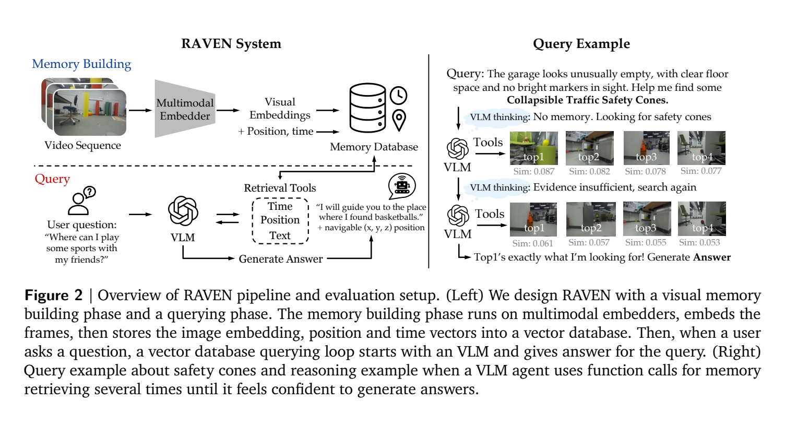

**原文**: [本地](../论文原件/RAVEN.pdf)

# 一句话记忆

RAVEN 把每帧的视觉嵌入、机器人位姿、时间戳与原图共同存入向量库，再由 VLM 智能体迭代调用文本、时间、位置和图像检索工具，为长时程问答与导航只取回少量相关记忆。

# 研究问题

## 以前的方法

在长期机器人具身智能（Embodied AI）部署中，机器人需要处理跨越数十分钟到数小时的长历史轨迹信息。以前的方法主要分为两类：一是基于 VLM 的纯文字记忆系统，通常在探索过程中运行目标检测或图像描述生成器，将图像转化为自然语言描述存入文本库；二是直接将超长视频流输入给拥有超长上下文的 VLM。

## 存在的问题

1. **文本描述的信息流失（Lossy Compression）**：图像到文字的 captioning 过程会过滤掉大量精细视觉语义（如物体的微小几何变形、磨损、特定纹理或不常见物体的名称），一旦用户提出非预定义细节的查询，文本记忆库将无法识别。
2. **长视频输入开销高昂**：直接将几千帧视频塞入 VLM 的上下文窗口会带来极大的推理延迟和极高的 Token 计费成本，且大模型依然存在长上下文“大海捞针”的检索性能衰退。
3. **空间与时间地标脱节**：传统视觉向量检索（如常规的 CLIP 特征检索）无法直接建立时间上的连续动作感知或空间上的绝对几何连贯，容易引发空间导航漂移。

## 论文试图解决什么

如何构建一个无需针对场景再训练、可扩展到长轨迹的机器人记忆系统，尽量保留 caption 容易漏掉的视觉细节，并把语义检索结果关联到时间和空间位置。这里的“高保真”是相对于文本 caption 的信息保留，不等于无损保存全部视觉信息。

# 核心洞察

- **研究洞察**：
  1. **视觉—空间—时间复合索引（Visuo-Spatio-Temporal Memory）**：每条记忆为 $(p_i,t_i,z_i,o_i)$，分别保存位姿、时间、视觉嵌入与原始 RGB 帧。它不是“视听”记忆，也不把全部字段强行拼成一个向量；不同工具按语义相似度、空间邻近或时间窗口查询。
  2. **智能体检索闭环 (Agentic Retrieval Loop)**：面对复杂的空间逻辑推理（如“我朋友想打排球，帮我找找需要的东西”），单次特征检索往往由于歧义或视角残缺而召回失败。让一个基于 VLM 的智能体扮演“推理状态机”，根据工作内存中已累积的线索，自主、迭代地调用不同的多模态检索工具（文本检索、位置检索、时间检索），直至确认收集到足够证据才输出最终目标，可显著提高召回精准度并控制上下文窗口大小。

- **工程实现**：
  1. **FSM Agent & Tool Set**：设计了四类工具：
     - `text-based`：将文本编码为向量，利用余弦距离检索视觉嵌入。
     - `time-based`：返回特定时间节点前后的连续图像序列。
     - `position-based`：检索特定 3D 坐标邻域内的历史帧。
     - `image-based`：使用图像进行跨模态多视图匹配。
  2. **A* 导航闭环集成**：将 VLM 智能体最终推理输出的 3D 目标坐标 $(\hat{x}, \hat{y}, \hat{z})$ 传入 $A^*$ 路径规划器与 RGB-D SLAM 建图模块，自动驱动机器人底盘行进，形成检索-推理-导航规划的物理闭环。

- **普通组件**：
  - 标准向量数据库可用 FAISS 或 Milvus；真实部署使用 Unitree Go1、ZED 2i 与 Jetson Orin NX。

# 方法流程

方法流程的总体框架见首图 。

- **1. 自主探索与内存构建阶段 (Autonomous Memory Building)**：
  - 机器人利用边界探索算法 (Frontier Exploration) 遍历环境，利用 RGB-D SLAM 重建 3D 占据网格图 (Occupancy Grid Map)。
  - 在探索过程中，深度相机持续捕捉 RGB 图像 $o_i$。
  - 图像经过预训练的多模态嵌入模型（如 SigLIP、QQMM-v2）提取出密集视觉特征向量 $z_i$。
  - 将每个特征与其对应的 SLAM 位姿 $p_i = (x_i, y_i, z_i)$ 和时间戳 $t_i$ 组合为记忆三元组 $m_i = (p_i, t_i, z_i, o_i)$ 并存储在 FAISS 向量数据库中。

- **2. 智能体迭代检索与闭环推理阶段 (Querying & Reasoning)**：
  - *输入*：用户发出自然语言查询 $q$（例如：“我感觉有点冷，能带我去能取暖的地方吗？”）。
  - *初始化*：VLM 智能体设定初始工作上下文 $R_0 = \{q\}$。
  - *迭代状态机*：
    - VLM 评估当前上下文 $R_\tau$ 中的信息是否足以直接回答或给出导航坐标。
    - 若不足，则自主调用检索工具（如生成文本检索词 `heater` 或 `fireplace`，通过 `text-based` 工具检索 Top-$K$ 视觉特征；或根据检测到的时间线索调用 `time-based` 工具追溯前几秒的画面）。
    - 数据库返回 top-$K$ 记忆实体 $\{m'_i\}_K$（包含对应的历史图片和空间坐标）。
    - 将新得到的实体拼入上下文：$R_{\tau+1} = R_\tau \cup \{m'_i\}_K$，进入下一轮迭代 $\tau+1$。
  - *退出*：直到 VLM 认为证据确凿，退出循环并输出结构化的终极目标位置 $(\hat{x}, \hat{y}, \hat{z})$。

- **3. 物理执行导航阶段 (Navigation Execution)**：
  - 将预测目标坐标 $(\hat{x}, \hat{y}, \hat{z})$ 交给 A* 规划器，在已有占据地图上执行导航。

# 关键模块

- **Visuo-Spatio-Temporal Memory Base (三元组时空特征库)**
  - 输入：RGB 图像、SLAM 位姿估计、系统时间戳
  - 输出：结构化的复合向量索引元组 $m_i = (p_i, t_i, z_i, o_i)$
  - 作用：将原生的密集高维视觉嵌入同物理三维坐标和绝对时间顺序捆绑存入向量库。
  - 为什么需要：彻底规避了 lossy text-captioning 带来的细节丢失，并且让视觉搜索可以跟机器人的物理坐标和行为发生几何关联。
  - 去掉后可能发生什么：若只保留图像向量检索，模型只能进行普通的图片搜索，无法建立任何有关“这个东西在地图哪个物理坐标”或“这是我几分钟前在哪个拐角看到的”的空间与时间推理，使得定位导航无从谈起。

- **Agentic FSM Reasoner (智能体推理状态机)**
  - 输入：用户查询 $q$、历史检索上下文 $R_\tau$
  - 作用：利用强大的 VLM（如 Gemini-2.5-Flash）进行链式检索推理，控制检索工具的调用和循环终止。
  - 为什么需要：允许网络自主过滤冗余的无关历史帧，使得机器人在长历史（数万帧）下只需关注与查询高度关联的几十帧，极大地缩短了注意窗口，控制了 VLM Token 开销。
  - 去掉后可能发生什么：若退化为常规的 Single-Shot 检索，模型极易因为初始检索词的偏差（如搜 `fire` 没搜到，但其实附近有 `heater`）而直接输出错误结果。

# 训练目标或核心公式

- **无需训练 (Training-free)**：
  RAVEN 的全部特征提取、文本/图像对齐均基于离线预训练好的基座模型（如 SigLIP, Seed1.6, QQMM-v2）。因此，RAVEN **没有**可训练的监督损失函数，其通过联合多模态超球面空间检索和 VLM 的 zero-shot 工具使用能力直接进行部署。

- **余弦特征对齐度量 (Cosine Similarity Match)**：
  对于给定的 agent 检索词 $\hat{q}$ 和视觉特征 $z_i$，两者的对齐距离通过以下余弦距离度量：
  $$D(\hat{q}, z_i) = 1 - \frac{\langle f_{enc}(\hat{q}), z_i \rangle}{\|f_{enc}(\hat{q})\| \|z_i\|}$$
  数据库召回前 $K$ 个使 $D$ 最小的记忆元组。

# 实验证明了什么

- **实验问题 1：视觉密集特征检索对比传统 Captioning 记忆库的信息丰富度？**
  - **比较对象**：Caption-only Baseline（将图像用 VLM 实时转换为文字存入文本库）。
  - **观察结果**：RAVEN 在 RAVEN-QA、NaVQA 和 FindingDory 上总体优于 caption-based ReMEmbR，硬查询上的差距更大。论文把失败归纳为 under-captioning 与 over-captioning。
  - **支持的结论**：直接检索视觉嵌入能保留更多可查询细节，但其上限仍由预训练嵌入模型决定，不能称为“完全规避”信息丢失。

- **实验问题 2：RAVEN 在超长历史探索序列下的检索效率与 Token 缩放能力？**
  - **比较对象**：VLM Only Baseline（将所有帧拼接成超长 Context 灌入大模型中）。
  - **观察结果**：FindingDory 最长子集平均约 3023 帧时，RAVEN 总体成功率为 32.2，VLM Only 为 28.2；RAVEN 平均检索 7.43% 的记忆，而 VLM Only 处理 100%。论文报告其记忆效率约高 10 倍。
  - **支持的结论**：向量预筛选显著缩短了送入 VLM 的工作上下文。成本不会严格恒定：数据库规模、检索轮数和 top-$K$ 仍会影响延迟。

# 局限与失效场景

- **局限 1：过度依赖预训练多模态编码器的零样本对齐空间**
  - **产生原因**：RAVEN 是训练无关的，这意味它的检索匹配纯粹依赖于基座多模态编码器（如 SigLIP）将“罕见文本词”和“特定角度下的 3D 物体”映射到同一超球面空间的能力。
  - **可能失败的场景**：如果面对极为罕见、甚至从未出现在多模态预训练语料中的专业工业零件，或者受到严重逆光、反光遮挡干扰的图像，RAVEN 的 `text-based` 检索可能会召回出完全无关的场景，导致推理链在第一步即断裂。
  - **后续意义**：论文建议用领域微调改善嵌入对齐。

- **局限 2：静态记忆假设**
  - **产生原因**：当前数据库主要记录过去观察，缺少对象状态变化后的更新、冲突消解和淘汰机制。
  - **可能失败的场景**：物体频繁移动或状态变化时，旧位置记忆可能仍被召回并误导导航。

# 与其他论文的关系

## 前置基础

- [[CLIP]]：提供了基础的跨模态对比预训练共享嵌入表征（`builds-on`）。
- [[ColPali]]：提供了多向量和视觉密集特征对齐检索的设计启发（`similar-idea`）。

## 同任务工作

- [[科研/论文/memory/CMMLoc]]：CMMLoc 同样在大尺度点云定位中融合文本与视觉，但 CMMLoc 依赖显式的多级注意力优化训练，而 RAVEN 是零样本、免训练的智能体驱动框架（`peer-work`）。
- [[ERGeoBench]]：RAVEN-QA 的部分场景评测任务可以用于评估大模型在具身空间感知和 2D 坐标回归上的性能（`peer-work`）。

# 对我的课题的启发

`[AI分析]`

1. **具身导航与 3D 地图的零样本对齐**：我们在做室外文本驱动导航（Text-to-Route）时，以往通常需要采集大量“文本-自车轨迹坐标”对进行端到端监督。RAVEN 的思路启发我们，可以通过 greedy 探索离线构建一个“图像特征-BEV网格坐标-时间”的复合向量库。在推理时，直接外挂一个免训练的 VLM Agent 扮演路径导航导向，通过多轮 `text-based` 和 `position-based` 检索逼近目标点，这能显著降低室外大场景部署的数据采集难度。
2. **多轮时空推理机制**：在发生高频遮挡的路口（如公交车完全遮挡了交通标志），单次检索极易失败。可引入类似 RAVEN 的 FSM 状态机，当第一步检索失败时，智能体自主调用 `time-based` 工具往前追溯几秒前公交车未驶入前的未遮挡画面，或调用 `position-based` 召回侧向相机的视野，这能极大提高系统在室外动态遮挡下的环境重构与推理稳定性。

# 主动回忆问题

## Level 1：主线恢复

- RAVEN 的“视听-空间-时间复合内存（Visuo-Spatio-Temporal Memory）”具体是由哪几个维度的信息联合索引的？
- 在 RAVEN 的 Query 阶段，VLM 智能体可以调用哪 4 种原生的检索工具？

## Level 2：机制理解

- 为什么说将图像实时生成 Caption（Image-to-Text Captioning）作为记忆库会在长历史具身智能任务中导致失败？它会流失哪些关键信息？
- RAVEN 又是如何做到完全“免训练（Training-free）”并在长轨迹上保持低推理开销的？

## Level 3：批判与迁移

- 如果多模态基座编码器（如 SigLIP）对于某个特定地标物体的特征检索出现了检索偏差，你将如何重新设计 RAVEN 的检索工具链或引入何种校验算子来防止 VLM 推理链条的“幻觉收敛”？

# 尚未解决的问题

- 在动态光影、强烈抖动和遮挡导致 SLAM 绝对坐标漂移条件下的检索连贯性。

## 理解更新记录

- `2026-07-12`：由 AI 基于论文原件 PDF 自动生成并归档初始版本笔记。
