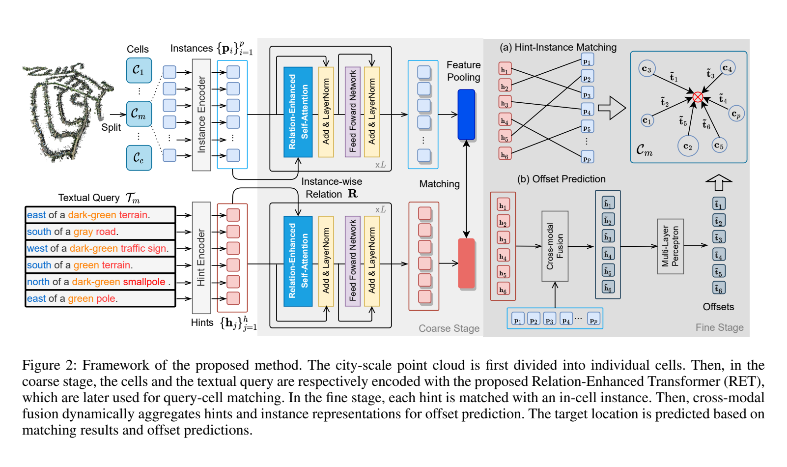

**原文**: [本地](../论文原件/TER.pdf)

# 一句话记忆

本文提出 RET：粗阶段以 RSA 把点云实例间的几何位移、文本 hints 间的成对关系显式写入表示，提升 cell 检索判别力；细阶段用 CMR 先训练匹配器、再冻结匹配器训练偏移回归器，以减少噪声中间匹配对回归的干扰。

# 研究问题

## 以前的方法

大尺度点云定位通常在城市级别展开。传统方法（如 Text2Pos）常采用 coarse-to-fine 两阶段定位：在粗检索阶段寻找潜在的 3D 子地图区域（Cells），在细定位阶段通过显式匹配文本描述与点云实例（Hints-to-Objects）来估算位移。

## 存在的问题

1. **地标实例的重复性与歧义性（Instance Repetitiveness）**：在城市级别的大尺度点云中，高度相似的局部地标（如“一棵树”、“一根电线杆”、“一面墙”）在多个不同的区域重复出现。仅以孤立实例的语义特征做检索，模型容易识别出错误的候选区域。
2. **文本线索的孤立与关联缺失（Linguistic Separation）**：自然语言查询通常是将多个环境提示（Hints）分句陈述（如“在我东侧有一棵树，在我北侧有一条路”）。在特征提取时，模型往往单独编码每个 Hint，忽略了它们之间内在的空间和语义拓扑关联。
3. **匹配与回归的联合优化困难**：在细定位阶段，同时进行“描述-实例匹配”和“相对坐标偏移量预测”两个截然不同的任务，会导致严重的梯度竞争和不稳定性（特别是在训练初期 matcher 尚未收敛时，Regressor 会在噪点匹配上发生过拟合）。

## 论文试图解决什么

如何在大尺度 3D 文本定位中显式建立地标实例（以及文本提示）之间的空间几何与语义关系编码，以增强特征的辨识度；同时，如何稳定细定位阶段的“匹配-回归”多任务学习过程。

# 核心洞察

- **研究洞察**：
  1. **拓扑关系是最佳辨识符 (Explicit Relation Encoding)**：虽然“一棵树”在城市里有成百上千棵，但“一棵树在一条灰色马路的东侧，且距离其 5 米”这种相对空间几何关系在局部区域通常是唯一的。在自注意力交互中，必须将这种两两实例之间的拓扑关系矩阵显式编码进多模态表征中。
  2. **级联解耦策略 (Cascaded Matching & Refinement)**：匹配与回归在时间尺度上存在依赖关系。应当在训练中将它们解耦为级联关系：先训练 hint-instance 匹配器（利用 Optimal Transport 形式），在匹配器收敛后再引入偏移回归器，并基于置信度过滤噪声匹配，能显著稳定训练过程。

- **工程实现**：
  1. **Relation-Enhanced Self-Attention (RSA, 关系增强自注意力)**：修改了经典 Self-Attention 结构，在计算 Value 向量时，显式融入两两节点（实例或 hints）之间的三维空间位移向量编码或文本 Token 拼接编码，使注意力图天然感知空间几何拓扑。
  2. **Cascaded Matching and Refinement (CMR, 级联匹配与细化)**：先训练 SuperGlue/OT 匹配器；随后固定 matcher，以匹配结果训练 cross-attention + MLP 偏移回归器。推理时只使用置信度 $>0.2$ 的匹配，并按置信度归一化加权各位置估计。

- **普通组件**：
  - 文本 hint 使用可学习词嵌入编码；点云实例骨干为 PointNet++；匹配器沿用 SuperGlue/OT，偏移头为 3 层 MLP。论文没有使用 T5 或 RoBERTa。

# 方法流程

方法流程的总体框架见首图 。

- **1. 粗检索阶段 (Coarse Stage: Relation-Enhanced Transformer)**：
  - *数据准备*：点云划分为 Cells，利用 PointNet++ 提取 Cells 内的物体实例特征 $\{P_i\}$，利用文本编码器提取 hints 语义特征 $\{H_j\}$。
  - *关系计算*：
    - 点云支：计算实例 $i$ 和 $j$ 的质心几何位移 $c_i - c_j$，经投影矩阵转化为关系矩阵 $R^V_{ij}$。
    - 文本支：拼接提示 $i$ 和 $j$ 的特征 $[h_i; h_j]$，经投影矩阵转化为关系矩阵 $R^L_{ij}$。
  - *RET 编码*：分别将特征与关系送入 RET，使用关系增强自注意力 (RSA) 深度学习拓扑关系。
  - *检索*：计算最终文本全局表征 $T_m$ 与 Cell 表征 $C_m$ 的余弦相似度，利用 Pairwise Ranking Loss 训练并检索出 Top-$k$ 个 Cell。

- **2. 细定位阶段 (Fine Stage: Cascaded Matching & Refinement)**：
  - *第一步：最优传输匹配*：在检索到的 Cell 范围内，利用 SuperGlue 匹配器计算 hint-instance 的跨模态最优传输匹配概率，得到匹配对及其置信度 $w_i$。
  - *第二步：偏移回归与整合*：对每个置信度 $> 0.2$ 的匹配对，计算跨模态融合特征并送入 MLP 回归器，预测从实例中心 $c_i$ 指向 target 坐标的相对偏移 $\hat{t}_i = (\Delta x, \Delta y)$。
  - *最终输出*：以置信度为权重对所有预测位置进行求和平均，计算出最终绝对 2D 定位点 $\hat{g} = (x, y)$。

# 关键模块

- **Relation-enhanced Self-Attention (RSA, 关系增强自注意力算子)**
  - 输入：Query $Q$、Key $K$、Value $V$、关系张量 $R \in \mathbb{R}^{N \times N \times d}$
  - 输出：拓扑增强后的节点表征矩阵
  - 作用：在点积注意力矩阵乘回 Value 时，将沿维度 1 进行平均池化后的关系张量 $\text{Pool}(R,1)$ 直接加回 Value 上。
  - 为什么需要：传统的注意力机制仅通过点乘计算节点间的相似度权重，无法保留两两节点之间的物理相对位移向量。RSA 显式地将空间拓扑方向和距离融入特征中。
  - 去掉后可能发生什么：模型退化为常规 Transformer，无法有效区分布局不同但地标相同的对称区域，导致在大尺度 VPR 上的 Top-1 检索召回率大幅下跌。

- **Cascaded Matching and Refinement (CMR, 级联匹配与细化策略)**
  - 作用：在细定位时，先独立训练基于 Optimal Transport 的匹配器，稳定后再引入偏移回归器，并基于置信度门限（0.2）过滤无效或低置信度的匹配特征。
  - 为什么需要：彻底解决了多任务联合学习时的优化竞争，防止回归器被前期的匹配噪点带偏而导致模型不收敛。
  - 去掉后发生什么：联合训练时验证集 matcher precision/recall 为 86.67/87.59，级联训练为 92.18/93.01；回归验证误差从 9.15 增至 10.01（Tables 4–5）。论文未把这一消融报告成“Recall@5m 下滑超过 5%”。

# 训练目标或核心公式

- **关系增强自注意力 (RSA) 公式**：
  $$RSA(Q, K, V, R) = \text{Softmax}\left(\frac{Q K^T}{\sqrt{d}}\right) (V + \text{Pool}(R, 1))$$
  其中 $R_{ij} \in \mathbb{R}^d$ 代表第 $i$ 个和第 $j$ 个节点的关系嵌入。

- **点云空间位移关系定义**：
  $$R^V_{ij} = W^V (c_i - c_j)$$
  其中 $c_i, c_j \in \mathbb{R}^3$ 是 3D 实例的中心坐标， $W^V \in \mathbb{R}^{d \times 3}$ 是可学习权重。

- **语言提示语义关系定义**：
  $$R^L_{ij} = W^L [h_i; h_j]$$
  其中 $[h_i; h_j]$ 代表两个 Hints 的特征拼接， $W^L \in \mathbb{R}^{d \times 2d}$ 是可学习权重。

- **粗检索两阶段 Pairwise Ranking 损失**：
  $$L_{coarse}=\sum_m\sum_{n\ne m}[\alpha-\langle C_m,T_m\rangle+\langle C_m,T_n\rangle]_+ + \sum_m\sum_{n\ne m}[\alpha-\langle T_m,C_m\rangle+\langle T_m,C_n\rangle]_+.$$
  - **公式作用**：双向约束 cell→text 与 text→cell，使正对相似度至少比批内负对高一个 margin $\alpha$。

# 实验证明了什么

- **实验问题 1：RSA 显式合并空间/语义关系对检索精度的提升？**
  - **比较对象**：RET 架构中消去空间关系（w/o geometry relation）、消去文本关系（w/o linguistic relation）的 ablation。
  - **观察结果**：无两类关系时 Recall@1/3/5 为 0.11/0.24/0.32；仅语言关系为 0.14/0.28/0.37；仅视觉几何关系为 0.16/0.30/0.40；两者同时使用为 0.18/0.34/0.44（Table 2）。
  - **支持的结论**：显式注入实例间的相对空间相对位移和 Hints 间的语义拓扑，能极大地增强跨模态对齐的判别力。

- **实验问题 2：级联匹配与细化策略 (CMR) 对比单阶段联合学习的优势？**
  - **比较对象**：使用单阶段联合匹配回归网络（如 Text2Pos 原始架构）。
  - **观察结果**：完整管线在 Top-1、$\epsilon<5$m 时为验证集 0.19、测试集 0.16；Text2Pos 为 0.14、0.13（Table 1）。更直接的 CMR 证据是 matcher 与回归误差消融，而不能把整条管线增益全部归因于 CMR。
  - **支持的结论**：级联训练、cross-attention 与置信度加权均降低回归误差；完整系统提升还同时包含粗阶段 RET 的贡献。

# 局限与失效场景

- **重复场景仍会击穿粗检索**：论文 Fig. 4(f) 的失败案例中，Top-3 都是远离真值的负 cell，但包含与真值相似的实例；显式关系提升了判别力，并没有消除低多样性带来的歧义。
- **细阶段仍依赖显式匹配和标签化实例**：匹配错误会继续传递到回归器；CMR 只是通过训练顺序与置信度过滤减轻噪声。跨数据集、自由语言和无语义标签点云未评测。

# 与其他论文的关系

## 前置基础

- [[PointNet++]]：作为提取 Cell 内部 3D 实例特征的底层 Backbone（`uses-as-backbone`）。
- [[Text2Pos]]：提供了双阶段 Coarse-to-Fine 定位的基本管线逻辑（`builds-on`）。

## 同任务工作

- [[MNCL]]：同样进行文本到点云的绝对定位，MNCL 基于 RET (TER) 建立的框架，通过多级负对比学习进一步优化了对于歧义位置的排除召回率（`improves`）。
- [[Text2Loc]]：同样在 KITTI360Pose 上进行定位，但 Text2Loc 在细定位阶段使用级联交叉注意力 Transformer (CCAT) 进行免匹配的坐标回归，而 RET 采用 SuperGlue 进行显式 hint-instance 匹配和 offset 预测（`peer-work`）。

# 对我的课题的启发

`[AI分析]`

1. **相对几何边编码 (RSA 思想)**：我们在做自车局部 BEV 地图与车端历史定位匹配时，车道的绝对 GPS 会漂移，但局部建筑物、交通灯之间的**相对距离和方位向量**是绝对不变的。我们可以直接借用 RSA 的设计：在计算车道线自注意力特征时，将周围 3D 地标的相对位移 $\Delta c = c_i - c_j$ 投影加到 Value 向量上，这样提取的 BEV 全局特征就自动融入了鲁棒的局部物理结构特征，对自车运动抖动具有极强的抗扰性。
2. **多源线索解耦回归**：当面临文字描述极为繁杂的长文本（如“自车东侧有一排栏杆，前方有一个公交站，公交站旁有大树”）时，不要直接用单层 Transformer 进行一锅端的端到端坐标预测。应该按照 CMR 策略，先识别出栏杆、车站、大树三个独立地标的位置，分别预测出自车相对于这三个物体的局部 Offset，最后以语义匹配置信度加权求和，这在数学上能显著提高微定位的鲁棒性。

# 主动回忆问题

## Level 1：主线恢复

- 什么是 RSA（关系增强自注意力）？它是如何将实例间的 pairwise 拓扑关系加回自注意力计算中的？
- 在细定位阶段，级联匹配与细化（CMR）策略是如何将“匹配”与“回归”两个任务解耦并级联执行的？

## Level 2：机制理解

- 点云和文本模态在 RSA 中使用的“关系矩阵”分别是如何计算和编码的？
- 在细定位预测最终坐标 $\hat{g}$ 时，为什么要设定一个 0.2 的置信度门限？去掉该门限会有什么负面影响？

## Level 3：批判与迁移

- 论文中的 RSA 在计算 Value 时是直接把 $\text{Pool}(R, 1)$ 加在 $V$ 上。如果我们将这个相对几何关系 $R$ 也编码进 Attention Map（即作用在 $Q K^T$ 上，类似 Relative Position Bias），这两种做法在物理直觉上有什么不同？对于大尺度点云定位，你认为哪种形式更能捕获局部几何边界？

# 尚未解决的问题

- 如何在不依赖显式 hint-instance 匹配的情况下保留关系建模优势，以及如何在重复场景中进一步提高粗检索判别力。

## 理解更新记录

- `2026-07-12`：由 AI 基于论文原件 PDF 自动生成并归档初始版本笔记。
