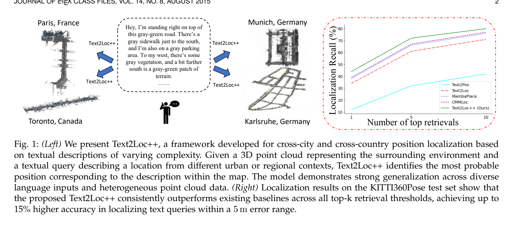
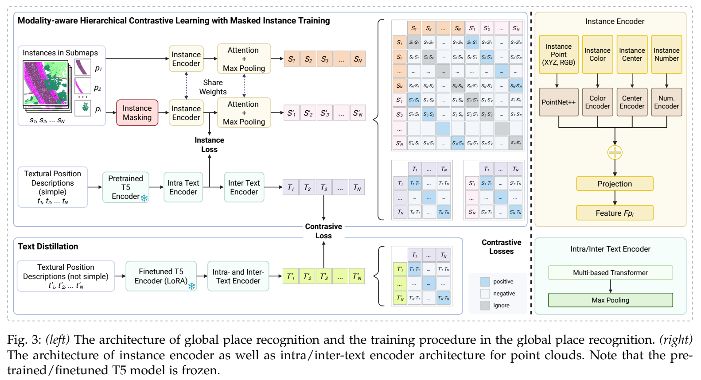
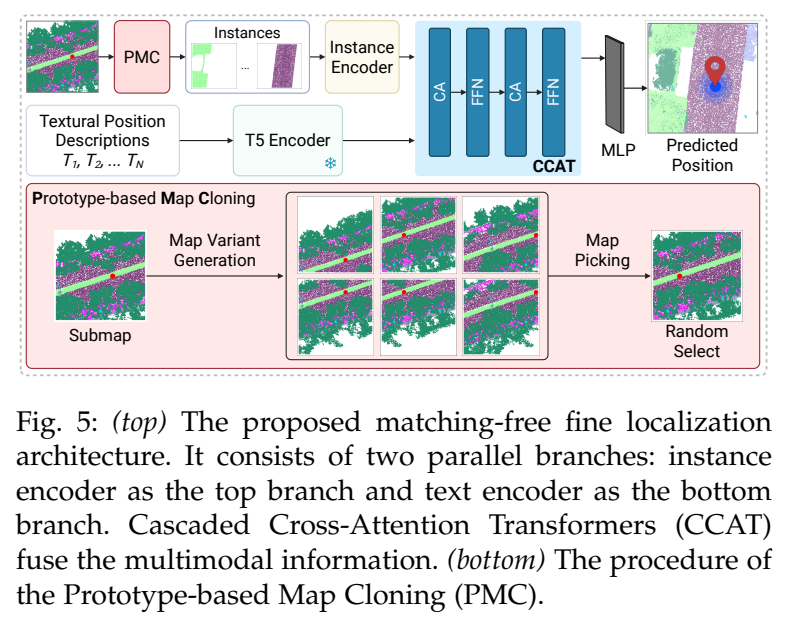

**原文**: [本地](../论文原件/Text2Loc++.pdf)

# 一句话记忆

Text2Loc++ 将 [[Text2Loc]] 的免匹配 coarse-to-fine 框架扩展到跨城市、跨传感器及复杂语言：粗阶段用 MIT + MHCL 处理多对多弱对应，并用文本蒸馏适配 moderate/complex 描述；细阶段沿用 PMC + CCAT 直接回归坐标。

# 研究问题

## 以前的方法

[[Text2Pos]] 与 RET 使用显式 hint-instance 匹配；[[Text2Loc]] 已经提出 PMC + CCAT 的免匹配细定位。Text2Loc++ 的新增重点是更可靠的全局检索、复杂文本适配和跨数据集泛化，而不是首次提出免匹配回归。

## 存在的问题

1. **文本与场景的多对多对应歧义**：一个子地图（Submap）通常含有大量无关背景，只在文本中提及少部分地标；而一个文本往往也能对应多个相似的子地图。传统对比对齐将配对文本与含无关背景的完整子地图做拉近，会造成严重特征污染（Many-to-many cross-modal matching anomaly）。
2. **显式地标匹配（Hints-to-Objects matching）脆弱且耗时**：自然语言存在极大的表述多样性和歧义性，显式的文本-物体匹配器不仅极其复杂、增加了推理延迟，而且一旦中间匹配出错（比如匹配错了相似的电线杆），最终的平移估计就会彻底失败。

## 论文试图解决什么

如何在不建立任何显式文本-实例匹配的条件下，开发一个轻量、高效且泛化性强的大尺度文本-点云定位系统，并解决多模态对齐中由于无关物体引入的 many-to-many 特征污染。

# 核心洞察

- **研究洞察**：
  1. **免匹配精细定位（Matching-free Fine Localization）**：完全放弃显式的 Hint-to-Instance 离散匹配。采用级联交叉注意力 Transformer (CCAT) 对子地图实例集合特征与文本表征进行双向逐层特征交互，利用多层 MLP 直接回归估计坐标。这不仅规避了匹配错误造成的定位崩溃，还大幅精简了网络结构与推理延迟。
  2. **被掩码实例训练（MIT）的分布折中**：训练时始终保留文本提及的实例，并从未提及实例中随机保留一个子集，得到 masked submap。它既减少无关背景，又避免训练时“只保留提及物体”、测试时面对完整子地图造成的分布错位。

- **工程实现**：
  1. **多模态层次化对比学习（MHCL）**：构建包含：(a) 跨模态 $T-S'$ 对齐损失；(b) 实例级文本-3D物体对齐损失 $L_{inst}$；(c) 模态内的子地图-Masked子地图双对比损失 $L_{submap}$ ；(d) 文本间的自对比损失 $L_{text}$ 的联合目标函数。这极大地规范了联合嵌入超球面的分布结构。
  2. **原型地图克隆（PMC）数据增广**：在训练时，对于给定的 (text, submap) 对，在其真值坐标周围的一定平面邻域内，克隆并生成一系列包含不同实例偏差的邻居子地图变体，并在训练中随机选取以增加定位样本的丰富度。
  3. **复杂文本蒸馏（Text Distillation）**：将位置描述分为 Simple、Moderate 和 Complex 三个层级。以处理 Simple 文本的 T5 编码器特征为 Teacher，通过对比蒸馏拉近 Moderate/Complex 下 LoRA 微调 T5 编码器的特征，使模型适应极其复杂和随意的自然界语言描述。

- **普通组件**：
  - 3D 骨干采用 PointNet++；语言模型采用 T5 Encoder + LoRA；实例融合采用多头自注意力。

# 方法流程

方法流程的总体框架见首图 。

- **1. 粗检索阶段 (Global Place Recognition)**（参见下面 ）：
  输入描述文本 $T$ 经 T5 + 层次化 Transformer (HTM) 提取全局文本特征 $\rightarrow$ 输入 3D 子地图，PointNet++ 提取 3D 物体实例并融合其 RGB、坐标和点数 $\rightarrow$ 经被掩码实例训练（MIT）去除噪声 $\rightarrow$ 注意力聚合输出全局子地图嵌入 $S'$ $\rightarrow$ 计算 $T$ 与 $S'$ 相似度，检索 Top-k 候选子地图。

- **2. 细定位阶段 (Fine Localization)**（参见下面 ）：
  提取候选子地图的 in-cell instances 几何特征集合 $\rightarrow$ 利用级联交叉注意力 (CCAT) 双向交叉融合：第一层以 3D 实例作为 Query，文本特征作为 Key/Value ；第二层以文本特征作为 Query，第一层得到的 3D 实例特征作为 Key/Value $\rightarrow$ 重复 CCAT 模块 $\rightarrow$ 经过 MLP 投影直接回归预测 final pose $(x, y)$。

# 关键模块

- **级联交叉注意力 Transformer (CCAT)**
  - 输入：子地图实例特征集合 $\{F_{p_i}\}$，描述句文本特征 $\{F_T\}$
  - 输出：双向深度交互后的融合多模态向量 $F_{fuse}$
  - 作用：由两层交叉注意力（CA）串联构成。第一层 CA 让点云物体感知文本语义，第二层 CA 让文本吸收物体空间几何布局，实现阶梯式双向跨模态注意力融合。
  - 为什么需要：彻底取代了传统繁琐的最优传输（OT）局部对齐模块，避免了对地标进行显式关联时的高计算开销与容错率差的问题。
  - 去掉后可能发生什么：模型无法深度融合语言语义与 3D 点云布局，不能支持直接的平面坐标回归。

- **原型地图克隆 (Prototype-based Map Cloning, PMC)**
  - 输入：当前子地图 $s_i$ 与真值目标位置 $c_i$
  - 输出：克隆生成的邻近 submap 变体集合 $G_i$
  - 作用：在训练时通过对位置进行轻微抖动，搜索并克隆符合物体分布数量阈值的邻居子地图，构建多重训练变体。
  - 为什么需要：室外点云中定位的真值坐标（自车轨迹点）与周围地标的空间关系存在大量重合。PMC 为网络回归提供了丰富的定位姿态负样本。
  - 去掉后可能发生什么：微定位回归网络极易在有限的自车轨迹坐标点上发生严重过拟合，对实际非轨迹点（如人行道、绿化带）的定位泛化精度明显下降。

# 训练目标或核心公式

联合层次对比对齐损失：

$$\mathcal{L} = \alpha_1 \mathcal{L}_{cross-modal} + \alpha_2 \mathcal{L}_{inst} + \alpha_3 \mathcal{L}_{submap} + \alpha_4 \mathcal{L}_{text}$$

其中，通过随机掩码实例训练（MIT）构建的子地图跨模态损失为：

$$\mathcal{L}_{cross-modal} = -\frac{1}{N} \sum_{i \in \mathcal{N}} \left[ \log \frac{e^{T_i \cdot S'_i/\tau}}{\sum_j e^{T_i \cdot S'_j/\tau}} + \log \frac{e^{S'_i \cdot T_i/\tau}}{\sum_j e^{S'_i \cdot T_j/\tau}} \right]$$

其中 $S'_i$ 包含全部被文本提及的实例，以及从未提及实例中随机保留的子集；它不是“仅包含文本涉及实例”。

子地图模态内的双对比损失（ld）为：

$$\mathcal{L}_{submap} = \frac{1}{N} \sum_{i \in \mathcal{N}} l_d(i, S', S)$$

$$l_d(i, S', S) = -\log \frac{e^{S_i \cdot S'_i/\tau}}{\sum_j e^{S_i \cdot S'_j/\tau} + \sum_{j \neq i} e^{S'_i \cdot S'_j/\tau}} - \log \frac{e^{S'_i \cdot S_i/\tau}}{\sum_j e^{S'_i \cdot S_j/\tau} + \sum_{j \neq i} e^{S_i \cdot S_j/\tau}}$$

- **优化目标**：最小化 $\mathcal{L}$。拉近配对文本与被掩码子地图；在模态内，拉近完整子地图与其自身的 Mask 变体表征，并推远不同的完整子地图嵌入；从而建立对噪点鲁棒且高度分离的模态联合嵌入。

# 实验证明了什么

- **实验问题 1：Text2Loc++ 对不同语言复杂度的泛化能力？**
  - **比较对象**：Text2Pos, Text2Loc, MambaPlace, CMMLoc 等。
  - **观察结果**：KITTI360Pose 的 complex 文本下，Text2Loc++ 粗检索 Recall@1/3/5 为 27.9/48.1/57.5（Table 7）。论文也明确指出，complex 输入仍比 simple 低约 10 个百分点，复杂句式、冗余内容与非平行语法仍难处理。
  - **支持的结论**：文本蒸馏技术（LoRA-T5）和免匹配 CCAT 机制使其在处理多变、随意、包含冗余和缺省信息的自然界人机交互指令时表现出强悍的抗噪泛化力。

- **实验问题 2：Masked Instance Training (MIT) 对 many-to-many 检索的增益？**
  - **比较对象**：使用 vs 不使用 MIT。
  - **观察结果**：在 simple 文本的默认模型中，去掉 MIT 后 Recall@1/3/5 从 35.3/57.6/66.9 降至 32.1/53.5/62.6；若训练时只保留显式提及实例，则进一步降至 10.1/21.3/28.5（Table 5）。Moderate 文本 22.7→34.0 对应的是“是否使用文本蒸馏”（Table 7），不能归因于 MIT。
  - **支持的结论**：有针对性地掩盖非提及实体是打通 many-to-many 弱对齐跨模态检索的决定性步骤。

# 局限与失效场景

- **复杂文本仍有明显退化**：即使使用 MIT、MHCL 和文本蒸馏，complex 输入仍比 simple 低约 10 个百分点；论文将其归因于冗余信息和交织句式难以筛选（Sec. 6.3）。
- **颜色与位置分支都重要**：默认配置 Recall@1 为 35.3；去颜色为 26.0，去位置为 21.0（Table 8）。这证明模型依赖这些输入分支，但不能概括成“所有无色数据均腰斩”。
- **跨域改进依赖额外数据**：refinement 设置加入 Paris CARLA、Lille、TUM 的少量训练数据后改善未见域；完全零样本跨城市仍显著受点云分布和文本复杂度影响。

# 与其他论文的关系

## 前置基础

- [[Text2Pos]]：本模型继承了其在大尺度城市下划分单元做 coarse-to-fine 本地定位的管线思想（`builds-on`）。
- [[Text2Loc]]：Text2Loc++ 的会议论文版本，扩展了多城市泛化性并增加了文本蒸馏（`builds-on`）。

## 同任务工作

- [[MambaPlace]]：利用先进的选择性状态空间模型 (Mamba) 替代 Transformer 进行序列化地点识别的平行工作（`peer-work`）。
- [[科研/论文/memory/CMMLoc]]：利用 Cauchy 混合模型（CMM）对文本局部重合度进行建模，替代 MIT 的平行工作（`peer-work`）。

# 对我的课题的启发

`[AI分析]`

1. **免匹配设计理念的迁移**：我们在设计 3D BEV 定位微调时，应避免使用复杂的 Bounding Box 关联（如匈牙利匹配）。可以直接使用 CCAT 架构，让 BEV 视觉特征作为 Key/Value，文本位置描述作为 Query，通过 Cascaded Cross-Attention 逐层自适应融合，最终由极简的 MLP 输出自车坐标 $x, y$，大幅降低算法部署耗时。
2. **无关实体的主动 Mask**：在训练 3D 跨模态模型时，点云包含整幅 BEV 场景，而自然语言只提及了自车附近的局部特征。我们应当根据文本提及的词，自动检测并 mask 点云中在 $15m$ 范围之外的非提及地标（stuff/instances），防止对比特征污染。

# 主动回忆问题

## Level 1：主线恢复

- 简述 Text2Loc++ 中“免匹配”细定位的工作原理。它是如何替代 Text2Pos 中的 hints-to-instances OT 匹配的？
- 什么是被掩码实例训练（MIT）？它是为了解决跨模态对齐中的什么问题？

## Level 2：机制理解

- 级联交叉注意力（CCAT）中，两个 Cross-Attention 模块的 Query、Key 和 Value 分别是什么？其两级级联顺序是如何设计的？
- 原型地图克隆（PMC）在训练中起到了什么作用？它是如何利用位置抖动增强模型鲁棒性的？

## Level 3：批判与迁移

- 为什么在丢失颜色信息（No-color point clouds）后，3D 文本定位的 Recall 会出现非常明显的暴跌？在真实的自动驾驶车辆部署中，这会带来什么安全风险？我们应当如何设计备份系统？

# 尚未解决的问题

- 如何进一步缩小 complex 与 simple 描述之间的差距，并降低对颜色、绝对位置编码及额外跨域训练数据的依赖。

## 理解更新记录

- `2026-07-12`：由 AI 基于论文原件 PDF 自动生成并归档初始版本笔记。
