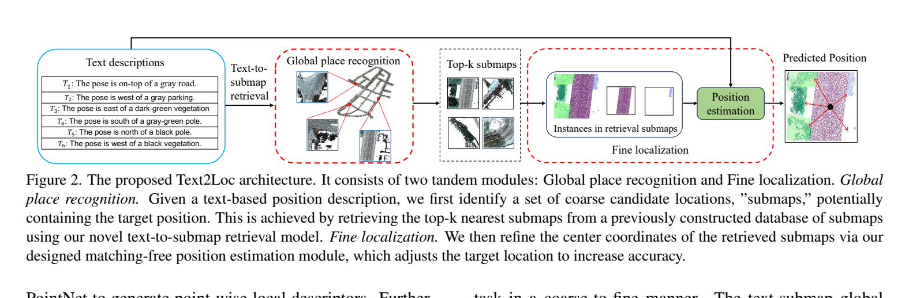
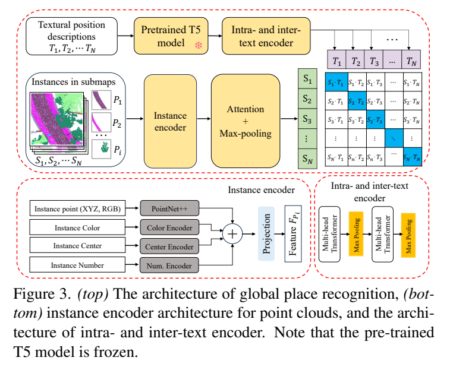
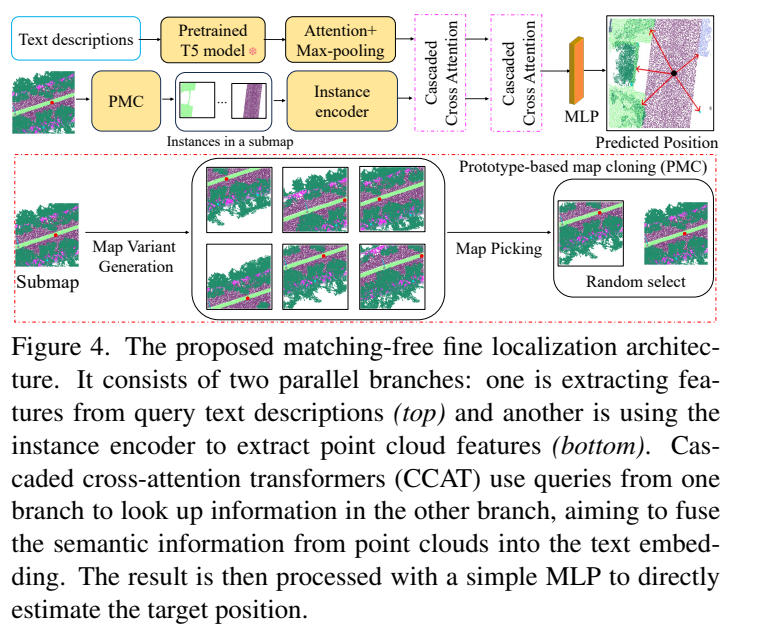

**原文**: [本地](../论文原件/Text2Loc.pdf)

# 一句话记忆

Text2Loc 在 [[Text2Pos]] 的 coarse-to-fine 框架上，把粗阶段升级为 T5 + 层次文本编码器驱动的跨模态对比检索，并在细阶段用 PMC 增广与 CCAT 融合直接回归 $(x,y)$，不再执行 hint-to-instance 的离散匹配。

# 研究问题

## 以前的方法

3D 点云定位主要依赖视觉图像（相机）或激光雷达（LiDAR）的特征匹配（如 SCAN-to-Map）。而使用自然语言描述（如 "在绿色的建筑物西侧..."）来实现绝对定位则少有探索。

## 存在的问题

以 Text2Pos 为代表的方法采用 coarse-to-fine 两阶段管线，但在细定位阶段，它们在文本地标描述与点云实例（Hints-to-Objects）之间建立显式的局部对齐匹配（采用最优传输 OT 算法等）。这存在如下问题：

1. **显式匹配形成误差链**：先匹配 hint 与实例、再按匹配结果回归偏移；错误关联会污染后续坐标估计，并引入 SuperGlue/Sinkhorn 的计算开销。
2. **粗检索表征不足**：LSTM 与 pairwise ranking loss 对句内/句间关系和跨模态批内负样本利用有限，难以区分重复的城市子地图。

## 论文试图解决什么

如何开发一个轻量、高效且泛化性强的大尺度 3D 文本定位系统，在不建立任何显式文本-实例局部对齐匹配的前提下，实现端到端的平面 2D 坐标回归。

# 核心洞察

- **研究洞察**：
  1. **免匹配细定位 (Matching-free Fine Localization)**：直接将场景 3D 物体实例的特征集合与文本语义进行高维交叉融合，利用级联交叉注意力 (CCAT) 进行双向自适应交互，规避脆弱的离散物体对齐，直接由 MLP 回归输出 $(x, y)$ 坐标。
  2. **跨模态联合对比学习**：引入对比学习损失（Contrastive Loss），在联合超球面上直接拉近配对文本与 3D 子地图全局特征，推远非配对特征，比 Pairwise Ranking Loss 具有更强的跨模态检索约束。

- **工程实现**：
  1. **级联交叉注意力 Transformer (CCAT)**：相比于平行的双向注意力，CCAT 采用串联阶梯式结构：CAT1 以 3D 特征为 Query、文本特征为 Key/Value 以引导点云特征感知文本；CAT2 以文本为 Query、CAT1 得到的增强点云为 Key/Value 进一步聚合，最终实现深层融合。
  2. **原型地图克隆 (PMC)**：PMC 并非凭空“抖动生成”点云，而是在已有数据库中选邻近子地图：其中心与原子地图中心的 $L_\infty$ 距离小于 15 m，且与真值位置的距离小于 12 m；过滤掉实例缺失过多的候选后随机取一个训练。

- **普通组件**：
  - 3D 实例提取骨干采用 PointNet++；文本编码采用预训练的 T5-Encoder。

# 方法流程

方法流程的总体框架见首图 。

- **1. 粗检索阶段 (Global Place Recognition)**（见下图 ）：
  - 文本支：描述文本经 T5 提取特征。
  - 点云支：3D 场景划分为 3D submaps $\rightarrow$ PointNet++ 提取 3D 实例并将其语义（Semantic）、颜色（Color）、位置（Position）和数量（Quantity）特征拼接 $\rightarrow$ 经注意力与最大池化聚合成子地图全局 descriptor $F_S$。
  - 相似度度量：计算文本与子地图余弦距离，进行 Top-k 检索。

- **2. 细定位阶段 (Fine Localization)**（见下图 ）：
  - 数据增广：在训练阶段对检索出的 submap 使用 PMC 模块进行地图变体生成。
  - 多模态融合：利用两组级联的交叉注意力 Transformer (CCAT) 对文本语义和子地图内的 3D 实例特征进行双向多层交互。
  - 坐标回归：将交互后的多模态特征输入 3 层 MLP 直接预测定位姿态坐标 $C_{pred} = (x, y)$。

# 关键模块

- **级联交叉注意力 Transformer (CCAT)**
  - 输入：点云实例特征 $\{F_{p_i}\}$ 和文本特征 $\{F_T\}$
  - 输出：深度交互后的多模态表征
  - 作用：由 CAT1 和 CAT2 串联构成。第一层 CAT1 让 3D 点云感知文本，第二层 CAT2 让文本感知空间几何，双向自适应交互。
  - 为什么需要：彻底取代了 hints-to-objects 的显式地标匹配（如最优传输），让网络在不进行匹配的条件下端到端回归坐标。
  - 去掉后可能发生什么：模型退化为简单的单向拼接注意力，无法有效对齐地标的相对方位描述，导致细定位 Recall 显著下跌。

- **原型地图克隆 (PMC)**
  - 输入：子地图 $S_i$ 和 ground-truth 位置 $c_i$
  - 输出：邻域变体子地图集合 $G_i$
  - 作用：从目标附近已有子地图中选择不同裁剪/中心的地图变体，增加细定位训练时的实例组合变化。
  - 为什么需要：室外点云中 true location 与周围地标的关系非常多变，PMC 为细定位网络回归提供了丰富的定位负样本和微调样本，防止过拟合。
  - 去掉后可能发生什么：微定位回归模型在有限的自车轨迹点上发生过拟合，对实际复杂城区测试场景的泛化精度显著下降。

# 训练目标或核心公式

- **粗检索跨模态对比损失 (Contrastive Loss)**：
  $$l(i, T, S) = - \log \frac{e^{F^T_i \cdot F^S_i / \tau}}{\sum_j e^{F^T_i \cdot F^S_j / \tau}} - \log \frac{e^{F^S_i \cdot F^T_i / \tau}}{\sum_j e^{F^S_i \cdot F^T_j / \tau}}$$
  其中 $F^T_i$ 和 $F^S_i$ 是匹配的文本-子地图对，$\tau$ 是可学习的温度系数。

- **细定位坐标回归损失 (MSE)**：
  $$L(C_{gt}, C_{pred}) = \|C_{gt} - C_{pred}\|^2$$
  其中 $C_{pred}$ 是预测的相对平移坐标 $(x, y)$，通过 Mean Squared Error 直接监督。

# 实验证明了什么

- **实验问题 1：Text2Loc 粗检索的效果如何？**
  - **比较对象**：使用 Pairwise Ranking Loss 训练的 baseline。
  - **观察结果**：完整模型的检索 Recall@1 为验证集 0.32、测试集 0.28；把对比损失换回 pairwise ranking loss 后分别为 0.21、0.20，即论文报告相对提升 52% 和 40%（Table 3）。
  - **支持的结论**：引入多模态对比学习极大地增强了语言与 3D 点云场景在超球面上的全局特征分布紧凑性。

- **实验问题 2：免匹配细定位对比传统地标匹配的优势？**
  - **比较对象**：使用 OT (Optimal Transport) 显式匹配地标的 baseline。
  - **观察结果**：在 $\epsilon<5$m 时，Top-1 定位 recall 为验证集 0.37、测试集 0.33；RET 对应为 0.19、0.16（Table 1）。测试集细定位网络为 1.06M 参数、2.27 ms，而替换为 matcher 的版本为 2.08M、43.11 ms（Table 5，TITAN X）。
  - **支持的结论**：免匹配设计（CCAT + MLP 直接回归）避免了累积的离散地标匹配错误，对歧义性语言更加鲁棒，且推理高效。

# 局限与失效场景

- **粗检索仍决定上限**：论文的失败案例中 Top-3 均为负子地图，细定位随即无法给出准确坐标；这些负样本虽距离很远，却含有与真值相似的实例（Sec. 6.2）。
- **对描述扰动敏感**：仅改动查询中的一句话，测试集检索 Recall@1 从 0.28 降至 0.15（Table 6）。这说明“免匹配”不等于对错误或矛盾文本鲁棒。
- **颜色依赖需谨慎表述**：实例编码器显式使用 RGB，正文未在主实验表中给出“无颜色即腰斩”的结论；跨传感器、无彩色点云泛化应视为尚未验证，后由 [[Text2Loc++]] 专门评测。

# 与其他论文的关系

## 前置基础

- [[Text2Pos]]：提供了 coarse-to-fine 两阶段点云定位的基本管线（`builds-on`）。
- [[PointNet]]：PointNet++ 用于提取 3D 实例的几何特征（`uses-as-backbone`）。

## 后续改进

- [[Text2Loc++]]：在其基础上引入了掩码实例训练 (MIT) 消除 many-to-many 检索污染，并利用 T5-LoRA 蒸馏解决复杂自然语言泛化问题（`improves`）。

# 对我的课题的启发

`[AI分析]`

1. **城域 3D 语义图定位迁移**：我们在设计基于拓扑图的定位任务时，可以借鉴 Text2Loc 的 coarse-to-fine 管线。粗阶段通过对比学习检索拓扑子图，细阶段完全放弃繁琐的子图节点匹配，直接利用级联交叉注意力融合语义输入特征，通过 MLP 直接回归自车的相对平面坐标 $x, y$，不仅大大降低了算法在移动端边缘设备上的耗时，还能有效抵抗局部节点缺失的噪声。

# 主动回忆问题

## Level 1：主线恢复

- 简述 Text2Loc 的 coarse-to-fine 级联定位流程。
- PMC 模块在细定位训练中起到了什么作用？它是怎么工作的？

## Level 2：机制理解

- 级联交叉注意力 Transformer (CCAT) 是如何交替利用点云和文本作为 Query 来进行双向融合的？
- 为什么 Contrastive Loss 相比传统的 Pairwise Ranking Loss 能带来大幅的检索提升？

## Level 3：批判与迁移

- 为什么在丢失颜色信息后定位准确率会急剧下降？除了提取 RGB 之外，还有什么方案可以增强纯几何 3D 描述定位的鲁棒性？

# 尚未解决的问题

- 对错误、缺失或改写描述的鲁棒性；以及在无 RGB、跨城市和跨传感器点云上的泛化。

## 理解更新记录

- `2026-07-12`：由 AI 基于论文原件 PDF 自动生成并归档初始版本笔记。
