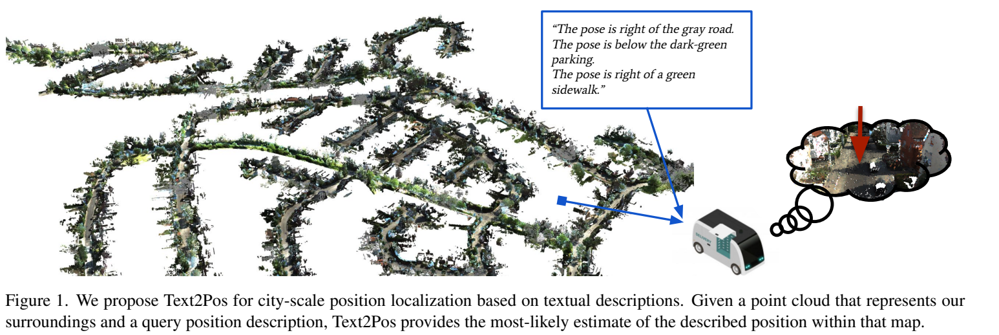
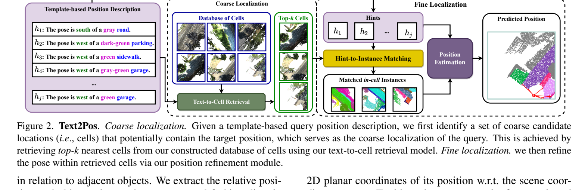
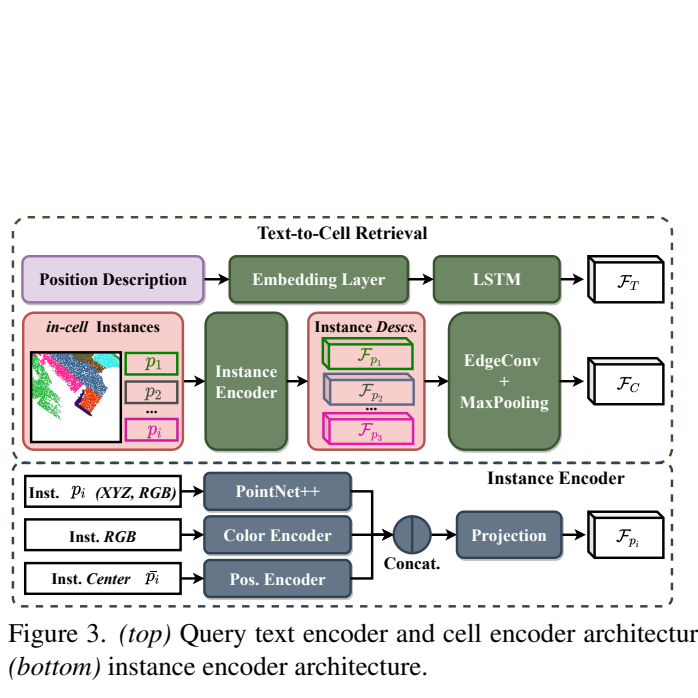

**原文**: [本地](../论文原件/Text2Pos.pdf)

# 一句话记忆

Text2Pos 首次把城市尺度的“自然语言 → 点云坐标”系统化为 coarse-to-fine 问题：粗阶段检索可能包含目标位置的 Top-$k$ cells，细阶段显式匹配 hint 与 cell 内实例，并从每个匹配实例中心预测二维平移，最后平均得到位置。

# 研究问题

## 以前的方法

此前的语言—3D 工作主要研究室内物体指代，如 [[ScanRefer]]、[[ReferIt3D]]：输入场景和描述，输出被指代物体的 3D 框。Text2Pos 研究的不是“找到哪个物体”，而是“在城市点云地图中找到描述者的平面坐标”。

## 存在的问题

1. **缺乏城市尺度大场景定位方法**：在大尺度城市中，没有像室内那样有明确视觉边界的“单个指代目标”，定位需要解读周围一整套地标和空间关系。大尺度点云数据量过于庞大，超出了常规 GPU 的显存限制，无法直接送入网络进行全局重定位。
2. **描述本身具有歧义**：城市中树木、道路、建筑等实例高度重复；论文生成的描述只给出若干邻近物体及其颜色、类别和相对方向，因此同一句话可能匹配多个 cell。

## 论文试图解决什么

如何利用自然语言描述在城市级（大尺度）三维点云地图中预测出高精度的 2D 平面坐标，并构建首个室外文本-3D点云定位数据集 KITTI360Pose。

# 核心洞察

- **研究洞察**：
  1. **先缩小搜索空间，再估计 cell 内位置**：将地图按 $W\times W$ 窗口和步长 $S<W$ 划成重叠 cells；粗检索负责召回候选区域，细定位只处理候选 cell 中的实例。
  2. **匹配地标不等于定位描述者**：hint 说的是目标相对地标的关系，地标中心不能直接当作目标坐标。模型需预测 $\hat t_i$，将实例中心 $\bar p_i$ 变换为位置估计 $\tilde y_i=\bar p_i+\hat t_i$。

- **工程实现**：
  1. **三维物体描述的多重嵌入融合**：对每个三维物体实例 $P_i$，提取包含：(a) PointNet++ 提取的几何/类别语义嵌入；(b) 3层 MLP 提取的 RGB 颜色嵌入；(c) 3层 MLP 提取的中心点坐标 $\bar{P}_i$ 空间嵌入。这三部分拼接后经投影层作为该 3D 实体的统一嵌入。
  2. **最优传输（OT）局部关联**：先以 self-/cross-attention 传播上下文，再用成对相似度作为 OT 代价；推理时仅保留置信度高于 $0.2$ 的部分匹配。

- **普通组件**：
  - 文本特征提取器使用双向 LSTM；3D 点特征聚合使用 EdgeConv 和 PointNet++。

# 方法流程

方法流程的总体框架见首图 。

- **1. Coarse-to-Fine 定位全流程**（参见下面 ）：
  输入自然语言描述 $T$ $\rightarrow$ **Coarse Stage (粗定位)**: LSTM 编码 $T$ 得到 $F_T$，EdgeConv 编码单元 $C$ 得到 $F_C$ $\rightarrow$ 计算 $F_T$ 与 $F_C$ 距离，检索 Top-k 近邻 Cells $\rightarrow$ **Fine Stage (细定位)**: 在候选 Cells 中进行局部 hints 与 3D 物体匹配 $\rightarrow$ 预测平移向量 $\rightarrow$ 平均各匹配点估算坐标，输出 final pose。

- **2. 局部 Hint-to-Instance 匹配与平移回归流程**（参见下面 ）：
  输入 cell 实例特征 $\{F_{p_i}\}$ 与 hints 特征 $\{F_{h_j}\}$ $\rightarrow$ 经过 self-attention 和 cross-attention 聚合上下文 $\rightarrow$ 构建 OT 矩阵计算 partial matches $\rightarrow$ 匹配成功后，对每个匹配 hint 送入 3 层 MLP (Translation Regressor) $\rightarrow$ 预测 $t_i$ 并平移物体中心点 $\tilde{y}_i = \bar{p}_i + t_i$ $\rightarrow$ 算术平均输出估计位置。

# 关键模块

- **投影与融合 Instance Encoder**
  - 输入：物体点云坐标 $(X, Y, Z)$、点颜色 $(R, G, B)$、物体几何中心 $\bar{P}_i$
  - 输出：融合特征维度为 $D_p$ 的物体表征 $F_{p_i}$
  - 作用：合并物体的几何、颜色纹理以及绝对空间位置三种异构特征。
  - 为什么需要：室外物体可能类别相同（如两棵树），但颜色不同（一黄一绿）或位置不同，多源特征拼接保证了地标特征的区分度。
  - 去掉后可能发生什么：模型无法分清颜色不同、位置不同的同类地标，导致匹配混淆，召回率下降。

- **平移回归器 (Translation Regressor)**
  - 输入：与 hint 匹配成功的描述句特征 $F_{h_j}$
  - 输出：二维偏移向量 $t_i \in \mathbb{R}^2$
  - 作用：预测从当前地标中心点 $\bar{p}_i$ 指向用户所在真实位置的平面相对偏移量。
  - 为什么需要：空间介词如 "west of a green garage" 说明真实坐标与地标之间存在明显的空间偏移，地标中心不代表自车/用户坐标。
  - 去掉后发生什么：在使用真实近邻 cell 的隔离实验中，$\epsilon<2$m 的 recall 从 0.24 降至 0.15（匹配实例中心均值）；但在 $\epsilon<5$m 时，cell 中心反而略高于完整细定位，说明该消融只证明平移回归改善严格精度，不能推出它在所有阈值都更优。

# 训练目标或核心公式

粗检索 Pairwise Ranking Loss：

$$\mathcal{L}_{coarse} = \sum_{i} \sum_{j \neq i} [\alpha - \langle F_C^i, F_T^i \rangle + \langle F_C^i, F_T^j \rangle]_+ + \sum_{i} \sum_{j \neq i} [\alpha - \langle F_T^i, F_C^i \rangle + \langle F_T^i, F_C^j \rangle]_+$$

其中 $\alpha$ 为 margin 超参数，$[ \cdot ]_+$ 为首正截断。

细粒度 Loss：

$$\mathcal{L}_{fine} = \mathcal{L}_{match} + \mathcal{L}_{reg}$$

其中 $\mathcal{L}_{match}$ 优化 optimal transport 矩阵的正样本匹配概率；$\mathcal{L}_{reg}$ 为平移向量的均方误差（MSE Loss）：

$$\mathcal{L}_{reg} = \|t_{pred} - t_{gt}\|^2$$

# 实验证明了什么

- **实验问题 1：粗单元划分的滑动 Stride $S$ 对定位 recall 的影响？**
  - **比较对象**：$S = 10m$ vs. $S = 15m$ vs. $S = 20m$。
  - **观察结果**：在 $S=10m$ 时，误差 $\epsilon < 5m$ 的 Top-1 检索召回率为 14%，显著优于 $S=15m$ (10%) 和 $S=20m$ (7%)。
  - **支持的结论**：较密的 Cell 采样是保证粗检索覆盖率和定位精度的重要前提。

- **实验问题 2：Fine Localization 中各组件对精度提升的消融？**
  - **比较对象**：Cell 中心坐标 vs. 匹配实例平均中心 vs. 匹配实例加平移向量。
  - **观察结果**：在 $\epsilon < 2m$ 的高精度误差阈值下，使用 Cell 中心 recall 为 14%，使用实例平均中心 recall 为 15%，而加上学到的平移向量后（Text2Pos）recall 提升到了 24%（Table 3 所示）。
  - **支持的结论**：学到的平移偏置回归（Translation Regressor）对于提高地点微定位的精度起到了核心支配作用。

# 局限与失效场景

- **论文明确承认的前提**：地图必须包含可用作锚点的已标注实例；训练和评测使用自动生成的模板描述，而非自由的人类指令。因此，对无标签点云和真实口语的泛化尚未验证（Sec. 6）。
- **管线瓶颈**：测试集 Top-1、$\epsilon<10$m 的 recall 仅 0.20，扩大到 Top-10 才达到 0.61（Table 6）。论文将这归因于描述可对应多个城市位置；粗检索未召回正确 cell 时，细阶段无法补救。

# 与其他论文的关系

## 后续改进

- [[Text2Loc]]：在其基础上引入 Transformer 强化特征编码并引入全局重采样（`improves`）。
- [[Text2Loc++]]：去除了繁琐的 Optimal Transport 匹配，使用 PMC 与注意力完成直接端到端回归定位（`improves`）。
- [[科研/论文/memory/CMMLoc]]：引入柯西混合模型处理部分重合匹配，解决无关背景的污染（`improves`）。

# 对我的课题的启发

`[AI分析]`

1. **地标平移回归思想在 BEV 定位中的迁移**：当以 BEV 图像与文本描述做匹配时（例如 [[VLM-Loc]]），我们不能直接将图像中心点作为估计坐标。应当借鉴平移回归，针对每个被检索到的关键地标（例如路口、柱子），预测其相对于图像中心点的平面偏差。
2. **数据集扩增的模板法**：对于 KITTI 这种纯激光雷达数据集，可以通过 DBSCAN 聚类 Stuff 类别构建临时 instance（如树丛、围墙），并基于空间拓扑模板自动合成本地化描述，极大降低数据集人工采集成本。

# 主动回忆问题

## Level 1：主线恢复

- 简述 Text2Pos 提出的 coarse-to-fine 定位管线在粗阶段与细阶段分别计算什么？
- KITTI360Pose 数据集是如何在不使用人工标注的情况下自动生成的？

## Level 2：机制理解

- Instance Encoder 分别将点云物体的哪些特征进行了融合？为什么要显式引入颜色嵌入和中心点位置嵌入？
- Translation Regressor 的优化损失是什么？为什么它相比简单的“匹配物体中心算术平均”能大幅提升 $\epsilon < 2m$ 的 recall？

## Level 3：批判与迁移

- 为什么在粗定位单元（Cell）提取时，Stride $S$ 选择得比 Cell 大小 $W$ 还要小？如果将 $S$ 设为与 $W$ 相等会造成什么定位隐患？

# 尚未解决的问题

- 如何把模板化、依赖实例标签的设定扩展到人类自由描述与无标签点云；以及如何用街道名、地址或显著地标消解重复场景中的粗检索歧义。

## 理解更新记录

- `2026-07-12`：由 AI 基于论文原件 PDF 自动生成并归档初始版本笔记。
