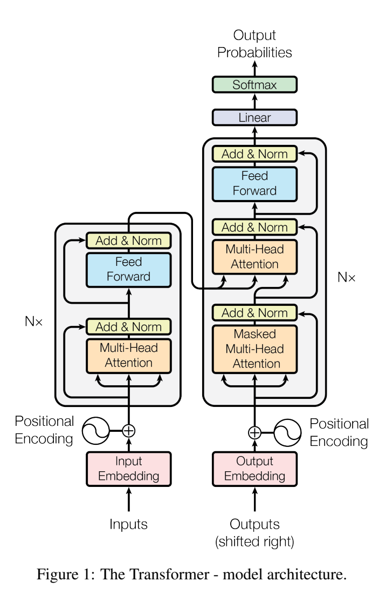
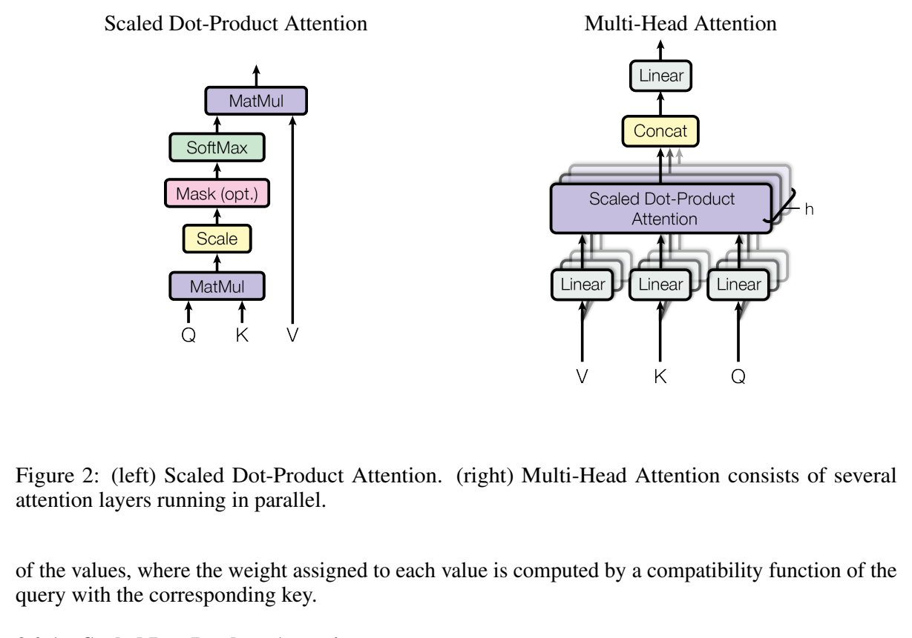

**原文**: [本地](../论文原件/Transformer.pdf) [arXiv](https://arxiv.org/abs/1706.03762)

# 一句话记忆

Transformer 用注意力层和逐位置前馈网络替代编码器—解码器中的循环与卷积：训练时可以并行处理同一序列的各位置，同时把任意两位置间的信息路径缩短为常数级；论文在 WMT 2014 翻译任务上以更低训练成本取得了当时的领先结果。

# 研究问题

## 以前的方法

以前主流的序列建模与序列到序列（Seq2Seq）系统主要基于循环神经网络（如 LSTM, GRU）或卷积神经网络（如 ConvS2S）构建编码器-解码器（Encoder-Decoder）结构。

## 存在的问题

1. **串行计算限制**：RNN 的计算沿着时间步迭代进行（第 $t$ 步计算依赖于第 $t-1$ 步的隐藏状态），这导致模型在训练阶段无法进行大规模并行化，成为处理超长序列时的计算瓶颈。
2. **长距离依赖路径过长**：即使门控循环网络缓解了梯度问题，两个相距很远的位置仍需经过许多顺序步骤才能交换信息。论文关注的是这种路径长度对学习依赖关系的限制，而不是声称 RNN 必然“丢失”所有远程信息。
3. **关联建模困难**：基于卷积神经网络的方法虽然易于并行，但在建模两点之间关系时，所需的计算操作步数随着距离的增长而增长（如 ConvS2S 为 $O(N)$，ByteNet 为 $O(\log(N))$），限制了网络学习长距离关联的效率。

## 论文试图解决什么

设计一个完全摆脱循环与卷积层、完全仅通过自注意力机制（Self-Attention）实现的序列到序列模型。该模型能够在常数步 $O(1)$ 操作内建立序列中任意两个位置之间直接的全局依赖关系，并支持极高程度的并行化训练。

# 核心洞察

1. **自注意力关联 (Self-Attention as Routing)**：通过计算序列中所有元素两两之间的点积注意力权重，使每个单词在一步内都能直接获取序列中任何其他位置的信息，突破了物理距离上的信息传播瓶颈。
2. **多子空间联合注意 (Multi-Head Attention)**：多头设计把查询、键和值投影到不同表示子空间，使模型可以同时关注不同位置与不同类型的关系。论文的消融证明多头优于所比较的单头配置，但“某一头专门表示语法或指代”只能作为解释性观察，不能视为结构保证。
3. **彻底并行化 (Elimination of Recurrence)**：丢弃时间步依赖，使得训练过程中整个序列的特征提取可一次性输入并行计算，极大优化了 GPU 算力利用率，这为后续的超大规模预训练语言模型（LLMs）铺平了道路。

# 方法流程

下图为 Scaled Dot-Product Attention (左) 与 Multi-Head Attention (右) 的结构示意图：

其核心计算与数据流如下：

1. **输入处理**：源序列单词经过 Input Embedding 转换为向量表示，并与代表词语序的位置编码（Positional Encoding）相加，作为编码器的输入。
2. **编码器堆叠 (Encoder Stack)**：
   - 编码器由 $N = 6$ 个相同的层堆叠而成。
   - 每层包含两个子层：**多头自注意力机制 (Multi-Head Self-Attention)** 和 **位置感知前馈神经网络 (FFN)**。
   - 每个子层周围均采用**残差连接 (Residual Connection)** 与**层归一化 (Layer Normalization)**，即输出为 $\text{LayerNorm}(x + \text{Sublayer}(x))$。

3. **解码器堆叠 (Decoder Stack)**：
   - 解码器同样由 $N = 6$ 个相同的层堆叠而成。
   - 每层包含三个子层：
     1. **遮罩多头自注意力层 (Masked Multi-Head Self-Attention)**：采用遮罩（Masking）机制，防止当前解码位置关注到未来的单词，确保预测自回归时的因果逻辑。
     2. **多头交叉注意力层 (Multi-Head Cross-Attention)**：Query 来自解码器前一层的输出，Key 和 Value 则直接来自编码器的全局输出。这一步实现了编码器信息到解码器的流转。
     3. **位置感知前馈神经网络 (FFN)**。

4. **输出预测**：解码器最上层的输出特征经过 Linear 映射层，并通过 Softmax 激活函数预测下一个单词的概率分布。

# 关键模块

- **缩放点积注意力 (Scaled Dot-Product Attention)**
  - 输入：Query $Q \in \mathbb{R}^{n \times d_k}$，Key $K \in \mathbb{R}^{m \times d_k}$，Value $V \in \mathbb{R}^{m \times d_v}$
  - 输出：注意力加权向量 $\text{Attention}(Q, K, V) \in \mathbb{R}^{n \times d_v}$
  - 作用：利用 $QK^T$ 计算 $Q$ 与所有 $K$ 的点乘相似度，再除以缩放因子 $\sqrt{d_k}$ 并进行 Softmax，将归一化后的注意力权重作用于 $V$ 上。
  - 为什么需要：充当元素之间语义交互的物理通道。缩放因子 $\sqrt{d_k}$ 极为关键：当 $d_k$ 很大时，点乘的结果可能变得非常大，导致 Softmax 概率集中在极少数极端点上，进而使 Softmax 处于梯度几乎为 0 的饱和区。
  - 去掉后可能发生什么：无法捕捉关联性。如果去掉缩放因子 $\sqrt{d_k}$，随着维度 $d_k$ 的增加，训练的收敛性会显著变差，甚至无法正常训练。

- **多头注意力 (Multi-Head Attention)**
  - 输入：查询、键、值矩阵 $Q, K, V \in \mathbb{R}^{n \times d_{\text{model}}}$
  - 输出：拼接并投影后的多头特征 $\text{MultiHead}(Q, K, V) \in \mathbb{R}^{n \times d_{\text{model}}}$
  - 作用：将 $d_{\text{model}}$ 维特征通过 $h$ 组不同的线性投影映射到较低维的子空间（$d_k = d_v = d_{\text{model}}/h$），在子空间内并行计算注意力，最后将各头的输出 Concat 并通过线性映射 $W^O$ 输出。
  - 为什么需要：允许模型从不同表示子空间、不同位置联合取信息。附录展示了与句法或共指相关的注意模式，但具体注意头的语义并非预先规定。
  - 去掉后可能发生什么：模型只拥有单一空间视角的注意力，消融实验表明，单头注意力（$h=1$ 且维持相同维度）的英德翻译 BLEU 指标会比 $h=8$ 下降 0.9 以上。

- **位置编码 (Positional Encoding)**
  - 输入：序列长度 $L$ 和嵌入维度 $d_{\text{model}}$
  - 输出：位置编码矩阵 $PE \in \mathbb{R}^{L \times d_{\text{model}}}$
  - 作用：由于注意力机制是置换不变的（即对输入打乱顺序计算结果完全一样），需要用特定的函数给输入加上语序信息。论文设计了正弦和余弦交替的绝对位置编码：
    $$PE_{(pos, 2i)} = \sin\left(\frac{pos}{10000^{2i/d_{\text{model}}}}\right)$$
    $$PE_{(pos, 2i+1)} = \cos\left(\frac{pos}{10000^{2i/d_{\text{model}}}}\right)$$
  - 为什么需要：引入语序的绝对与相对位置距离。该公式允许模型通过不同位置编码的线性组合来隐含学习到相对位置关系。
  - 去掉后可能发生什么：模型变成了一个对词序不敏感的“词袋模型”，失去所有句法和顺序信息，导致机器翻译或语言生成的词序完全错乱。

- **位置感知前馈神经网络 (Position-wise Feed-Forward Network)**
  - 输入：位置混合后的注意力输出特征 $x \in \mathbb{R}^{L \times d_{\text{model}}}$
  - 输出：非线性特征映射特征 $FFN(x) \in \mathbb{R}^{L \times d_{\text{model}}}$
  - 作用：在每个位置上独立应用两层线性变换和一层非线性激活（ReLU）：
    $$FFN(x) = \max(0, xW_1 + b_1)W_2 + b_2$$
    内层隐含维度 $d_{ff} = 2048$。
  - 为什么需要：注意力层的主要作用是进行序列空间位置上的交互混合，而 FFN 层专门在位置通道内部进行复杂的、非线性的特征变换与参数记忆。
  - 去掉后可能发生什么：模型参数量锐减，仅有的线性变化无法映射高度复杂的自然语言隐含语义。

# 训练目标或核心公式

- **缩放点积注意力公式**：
  $$\text{Attention}(Q, K, V) = \text{softmax}\left(\frac{QK^T}{\sqrt{d_k}}\right)V$$
  - **优化方向**：在自注意力矩阵中，最大化匹配词之间的归一化概率。

- **多头注意力拼接公式**：
  $$\text{MultiHead}(Q, K, V) = \text{Concat}(\text{head}_1, \dots, \text{head}_h)W^O$$
  $$\text{where } \text{head}_i = \text{Attention}(QW_i^Q, KW_i^K, VW_i^V)$$

- **训练损失目标**：
  在翻译（序列生成）任务中，模型最小化自回归负对数似然损失（交叉熵损失）：
  $$\mathcal{L} = -\sum_{t=1}^{T} \log P(y_t | y_{<t}, X; \theta)$$
  - **优化目标**：最小化目标句中正确单词的负对数概率，以令模型的预测分布贴近真实的句子分布。
  - **正则化手段**：采用标签平滑（Label Smoothing $\epsilon_{ls} = 0.1$）以避免模型输出极度自信的分布，虽会略微影响困惑度（Perplexity），但显著改善了 BLEU 评分和训练稳定性。

# 实验证明了什么

- **实验问题 1：在主流的机器翻译基准上，Transformer 的翻译质量和计算开销表现如何？**
  - **比较对象**：当时学术界最好的 CNN 翻译模型（如 ConvS2S）、RNN 翻译模型（如 GNMT）以及包含 RL 优化的集成翻译基线。
  - **观察结果**：
    - **英语-德语 (WMT 2014)**：Transformer (big) 取得 28.4 BLEU，比论文所列此前最佳结果高 2 BLEU 以上；该模型在 8 张 P100 GPU 上训练 3.5 天。
    - **英语-法语 (WMT 2014)**：论文表 2 报告 Transformer (big) 为 41.8 BLEU，训练成本为 $2.3\times10^{19}$ FLOPs；但正文第 6.1 节写作 41.0，原 PDF 内部存在不一致，因此引用该数值时应注明以表 2 为准。
  - **支持的结论**：证明完全放弃循环结构，仅依靠自注意力就能在翻译质量上击败主流 RNN/CNN 模型，且具有数倍的训练速度优势。
  - **不能支持的结论**：该实验无法直接证明在小样本数据集或极度依赖长程全局连续推理的超长文档级翻译中，它是否能完全替代具有局部归纳偏置（Inductive Bias）的模型。

- **实验问题 2：主要的超参数消融实验说明了哪些设计对表现有重要影响？**
  - **比较对象**：不同的 Attention 头数 $h$、模型维度 $d_{\text{model}}$、前馈网络维度 $d_{ff}$ 等。
  - **观察结果**：
    - 维持 $d_{\text{model}}$ 的总大小，将头数 $h$ 从 1 提升至 8（甚至 16）可以一致性地提高翻译表现。但头数过多（如 32 头，每头维度太小）会导致性能回落。
    - 增加前馈层宽度 $d_{ff}$ 以及整体隐层大小 $d_{\text{model}}$ 表现出非常稳定的性能提升。
  - **支持的结论**：在论文控制计算量的消融设置中，8 头配置优于单头 0.9 BLEU，过多注意头又会回落；更大的模型在这些配置上更好，但这不是对所有任务和规模都成立的“绝对优越性”证明。

# 局限与失效场景

- **计算复杂度与内存消耗呈二次方增长 ($O(L^2)$)**
  - **产生原因**：在计算 Self-Attention 时，需要计算长度为 $L$ 的序列中所有单词的两两点乘，导致生成的 Attention Matrix 大小为 $L \times L$。
  - **可能失败的场景**：当输入序列非常长（如整本小说、几十万 tokens 级别的上下文、或者高分辨率图像打平后的超长像素序列）时，注意力矩阵的显存与计算量按序列长度的平方增长，容易导致显存溢出（OOM）。
  - **对后续研究的意义**：极大地激发了后来学术界对线性注意力机制（Linear Attention, Sparse Attention）如 Longformer、Reformer、Mamba 等的探索。

- **推理阶段的自回归生成串行瓶颈**
  - **产生原因**：虽然训练时可以并行输入，但推理生成时，模型必须根据之前生成的 $t-1$ 个词来预测第 $t$ 个词，这属于单步串行推理（Auto-Regressive decoding）。
  - **可能失败的场景**：在大并发、低延迟的高吞吐在线实时交互系统（如线上客服、翻译接口）中，解码时延会随着输出序列长度增加而线性增加。
  - **对后续研究的意义**：促成了非自回归 Transformer (Non-Autoregressive Transformer, NAT) 以及投机性解码 (Speculative Decoding)、KV Cache 缓存机制等技术的发展。

# 与其他论文的关系

## 前置基础

- [[Seq2Seq]]：奠定了编码器-解码器架构的基本概念。
- [[Bahdanau-Attention]]：首次在神经网络机器翻译中引入了 Soft Attention 机制。本论文在此基础上，将其泛化为了不依赖循环结构的自注意力（Self-Attention）。

## 同任务工作

- [[ConvS2S]]：同一时期的 CNN 机器翻译架构，虽可实现并行，但感受野随层数受限，本论文则实现了 $O(1)$ 的感受野建立。

## 后续改进

- [[BERT]]：使用双向 Transformer 编码器结构，配合遮罩语言模型（Masked LM）开创了双向语言表征预训练。
- [[GPT]] 系列：使用仅解码器（Decoder-Only）架构进行单向自回归语言建模预训练，演进为当前的通用大语言模型（LLMs）。
- [[ViT]]：把图像切割成 Patch 打平后作为 Token 输入，开创了视觉 Transformer 时代。

# 主动回忆问题

## Level 1：主线恢复

1. 请简述 Transformer 编码器和解码器的整体数据流走向。
2. 相比传统的 LSTM/GRU 翻译模型，Transformer 最核心的提速和提效点在什么地方？

## Level 2：机制理解

1. 缩放点积注意力中，为什么要除以 $\sqrt{d_k}$ ？如果不除，在 $d_k$ 很大时会对模型带来什么具体负面影响？
2. 简述 Decoder 中的 Masked Multi-Head Attention 层是如何起到“遮罩未来”的作用的？
3. 如果完全去除输入中的 Positional Encoding，模型输出的特征会呈现何种物理性质？这为什么会损害翻译任务的表现？

## Level 3：批判与迁移

1. 如果我们要将 Transformer 迁移到超长序列建模（如 $L=100k$），哪些模块最容易成为显存和计算瓶颈？你会如何改造它们？
2. 如何看待 Transformer 中自注意力完全抛弃了局部归纳偏置（Inductive Bias，例如 CNN 的局部平移不变性，RNN 的时间连续性）？这种设计在训练集大小不同时会有什么优缺点？
