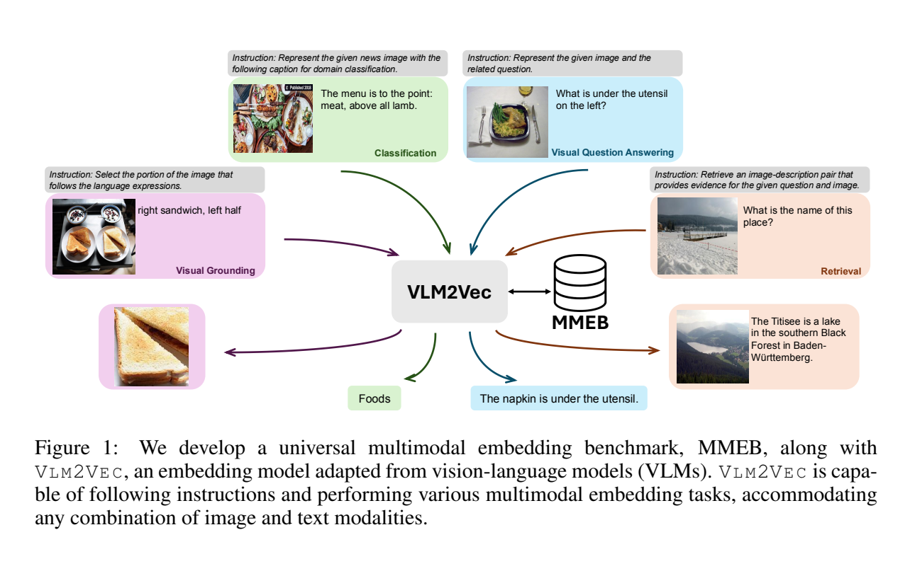
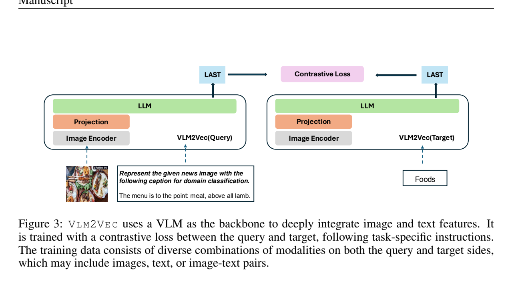
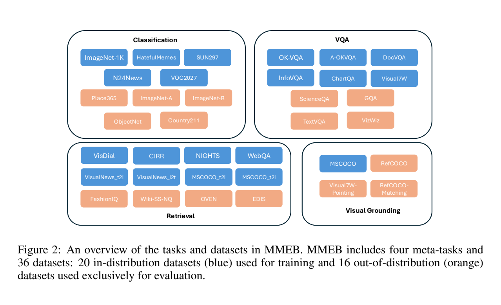

**原文**: [本地](../论文原件/VLM2Vec.pdf) [arXiv](https://arxiv.org/abs/2410.05151)

# 一句话记忆

VLM2Vec 一方面把 36 个数据集统一成 MMEB 的四类“查询—候选排序”任务，另一方面用指令条件化的 InfoNCE 训练，把 Phi-3.5-V、LLaVA-1.6 等生成式 VLM 改造成输出单向量的通用多模态编码器；GradCache 使全参数训练也能使用 1024 的有效 batch。

# 研究问题

## 以前的方法

以前的多模态向量嵌入方法通常使用 CLIP 或 BLIP 风格的双塔或浅层融合架构，将视觉与文本各自独立编码后进行相似度对齐，并仅在一两个特定任务（如图像检索）上进行局部评估。

## 存在的问题

1. **评测基准缺失与割裂**：目前缺乏一个能像 MTEB (文本向量评测基准) 那样，在统一的框架下系统评测通用多模态向量模型在多种任务（如分类、VQA、检索、定位）上泛化能力的基准。
2. **模型融合浅层且不具备指令遵循能力**：以 CLIP 为代表的模型难以理解复杂的提示指令（如“Represent the given news image for classification”），在面对图文交错的复杂查询时，由于是后期双塔内积对齐，无法捕捉图文深度交互后的高阶特征语义。

## 论文试图解决什么

如何构建首个覆盖多种任务的多模态向量评测基准（MMEB），以及如何将通用的自回归视觉语言大模型（VLM）深度融合成能够遵循多样化语言指令输出固定维度特征的通用多模态向量提取模型（VLM2Vec）。

# 核心洞察

- **研究洞察**：
  1. **自回归大模型作为向量提取器（Generative to Embedding）**：通过对比学习让自回归的 VLM 学习输出固定的向量。VLM 原生具备极强的图像-文本交叉注意力深度融合能力，能够根据提示词指令（Instruction）自适应地决定如何提取图文嵌入。
  2. **指令决定“按什么语义比较”**：在 Phi-3.5-V 消融中，加入任务指令使平均 Precision@1 从 34.8 提升到 52.0，即增加 17.2 个百分点、相对提升 49.4%；同样的指令却使 CLIP 从 37.8 降到 26.7，说明收益来自具备并经训练强化的指令理解能力，而非简单增加文本。

- **工程实现**：
  1. **GradCache 梯度缓存在大批次对比学习中的应用**：大批次（如 1024）对于对比对齐的负样本容量至关重要，但 VLM 的激活值极其消耗显存。VLM2Vec 使用 GradCache 梯度缓存技术，将前向传播与反向传播的梯度依赖在 Batch 维度上解耦，在每张卡（H100）上使用 sub-batch = 4 运行并缓存隐藏层梯度，最终累积实现 Batch Size = 1024 的高效训练。
  2. **自回归 LAST Token 的表示法**：在 VLM 的最后一层，直接提取整个提示词图文输入序列的最后一个 Token 的输出向量作为整帧多模态信息的 Global Representation 嵌入。

- **普通组件**：
  - 骨干网络使用 Phi-3.5-V 或 LLaVA-1.6；图像编码器使用 SigLIP / ViT。

# 方法流程

方法流程的总体框架见首图 。

- **1. 训练与表征提取流程**（参见下面 ）：
  输入图文查询与对应任务指令 $\rightarrow$ 拼接格式化为 `[IMAGE TOKEN]Instruct: {task definition} \n Query: {q}` $\rightarrow$ 馈入自回归大语言模型（Phi-3.5-V / LLaVA-1.6） $\rightarrow$ 提取大模型最后一层、最后一个 Token (LAST) 的隐特征向量作为嵌入 $\rightarrow$ 计算 Batch 范围内的 InfoNCE 对比损失（借助 GradCache 梯度缓存更新模型） $\rightarrow$ 最小化损失。

- **2. MMEB 评测流程**（参见下面 ）：
  将 Classification、VQA、Retrieval、Visual Grounding 均重构为**候选排序问题** $\rightarrow$ 每个查询面对 1 个真值和 999 个干扰项 $\rightarrow$ 分别编码 query 与 candidate，按向量相似度选择最高者 $\rightarrow$ 评估 Precision@1。

# 关键模块

- **GradCache 梯度累积缓存**
  - 输入：大小为 $N = 1024$ 的全 Batch 样本
  - 输出：计算得到的累积梯度 $\frac{\partial \mathcal{L}}{\partial \Theta}$
  - 作用：将对比损失计算与骨干网络的梯度回传解耦。每次仅对 sub-batch = 4 的样本进行前向计算，保存其最终表征向量和梯度张量，最后利用链式法则分批进行 backward。
  - 为什么需要：自回归多模态模型包含数十亿参数，如果直接在 1024 批次大小下做常规 backward，会导致 GPU 显存（OOM）崩溃。
  - 去掉后可能发生什么：同等显存下只能缩小 batch 或改用参数高效微调。论文的 batch-size 消融显示大 batch 更好，但没有证明任何较小 batch 都必然“大幅恶化”。

- **LAST Token 提取器**
  - 输入：自回归 LLM 最后一层的所有隐藏层向量 $\{h_1, h_2, \dots, h_L\}$
  - 输出：末尾向量 $h_L \in \mathbb{R}^D$ ($D = 3072$ 或 $4096$)
  - 作用：将整个指令、图像与文本交错输入压缩为单一固定维度的全局多模态语义向量。
  - 为什么需要：下游检索与分类任务要求必须输出固定的紧凑表示。自回归 Transformer 后向注意力（Causal Attention）机制使得最后一个 Token 能够自发汇聚先前所有图文交互后的上下文信息。
  - 去掉后可能发生什么：无法输出定维嵌入，无法直接应用矩阵内积比对相似度。

# 训练目标或核心公式

相似度函数定义（温度缩放的余弦相似度）：

$$\phi(h_q, h_t) = \exp \left( \frac{1}{\tau} \cos(h_q, h_t) \right)$$

其中温度超参数 $\tau$ 设为 0.02。

联合对比对齐 InfoNCE 损失：

$$\min \mathcal{L} = -\sum \log \frac{\phi(h_{q_{inst}}, h_{t^+})}{\phi(h_{q_{inst}}, h_{t^+}) + \sum_{t^- \in \mathcal{N}} \phi(h_{q_{inst}}, h_{t^-})}$$

其中 $t^+$ 是与指令 Query 配对的唯一正样本，$\mathcal{N}$ 表示 Batch 内的所有其他负样本与难负样本（Hard Negatives）。

# 实验证明了什么

- **实验问题 1：在 MMEB 的 20 个训练数据集上训练后，VLM2Vec 相比现有通用多模态嵌入模型如何？**
  - **比较对象**：CLIP, OpenCLIP, SigLIP, BLIP2, UniIR, MagicLens, E5-V 等。
  - **观察结果**：最佳 LLaVA-1.6 LoRA 变体在全部 36 个数据集上的平均 Precision@1 为 **62.9**，比未在 MMEB 上微调的 UniIR（44.7）高 18.2 个百分点；在 16 个保留的 OOD 数据集上为 **57.1**，比 UniIR 的 41.7 高 15.4 个百分点。VLM2Vec 本身已在 20 个 MMEB-IND 数据集上训练，不能称为“未经任何微调”。
  - **支持的结论**：多任务对比训练后的 VLM 能把指令、图像和文本统一为有效单向量，并迁移到保留数据集；结果不能单独归因于“深度融合”，因为骨干、分辨率、训练数据与调参方式也同时不同。

- **实验问题 2：LoRA 参数高效微调与全参数微调（FFT）的差异？**
  - **比较对象**：LoRA (Rank=8) vs. Full Fine-Tuning (FFT)。
  - **观察结果**：论文结论与旧笔记相反：在 Phi-3.5-V、batch 256 的一致设置中，合适秩的 LoRA 优于全参数微调；LoRA $r=4$ 的 IND/OOD/总平均为 64.9/50.4/58.4，而 FFT 为 61.8/45.8/54.7。秩并非越大越好，$r=16$ 和 $r=32$ 反而下降。
  - **支持的结论**：该实验支持“适当容量的 LoRA 在当前数据规模下可优于 FFT”；作者推测全参训练更易过拟合，但没有证明 LoRA 普遍优于全参数训练。

# 局限与失效场景

- **局限 1：对比推理计算开销巨大**
  - **产生原因**：每次计算匹配度必须将候选图像或文本连同指令一起送入超大参数 VLM 提取 LAST token 向量。
  - **可能失败的场景**：面对毫秒级的大规模搜索引擎，直接在数百万数据库上在线运行 VLM2Vec 提取候选表征是不切实际的，必须进行离线多模态缓存。
  - **边界**：候选向量可离线编码，在线阶段只需编码查询并做向量搜索；真正的代价主要是建库吞吐、查询编码延迟和高维索引，而不是为每次查询重新编码全部候选。

# 与其他论文的关系

## 同任务工作

- [[E5-V]]：只用文本对微调 MLLM 的语言侧参数、训练时移除视觉编码器与 projector 的跨模态嵌入工作（`peer-work`）。
- [[UniIR]]：采用浅层融合与 score-level 对齐的跨模态通用信息检索基线（`peer-work`）。

## 前置基础

- [[GradCache]]：提供 Batch 维度解耦与梯度累积的显存优化方案（`builds-on`）。

# 对我的课题的启发

`[AI分析]`

1. **多模态大模型的向量化抽取在 3D 点云定位中的价值**：定位时面对的常常是多模态输入的 Query（如“我在一条路边，前面有一个大广告牌，旁边是加油站”）。我们可以用类似 VLM2Vec 的方法，不需要做复杂的几何特征提取，而是让多模态大语言模型提取 LAST Token 语义表征，和三维子地图的特征做对比匹配，利用 LLM 的推理上下文融合多模态查询。

# 主动回忆问题

## Level 1：主线恢复

- 简述 VLM2Vec 将自回归的 VLM 转换为向量表征提取器的核心思路。
- MMEB 基准包含哪些元任务？各任务的负样本（Distractors）数量是多少？

## Level 2：机制理解

- 为什么在 VLM2Vec 的输入中拼接任务特定的描述指令（Instruction）可以带来高达 49.4% 的性能提升？
- GradCache 是如何实现把自回归模型的对比批次大小扩展到 1024 的？

## Level 3：批判与迁移

- 相比于 CLIP 这类只在共享特征空间计算余弦相似度的模型，VLM2Vec 这种基于自回归注意力融合特征的方法在应对组合语义（比如“拿在左手的黑色包，而不是挂在右肩的红色包”）时，有什么本质优势？

# 尚未解决的问题

- 多模态自回归模型提取的向量在高吞吐量实时图像/三维点云检索中的延迟瓶颈。

## 理解更新记录

- `2026-07-12`：由 AI 基于论文原件 PDF 自动生成并归档初始版本笔记。
