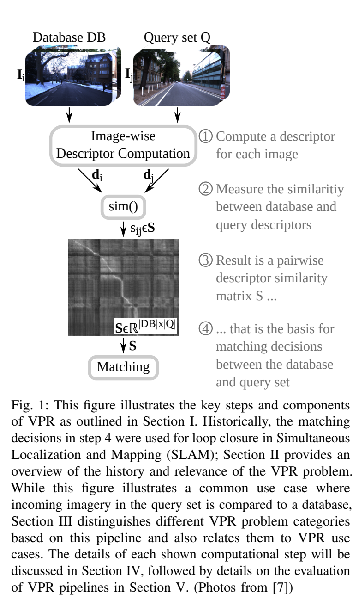
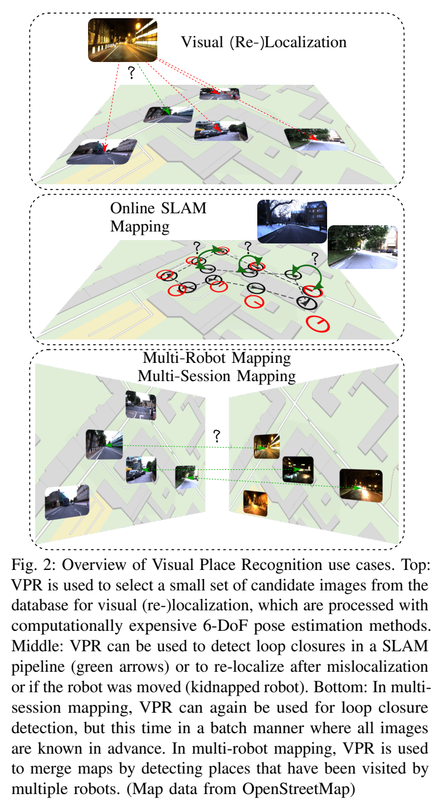
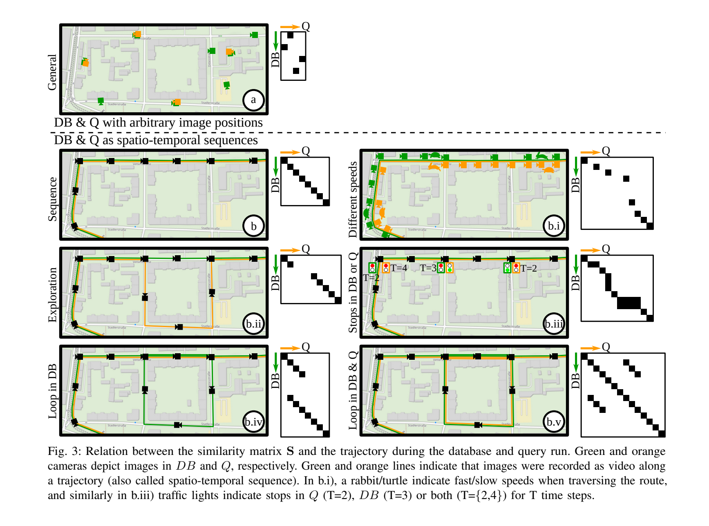

**原文**: [本地](../论文原件/VPR_Tutorial.pdf)

# 一句话记忆

该文自称首篇 VPR 教程论文：它用“输入会话、处理方式、输出类型”三个轴统一任务定义，并从描述子、相似度矩阵、匹配决策、真值和指标一路给出可执行的视觉地点识别流程。

# 研究问题

## 以前的方法

以前关于地点识别的文献主要分散在 SLAM（回环检测）或图像检索（Image Retrieval）领域，缺乏统一的术语规范和入门导引。

## 存在的问题

1. **概念混淆与缺乏统一术语**：不同领域（如机器人、计算机视觉）在称呼这一任务时存在“地点识别（PR）”、“视觉地点识别（VPR）”、“回环检测（LCD）”和“视觉重定位（Visual Re-localization）”等多个概念，术语的不一致阻碍了学术交流。
2. **入门门槛高**：新进入 VPR 领域的学者需要查阅大量的零散基准评估、特征描述子论文，缺少系统介绍 VPR 基础数学模型、算法流水线和各种实际部署挑战的全面教程。

## 论文试图解决什么

统一 VPR 领域的定义和学术术语，提供一个包含输入、特征提取、相似度比对和匹配决策的通用算法管线，给出完整的 PR 评估指标（如 AUPRC、Recall@N）和常见环境挑战下的应对设计。

# 核心洞察

- **研究洞察**：
  1. **三维问题分类模型**：将 VPR 任务划分为三个关键属性：输入（单会话自匹配 vs 双会话异期匹配）、数据处理（在线流式处理 vs 离线批量处理）以及输出（返回单最佳匹配 vs 返回所有匹配）。这为不同的机器人定位和建图场景提供了精准的算法选型依据。
  2. **用相似度矩阵读出轨迹结构**：相同路线、方向和速度会形成约 $45^\circ$ 的高相似度对角线；相对速度改变会改变斜率，停顿会形成横线或竖线，重复访问则会产生额外的高相似度轨迹。图案方向取决于矩阵轴的约定，解释时应先确认 DB/Q 分别位于哪一轴。

- **工程实现**：
  1. **层次化特征匹配（Hierarchical Matching Pipeline）**：在海量地图检索中，直接对高维局部特征进行两两空间几何校验（如单应性矩阵估计）计算量极其高昂。工业界与学术界的标准实践是：首先使用计算高效的全局/整体特征（如 NetVLAD）检索出 Top-K 候选；随后仅在 Top-K 范围内利用局部特征进行精细的重排与几何验证。

- **普通组件**：
  - 图像局部特征提取使用经典的 SIFT、ORB 或深度特征；全局特征聚合算法使用 Bag of Visual Words (BoVW)、VLAD。

# 方法流程

方法流程的总体框架见首图 。

- **1. 通用 VPR 算法管线流程**：
  输入数据库图像集 DB 与查询图像集 Q $\rightarrow$ **步骤 1 (特征抽取)**：分别提取各图像的全局描述符 $d_{DB}, d_Q$ $\rightarrow$ **步骤 2 & 3 (相似度计算)**：计算所有图像两两间的余弦相似度，构建相似度矩阵 $S \in \mathbb{R}^{|DB| \times |Q|}$ $\rightarrow$ **步骤 4 (匹配决策)**：基于单匹配决策（选择每列/行最大值）或多匹配决策（设定自动阈值筛选），输出离散的匹配关系矩阵 $M$。

- **2. VPR 多样化应用场景与回环轨迹**（参见下面  & ）：
  - **Loop Closure (回环检测)**：在建图或 SLAM 中检测先前访问过的位置，添加位姿约束消除漂移。
  - **Kidnapped Robot (绑架机器人)**：在未知初始位姿的情况下，利用 VPR 从数据库中召回最可能的参考位姿，实现全局初始化。
  - **Spatio-temporal Trajectories**：通过相似度矩阵 $S$ 的 45 度连续亮线，应用序列匹配算法（Sequence Matching）滤除零散噪点。

# 关键模块

- **图像全局描述器 (Global Descriptor)**
  - 输入：原始 RGB 图像 $I \in \mathbb{R}^{H \times W \times C}$
  - 输出：一维特征向量 $d \in \mathbb{R}^{D}$
  - 作用：提取图像整体的语义或统计特性，降低特征维度。
  - 为什么需要：对单张图片实现快速匹配，使得数据库搜索复杂度从局部特征的两两几何匹配下降到向量点积。
  - 去掉后可能发生什么：只能直接比较局部描述子集合，通常比固定维度全局向量的点积更昂贵；实际开销取决于索引、候选筛选和局部特征数量，不能笼统断言一定“爆炸”。

- **局部特征校验器 (Local Verification / Spatial Verification)**
  - 输入：查询图与 Top-K 候选图的局部特征点集合 $\{D_i\}$
  - 输出：精细重排后的候选列表或相对位姿变化
  - 作用：利用几何约束（如对极几何、单应性矩阵、RANSAC 迭代）验证局部特征在空间结构上的合理性，滤除虚假匹配。
  - 为什么需要：单个全局向量压缩了局部几何信息，外观相似但物理位置不同的图像可能获得相似表示；局部匹配与几何一致性可用于重排或验证。
  - 去掉后可能发生什么：无法验证特征的空间几何关系，导致定位精度被相似背景误导，重定位 Recall 下降。

# 训练目标或核心公式

相似度定义：
两张图像的全局特征向量进行归一化后，其相似度为余弦相似度：

$$s_{ij} = \frac{d_i^T \cdot d_j}{\|d_i\| \cdot \|d_j\|}$$

指标计算公式：

1. Area Under Precision-Recall Curve (AUPRC)：
   $$\text{AUPRC} = \int_{0}^{1} P(R) dR$$

2. Recall@N：
   $$\text{Recall@N} = \frac{\sum_{j=1}^{|Q|} \mathbb{I}\!\left(\min_{i:\,GT_{ij}=1}\text{rank}_j(i) \le N\right)}{|Q|}$$
   即对每个查询，只要前 $N$ 个返回结果中至少包含一个真实匹配，就计为召回。一个查询可能有多个有效数据库位置，因此用最佳真实匹配的排名比只写单个 $I_j^{GT}$ 更准确。

# 实验证明了什么

- **实验问题 1：教程中的可运行示例验证了什么？**
  - **比较对象**：论文用 GardensPoint Walking 数据和一个全局描述子示例贯穿单/多会话、在线/批处理、单最佳/多匹配流程，并展示相似度矩阵、匹配矩阵与评估代码。
  - **观察结果**：示例运行给出 AUPRC 0.742，主要目的在于说明从数据、$GT/GT_{soft}$、相似度到指标的计算接口，而不是比较 NetVLAD、AlexNet 或 HybridNet 的优劣。
  - **支持的结论**：VPR 评价必须先明确任务类型、真值和匹配决策；本文对“VLAD 类描述子通常更适合大视角变化”的表述是文献综述性建议，不能改写成本论文在 GardensPoint/Nordland 上完成的对比实验。

- **实验问题 2：单会话 VPR 为什么需要排除平凡近邻？**
  - **比较对象**：这是教程给出的任务建模约束，并非文中独立的有/无 heuristic 定量实验。
  - **观察结果**：同一图像流中的相邻帧天然高度重叠；若目标是回环检测，把时间上紧邻的帧当作地点重访会产生无意义匹配。因此单会话系统通常用时间窗口或运动先验排除这些候选。
  - **支持的结论**：需要根据应用定义“可接受的重访间隔”；具体窗口并无通用固定值，也不是所有单会话检索任务都必须采用同一种 heuristic。

# 局限与失效场景

- **局限 1：高相似度静态背景下的 Perceptual Aliasing (感知走样/混淆)**
  - **产生原因**：不同物理位置的建筑物、树木或道路由于使用相同材质或几何结构，在图像全局嵌入中呈现极高相似度。
  - **可能失败的场景**：高密度高层写字楼林立的“都市峡谷”（Urban Canyon）、或者两侧高度重复的林荫小道，模型常给出错误的地点匹配。

- **局限 2：极端域偏移（Season, Weather, Light）导致的特征漂移**
  - **产生原因**：图像像素分布在季节更替（绿树变枯枝、积雪）、天气转换（大雨、浓雾）时会发生剧烈变化。
  - **可能失败的场景**：夏季数据库与冬季积雪查询之间可能出现显著特征漂移。教程将 Nordland 等列为典型挑战数据集，但没有给出“召回率几乎降到 0”的统一实验数值。

# 与其他论文的关系

## 前置基础

- [[NetVLAD]]：代表性的全局特征提取子，基于图像的全局池化进行地点识别（`peer-work`）。

## 同任务工作

- [[FAB-MAP]]：早期经典的非深度学习地点识别系统，采用 BoW 方法进行地点匹配（`peer-work`）。

# 对我的课题的启发

`[AI分析]`

1. **层次化检索架构在 3D 定位中的复现**：在 3D 点云的文本定位（如 [[Text2Pos]]）中，直接匹配局部物体（Instance Matching）在全城尺度下开销极大，必须参考 VPR 的双阶段管线：先做粗粒度的 Text-to-Submap 检索，缩小候选范围；再在局部 Submap 中做 fine-grained 的 hint-to-instance 几何与属性校验。
2. **评估指标规范化**：课题目前对 Recall 的计算较粗糙，后续应当引入 dilated 软真实矩阵 $GT_{soft}$ 概念，允许测试时对具有部分重合（小 overlap）的相邻子地图召回免除虚警惩罚。

# 主动回忆问题

## Level 1：主线恢复

- 视觉地点识别（VPR）在机器人 SLAM 建图与重定位中分别扮演什么角色？
- 简述全局描述子与局部描述子的定义，并说明它们在层次化定位管道中是如何组合协作的？

## Level 2：机制理解

- 如果机器人在建图数据库（DB）采集时在某个红绿灯路口停顿了 1 分钟，而在定位查询（Q）时顺利通过，所产生的相似度矩阵 $S$ 会表现出怎样的图案？
- dilated 软真实矩阵 $GT_{soft}$ 是为了解决评估中的什么实际问题而设计的？

## Level 3：批判与迁移

- 为什么在 3D 点云定位（如 Text2Loc）中，通常不需要像视觉定位（VPR）那样设计复杂的防天气、防光照的描述子？这是否意味着 3D 定位的鲁棒性天然高于视觉定位？

# 尚未解决的问题

- 动态物体（人流、车辆）高占比场景下，长时 VPR 静态地标提取的鲁棒性上限。

## 理解更新记录

- `2026-07-12`：由 AI 基于论文原件 PDF 自动生成并归档初始版本笔记。
