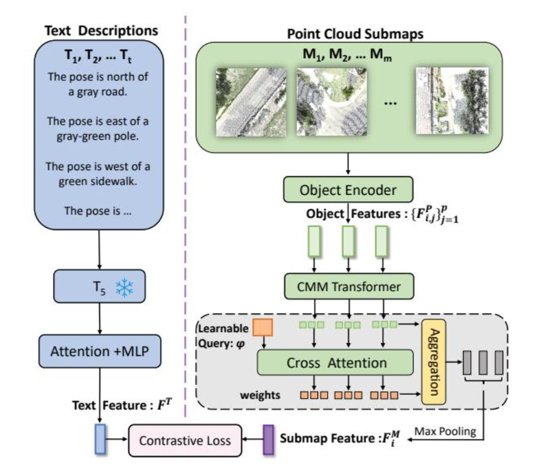

# CMMLoc 公式分析

**原文**: [本地](../论文原件/CMMLoc.pdf) [网络](https://arxiv.org/abs/2503.02593)

## 基于公式的理解

整个子地图编码过程可以连起来写成：

### 1. 物体级输入（Object-level Input）

$$M_i = \{P_{i,j}\}_{j=1}^p, \quad P_{i,j} \in \mathbb{R}^{s \times 3}$$

- **操作目的**：将子地图内所有物体的点云数据进行结构化表征，作为后续特征提取的源输入。
- **简短原理**：子地图 $M_i$ 由 $p$ 个独立物体组成。每个物体 $P_{i,j}$ 包含 $s$ 个三维空间点，每个点由 $(x, y, z)$ 三维坐标表示，从而构成 $s \times 3$ 的局部几何矩阵。

### 2. 单物体编码（Single Object Encoding）

$$F_{i,j}^P = \text{Concat} \left[ \text{PointNet++}(P_{i,j}), E_c(c_{i,j}), E_l(l_{i,j}), E_n(n_{i,j}) \right]$$

- **操作目的**：多模态属性融合。将物体的底层几何点云特征与其高层语义及物理属性（如类别、尺寸、实例标签）融合为一个高维联合特征向量。
- **简短原理**：使用 **PointNet++** 网络提取物体点云 $P_{i,j}$ 的几何结构特征，并使用多层感知机（MLP） or 嵌入层（Embedding）分别对类别信息 $c_{i,j}$（即 $E_c$）、尺寸/包围盒信息 $l_{i,j}$（即 $E_l$）和物体名称/标签编码 $n_{i,j}$（即 $E_n$）进行编码。最终通过拼接操作（**Concat**）将这四者在通道维度进行合并。 (Wait! original was "或嵌入层", let's keep "或")

### 3. 堆叠所有物体（Stacking All Objects）

$$X_i = \text{Stack} \left( F_{i,1}^P, \dots, F_{i,p}^P \right) \in \mathbb{R}^{p \times d}$$

- **操作目的**：构造子地图内部的多物体特征矩阵，为后续建模物体间的空间与语义关联（如注意力机制）准备统一的张量维度。
- **简短原理**：将子地图 $M_i$ 中所有 $p$ 个已编码的单物体特征向量 $F_{i,j}^P$ 按顺序进行堆叠（**Stack**），形成一个维度为 $p \times d$ 的子地图特征矩阵 $X_i$，其中 $d$ 代表拼接编码后的多模态特征维度。

### 4. 柯西注意力（Cauchy Attention）

$$X_{i,n}^{\text{attn}} = \text{Softmax} \left[ W_{c,n} \odot \frac{X_i W_q (X_i W_k)^{\top}}{\sqrt{d_k}} \right] X_i W_v$$

- **操作目的**：捕捉子地图内部各物体之间的相互依赖关系与空间关联性。
- **简短原理**：在传统自注意力（Self-Attention）机制的缩放点积（Scaled Dot-Product）基础上，引入 **柯西核矩阵**（Cauchy Kernel Matrix，通常表示为 $W_{c,n}$）进行元素级相乘（**哈达玛积** $\odot$）。柯西核通过物理空间距离对注意力权重进行约束，使得空间邻近的物体分配到更高的注意力权重，最后通过 **Softmax** 归一化并与值矩阵 $X_i W_v$ 相乘，输出融合上下文信息的特征矩阵 $X_{i,n}^{\text{attn}}$。

### 5. 前馈网络（Feed-Forward Network, FFN）

$$X_{i,n}^{\text{output}} = \text{FFN} \left( X_{i,n}^{\text{attn}} \right)$$

- **操作目的**：进行非线性特征变换，提升特征的表征能力与高阶语义抽象水平。
- **简短原理**：将柯西注意力的输出特征送入一个双层多层感知机（通常包含线性层、激活函数如 **ReLU** 或 **GELU**、以及 **Layer Normalization** 和残差连接），在保持维度不变的同时，对特征空间进行非线性映射与特征重组。

### 6. 多尺度融合（Multi-scale Fusion）

$$w_n = \text{CrossAttention} \left( \phi, X_{i,n}^{\text{output}} \right)$$

$$\widetilde{X}_i^{\text{output}} = \sum_{n=1}^N w_n X_{i,n}^{\text{output}}$$

- **操作目的**：自适应融合不同感受野或多尺度网络层提取的特征，获得稳健的综合特征表示。
- **简短原理**：通过交叉注意力机制（**Cross-Attention**）计算一个全局查询向量 $\phi$ 与各个尺度/层特征 $X_{i,n}^{\text{output}}$ 之间的关联权重 $w_n$。随后，以此权重对 $N$ 个尺度的特征进行加权求和，从而自适应地过滤噪声并保留最关键的特征多尺度信息。

### 7. 全局池化（Global Pooling）

$$F_i^M = \text{MaxPool} \left( \widetilde{X}_i^{\text{output}} \right)$$

- **操作目的**：消除输入物体数量 $p$ 的动态变化对特征维度的影响，抽取出描述整个子地图的全局不变特征向量。
- **简短原理**：在物体维度（即 $p$ 的维度）上应用最大池化（**MaxPool**）算子，仅保留各特征通道上激活值最强的关键特征。该操作使得最终的子地图表征具备置换不变性（Permutation Invariance）。

### 8. 最终映射（Final Mapping）

$$M_i \longrightarrow F_i^M \in \mathbb{R}^d$$

- **操作目的**：实现从原始子地图三维离散点云集及多模态属性，到高维空间度量嵌入（Embedding）的端到端映射。
- **简短原理**：通过上述七步流水线，原始含有复杂、无序物体集合的子地图 $M_i$ 被成功编码为单条固定维度的连续稠密向量 $F_i^M$。该向量完美凝练了子地图的几何、语义及拓扑结构，可直接用于回环检测、子地图匹配或三维重建任务。

## 相关链接

- [[科研/论文/memory/CMMLoc|CMMLoc 记忆笔记]]：配套的论文摘要、实验结果与关系梳理（`complements`）。

## 理解更新记录

- `2026-07-15`：统一公式分析排版，补充原文入口，并与记忆笔记建立双向链接。
