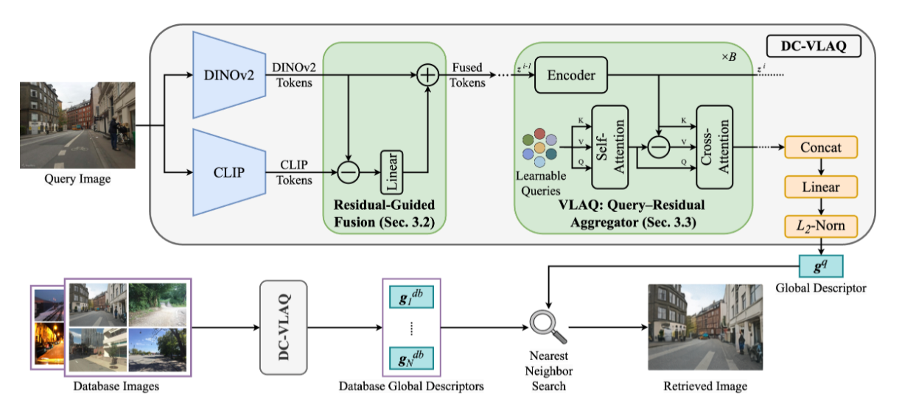

**原文**: [本地](../论文原件/DC-VLAQ.pdf) [网络](https://arxiv.org/abs/2601.12729)

- 概述：将一系列图片输入 $CLIP、DINOv2$ 模型，输出描述每张图片的局部词元张量、全局特征向量。由于两个模型的侧重点不同( $CLIP$ 认大类，$DINOv2$ 扣细节)，可以综合两者输出(不使用 $cls$ 向量)，获得对图片更精确的描述。( $cls$ 适合分类，该论文聚焦视觉地点识别)

核心流程：
1. 将第 $i$ 张图片输入两个模型，获得 $X_i^C、X_i^D$ 局部特征张量(忽略全局的)
2. 计算融合后的最终局部特征张量 $Z_i=X_i^D+F_C(X_i^C-X_i^D)$ ，( $F_C(·)$ 是可学习的线性映射层)，$Z_i=\{z_{ij}\}$ 也就是第 $i$ 张图里的所有局部特征词元
3. 查询相似度计算： $s_{ijk}​= \frac{q_k^T·​z_{ij}​​}{\sqrt{d}}$ ，( $s_{ijk}$ 为第 $i$ 张图的第 $j$ 个特征词元，和第 $k$ 个查询模板的匹配相似度分数；$\{q_k\}_{k=1}^S$ 为**可学习查询模版**，共 $S$ 个；除以 $\sqrt{d}$ 缩放是为了避免高维特征数值爆炸)
4. 软分配权重归一化：$α_{ijk}​=Softmax_j​(s_{ijk}​)$，(沿着 $j$ 维度) ；同一个模板对应的所有权重加起来正好等于 $1$
5. 残差加权聚合：$v_{ik}​=∑_j​α_{ijk}​(z_{ij}​−q_k​)$ 
6. 把 $S$ 个模板对应的 $v_{ik}$ ​全部拼接起来，再做一次 $L2$ 归一化，就得到了最终的全局描述子 $g_i$ ​，是一个固定长度的向量，和输入图像的尺寸、词元数量无关。

- 训练阶段：通过数据集训练好 $\{q_k\}、F_C(·)$ 
- 使用阶段：根据上述流程得到 $g_i$ ，再和数据库里提前算好的所有地点的描述子做余弦相似度比对，就能完成地点检索的核心任务
## 相关链接

- [[VLM-Loc|VLM-Loc]]
- [[UniPR-3D|UniPR-3D]]
