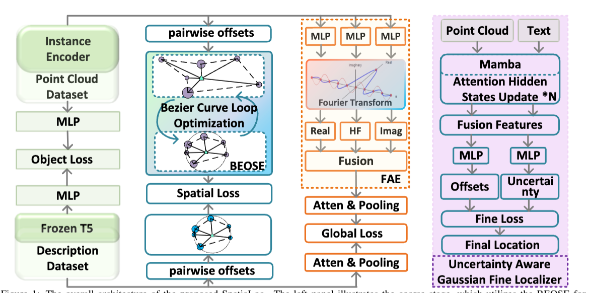

**原文**: [本地](../论文原件/SpatiaLoc.pdf) [网络](https://arxiv.org/abs/2601.03579)

## 前置固定实例锚定

- **文本查询 Q**：「我在灰色3层居民楼的正南边，路口红绿灯的正东边，紧挨着白色人行道」
- **目标子地图 A 的核心物体**（质心坐标 `(x,y,z)`）：

| 物体ID | 物体名称 | 质心坐标 | 对应文本描述 |
|--------|----------|----------|--------------|
| s₁ | 灰色3层居民楼 | (100, 200, 2) | 灰色3层居民楼 |
| s₂ | 路口红绿灯 | (120, 180, 3) | 路口红绿灯 |
| s₃ | 白色人行道 | (110, 170, 0) | 白色人行道 |

- 子地图 A 几何中心：`(115, 185)`
- 真实目标坐标 $L_{gt}$：`(110, 195)`

---

## 一、任务定义：核心公式 (1)(2)

【对应模块】3.1 Task Formulation，整个任务的数学化定义，是所有后续公式的基础

### 公式 (1)：精定位阶段的优化目标

$$
\min _{\Psi, \Phi} \mathbb{E}_{\left(L_{g t}, Q\right) \sim \mathcal{D}_{s}}\left\| L_{g t}-\Phi(Q, \tilde{R})\right\| _{2}^{2}
$$

### 公式 (2)：粗定位阶段的子地图检索规则

$$
\tilde{R}= \arg\min _{R \in \mathcal{G}} \Delta(\Psi(Q), \Psi(R))
$$

---

#### 逐变量拆解（含义+来历）

| 变量符号                   | 变量含义                                                             | 变量来历                                                                              |
| ---------------------- | ---------------------------------------------------------------- | --------------------------------------------------------------------------------- |
| $\mathcal{G}$          | 点云子地图库，包含全城所有拆分后的子地图                                             | 人工预处理：把全城3D点云地图，拆分为 $N_c$ 个连续的 50m×50m 小子地图，即 $\mathcal{G}=\{R_{i}\}_{i=1}^{N_c}$ |
| $R_i$                  | 子地图库中的第 $i$ 个子地图，每个子地图包含 $N_s$ 个物体实例，即 $R_i=\{s_k\}_{k=1}^{N_s}$ | 来自子地图库 $\mathcal{G}$，实例 $s_k$ 是点云里的单个物体（如居民楼、红绿灯）                                 |
| $Q$                    | 自然语言查询文本，包含 $N_q$ 个带空间关系的描述单元，即 $Q=\{d_j\}_{j=1}^{N_q}$          | 用户输入的定位文本，本例中 $N_q=3$，对应3个描述单元                                                    |
| $L_{gt}$               | 文本描述对应的真实2D坐标，$\in \mathbb{R}^2$                                 | 数据集的标注真值，本例中为 `(110, 195)`                                                        |
| $\mathcal{D}_s$        | 文本-坐标配对的数据集分布                                                    | 来自训练数据集 KITTI360Pose，所有标注好的 (文本, 真实坐标) 对都服从这个分布                                   |
| $\mathbb{E}$           | 数学期望，对整个数据集分布求平均                                                 | 统计学基础算子，代表模型在整个数据集上的平均误差                                                          |
| $\Psi$                 | 粗阶段的嵌入函数                                                         | 由 BEOSE + FAE 模块组成，作用是把文本/点云子地图映射到共享隐空间的特征向量                                      |
| $\Phi$                 | 精阶段的回归函数                                                         | 由 UGFL 模块组成，作用是融合文本和检索到的子地图特征，回归出最终2D坐标                                           |
| $\tilde{R}$            | 粗阶段检索到的、和文本最匹配的目标子地图                                             | 由公式 (2) 计算得到，本例中为子地图 A                                                            |
| $\Delta(\cdot, \cdot)$ | 特征相似度计算函数，论文中为**欧氏距离**                                           | 基础距离算子，计算两个特征向量在共享隐空间的距离，距离越小 = 相似度越高                                             |
| $\|\cdot\|_2^2$        | L2范数的平方，即均方误差                                                    | 基础误差算子，衡量预测坐标和真实坐标的偏差大小                                                           |

---

#### 公式物理意义

- **公式 (2)（粗定位）**：遍历所有子地图，找到和文本特征距离最小的那个子地图 $\tilde{R}$，完成「从全城找对目标街区」的任务；
- **公式 (1)（精定位）**：优化嵌入函数 $\Psi$ 和回归函数 $\Phi$，让模型在整个数据集上，预测坐标和真实坐标的平均均方误差最小，完成「在街区里算准精准坐标」的任务。

---

## 二、粗定位阶段：BEOSE模块 核心公式 (3)-(8)

【对应模块】3.2 Object Level Alignment，实例级空间关系建模，解决模态鸿沟

### 前置基础变量（先明确，后续公式复用）

| 变量符号 | 变量含义 | 变量来历 |
|----------|----------|----------|
| $T=\{t_j\}_{j=1}^{N_q}$ | 文本特征集合，每个 $t_j$ 是单个描述单元的语言特征 | 由**冻结的T5预训练编码器**对文本描述 $d_j$ 编码得到，固定256维 |
| $V=\{v_k\}_{k=1}^{N_s}$ | 点云物体特征集合，每个 $v_k$ 是单个物体的视觉特征 | 由**冻结的PointNet++**对物体实例 $s_k$ 的点云编码得到，和文本特征同维度256维 |
| $m,n$ | 物体实例的索引，取值范围 $1,2,...,N_s$ | 遍历子地图里的所有物体，用来表示两两物体的配对 |
| $j$ | 文本描述单元的索引，取值范围 $1,2,...,N_q$ | 遍历文本里的所有描述单元 |

---

### 公式 (3)：成对空间偏移张量计算

$$
O_{mn}=Coord(s_{m})-Coord(s_{n})
$$

#### 逐变量拆解

| 变量符号 | 变量含义 | 变量来历 |
|----------|----------|----------|
| $O_{mn}$ | 3维空间偏移向量，$\in \mathbb{R}^{N_s × N_s × 3}$，代表从物体 $n$ 指向物体 $m$ 的几何向量 | 由公式 (3) 计算得到，是两两物体的坐标差 |
| $Coord(s_m)$ | 物体 $s_m$ 的3D质心坐标，$\in \mathbb{R}^3$ | 点云数据的预处理结果，对物体 $s_m$ 的所有点云坐标求平均得到 |

#### 公式物理意义

计算子地图里两两物体之间的相对空间关系，同时包含**方向**和**绝对距离**两个核心信息，是后续空间关系建模的基础。

#### 实例对应

本例中，$m=1$（居民楼），$n=2$（红绿灯），则：

$$
O_{12}=Coord(s_1)-Coord(s_2)=(100-120, 200-180, 2-3)=(-20, 20, -1)
$$

含义：居民楼在红绿灯的x轴负方向（西）20米、y轴正方向（北）20米、高度低1米，即西北方向约28米处。

---

### 公式 (4)：初始边特征生成

$$
E_{m n}=MLP_{fuse }\left(\left[\left(v_{m}, v_{n}\right) ; MLP_{geo }\left(O_{m n}\right)\right]\right)
$$

#### 逐变量拆解

| 变量符号 | 变量含义 | 变量来历 |
|----------|----------|----------|
| $E_{mn}$ | 物体对 $(m,n)$ 的初始边特征，代表两个物体的空间关系特征 | 由公式 (4) 计算得到，256维向量 |
| $MLP_{geo}$ | 几何编码多层感知机 | 可学习的全连接网络，作用是把3维偏移向量 $O_{mn}$ 编码为256维的高维特征，和物体特征维度对齐 |
| $MLP_{fuse}$ | 融合多层感知机 | 可学习的全连接网络，作用是把两个物体的语义特征、空间偏移特征融合为统一的边特征 |
| $[\cdot ; \cdot]$ | 特征拼接操作 | 基础算子，把多个向量按维度拼接为一个长向量 |

#### 公式物理意义

把「两个物体的语义特征」和「它们之间的空间偏移特征」融合，生成代表两两物体空间关系的边特征，文本侧同步执行相同操作，生成文本边特征 $E_{mn}^t$。

---

### 公式 (5)(6)：贝塞尔曲线特征调制（BEOSE核心创新）

#### 公式 (5)：贝塞尔曲线控制点预测

$$
P_{mn}^{(0)}=\phi _{0}(h_{mn}), \quad P_{mn}^{(2)}=\phi _{2}(h_{mn}), \quad P_{mn}^{(1)}=\phi _{c}(P_{mn}^{(0)})
$$

#### 公式 (6)：二次贝塞尔曲线特征调制

$$
\hat{E}_{m n}\left(\tau_{m n}\right) =(1-\tau_{m n})^{2} P_{m n}^{(0)}+2(1-\tau_{m n}) \tau_{m n} P_{m n}^{(1)} +\tau_{m n}^{2} P_{m n}^{(2)}
$$

---

#### 逐变量拆解

| 变量符号 | 变量含义 | 变量来历 |
|----------|----------|----------|
| $h_{mn}$ | 边特征 $E_{mn}$ 的隐藏状态 | 由门控LSTM网络从初始边特征 $E_{mn}$ 中提取得到，包含边特征的核心方向信息 |
| $\phi_0, \phi_2, \phi_c$ | 投影网络（全连接层） | 可学习的全连接网络，作用是从隐藏状态 $h_{mn}$ 中预测贝塞尔曲线的3个控制点 |
| $P^{(0)}, P^{(2)}$ | 二次贝塞尔曲线的两个端点 | 由投影网络 $\phi_0, \phi_2$ 预测得到，决定了特征的**方向趋势** |
| $P^{(1)}$ | 二次贝塞尔曲线的中间控制点 | 由投影网络 $\phi_c$ 预测得到，决定了特征的**幅值/大小** |
| $\tau_{mn}$ | 可学习的插值参数，取值范围 $[0,1]$ | 网络训练过程中自动学习的参数，用来在贝塞尔曲线上插值得到最终调制特征 |
| $\hat{E}_{mn}$ | 调制后的边特征 | 由公式 (6) 计算得到，是贝塞尔曲线插值输出的新特征 |

#### 公式物理意义

这是BEOSE的核心，利用二次贝塞尔曲线的特性：**两个端点决定方向，中间控制点决定幅值**，实现「保留方向语义、压制极端距离幅值」的效果，完美解决文本（定性方向）和点云（定量距离）的模态鸿沟。

- 当 $\tau=0$ 时，$\hat{E}_{mn}=P^{(0)}$；当 $\tau=1$ 时，$\hat{E}_{mn}=P^{(2)}$，两个端点固定了特征的方向；
- 中间控制点 $P^{(1)}$ 调整曲线的弯曲程度，实现对特征幅值的压制，避免绝对距离数值主导特征学习。

#### 后续处理

调制后的特征 $\hat{E}_{mn}$ 会经过 `tanh()` 激活函数做幅值约束，把数值限制在 $(-1,1)$ 之间，进一步压制极端值，最终得到对齐后的边特征 $E_{mn}^*$，上述过程循环执行N次优化。

---

### 公式 (7)(8)：高斯聚合（GA），边特征压缩为节点描述符

#### 公式 (7)：重参数化采样

$$
Z_{m n}=\mu_{m n}+ \exp \left(0.5 \log \sigma_{m n}^{2}\right) \odot \epsilon, \quad \epsilon \sim \mathcal{N}(0, I)
$$

#### 公式 (8)：加权聚合生成节点描述符

$$
\hat{v}_{m}=\sum_{n=1}^{N_{s}}\left( \operatorname{Softmax}_{n}\left(Z_{m n}\right) + \operatorname{Softmax}_{n}\left(E_{m n}^{*}\right) \right)
$$

---

#### 逐变量拆解

| 变量符号 | 变量含义 | 变量来历 |
|----------|----------|----------|
| $Z_{mn}$ | 重参数化后的隐变量 | 由公式 (7) 计算得到，给边特征加入不确定性权重 |
| $\mu_{mn}, \sigma_{mn}^2$ | 高斯分布的均值和方差 | 由可学习的全连接层从对齐边特征 $E_{mn}^*$ 中预测得到 |
| $\epsilon$ | 标准高斯噪声，服从均值0、方差为单位矩阵 $I$ 的正态分布 | 固定采样的噪声，不参与网络训练，实现重参数化技巧 |
| $\odot$ | 哈达玛积（逐元素相乘） | 基础算子，两个同维度向量逐元素相乘 |
| $\hat{v}_m$ | 物体 $m$ 的实例级空间描述符 | 由公式 (8) 计算得到，256维向量，是物体 $m$ 的「空间关系身份证」 |
| $\operatorname{Softmax}_n(\cdot)$ | 沿 $n$ 维度的 Softmax 操作 | 基础算子，把数值转换为0-1之间的权重，总和为1，实现加权聚合 |

#### 公式物理意义

- **公式 (7)**：用**重参数化技巧**，把边特征建模为高斯分布，给不同的边特征赋予不确定性权重——和文本相关的边权重高，无关的边权重低，解决了采样过程不可导、无法训练的问题；
- **公式 (8)**：把 $N_s×N_s$ 的分散边特征，加权聚合为每个物体的节点级描述符，压缩了特征维度，同时完整保留了该物体和其他所有物体的空间关系信息。文本侧同步执行相同操作，得到文本空间描述符 $\hat{T}=\{\hat{t}_j\}$。

---

## 三、粗定位阶段：FAE模块 核心公式 (11)-(13)

【对应模块】3.3 Global Level Alignment，全局级频域特征提取，生成子地图的「轮廓身份证」

### 公式 (11)：快速傅里叶变换（FFT），空间域转频域

$$
\mathcal{Z}_{i}^{(k)}[m]=\sum_{t=0}^{T-1} \xi_{i}^{(k)}[t] \cdot e^{-j \frac{2 \pi}{T} m t}, \quad k=1,2,3
$$

#### 逐变量拆解

| 变量符号                         | 变量含义                                 | 变量来历                             |
| ---------------------------- | ------------------------------------ | -------------------------------- |
| $\mathcal{Z}_{i}^{(k)}$      | 第 $i$ 个子地图、第 $k$ 个分支的频域特征            | 由FFT计算得到，是空间域特征转换后的频域结果          |
| $\xi_{i}^{(k)}$              | 第 $k$ 个分支的空间域特征序列，$k=1,2,3$ 对应3个独立分支 | 由3个独立的全连接层，把子地图的原始特征序列投影到3个隐空间得到 |
| $T$                          | 特征序列的长度                              | 子地图特征序列的固定长度，由输入数据决定             |
| $t$                          | 空间域的序列索引，取值 $0,1,...,T-1$            | 遍历特征序列的每个位置                      |
| $m$                          | 频域的频率索引，取值 $0,1,...,T-1$             | 遍历不同的频率分量，$m$ 越大 = 频率越高          |
| $j$                          | 虚数单位，$j^2=-1$                        | 傅里叶变换的基础数学符号                     |
| $e^{-j \frac{2 \pi}{T} m t}$ | 复指数基函数                               | 傅里叶变换的核心，实现空间域到频域的转换             |

#### 公式物理意义

把子地图的空间域特征（每个点的坐标信息），通过FFT转换为频域特征，空间域的平移、旋转、视角变化，在频域里有稳定的对应关系，因此频域特征能更鲁棒地表达子地图的全局空间几何结构。

---

### 公式 (12)：高频分支特征提取

$$
\mathcal{H}_{m}=\mathbb{I}(m \geq 0.7 T), \quad \nu_{i}^{(3)}=\mathfrak{R}\left( \operatorname{IFFT}\left(\hat{\mathcal{Z}_{i}^{(3)}}\right) \right)
$$

#### 逐变量拆解

| 变量符号                          | 变量含义                                                                             | 变量来历                                      |
| ----------------------------- | -------------------------------------------------------------------------------- | ----------------------------------------- |
| $\mathcal{H}_m$               | 二值高通掩码                                                                           | 由指示函数 $\mathbb{I}(\cdot)$ 生成，只保留前30%的高频分量 |
| $\mathbb{I}(\cdot)$           | 指示函数，括号内条件成立时输出1，不成立输出0                                                          | 基础数学算子，实现高通滤波                             |
| $\hat{\mathcal{Z}_{i}^{(3)}}$ | 滤波后的频域特征，$\hat{\mathcal{Z}_{i}^{(3)}}=\mathcal{H}_m \odot \mathcal{Z}_{i}^{(3)}$ | 高通掩码和原始频域特征逐元素相乘，只保留高频分量                  |
| $\operatorname{IFFT}(\cdot)$  | 逆快速傅里叶变换                                                                         | 基础算子，把滤波后的频域特征转换回空间域特征                    |
| $\mathfrak{R}(\cdot)$         | 取复数的实部                                                                           | 基础算子，IFFT输出为复数，取实部得到最终的空间域特征              |
| $\nu_{i}^{(3)}$               | 高频分支的输出特征                                                                        | 由公式 (12) 计算得到，捕捉子地图的细节、边缘、局部几何突变信息        |

#### 公式物理意义

通过高通掩码，只保留频域中前30%的高频分量，高频分量对应空间域的细节边缘信息，和实部分支（整体轮廓）、虚部分支（方向信息）形成互补，三个分支分别捕捉全局特征的不同维度。

---

### 公式 (13)：三重交叉注意力特征融合

$$
\kappa_{i}=\operatorname{Attention}\left(\Omega_{c o m b}, \nu_{i}^{(3)}\right)
$$

#### 逐变量拆解

| 变量符号 | 变量含义 | 变量来历 |
|----------|----------|----------|
| $\kappa_i$ | 融合后的全局表征 | 由公式 (13) 计算得到，是三个分支特征融合后的结果 |
| $\nu_{i}^{(1)}, \nu_{i}^{(2)}, \nu_{i}^{(3)}$ | 实部、虚部、高频三个分支的输出特征 | $\nu_{i}^{(1)}=\mathfrak{R}(\mathcal{Z}_i^{(1)})$，$\nu_{i}^{(2)}=\mathfrak{I}(\mathcal{Z}_i^{(2)})$，$\nu_{i}^{(3)}$ 来自公式 (12) |
| $\Omega_1, \Omega_2$ | 交叉注意力权重 | $\Omega_1$ 是高频分支 $\nu_i^{(3)}$ 和实部分支 $\nu_i^{(1)}$ 的交叉注意力权重；$\Omega_2$ 是 $\nu_i^{(3)}$ 和虚部分支 $\nu_i^{(2)}$ 的交叉注意力权重 |
| $\Omega_{comb}$ | 联合注意力权重，$\Omega_{comb}=\Omega_1 \odot \Omega_2$ | 两个交叉注意力权重逐元素相乘，得到最终的融合权重 |
| $\operatorname{Attention}(\cdot)$ | 注意力操作 | 基础算子，用联合权重对高频特征做加权，融合三个分支的信息 |

#### 公式物理意义

通过交叉注意力，把三个分支的互补特征融合为统一的全局表征，后续经过堆叠LSTM编码，最终生成点云子地图的全局描述符 $P_i^{glo}$；文本侧通过注意力+最大池化，生成文本全局描述符 $Q_i^{glo}$。

---

## 四、粗定位阶段：损失函数 核心公式 (9)(10)(14)(15)

### 公式 (9)(10)：跨模态对齐损失（实例级+全局级通用）

#### 公式 (9)：双向集合到集合相似度计算

$$
\mathcal{S}(\mathcal{X}_{b},\mathcal{Y}_{b})=\frac{\exp(\lambda_{ij}^{\mathcal{X}2\mathcal{Y}}/\gamma)}{\sum_{k=1}^{B}\exp(\lambda_{ij}^{\mathcal{X}2\mathcal{Y}}/\gamma)}+\frac{\exp(\lambda_{ij}^{\mathcal{Y}2\mathcal{X}}/\gamma)}{\sum_{k=1}^{B}\exp(\lambda_{ij}^{\mathcal{Y}2\mathcal{X}}/\gamma)}
$$

#### 公式 (10)：对齐损失计算

$$
\mathcal{L}_{align}(\mathcal{X}, \mathcal{Y})=-\frac{1}{B} \sum_{b=1}^{B} \log\left(1-\mathcal{S}\left(\mathcal{X}_{b}, \mathcal{Y}_{b}\right)\right)
$$

---

#### 逐变量拆解

| 变量符号                                     | 变量含义                                                  | 变量来历                                                                               |
| ---------------------------------------- | ----------------------------------------------------- | ---------------------------------------------------------------------------------- |
| $\mathcal{S}$                            | 双向集合到集合的相似度                                           | 由公式 (9) 计算得到，衡量一个batch内，点云特征集合和文本特征集合的匹配程度                                         |
| $\mathcal{X}, \mathcal{Y}$               | 一个batch内的特征集合，$\mathcal{X}$ 为点云特征，$\mathcal{Y}$ 为文本特征 | 训练时一个batch内的所有样本特征，$\mathcal{X}_b$ 是第 $b$ 个样本的点云特征，$\mathcal{Y}_b$ 是第 $b$ 个样本的文本特征 |
| $\lambda_{ij}^{\mathcal{X}2\mathcal{Y}}$ | 点云到文本的最大相似度的平均值                                       | 计算第 $i$ 个点云特征和第 $j$ 个文本特征的最大相似度，再求平均得到                                             |
| $\lambda_{ij}^{\mathcal{Y}2\mathcal{X}}$ | 文本到点云的最大相似度的平均值                                       | 反向计算，和上述值形成双向匹配                                                                    |
| $\gamma$                                 | 温度参数，固定超参数                                            | 用来缩放相似度，控制 Softmax 的尖锐程度，$\gamma$ 越小，对匹配对的区分度越高                                    |
| $B$                                      | 训练的 batch size                                        | 训练超参数，论文中粗阶段 batch size=64                                                         |
| $\mathcal{L}_{align}$                    | 对齐损失                                                  | 由公式 (10) 计算得到，是交叉熵形式的对比损失                                                          |
#### 注：
一个 $batch$ 有 $B$ 个样本，一个样本中有一个点云和一个对应的文本，$\lambda_{ij}$ 表示第 $i$ 个点云和第 $j$ 个文本的匹配
#### 公式物理意义

- **公式 (9)**：双向计算相似度，避免单向匹配的偏差，让匹配的文本-点云对的相似度尽可能高，不匹配的对相似度尽可能低；
- **公式 (10)**：用对比损失的形式，优化模型的特征对齐能力，让匹配的对损失更小，不匹配的对损失更大。

---

### 公式 (14)：全局级损失 $\mathcal{L}_{Global}$

$$
\begin{aligned}
\mathcal{L}_{Global} = & \mathcal{L}_{align}\left(Q_{i}^{g l o}, P_{i}^{g l o}\right) + \mathcal{L}_{align}\left(Q_{i}^{g l o}, Q_{i}^{g l o}\right) \\
& + \mathcal{L}_{align}\left(P_{i}^{g l o}, P_{i}^{g l o}\right)
\end{aligned}
$$

#### 逐变量拆解

| 变量符号                                        | 变量含义             | 变量来历                    |
| ------------------------------------------- | ---------------- | ----------------------- |
| $Q_i^{glo}$                                 | 第 $i$ 个文本的全局描述符  | 文本侧注意力+最大池化输出得到         |
| $P_i^{glo}$                                 | 第 $i$ 个子地图的全局描述符 | FAE模块输出、LSTM编码得到        |
| $\mathcal{L}_{align}(Q_i^{glo}, P_i^{glo})$ | 跨模态对齐损失          | 让匹配的文本-子地图全局特征距离更近      |
| $\mathcal{L}_{align}(Q_i^{glo}, Q_i^{glo})$ | 文本单模态自对比损失       | 让不同文本的全局特征距离更远，提升特征区分度  |
| $\mathcal{L}_{align}(P_i^{glo}, P_i^{glo})$ | 点云单模态自对比损失       | 让不同子地图的全局特征距离更远，提升特征区分度 |

#### 公式物理意义

全局损失由三部分组成，既保证了文本和点云的跨模态对齐，又保证了单模态内不同样本的特征有足够的区分度，避免不同子地图的特征撞车。

---

### 公式 (15)：粗阶段总损失

$$
\mathcal{L}_{Coarse } = \mathcal{L}_{Global } + \mathcal{L}_{I S} + \mathcal{L}_{I O}
$$

#### 逐变量拆解

| 变量符号 | 变量含义 | 变量来历 |
|----------|----------|----------|
| $\mathcal{L}_{IS}$ | 实例级空间对齐损失 | $\mathcal{L}_{align}(\hat{V}, \hat{T})$，对齐 BEOSE 输出的实例空间描述符 |
| $\mathcal{L}_{IO}$ | 实例级语义对齐损失 | $\mathcal{L}_{align}(V', T')$，对齐原始的物体/文本语义特征（$V',T'$ 是原始特征的投影） |

#### 公式物理意义

粗阶段总损失同时优化「全局级空间特征、实例级空间特征、实例级语义特征」三个维度的对齐，让文本和点云的特征匹配精度最大化。

---

## 五、精定位阶段：UGFL模块 核心公式 (16)

【对应模块】3.4 Fine Stage，不确定性感知的高斯精定位，解决文本模糊带来的预测误差

### 公式 (16)：不确定性感知的回归损失

$$
\mathcal{L}_{reg} = \lambda \left| L_{pr} - L_{gt} \right|_{1} + \lambda^{-1}
$$

#### 前置基础变量

| 变量符号 | 变量含义 | 变量来历 |
|----------|----------|----------|
| $L_{pr}$ | 模型预测的2D坐标 | $L_{pr} = C_{submap} + \delta$，其中 $C_{submap}$ 是子地图的几何中心，$\delta$ 是MLP预测的2D坐标偏移量 |
| $\delta$ | 2D坐标偏移量 | 由轻量MLP从融合特征 $f_u$ 中预测得到 |
| $\lambda$ | 可靠性权重（高斯分布的逆方差/精度） | 由轻量MLP从融合特征 $f_u$ 中预测得到的正标量，$\lambda$ 越大 = 模型置信度越高、不确定性越低 |
| $f_u$ | 深度融合的跨模态特征 | 由 Mamba+交叉注意力交替结构，融合文本和子地图特征得到 |

---

#### 逐变量拆解

| 变量符号 | 变量含义 | 变量来历 |
|----------|----------|----------|
| $\mathcal{L}_{reg}$ | 精阶段的回归损失 | 由公式 (16) 计算得到，是精阶段的核心优化目标 |
| $|\cdot|_1$ | L1范数（曼哈顿距离） | 基础误差算子，计算预测坐标和真实坐标的绝对误差之和 |
| $\lambda^{-1}$ | 正则项，$\lambda$ 的倒数 | 防止模型偷懒，避免 $\lambda$ 趋近于0的平凡解 |

#### 公式物理意义

这是UGFL的核心创新，把预测过程建模为高斯分布，损失函数分为两部分，实现不确定性自适应优化：

1. **第一部分 $\lambda\left|L_{pr}-L_{gt}\right|_{1}$：加权误差项**  
   模型置信度 $\lambda$ 越高，对预测误差的惩罚越重，倒逼模型在文本清晰的样本上做精准预测；文本模糊、置信度低时，惩罚自动降低，避免模型强行拟合模糊信息。

2. **第二部分 $\lambda^{-1}$：正则约束项**  
   防止模型让 $\lambda$ 一直趋近于0（一直说“我没把握”来逃避惩罚），如果 $\lambda$ 趋近于0，$\lambda^{-1}$ 会趋近于无穷大，损失无限升高，倒逼模型给出合理的置信度。

#### 实例对应

本例中，文本描述清晰，模型预测 $\lambda=10$，预测坐标 $L_{pr}=(110,195)$，和真实坐标 $L_{gt}$ 完全一致，因此：

$$
\mathcal{L}_{reg}=10 \times |(110,195)-(110,195)|_1 + 1/10 = 0 + 0.1 = 0.1
$$

损失极小，符合预期；如果预测误差为5米，损失会变为 $10 \times 5 + 0.1 = 50.1$，惩罚极重，倒逼模型精准预测。
## 相关链接

- [[VLM-Loc|VLM-Loc]]
- [[UniPR-3D|UniPR-3D]]
