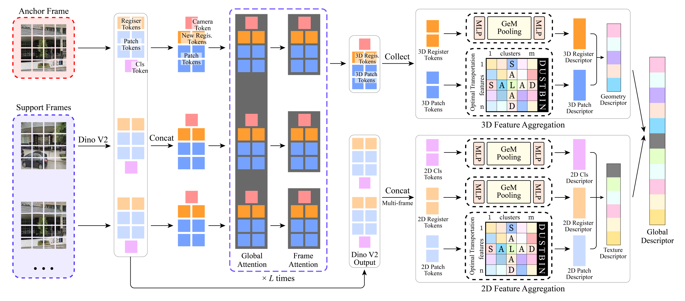

**原文**: [本地](../论文原件/UniPR-3D.pdf) [网络](https://arxiv.org/abs/2512.21078)

(一个 $Token$ 对应图片中的一个位置，比如墙角、地板纹理， $Token$ 中的各个特征值表示该处特点)
单帧流程：
1. 使用通用图像数据集训练模型，教会模型如何提取特征，并提取一组关键 $Token$  $r_{M×D}$ 
2. 对于候选图集、查询图，从图像中提取各种不同类型的 $Token$ ，再构建全局描述符，具体流程如下：
	1. 对于数量较少但重要的 $Token$ ，采用 $GEM$ 池化，对特征取幂平均（$GeM(F)=(\frac{1}{N}\sum_{i=1}^{N}f_{i}^{p}​)^{\frac{1}{p}}$ ，$f_i$ 为特征) ，得到描述符 $d_{cls2d}=MLP((\frac{1}{N}\sum_{i=1}^{N}f_{cls2d}^{p}​)^{\frac{1}{p}})$ ，( $reg2d、reg3d$ 等同理)
	2. 对于数量较多的 $Token$ ，有 $N$ 个 $Token$ ，每个 $Token$ 有 $D$ 个特征，整体使用矩阵 $t_{N×D}$ 标识。
	3. 通过 $s_{2d} = W_{2d_2} \left( \sigma \left( W_{2d_1} \left( t_{2d} \right) + b_{2d_1} \right) \right) + b_{2d_2}$ ( $3d$ 同理，$W$ 为权重矩阵， $b$ 为偏置矩阵)生成重要性矩阵 $s_{N×1}$ (每个 $Token$ 的重要性，比如，类似描述天空的不适合定位的 $Token$ 的重要性低)
	4. 使用关键 $Token$ 组 $r_{M×D}$ (通过训练完成的模型获得)和图片本身的 $Token$ 组 $s$ (不是重要性矩阵)，构建匹配得分矩阵 $S_{N×M}$ ，其中 $s_{i,j}$ 表示图的第 $i$ 个 $Token$ 和关键 $Token$ 组的第 $j$ 个 $Token$ 的匹配得分(余弦相似度之类的算法)
	5. 令 $s'_{N×1}=z1_n$ ( $z$ 为训练完成后的固定参数，例如 $s'=[0.3]_N$ )，$\overline{P}_{N×(M+1)}=[S,s']$ ，$s'$ 表示垃圾桶列(收集无用权重，过滤噪声)
	6. $Sinkhorn$ 算法迭代归一化（满足行和为 $μ$ 、列和为 $ν$ ），$μ、ν$ 就是两组 $Token$ 对应的重要性矩阵 $s$ ，垃圾桶列的列和值 $k_{垃圾桶}=\sumμ_i-\sumν_i$ (前者为行和矩阵 $N×1$ )，
		- **行归一化**：把每一行的和，强行变成要求的 行和 $μ$ 
		- **列归一化**：把每一列的和，强行变成要求的 列和 $ν$ 
		- 类似把第 $i$ 行和按比例改变成 $μ_i$ 。多次行、列归一化后会收敛
		- 垃圾桶会吸收 对应不合适 的值，提高 对应合适 的值
		最终，去除垃圾桶列得到矩阵 $P_{N×M}$ 
	7. $H_{M×D}=(P_{N×M})^T·t_{N×D}$ ，之后计算描述符 $d_{2d}$ ，其为 $1×D$ 向量，为 $H$ 的列和( $3d$ 等同理)
	8. 最终图片的全局描述符 $d_{1×...}$ 为 $d_{cls2d}、d_{reg2d}、d_{2d}、d_{3d}$ 等描述符的水平拼接
3. 创建向量数据库，存放候选图的全局描述符
4. 查询时，使用查询图的全局描述符在数据库中检索

多帧流程：
1. 通过模型获得全局 $Token$ ，$2d、3d$  $Token$ 
2. 定义序列的第一帧为锚定帧，将其相机坐标系设为整个序列的世界坐标系基准，计算获得：锚定帧的世界坐标系基准参数、锚定帧的 $3D$ 特征
3. 根据坐标基准，使用 $VGG-T$ ，将所有带 $3d$ 坐标的 $Token$ 对齐
4. 对每一帧的全局 $Token$ ( $2D$ $CLS$  $Token$ 、$2D$ 寄存器 $Token$ 、对齐后的 $3D$ 寄存器 $Token$ )，分别送入训练好的单层 $MLP$ 做非线性变换，映射到适合跨帧融合的特征空间
5. 把 $MLP$ 变换后的全局 $Token$ (比如 $2D$ $CLS$  $Token$ )，送入训练好的多帧投影器，做跨帧 $GeM$ 池化：$d_{cls2d-seq}=MLP((\frac{1}{N}\sum_{i=1}^{N}f_{cls2d,i}^{p}​)^{\frac{1}{p}})$ ，( $reg2d-seq、reg3d-seq$ 等同理)，获得描述符
6. 将 $2d、3d$ 补丁 $Token$ 通过单帧流程获得 $d_{patch2d}、d_{patch3d}$ 描述符，再池化获得 $d_{patch2d-seq}、d_{patch3d-seq}$ 
7. 最终的全局描述符 $d_{1×...}$ 为 $d_{cls2d-seq}、d_{reg2d-seq}、d_{patch2d-seq}、d_{patch3d-seq}、d_{patch3d-seq}$ 等描述符的水平拼接
## 相关链接

- [[DC-VLAQ|DC-VLAQ]]
- [[SpatiaLoc|SpatiaLoc]]
