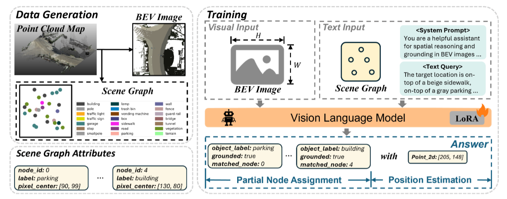

**原文**: [本地](../论文原件/VLM-Loc.pdf) [网络](https://arxiv.org/abs/2603.09826)

1. 对于每个点云文件，提取每个 3D 物体，之后跨文件合并 3D 物体，得到场景中的所有物体实例。
2. 对于每个实例，通过不同程度的降采样，稀疏化物体的点云（过滤掉较少点的实例），方便计算
3. 根据固定大小的方块，分割点云图（不是全覆盖分割，存在空隙），根据方块绘制 BEV 图（俯瞰图，不用考虑 z 轴，但是要考虑重叠）。
4. 根据一定间隔，对轨迹进行采样，对每个采样点，建一个格子，存到数据库 cell 中。以下是输出 pose（根据<x,y> 生成该视角的描述） 的流程：
	- 取一个 pose_location
		↓
	- 随机偏移（模拟用户不在轨迹上）
		↓
	- 找最近的数据库 Cell → 记为 Best Cell
		↓
	- 以位姿为中心建临时 Pose Cell
		↓
	- 从 Pose Cell 里选对象，生成描述
		↓
	- 把描述 ground 到 Best Cell（检查是否匹配）
		↓
	- 封装成 Pose 对象（含位姿坐标 + 匹配的描述）
		↓
	- 重复以上流程，直到所有位置处理完
		↓
	- 返回 poses 列表，用来训练模型
5. 将预备数据打包成 pkl 文件存放，方便复用
6. 根据 pkl 打包输出：messages + images，一条 ms-swift 训练样本
7. 模型根据 BEV图 + 场景物体 Json，预测 $x_{预测},y_{预测}$ ，再跟 $x_{具体},y_{具体}$ 比较，通过 lora 微调模型

## 相关链接

- [[VLM-Loc-Code|VLM-Loc-Code]]
- [[SpatiaLoc|SpatiaLoc]]
- [[Lora微调|Lora微调]]
