> [!info] 考试信息
> **教材**：[数据结构(C语言版)].严慰敏_吴伟民
>
> **题型**：10 判断（概念、定理）+ 10 选择 + 10 填空（计算）+ 6 解答（过程、结果）+ 2 编程（抽象后的编程题）
>
> > [!warning] 不考内容
> > - 带 `*` 的都不考
> > - 存储相关内容
> > - 外部排序
> > - 文件
> >   - 但需了解：**文件是由大量数据相同的记录组成的集合**

> [!abstract] 目录
> - [[#绪论]]
> - [[#线性表]]
> - [[#栈和队列]]
> - [[#串]]
> - [[#数组和广义表]]
> - [[#树和二叉树]]
> - [[#图]]
> - [[#查找]]
> - [[#内部排序]]
> - [[#代码题]]

---

## 绪论

### 数据结构定义

1. **狭义**：在本书中，数据结构被定义为相互之间存在一种或多种特定关系的数据元素的集合。这种定义强调了数据内部的数学特性，通常用一个二元组表示：
   $$
   Data\_Structure = (D, S)
   $$
   - **D**：是数据元素的有限集。
   - **S**：是 D 上关系的有限集。

2. **广义**：从计算机加工数据的角度来看，完整的数据结构概念包含了以下三个不可分割的方面：
   1. **逻辑结构**：数据元素之间的抽象关系（如线性、树形、图形结构）。
   2. **存储结构**：数据及其关系在计算机中的物理表示（如顺序存储、链式存储）。
   3. **算法（操作）**：施加在这些数据上的操作及其实现（如查找、排序等）。

> [!important] 核心区别
> - **狭义**侧重于数据元素之间的**逻辑关系**，是一种抽象的数学模型。
> - **广义**则更贴合工程实践，认为数据结构必须考虑其在计算机中的**存储实现**以及伴随其上的**运算操作**。

### 一堆概念（P4）

| 概念 | 关键词 | 对应数据库/Excel |
|------|--------|-----------------|
| **数据** | 总称 | 整个硬盘的信息 |
| **数据对象** | 集合、性质相同 | 一张工作表 (Table) |
| **数据元素** | 基本单位 | 一行记录 (Row) |
| **数据项** | 最小单位 | 一个字段 (Field) |
| **数据结构** | 关系 | 表与表、行与行之间的组织方式 |

> [!example] 形象化总结 — "学生档案库"
> - **数据**：整个档案库里的所有信息（包括纸质扫描件、录音等）。
> - **数据对象**：全体在校生的档案（强调"学生"这一类性质相同的人）。
> - **数据元素**：张三的这一份个人档案（它是处理的最小整体）。
> - **数据项**：档案里填写的"民族：汉"（这是档案里最小的单位）。
> - **数据结构**：档案是怎么摆放的——是按学号排好（线性结构）？还是按班级、年级分层存放（树形结构）？

### 数据结构的 4 类基本结构

- 集合
- 线性结构
- 树形结构
- 图状结构或网状结构

### 两种结构

#### 1. 逻辑结构
指数据元素之间的**抽象关系**，与数据在计算机中的具体存储方式无关。**分类**（书中将其概括为四类）：
- **集合结构**：元素之间除了"同属于一个集合"外，无其他关系。
- **线性结构**：元素之间存在"一对一"的关系（如：线性表、栈、队列）。
- **树形结构**：元素之间存在"一对多"的关系（如：二叉树）。
- **图形结构**：元素之间存在"多对多"的关系（如：网、图）。

#### 2. 物理结构
指数据结构在计算机中的**表示**（又称映像），即逻辑结构在内存中的具体实现。**主要形式**：
- **顺序存储结构**：借助元素在存储器中的**相对位置**来表示数据元素之间的逻辑关系。通常在 C 语言中利用**数组**实现。
- **链式存储结构**：借助指示元素存储地址的**指针**来表示数据元素之间的逻辑关系。

### 算法的 5 个重要特性

| 特性 | 说明 |
|------|------|
| **有穷性** | 一个算法必须总是（对任何合法的输入值）在执行**有穷步**之后结束，且每一步都可在有穷时间内完成。 |
| **确定性** | 算法中每一条指令必须有确切的含义，读者理解时不会产生二义性。在任何条件下，算法只有唯一的一条执行路径，即**相同的输入只能得出相同的输出**。 |
| **可行性** | 算法中描述的操作都是可以通过已经实现的基本运算执行**有限次**来实现的。 |
| **输入** | 一个算法有**零个或多个**输入。这些输入取自于某个特定的对象的集合。 |
| **输出** | 一个算法有**一个或多个**输出。这些输出是同输入有着某些特定关系的量。 |

### 算法的要求

- **正确性**：算法应当满足具体问题的需求，能够正确执行并得出预期的结果。
- **可读性**：算法主要是为了人的阅读与交流，其次才是计算机执行。因此，结构应当清楚、易于理解。
- **健壮性**：当输入数据非法时，算法也能适当地做出反应或进行处理，而不会产生莫名其妙的输出结果。
- **效率与低存储量需求**：
  - **效率**：通常指算法执行的时间。对于同一个问题，执行时间短的算法效率更高。
  - **存储量需求**：指算法执行过程中所需要的最大存储空间。

### 时间复杂度

算法中所有语句的频度（执行次数）之和。通常记作 $T(n) = O(f(n))$，其中 $n$ 为问题规模。

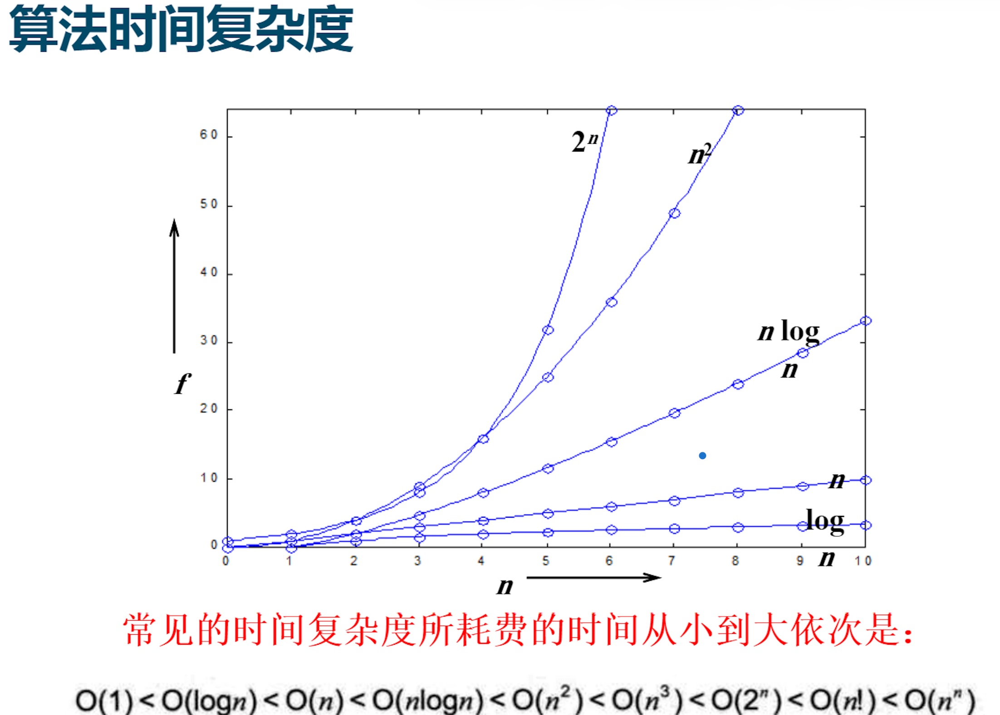

### 空间复杂度

算法在运行过程中所需存储空间的度量。记作 $S(n) = O(g(n))$。

---

## 线性表

### 一些代码

**顺序表**——通过初始化创建内部数组指针

```c
#define MAXSIZE 100             //顺序表可能达到的最大长度
typedef struct {
    ElemType *elem;         //存储空间的基地址
    int length;             //当前长度
} SqList;                   //顺序表的结构类型为SqList
```

**链式表**——节点定义

```c
typedef struct LNode {
    ElemType data;          //结点的数据域
    struct LNode *next;     //结点的指针域
} LNode, *LinkList;         //LinkList 为指向结构体 LNode 的指针类型
```

**有序链表的 merge**（有头节点）

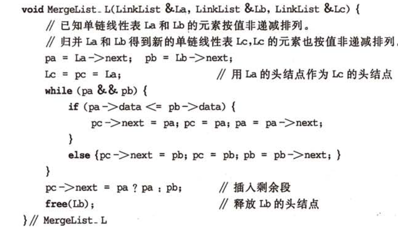

其他略（基本都简单）。

### 增删改查

- 先检查索引参数是否异常，再检查是否会导致溢出。
- **增**：记得改变长度。
- **删**：记得改变长度。
- **改**：……
- **查**：通过引用将索引值传出函数。

### 链式存储结构

1. 有头节点、无头节点。
2. **特点**：
   - 物理存储非连续
   - 逻辑关系靠指针表达
   - 非随机存取（顺序存取）——由于没有索引，不能像顺序表（数组）那样通过下标直接访问某个元素。
   - 插入和删除操作方便——**不需要移动元素**。
   - 存储密度较低——每个结点需要额外设置指针域。

> [!tip] 对比总结
> - **空间上**：链表不限制长度，动态分配，但有指针额外开销。
> - **时间上**：链表不支持随机访问（慢），但插入删除不需要移动数据（快）。

### 链表相关函数

增删改查，合并。（有无头节点会导致有点区别）

### 一元多项式的链表表达

- 表达：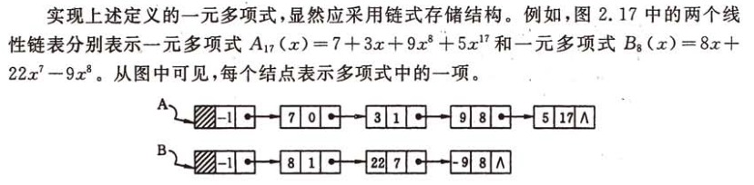
- 相关代码，每一项：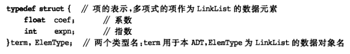
- 简单的加减运算等：有同次项则直接运算，无同次项则添加节点。

### 特殊的链表

- **循环链表**：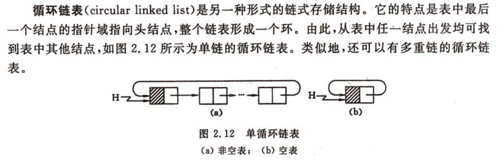
- **双向链表**：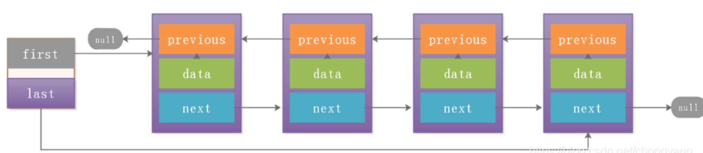

---

## 栈和队列

> [!tip] 实现选择
> - **栈**：一般用顺序表
> - **队列**：一般用链式表
> - **循环队列**：用顺序表

### 一些代码

**顺序栈**

```c
#define MAXSIZE 100         //顺序栈存储空间的初始分配址
typedef struct{
    SElemType *base;        //栈底指针
    SElemType *top;         //栈顶指针
    int stacksize;          //栈可用的最大容扯
}SqStack;
```

- 初始化时，`top = base`，压入元素时，`++top` 再赋值。
- `top = base` 时为空，如果进行取值等操作应该报错。

**链栈**，略。

> [!warning] pop 与 gettop 的区别
> - **pop**：弹出栈，**改变**栈顶指针
> - **gettop**：**不改变**栈顶指针

### 表达式求值 (P54)

**思路**：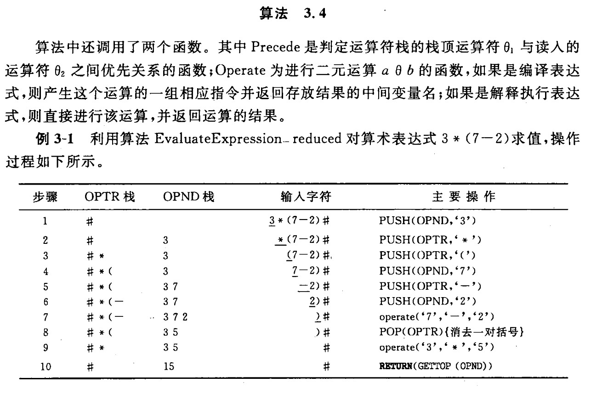

### 递归

> [!important] 阶乘、斐波那契数列——递归实现，注意终止条件

> [!warning] 注意栈初始化指针的位置

---

## 串

### 一些定义

### 块间有序，块内无序

- **块间有序**：第二个块中所有元素的关键字均大于第一个块中的最大关键字，第三个块大于第二个块，依此类推。
- **块内无序**：每一个块内部的元素排列不需要有顺序，可以随机摆放。

### KMP 算法

> [!warning] 具体内容不考，但 next 数组要会求

求 `next[j]` 时，实际上是在寻找模式串第 $j$ 个字符**之前**的子串中，**相等的前缀和后缀的最大长度**，然后加 $1$。

- **第一步**：`next[1]` 恒等于 **0**。
- **第二步**：`next[2]` 恒等于 **1**（因为 $j=2$ 之前只有一个字符，一个字符没有前后缀可言）。
- **第三步（$j \ge 3$）**：观察 $P[1...j-1]$ 这个子串：
  - 找出它所有的相等的前缀和后缀。
  - 找到最长的那一个，假设其长度为 $L$。
  - 则 `next[j] = L + 1`。

**示例**：模式串 $P = \text{"abacaba"}$（严蔚敏版，下标 $j$ 从 1 开始）

| **j** | **模式串字符** | **j 之前的子串** | **相等前后缀** | **L (长度)** | **next[j] (L+1)** |
|-------|---------------|-----------------|--------------|-------------|------------------|
| 1     | a             | (无)             | -            | -           | **0**            |
| 2     | b             | "a"             | 无           | 0           | **1**            |
| 3     | a             | "ab"            | 无           | 0           | **1**            |
| 4     | c             | "aba"           | "a"          | 1           | **2**            |
| 5     | a             | "abac"          | 无           | 0           | **1**            |
| 6     | b             | "abaca"         | "a"          | 1           | **2**            |
| 7     | a             | "abacab"        | "ab"         | 2           | **3**            |

---

## 数组和广义表

### 数组

一般不进行插入、删除操作。

### 数组无加工型操作

> [!info] 定义
> 对数据结构进行查找、读取或遍历，但**不改变数据元素本身的值**，也不改变数据元素之间的**逻辑结构**（如不进行插入、删除、修改）的操作。

### 寻址公式

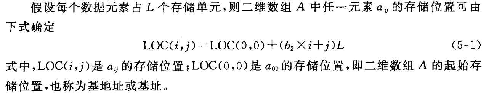

> [!warning] 注意数组是按照列还是行排列的

### 特殊矩阵

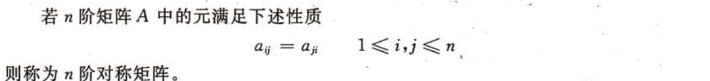
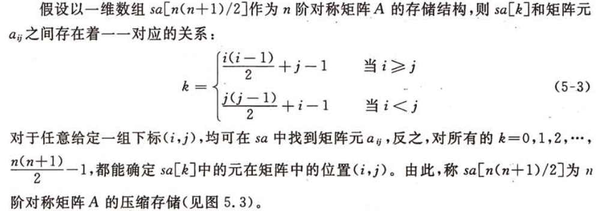
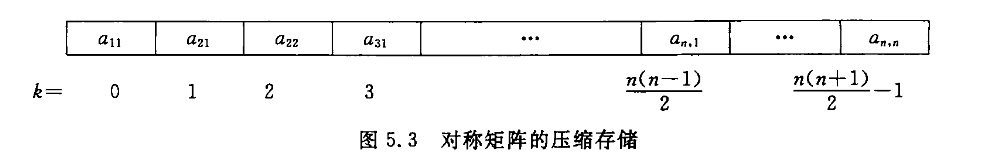

### 稀疏矩阵

假设在 $m \times n$ 的矩阵中，有 $t$ 个元素不为零。令 $\delta = \frac{t}{m \times n}$，称 $\delta$ 为矩阵的**稀疏因子**。通常认为 $\delta \le 0.05$ 时称为**稀疏矩阵**。

**压缩——三元组表示法**：

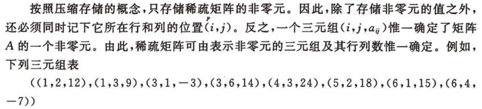

### 广义表

- 广义表是线性表的推广，也称为列表。
  - 广义表是 $n (n \ge 0)$ 个元素的一个序列，表中的元素可以是称为原子的单个元素，也可以是一个子表。若 $n = 0$ 时则称为空表。
  - $LS = ( a_1, a_2, \cdots, a_n )$，$a_i$ 为单个元素或子表。
- **表头**：广义表中的**第一个元素**，即 $a_1$。
- **表尾**：指除去表头之外，由**剩余元素构成的表**，即 $(a_2, a_3, \cdots, a_n)$。

> [!danger] 特别注意
> 表尾**一定是一个广义表**，即使剩余元素只有一个，也要用括号括起来。如果除去表头后没有剩余元素，表尾就是**空表 `()`**。

---

## 树和二叉树

### 一堆概念

- 树节点、子树、度等。
- 二叉树是**有序树**（左右子树不能换），其他树是无序树。

> [!warning] 黑体字基本都要求

### 二叉树的性质

> [!important] 核心性质
> 1. 在二叉树的第 $i$ 层上**至多**有 $2^{i-1}$ 个结点（$i \ge 1$）
> 2. 深度为 $k$ 的二叉树**至多**有 $2^k - 1$ 个结点（$k \ge 1$）
> 3. 对任何一棵二叉树 $T$，如果其终端结点数为 $n_0$，度为 2 的结点数为 $n_2$，则 $n_0 = n_2 + 1$
> 4. 具有 $n$ 个结点的完全二叉树的深度为 $\lfloor \log_2 n \rfloor + 1$
> 5. 对一颗有 $n$ 个结点的完全二叉树按层序编号，对任一结点 $i (1 \le i \le n)$ 有：
>    - 如果 $i = 1$，则结点 $i$ 是根，无双亲；如果 $i > 1$，则其双亲是结点 $\lfloor i/2 \rfloor$
>    - 如果 $2i > n$，则结点 $i$ 无孩子（叶子结点）；否则左孩子是结点 $2i$
>    - 如果 $2i + 1 > n$，则结点 $i$ 无右孩子；否则右孩子是结点 $2i + 1$

### 先、中、后序（迭代）遍历代码

> [!tip] 其他遍历方式不要求

**1. 中序遍历 (Inorder Traversal)**

只要当前结点存在或栈不为空，就一直向左走并将沿途结点压栈；走到头后，弹出栈顶元素并访问，然后转向该结点的右子树。

```c
Status InOrderTraversal(BiTree T) {
    InitStack(S);
    BiTree p = T;
    while (p || !StackEmpty(S)) {
        if (p) {
            Push(S, p);          // 根指针进栈
            p = p->lchild;       // 遍历左子树
        } else {
            Pop(S, p);           // 根指针退栈
            printf("%d ", p->data); // 访问根结点
            p = p->rchild;       // 遍历右子树
        }
    }
    return OK;
}
```

**2. 先序遍历 (Preorder Traversal)**

先序遍历与中序非常相似，区别仅在于**访问结点的时机**：在结点进栈之前就进行访问。

```c
Status PreOrderTraversal(BiTree T) {
    InitStack(S);
    BiTree p = T;
    while (p || !StackEmpty(S)) {
        if (p) {
            printf("%d ", p->data); // 访问根结点（进栈前访问）
            Push(S, p);
            p = p->lchild;
        } else {
            Pop(S, p);
            p = p->rchild;
        }
    }
    return OK;
}
```

**3. 后序遍历 (Postorder Traversal)**

后序遍历最复杂，因为需要保证**左、右子树都访问完后**才能访问根结点。需要一个辅助指针 `r` 来记录上一个访问过的结点，以判断是从左子树返回的还是从右子树返回的。

```c
Status PostOrderTraversal(BiTree T) {
    InitStack(S);
    BiTree p = T;
    BiTree r = NULL; // 用于记录最近访问过的结点
    while (p || !StackEmpty(S)) {
        if (p) {
            Push(S, p);
            p = p->lchild;       // 走到最左边
        } else {
            GetTop(S, p);        // 取栈顶看一眼，先不弹出
            // 如果右子树存在 且 未被访问过
            if (p->rchild && p->rchild != r) {
                p = p->rchild;   // 转向右子树
            } else {
                Pop(S, p);       // 弹出并访问
                printf("%d ", p->data);
                r = p;           // 记录最近访问过的结点
                p = NULL;        // 访问完后重置p，继续弹出栈顶
            }
        }
    }
    return OK;
}
```

### 线索二叉树

### 森林和二叉树的转换

> [!important] 树变成二叉树**没有**右孩子

### 哈夫曼树

- 黑字部分都要知道，缩写稍微记一下。
- ……是最优二叉树或哈夫曼树。
- **哈夫曼编码**，最好写一下对应关系，即 A: 0, B: 10, ……

---

## 图

### 概念和性质

- 边数小于 $n \log n$ 的图叫**稀疏图**，反之叫**稠密图**。
- 带权的图称为**网**。
- 若有两个图 $G = (V, E)$, $G_1 = (V_1, E_1)$，若 $V_1$ 是 $V$ 的子集且 $E_1$ 是 $E$ 的子集，称 $G_1$ 是 $G$ 的子图。
- **邻接点**：直接相连的两个点。
- 边 $e(v, v')$，$v, v'$ 是两端点，则称 $e$ 与 $v, v'$ 项关联。
- **连通图**：任意两点相连通的图。（有向图中满足这个要求的话称为**强连通图**）
- **连通分量（极大连通子图）**：对于一个子图，如果你再尝试从原图中增加任何一个顶点进去，这个子图就不再连通了，那么这个子图是极大连通子图。（边和点尽可能多）（有向图中满足这个要求的话称为**强连通分量**）
- **极小连通子图**：对于一个子图，如果你再尝试从子图中删除任何一个顶点，这个子图就不再连通了。
- **生成树**：
  - 无向图：再向子图中加入边则会形成环。
  - 有向图：一个节点入度为 0，其他节点入度为 1。一个有向图可能不会形成生成树，而会形成森林。

### 存储结构（n 点，m 边）

| 结构 | 复杂度 |
|------|--------|
| 邻接矩阵 | $n \times n$ |
| 邻接表 | $n \times m$ |

**十字链表**：由两种结点组成——**顶点结点**和**弧结点**。

1. **顶点结点**，每个顶点由三个域组成：
   - **data**：存储顶点信息。
   - **firstin**：指向以该顶点为**终点**的第一条弧（入边）。
   - **firstout**：指向以该顶点为**起点**的第一条弧（出边）。

2. **弧结点**，每条边由五个域组成：
   - **tailvex**：起点。
   - **headvex**：终点。
   - **hlink**：指向**弧头相同**的下一条弧（寻找入边）。
   - **tlink**：指向**弧尾相同**的下一条弧（寻找出边）。
   - ~~**info**：存储弧的相关信息（如权值）。~~

- 邻接多重表

### BFS、DFS

> [!tip] 代码不需要，但手动获得结果需要掌握
> - **BFS**：一层层向外，队列
> - **DFS**：一次走完，栈

### 最小生成树

> [!tip] 会根据两个算法画图
> - **Prim 算法**：遍历节点，找到相邻最短边，再从子图出发继续找短边，如果加入子图后会成环则跳过，找次短边……
> - **Kruskal 算法**：排序边，遍历边，把短边依次加入图，如果加入子图后会成环则跳过，继续向后……

### 拓扑排序

- 答案不唯一。
- **逆拓扑排序**：把从入度考虑改为从出度考虑。
- 求关键路径需要先做拓扑排序，做完后稍微讲一下。

### 关键路径

- 路径长度最长的路径叫做**关键路径**。
- 最早、最晚发生时间相同的称为**关键事件**，关键事件不得延误。
- 其组成的序列就是关键路径。

### 最短路径

> [!tip] 不要求代码
> - **Dijkstra**：$O(n^2)$
> - **Floyd**：$O(n^3)$

> [!warning] 做题时**仔细画表**

> [!warning] P190 的图，可能让你画

> [!warning] 没有写代码的部分

---

## 第 8 章

> [!danger] 不考

---

## 查找

### 代码

> [!warning] 都要考：二分、顺序等

### 一些概念

- **静态查找**：在查找过程中只是对数据元素进行查找。
- **动态查找**：在实施查找的同时，插入找不到的元素，或从查找表中删除已查到的某个元素，即允许表中元素变化。
- **分块查找**：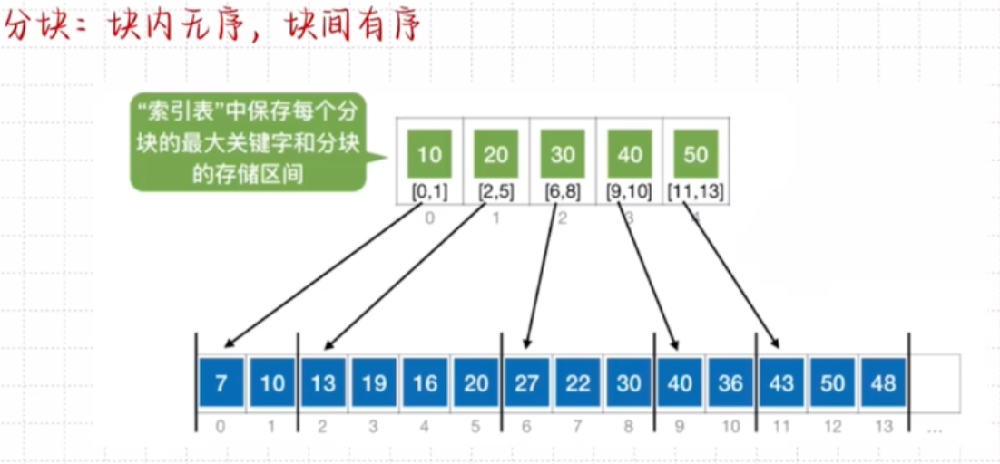

### 平均查找长度

> [!important] 公式汇总

**顺序查找**：
$$
ASL = \frac{n+1}{2}
$$

**折半查找**：画树、计算。

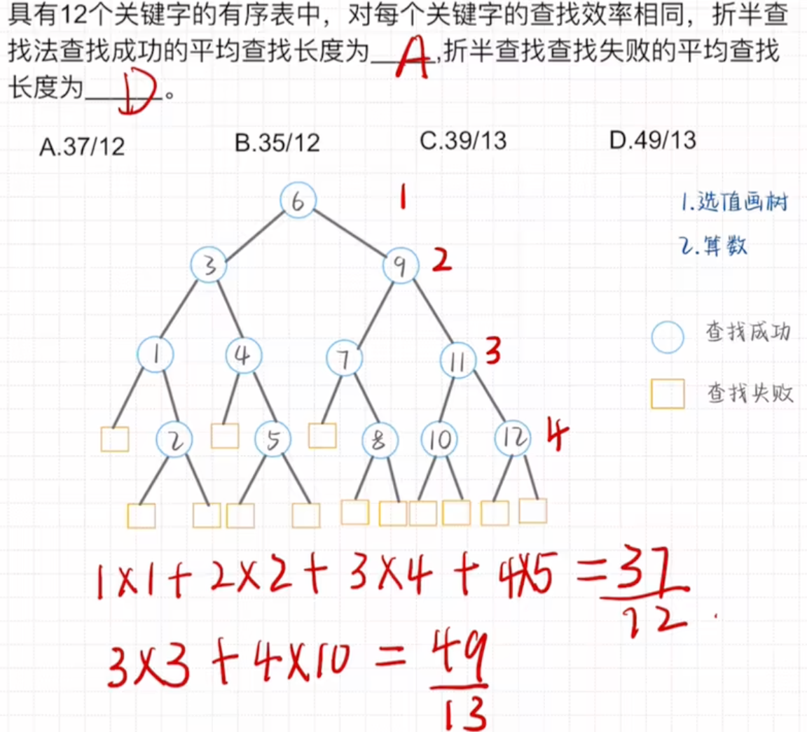

- 成功的平均查找长度：$\frac{\sum 各层圆形数 \times 层数}{总节点数}$
- 失败的平均查找长度：$\frac{\sum 各层方形数 \times (层数 - 1)}{总节点数 + 1}$
- 标准公式：$ASL = \frac{n+1}{n} \log_2 (n+1) - 1$
  - 当 $n > 50$ 时，$ASL \approx \log_2 (n+1) - 1$

**分块查找**：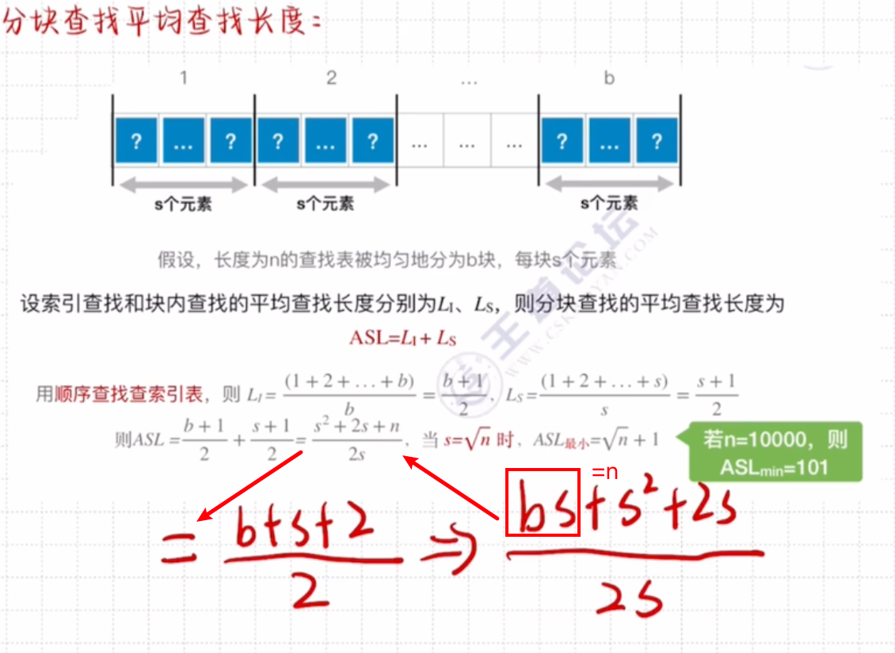

> [!warning] 折半查找，知道 low、high 的意义

### 红黑树

> [!tip] 稍微了解一下（概念）

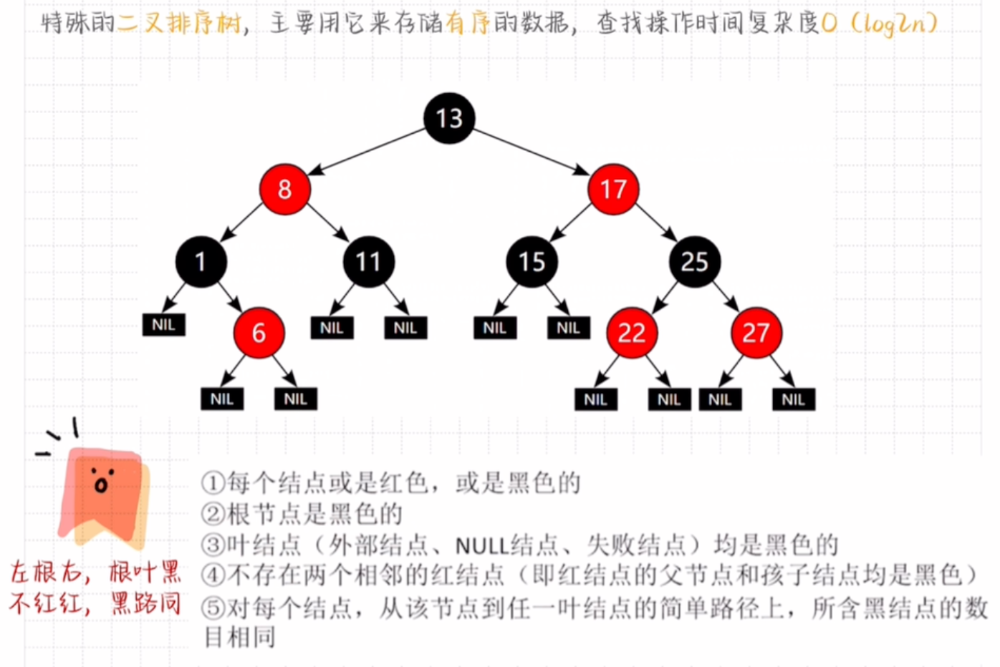

### 平衡二叉树

- **平衡因子**：左子树的深度 - 右子树的深度。
- 值只能为 $-1, 0, 1$。

> [!tip] 会如何构造平衡二叉树
> - [速成视频](https://www.bilibili.com/video/BV1ZX4y1z7G1?spm_id_from=333.788.videopod.sections&vd_source=3aa36fe5332c3a1abbd4eadd1053a0d0)
> - 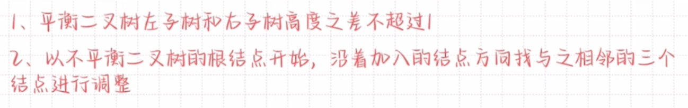

### B 树

> [!warning] 构造、操作等，有点难度
> - [了解视频 1](https://www.bilibili.com/video/BV1tJ4m1w7yR/?spm_id_from=333.337.search-card.all.click&vd_source=3aa36fe5332c3a1abbd4eadd1053a0d0)
> - [了解视频 2](https://www.bilibili.com/video/BV1JU411d7iY?spm_id_from=333.788.videopod.sections&vd_source=3aa36fe5332c3a1abbd4eadd1053a0d0)

### B+ 树

没 B 树重要。

### 哈希表的散列函数 H(key)

1. **直接定址法**：$H(key) = key$ 或 $H(key) = a \cdot key + b$
2. **数字分析法**：直接分析数字，如手机号后四位
3. **平方取中法**：假设关键字为 1234，$1234^2 = 1522756$，取 227
4. **折叠法**：假设关键字 9876543210，分为四组 987 \| 654 \| 321 \| 0，$987 + 654 + 321 + 0 = 1962$，取 1962
5. **除留余数法**：$x \% k$
6. **随机数法**

### 处理哈希冲突的方法

1. **开放地址法**
   - 线性探测
   - 平方探测
   - 伪随机再探测法
   - 双散列法
   - [参考视频](https://www.bilibili.com/video/BV1EL411675e?spm_id_from=333.788.videopod.sections&vd_source=3aa36fe5332c3a1abbd4eadd1053a0d0)
2. **再哈希法**
3. **链地址法**
4. **建立一个公共溢出区**

### 平均查找长度

> [!tip] 不同解决方案各不相同
> - [参考视频](https://www.bilibili.com/video/BV13NwveLE1D?spm_id_from=333.788.videopod.sections&vd_source=3aa36fe5332c3a1abbd4eadd1053a0d0)

### 装填因子

$$
\alpha (\text{装填因子}) = \frac{n (\text{表中元素})}{m (\text{表长})}
$$

- 值越大，越容易发生冲突。
- 值越小，越不容易发生冲突，但是空间利用率低。

> [!tip] 对于题目要求特定的 $\alpha$
> 可采用 $m (\text{表长}) = \frac{n (\text{表中元素})}{\alpha (\text{装填因子})}$，进而求除留余数法中的除数，要求 $k$ 为小于等于 $m$ 的最大质数。

> [!warning] 哈希表不用代码，但是要会画图

> [!warning] 简单的代码要掌握

---

## 内部排序

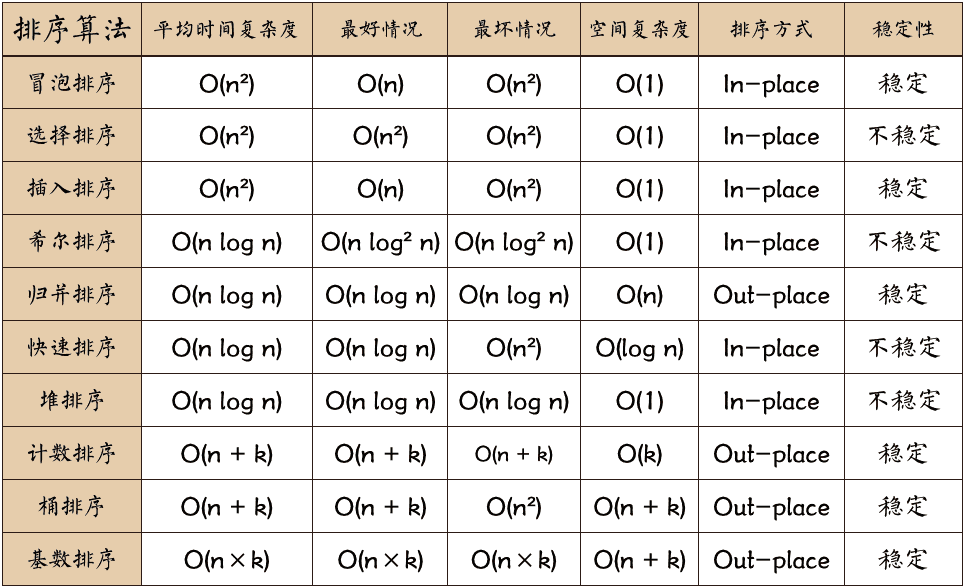

> [!tip] [速记小故事](https://www.bilibili.com/video/BV1Mm4y1t7bk?spm_id_from=333.788.videopod.sections&vd_source=3aa36fe5332c3a1abbd4eadd1053a0d0)

> [!warning] 考试要求
> - ==希尔、快速、堆排序代码不要求==，但要掌握手动排序，会画图
> - ==希尔排序最后步长为 1==
> - ==堆排序的过程是解答题==
> - ==归并要会代码==
> - ==基数排序——比较和记录两种操作==

---

## 代码题

> [!warning] 注意分配内存时，需要判断是否分配成功
> ```c
> ad = (ElemType *)malloc(sizeof(ElemType) * MAXSIZE);
> if(!ad) return ERROR;
> ```

**重点范围**：线性表，二叉树，查找和排序。
