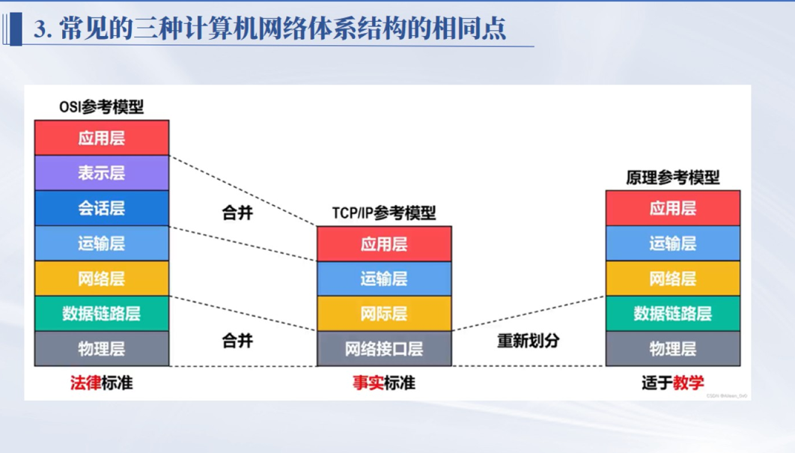
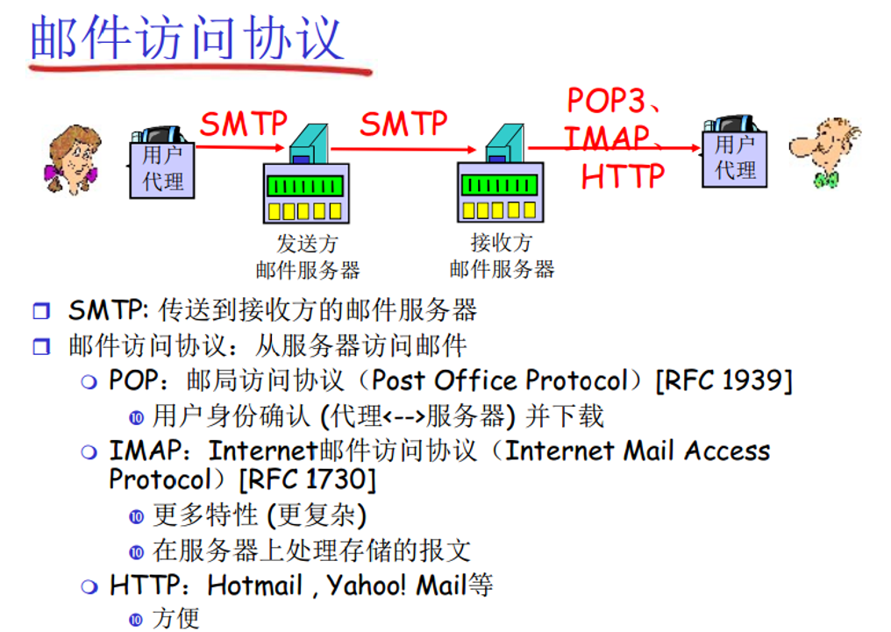
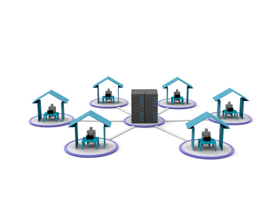
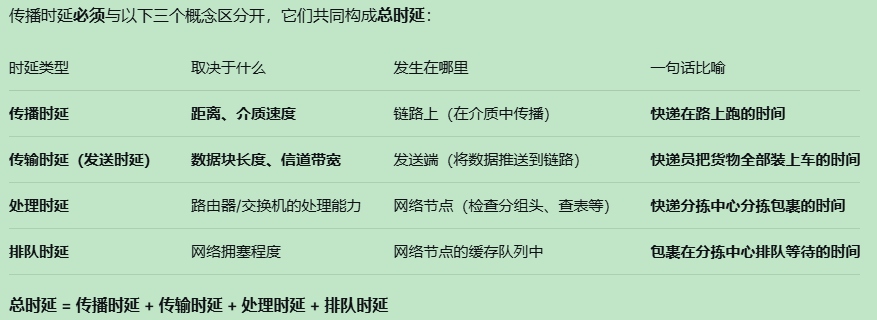
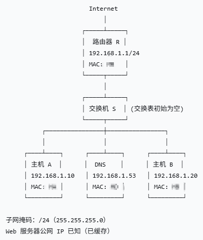

## 体系结构与分层

### 三种体系结构

- OSI 参考模型：应用层、表示层、会话层、运输层、网络层、数据链路层、物理层。它更像法律标准或理论标准。
- TCP/IP 参考模型：应用层、运输层、网际层、网络接口层。它是互联网事实标准。
- 原理参考模型：应用层、运输层、网络层、数据链路层、物理层。它常用于教学和考试。

层次对应关系：

- OSI 的应用层、表示层、会话层，在 TCP/IP 中大体并入应用层。
- OSI 的数据链路层、物理层，在 TCP/IP 中大体并入网络接口层。
- 原理参考模型是在 TCP/IP 基础上，为了讲清楚网络原理而重新划分。

### 各层通信对象

- 应用层：用户或应用程序与网络之间的服务接口。
- 传输层：进程到进程通信，关键标识是端口号。
- 网络层：主机到主机通信，关键是 IP 地址、路由选择和分组转发。
- 数据链路层：相邻节点到相邻节点通信，关键是帧、MAC 地址、交换机和 ARP。
- 物理层：比特流在物理介质上传输，关心电气、机械、时序等接口特性。

### IP、MAC、端口号

- MAC 地址：48 位，物理地址，扁平结构，用于同一链路内交付帧。
- IP 地址：IPv4 为 32 位，IPv6 为 128 位，逻辑地址，分层结构，用于跨网络寻址和路由。
- 端口号：16 位，传输层标识进程，用于把数据交给正确应用。

发送数据时，应用数据逐层封装。跨网络转发过程中，源/目的 IP 通常保持不变，但链路层源/目的 MAC 会随着每一跳改变。

## 01 应用层

### 应用层概述

应用层是 OSI 七层模型的最高层，为用户提供网络服务接口。例如 HTTP 用于浏览器访问网页，FTP 用于文件传输，SMTP/POP3/IMAP 用于邮件服务。

应用层协议通常基于 TCP 或 UDP：

- HTTP/HTTPS、FTP、SMTP 等通常基于 TCP。
- DNS 常规查询通常基于 UDP。
- UDP 数据报传输时，要加 UDP 首部，通常 8 B。
- TCP 段传输时，要加 TCP 首部，无选项时通常 20 B。

做分片、传输长度、首部长度题时，要先看题目问的是应用层数据、TCP/UDP 段，还是 IP 数据报。

### 邮件访问协议

邮件系统常见流程：

1. 发送方用户代理把邮件交给发送方邮件服务器。
2. 发送方邮件服务器用 SMTP 把邮件传送到接收方邮件服务器。
3. 接收方用户代理用 POP3、IMAP 或 HTTP 从邮件服务器访问邮件。

协议区别：

- SMTP：简单邮件传输协议，负责发送邮件。
- POP3：邮局协议第 3 版，偏向把邮件下载到本地，用户身份确认后下载。
- IMAP：Internet 邮件访问协议，功能更复杂，偏向在服务器上处理和同步邮件。
- HTTP：网页邮箱常用，使用方便。

### DNS 域名系统

DNS 的作用是把域名解析为 IP 地址，也可能返回别名、邮件服务器等记录。DNS 采用层次结构，例如 `www.baidu.com` 中，`com` 是顶级域，`baidu` 是二级域，`www` 是主机名。

DNS 服务器类型：

- 根域名服务器：负责引导到顶级域名服务器。常说全球有 13 组根服务器。
- 顶级域名服务器：负责 `.com`、`.cn` 等顶级域。
- 权威域名服务器：保存具体域名的权威记录。
- 本地域名服务器：主机首先查询的 DNS 服务器，IP 可手动配置，也可通过 DHCP 获得。

递归查询和迭代查询：

- 递归查询：我问你，你必须给我最终答案或错误。典型场景是主机向本地域名服务器查询。
- 迭代查询：我问你，你告诉我下一步该问谁。典型场景是本地域名服务器依次查询根、顶级域、权威服务器。

标准解析过程：

1. 浏览器或主机检查本地缓存，若命中则直接得到 IP。
2. 未命中时，主机向本地域名服务器发起递归查询。
3. 本地域名服务器若无缓存，向根域名服务器迭代查询，得到顶级域名服务器地址。
4. 再向顶级域名服务器查询，得到权威域名服务器地址。
5. 最后向权威域名服务器查询，得到目标域名对应 IP。
6. 本地域名服务器缓存结果，并返回给主机。

易错点：

- DNS 常规查询通常用 UDP 53。
- 区域传送或响应过大等场景可能用 TCP 53。
- 主机上的 DNS 客户端请求的是本地域名服务器，不是直接一开始就问根服务器。

### HTTP 协议

HTTP 本身是应用层协议。基础题如果没有特别说明，一般按 HTTP over TCP 处理。HTTPS 是 HTTP + TLS + TCP。HTTP/3 运行在 QUIC 上，QUIC 基于 UDP，但普通期末题多数不展开 HTTP/3。

常见请求方法：

- GET：获取资源，参数常出现在 URL 中，静态资源常可缓存。
- POST：提交数据，请求体中携带数据，常见于登录、表单、下单等。

常见状态码：

- 200：请求成功。
- 301/302：重定向。
- 404：请求资源不存在。
- 500：服务器内部错误。

HTTP 报文结构：

- 请求报文：请求行、首部字段、空行、实体体。
- 响应报文：状态行、首部字段、空行、响应体。

请求报文常见字段：

- `Host`：目标主机名，HTTP/1.1 必需。
- `User-Agent`：客户端信息。
- `Accept`：客户端可接受的内容类型。
- `Connection`：是否保持连接。
- `Cookie`：客户端携带的状态信息。

响应报文常见字段：

- `Status Code`：状态码，如 200、301、404、500。
- `Content-Type`：实体类型，如 `text/html`。
- `Content-Length`：实体长度。
- `Set-Cookie`：服务器要求客户端保存 Cookie。
- `Cache-Control`：缓存策略。

### HTTP 连接方式和性能

非持续连接：

- 每个对象单独建立 TCP 连接。
- 每个对象都可能经历 TCP 建连开销。

持续连接（非流水线）：

- 多个对象复用同一个 TCP 连接。
- 但请求串行发送，必须等上一个响应回来后再发下一个。

持续连接（流水线）：

- 同一连接上可连续发送多个请求。
- 响应通常仍按请求顺序返回。

计算题常用判断：

- 建立一个 TCP 连接通常需要 1 RTT。
- 发出 HTTP 请求并收到第一个对象，通常再需要 1 RTT 加对象传输时间。
- 非持续连接每个对象都可能重复经历建连。
- 持续连接可以节省后续对象的建连 RTT。
- 页面包含 HTML、图片、CSS、JS 时，不能只算 HTML。

HTTP 缓存：

- 浏览器可缓存图片、CSS、JS 等静态资源。
- 再次访问时若缓存有效，可直接从本地读取，减少服务器请求。
- GET 请求更常被缓存；POST 主要用于提交数据，通常不作为静态资源缓存。
- 典型例子：再次访问同一网页时，图片或 CSS 命中缓存，浏览器可减少 HTTP 请求数量。

### 时延

总时延由四部分构成：

- 传播时延：取决于距离和介质传播速度，发生在链路中，公式可写作 $d / s$。
- 传输时延，也叫发送时延：取决于数据块长度和信道带宽，发生在发送端，公式可写作 $L / R$。
- 处理时延：节点检查分组头、查表、校验等时间。
- 排队时延：分组在路由器或交换机缓存队列中等待的时间，取决于拥塞程度。

总时延：

$总时延 = 传播时延 + 传输时延 + 处理时延 + 排队时延$

易错点：

- 传输时延与数据量有关，传播时延与距离有关。
- 路由器转发场景可能要考虑排队时延。
- HTTP 加载时间容易漏算 TCP 握手时间和不同连接模式差异。

### 从输入域名到显示网页

答题模板：

1. 浏览器检查缓存，必要时进行 DNS 解析。
2. 主机向本地域名服务器查询，得到服务器 IP。
3. 判断目的 IP 是否在同一子网；若不在同一子网，下一跳是默认网关。
4. 若下一跳 MAC 未知，先通过 ARP 获取下一跳 MAC。
5. 浏览器与服务器建立 TCP 连接，通常三次握手。
6. 浏览器发送 HTTP 请求。
7. 服务器返回 HTML。
8. 浏览器解析 HTML，发现图片、CSS、JS 等嵌入对象。
9. 按题目指定的连接方式继续请求这些对象。
10. 资源接收完成后，浏览器渲染页面。

若是 HTTPS，还要增加 TLS 握手。若题目强调交换机/网关，必须写清楚以太网帧的目的 MAC 是下一跳 MAC，而不是远端服务器 MAC。

### 其他应用层协议

- DHCP：动态主机配置协议，用于自动分配 IP、子网掩码、默认网关、DNS 服务器等配置。DHCP 是应用层协议，使用 UDP。
- FTP：文件传输协议，常用于上传下载文件，通常基于 TCP。
- Telnet：远程登录协议，明文传输，不安全，但常作为早期远程登录考点。

## 02 传输层

### 传输层核心使命

传输层提供端到端通信服务，实现主机中进程到进程的数据传输。核心是端口号、可靠传输、流量控制、拥塞控制。

重点：

- 通过端口号区分不同应用进程，例如 HTTP 80、HTTPS 443。
- TCP 通过三次握手、序号确认号、超时重传等机制保证可靠传输。
- Wireshark 抓包要会分析序列号、确认号、传输字节数。
- 要会区分 IP、MAC、端口号的作用和层次。

### TCP 和 UDP

UDP：

- 无连接，发送前不需要建立连接。
- 不可靠，尽力而为交付。
- 面向报文，保留应用层报文边界。
- 首部 8 B，包括源端口、目的端口、长度、校验和。
- 适合 DNS、实时视频会议、语音等场景。

TCP：

- 面向连接。
- 可靠传输。
- 面向字节流。
- 有流量控制和拥塞控制。
- 首部无选项时通常 20 B。
- 重要字段包括源端口、目的端口、序号、确认号、首部长度、标志位、窗口大小、校验和、紧急指针、选项。

核心区别：

- TCP 面向连接，UDP 无连接。
- TCP 可靠，UDP 尽力而为。
- TCP 面向字节流，UDP 面向报文。
- TCP 有流量控制和拥塞控制，UDP 通常没有。
- TCP 首部至少 20 B，UDP 首部 8 B。

### 三次握手

过程：

1. 客户端发送 SYN，选择初始序号 $x$。
2. 服务器回复 SYN + ACK，选择初始序号 $y$，确认号为 $x + 1$。
3. 客户端回复 ACK，确认号为 $y + 1$，序号通常为 $x + 1$。

例子：

- 客户端发 SYN：Seq = 100。
- 服务器回 SYN + ACK：Seq = 200, ACK = 101。
- 客户端回 ACK：ACK = 201。

为什么要三次握手：

- 双方都要确认自己的发送能力和接收能力。
- 双方都要确认对方的发送能力和接收能力。
- 两次握手可能让历史连接请求报文造成错误连接。

注意：

- SYN 占用 1 个序号。
- 普通 ACK 若不携带数据，一般不消耗序号。

### 四次挥手

过程：

1. 主动关闭方发送 FIN。
2. 被动关闭方回复 ACK。
3. 被动关闭方数据发送完后，再发送 FIN。
4. 主动关闭方回复 ACK，并进入 TIME_WAIT。

例子：

- 客户端发 FIN：Seq = 500。
- 服务器回 ACK：ACK = 501。
- 服务器处理完剩余数据后发 FIN：Seq = 600。
- 客户端回 ACK：ACK = 601。

为什么常是四次：

- TCP 是全双工连接。
- 一方不再发送数据，不代表另一方也马上没有数据要发。
- 第二次和第三次可能分开发生。

注意：

- FIN 占用 1 个序号。
- TIME_WAIT 用来保证最后一个 ACK 能被对方收到，并让旧连接中的迟到报文在网络中消失。

### TCP 序号与确认号

TCP 序号按字节编号。确认号表示“期望收到的下一个字节序号”，也就是累计确认。

例子：

- A 从序号 100 开始发送 500 B 数据。
- B 正确收到后，确认号是 600。
- 若 A 发送的 SYN 序号为 100，则 SYN 后第一个数据字节通常从 101 开始。

做题方法：

1. 先判断 SYN、FIN 是否占用序号。
2. 再统计每段携带的数据字节数。
3. 确认号永远写“下一个期望字节”的序号。
4. 超时重传使用原来的序号，不会因为“重传”改成新序号。

易错点：

- 序号是本报文段第一个字节编号。
- 确认号不是“已经收到的最后一个字节”，而是“期望收到的下一个字节”。
- 初始序号 ISN 通常随机生成，首字节数据序号通常是 ISN + 1。

### 流量控制

流量控制解决“接收方来不及收”的问题。核心是接收窗口 $rwnd$。

- 接收方通过窗口大小告诉发送方自己还能接收多少数据。
- 发送方未确认的数据量不能超过接收方通告窗口。
- 如果接收缓存不足，接收方会缩小窗口，发送方降低发送速率。

### 拥塞控制

拥塞控制解决“网络承受不了”的问题。核心是拥塞窗口 $cwnd$。

实际发送窗口通常取：

$发送窗口 = \min(rwnd, cwnd)$

题目说默认单位是 MSS 时，窗口大小按 MSS 个数算。原笔记中一个 MSS 可按 2 KB 记，若题目给具体 MSS，应以题目为准。

常见阶段：

- 慢开始：$cwnd$ 从 1 MSS 开始，通常每经过一个 RTT 近似翻倍。
- 拥塞避免：$cwnd \ge ssthresh$ 后进入拥塞避免，窗口线性增长。
- 快重传：收到 3 个重复 ACK 时，不等超时就重传。
- 快恢复：轻微拥塞后调整阈值和窗口，避免直接回到最小窗口。

轻微拥塞和严重拥塞：

- 轻微拥塞：通常表现为收到 3 个重复 ACK，说明个别报文段可能丢失，触发快重传和快恢复。
- 严重拥塞：通常表现为超时，发送方把 $ssthresh$ 设为当前 $cwnd$ 的一半，并把 $cwnd$ 降低后重新慢开始。

常见规则：

- 超时时：$ssthresh = cwnd / 2$，然后重新慢开始。
- 3 个重复 ACK 时：常见处理是 $ssthresh = cwnd / 2$，$cwnd = ssthresh + 3$。
- 慢启动结束条件：$cwnd \ge ssthresh$ 时进入拥塞避免。

教材相关提示：Word 文档里标注了 P193、P40 相关内容，说明教材课后题中的拥塞控制计算要重点刷。

## 03 网络层

### 网络层核心任务

网络层负责逻辑寻址、路由选择、分组转发和异构网络互联。核心协议是 IP。

路由器工作流程：

1. 收到 IP 数据报。
2. 检查目的 IP。
3. 查路由表，选择下一跳和输出接口。
4. 必要时处理 TTL、分片等。
5. 重新封装链路层帧并发出。

相关协议和工具：

- IP：无连接、尽力而为的数据报传输。
- ICMP：网际控制报文协议，用于差错报告和网络探测。
- traceroute/tracert：利用 TTL 逐跳递增和 ICMP 差错报文，探测到目的主机经过的路由器。
- ARP：根据 IP 地址解析 MAC 地址，常放在网络层与数据链路层之间理解。
- NAT：私有地址与公网地址转换。

### IPv4、IPv6 和地址分类

IPv4：

- 地址长度 32 位，常写成点分十进制。
- 首部可变长。
- 首部有校验和。
- 路由器和主机都可能进行分片。

IPv6：

- 地址长度 128 位，常写成冒号分隔的十六进制。
- 基本首部固定 40 B。
- 基本首部取消首部校验和。
- 路由器不分片，由源主机通过路径 MTU 发现处理。
- 支持更大的地址空间和更方便的地址配置。

IPv4 传统分类：

- A 类：默认前缀 /8，适合超大网络。
- B 类：默认前缀 /16，适合中等网络。
- C 类：默认前缀 /24，适合小型网络。
- D 类：组播地址。
- E 类：保留实验用途。

常见私有地址范围：

- `10.0.0.0/8`
- `172.16.0.0/12`
- `192.168.0.0/16`

### 子网划分

子网掩码用于区分网络位和主机位。

常用计算：

- 主机位数 = 32 - 前缀长度。
- 地址总数：$2^{主机位数}$。
- 传统可用主机数：$2^{主机位数} - 2$。
- 网络地址：主机位全 0。
- 广播地址：主机位全 1。
- 可用地址范围：去掉网络地址和广播地址。

例子：

- `192.168.1.0/24` 要分给 4 个部门。
- 需要 4 个子网，即借 2 位。
- 新前缀是 `/26`，掩码是 `255.255.255.192`。
- 每个子网地址数为 64，可用主机数为 62。

变长子网划分 VLSM：

- 不同区域可用不同前缀，例如学生区 `/24`，教师区 `/26`，服务器区 `/28`。
- 应按需求从大到小分配，避免地址浪费。

常见错误：

- 把网络地址或广播地址分配给主机。
- 子网掩码设置错误，导致主机以为彼此不在同一子网。
- 可用地址数忘记减 2。

### CIDR 和路由聚合

CIDR 用 `IP地址/前缀长度` 表示网络，例如 `192.168.1.0/24`。

CIDR 的意义：

- 融合子网划分与超网技术。
- 提高 IP 地址利用率。
- 支持路由聚合，减少路由表项。

路由聚合判断：

1. 多个网络是否连续。
2. 网络数量是否是 2 的幂。
3. 起始地址是否按聚合块大小对齐。
4. 聚合后的前缀是否能覆盖这些网络且不多覆盖不该覆盖的网络。

易错例子：

- `/22` 不是“4 个地址”，而是主机位 10 位，共 $2^{10} = 1024$ 个地址。
- 传统可用地址数为 1022。

### IP 分片与重组

IPv4 分片产生原因：

- 当 IP 数据报长度超过下一跳网络 MTU 且 DF 位为 0 时，路由器可进行分片。
- 以太网 MTU 通常是 1500 B，表示 IP 数据报最大长度通常为 1500 B。

基本规则：

- 分片由需要转发到较小 MTU 链路的路由器进行。
- 重组只在目的主机进行，中间路由器不重组。
- 若后续链路 MTU 更小，中间路由器可以继续对分片再分片。

关键字段：

- 标识 Identification：同一个原始数据报的所有分片标识相同。
- 标志 Flags：
  - DF：Don't Fragment，不允许分片。
  - MF：More Fragments，后面还有分片。
- 片偏移 Fragment Offset：当前分片数据部分相对原始数据部分的偏移，单位是 8 B。

分片题步骤：

1. 用 MTU 减 IP 首部长度，得到每片最大数据长度。
2. 除最后一片外，数据长度必须向下取 8 B 的整数倍。
3. 片偏移 = 前面已发送的数据字节数 / 8。
4. 最后一片 $MF = 0$，其余 $MF = 1$。
5. 若 $DF = 1$ 且需要分片，则丢弃并通常返回 ICMP 差错报文。

常见易错点：

- 片偏移单位是 8 B，不是 1 B。
- 除最后一片外，分片数据长度必须是 8 B 的倍数。
- 若某分片丢失，目的主机超时后丢弃整个原始数据报；如果上层是 TCP，TCP 会触发重传。
- 题目可能会反推原始数据报长度、分片位置、MF/DF 含义。

### 路由协议

路由协议承载位置：

- RIP 使用 UDP，端口 520。
- OSPF 直接封装在 IP 中，协议号 89，不使用 TCP 或 UDP。
- BGP 使用 TCP，端口 179。

RIP：

- 距离向量协议。
- 度量通常是跳数。
- 最大有效跳数为 15，16 表示不可达。
- 常见更新周期是 30 秒。
- 简单，适合小型网络；收敛慢，容易出现环路。

OSPF：

- 链路状态协议。
- 使用 cost 作为度量，不按跳数。
- OSPF cost 常见理解：参考带宽 / 实际带宽，向下取整，具体以题目给定为准。
- 链路状态变化时泛洪链路状态信息。
- 基于 Dijkstra 算法计算最短路径。
- 收敛快，适合大型校园网、企业网等。

BGP：

- 路径向量协议。
- 用于自治系统之间。
- 关注策略、可达性、AS 路径，不单纯追求最短路径。

RIP 和 OSPF 对比：

- RIP：距离向量、跳数、UDP、简单、适合小网络、收敛慢。
- OSPF：链路状态、cost、IP、复杂、适合大网络、收敛快。

### DV 和 LS 算法

距离向量算法 DV：

$D_x(y) = \min_v \{ c(x, v) + D_v(y) \}$

含义：节点 $x$ 到目的 $y$ 的最短距离，等于从所有邻居 $v$ 中选择一条代价最小的路径。$c(x, v)$ 是 $x$ 到邻居 $v$ 的链路代价，$D_v(y)$ 是邻居 $v$ 到目的 $y$ 的估计距离。

做计算题：

1. 列出每个邻居到目的网络的距离。
2. 加上本节点到该邻居的链路代价。
3. 对所有候选路径取最小值。
4. 记录下一跳。

链路状态算法 LS：

- 每个路由器收集全网拓扑信息。
- 链路状态变化时泛洪链路状态信息。
- 所有路由器基于一致的拓扑数据库运行最短路径算法。

### NAT

NAT 用于把内网私有 IP 转换为公网 IP，节省公网 IPv4 地址。

常见类型：

- 静态 NAT：一个私有地址固定映射到一个公网地址。
- 动态 NAT：从公网地址池中动态选择地址映射。
- NAPT：端口转换，多个内网主机可共享一个公网 IP，通过端口区分连接。

优点：

- 节省公网 IPv4 地址。
- 隐藏内网结构。

缺点：

- 破坏端到端连接模型。
- 某些需要外部主动连接内网主机的应用会更复杂。
- 排错时要看地址和端口转换表。

## 04 数据链路层

### 数据链路层服务

数据链路层负责在同一局域网内的节点到节点传输帧，并进行差错检测、介质访问控制等。

三种服务：

- 无确认无连接服务：发送方直接发送帧，不建立连接，不等待链路层确认。以太网常见，丢包由上层处理。
- 有确认无连接服务：不建立连接，但每帧需要确认。无线链路中较常见。
- 有确认面向连接服务：先建立链路连接，再传输数据，最后释放连接。PPP 场景中会有链路建立、认证、网络层协议协商等过程。

### ARP 和交换机综合题

ARP 作用：根据 IP 地址解析 MAC 地址。

ARP 表命中：

- 主机已经知道下一跳 IP 对应 MAC。
- 直接封装以太网帧并发送。

ARP 表未命中：

- 主机广播 ARP 请求：“谁拥有这个 IP？”
- 目标主机单播 ARP 响应。
- 主机把结果写入 ARP 缓存。

默认网关注意点：

- 若目的 IP 与本机不在同一子网，主机不会 ARP 远端服务器。
- 主机会 ARP 默认网关的 MAC 地址。
- 以太网帧目的 MAC 是默认网关 MAC，IP 数据报目的 IP 仍是远端服务器 IP。

交换机工作：

- 根据源 MAC 学习 MAC 地址表。
- 根据目的 MAC 决定单播转发、泛洪或过滤。
- ARP 请求是广播帧，交换机会向除入端口外的其他端口泛洪。
- 与自己无关的广播帧也可能被同一广播域内主机接收后丢弃。

### 差错控制

奇偶校验码：

- 添加 1 位校验位，使 1 的总数为奇数或偶数。
- 可检测奇数位错误，不能可靠检测偶数位错误。
- 不能定位错误。

CRC 循环冗余校验：

- 把比特串看作多项式。
- 用生成多项式做模 2 除法。
- 若生成多项式最高次为 $r$，则冗余位是 $r$ 位。
- 以太网中常见 CRC-32。
- CRC-32 在以太网中用于帧差错检测，接收端校验不通过就丢弃帧。

CRC 计算步骤：

1. 原始数据后补 $r$ 个 0。
2. 用生成多项式对应的比特串做模 2 除法。
3. 得到 $r$ 位余数。
4. 把余数替换补上的 0，形成发送码字。
5. 接收方用同一生成多项式除码字，余数为 0 通常认为无差错。

模 2 除法：

- 加减法都等价于异或。
- 不进位、不借位。

海明码：

- 通过插入多个校验位实现单比特纠错。
- 若数据位为 $m$，校验位为 $r$，需满足 $2^r \ge m + r + 1$。
- 校验位通常放在 1、2、4、8 等 2 的幂位置。
- 综合校验结果可以定位出错位。

### 停止等待、GBN、SR

停止等待协议：

- 发送方每次只发一帧。
- 收到确认后再发下一帧。
- 超时未收到确认则重发。
- 实现简单，但链路利用率低。

后退 N 帧协议 GBN：

- 发送方可连续发送多个帧。
- 若某帧出错或丢失，从该帧开始以及之后已发送但未确认的帧都要重传。
- 接收方通常只按序接收，丢弃失序帧。

选择重传协议 SR：

- 只重传出错或丢失的帧。
- 接收方可缓存失序帧。
- 效率高，实现复杂，需要更大缓存。

窗口关系：

- 停止等待：发送窗口 = 1，接收窗口 = 1。
- GBN：发送窗口 > 1，接收窗口 = 1。
- SR：发送窗口 > 1，接收窗口 > 1。

若序号位数为 $n$：

- GBN 发送窗口最大通常是 $2^n - 1$。
- SR 发送窗口最大通常不超过 $2^{n-1}$，避免新旧帧序号混淆。

链路利用率常见近似：

$U = 发送数据帧所需时间 / 一个发送周期$

停止等待中，若忽略 ACK 发送时间：

$U = T_t / (T_t + 2T_p)$

其中 $T_t$ 是发送时延，$T_p$ 是单程传播时延。若题目考虑 ACK 发送时间、处理时延、出错重传，要按题目条件修正。

### 介质访问控制

CSMA/CD：

- 用于传统共享式以太网。
- 先听后发，边发边听。
- 检测到冲突后立即停止发送，随机等待后重发。
- IEEE 802.3 使用此类机制。
- 争用期，也叫冲突窗口或碰撞检测窗口：

$争用期 = 2 \times 单程传播时延$

只有发送了至少一个争用期还没检测到冲突，才能认为本次发送不会再发生冲突。

CSMA/CA：

- 常用于无线局域网。
- 无线中冲突检测困难，所以采用冲突避免。
- 发送前监听，空闲则等待随机时间后发送。
- 可结合 ACK、RTS/CTS 等机制。
- IEEE 802.11 使用此类机制。

令牌传递控制：

- 只有拿到令牌的站点才能发送数据。
- 令牌沿环传递。
- 优点是冲突少、时延较确定。
- 缺点是令牌维护有开销，令牌丢失或故障需要处理。

二进制指数退避：

- 用于以太网冲突后的重传等待。
- 第 $k$ 次冲突后，从 $[0, 2^k - 1]$ 中随机选一个数作为退避倍数，$k$ 通常有上限。
- 冲突越多，可能等待越久，以降低再次冲突概率。

### 局域网与设备

以太网：

- 遵循 IEEE 802.3 标准。
- 例如 100BASE-TX 使用双绞线，速率 100 Mbps。
- 早期共享式以太网用 CSMA/CD。
- 现代交换式以太网中，每个交换机端口通常是独立冲突域，全双工下基本不再发生传统冲突。

WLAN：

- 遵循 IEEE 802.11 标准。
- Wi-Fi 6 对应 802.11ax。
- Word 材料中提到 Wi-Fi 6 理论速率可达 9.6 Gbps，考试若出现具体速率以题目给定为准。
- 无线局域网常用 CSMA/CA。

集线器 Hub：

- 工作在物理层。
- 相当于多端口中继器。
- 不识别 MAC 和 IP。
- 所有端口共享一个冲突域，也共享一个广播域。

交换机：

- 工作在数据链路层。
- 根据 MAC 地址表转发帧。
- 根据源 MAC 学习地址表。
- 每个端口通常是独立冲突域。
- 默认情况下，同一 VLAN 内仍是同一广播域。

路由器：

- 工作在网络层。
- 根据 IP 地址和路由表转发分组。
- 隔离广播域。
- 每个接口通常对应一个广播域。

常考判断：

- 集线器：不隔离冲突域，不隔离广播域。
- 交换机：隔离冲突域，不隔离同一 VLAN 的广播域。
- 路由器：隔离广播域，也隔离冲突域。

## 05 物理层

### 基础概念

物理层负责在传输介质上透明传输原始比特流，为数据链路层提供比特传输服务。

它关心：

- 电气特性。
- 机械特性。
- 功能特性。
- 过程/时序特性。
- 信号编码、调制、传输速率、带宽。

它不关心：

- 帧格式。
- IP 地址。
- 端口号。
- 应用层数据语义。

### 数据通信基本模型

典型模型包括：

- 信源。
- 发送设备。
- 传输介质。
- 接收设备。
- 信宿。

例子：计算机通过网卡把数据转换成电信号，经双绞线传输到路由器或交换机。

### 传输介质

双绞线：

- 家庭宽带、企业以太网常见。
- 超五类线可支持较高速率。
- Word 材料中给出的例子是超五类线可支持 1000 Mbps 级别以太网接入。

光纤：

- 抗干扰强。
- 传输距离远。
- 支持高速率，常用于骨干网、数据中心。
- 单模光纤传输距离可达 10 公里以上。

无线信道：

- Wi-Fi 常用 2.4 GHz 和 5 GHz 频段。
- 若信道拥有 10 MHz 带宽，表示信号频率分量范围不超过 10 MHz。

### 物理层设备

中继器：

- 放大或再生信号。
- 用于延长传输距离，解决信号衰减。

集线器 Hub：

- 多端口中继器。
- 把收到的比特信号转发到其他端口。
- 工作在物理层。

### 单位

带宽/速率单位：

- b/s、Kb/s、Mb/s、Gb/s。
- 通信速率常按十进制换算：$1G = 10^3M = 10^6K$。

数据量单位：

- B、KB、MB。
- 存储容量常按二进制换算：$1KB = 1024B$。

时间单位：

- ms、μs、ns。
- 注意统一单位后再计算。

## 综合实战

### ARP、DNS、HTTP、交换机综合题

典型场景：主机 A 访问公网 Web 服务器，已知主机 A、DNS、主机 B、交换机、路由器信息。

分析顺序：

1. 判断目的服务器是否在本子网。
2. 若不在本子网，下一跳是默认网关。
3. 若默认网关 MAC 不在 ARP 表中，主机 A 先广播 ARP 请求。
4. 交换机收到广播帧后泛洪到其他端口，并学习主机 A 的源 MAC。
5. 路由器接口收到 ARP 请求后单播 ARP 响应。
6. 主机 A 得到默认网关 MAC 后，封装发往网关的以太网帧。
7. 若需要域名解析，先进行 DNS 查询。
8. 得到服务器 IP 后，建立 TCP 连接。
9. 发送 HTTP 请求，接收响应并渲染网页。

关键点：

- 帧的目的 MAC 是下一跳 MAC。
- IP 数据报的目的 IP 是最终服务器 IP。
- 交换机基于 MAC 转发，路由器基于 IP 转发。
- 广播域内无关主机可能收到广播帧，但会丢弃不属于自己的请求。

### 高频综合题模板

从输入域名到显示网页：

1. 检查缓存。
2. DNS 解析。
3. 判断同网段/默认网关。
4. ARP 获取下一跳 MAC。
5. TCP 三次握手。
6. HTTP 请求和响应。
7. 解析 HTML 并请求嵌入对象。
8. 浏览器渲染页面。

TCP 序号题：

1. 标出 SYN、FIN 是否占序号。
2. 统计每段数据字节数。
3. 序号是本段第一个字节编号。
4. 确认号是下一个期望字节编号。

子网划分题：

1. 看需要多少子网或每个子网多少主机。
2. 借主机位。
3. 写新前缀和子网掩码。
4. 列网络地址、广播地址、可用地址范围。
5. VLSM 从大需求到小需求分配。

IP 分片题：

1. MTU 减 IP 首部长度，得到每片最大数据长度。
2. 非最后一片向下取 8 B 整数倍。
3. 计算片偏移。
4. 设置 MF。
5. 检查 DF。

CRC 题：

1. 生成多项式最高次决定冗余位数。
2. 原数据后补 0。
3. 模 2 除法，即异或。
4. 余数补到原数据后。
5. 验算整个码字余数是否为 0。

滑动窗口题：

1. 判断停止等待、GBN、SR。
2. 明确发送窗口、接收窗口。
3. 判断序号位数限制。
4. 按传播时延、发送时延、ACK 时间、是否出错计算利用率或总时间。

### 复习策略

- 先按 OSI 七层或原理五层构建知识框架，把协议、设备、地址、控制算法放回对应层。
- 真题专项突破：每天集中练习若干道计算题和简答题，优先练 TCP 三次握手、拥塞控制、DNS/HTTP 时延、子网划分、IP 分片、CRC。
- 可以用 Packet Tracer 搭建小型局域网，配置 RIP，观察分组转发路径和路由表变化。

## 易错点总表

### 时延计算

- 混淆传输时延与传播时延。
- 忽略路由器/交换机排队时延。
- HTTP 加载时间忘记 TCP 握手。
- 非持续连接、持续连接非流水线、持续连接流水线的 RTT 不同。

### 子网和 CIDR

- 网络地址主机位全 0，广播地址主机位全 1。
- 可用地址范围要去掉网络地址和广播地址。
- `/22` 共有 1024 个地址，不是 4 个地址。
- VLSM 应从大到小分配。

### IP 分片

- 片偏移单位是 8 B。
- 最后一片 MF = 0，其他片 MF = 1。
- 除最后一片外，分片数据长度必须是 8 B 的倍数。
- 经过不同 MTU 链路时可能再次分片。

### TCP

- 序号和确认号含义不同。
- SYN 和 FIN 各占 1 个序号。
- 窗口大小单位看题目：可能是字节，也可能以 MSS 为单位。
- 超时重传使用原序号。

### 拥塞控制

- 超时时 $ssthresh$ 设为当前 $cwnd$ 一半。
- $cwnd \ge ssthresh$ 时进入拥塞避免。
- 3 个重复 ACK 触发快重传和快恢复。

### 路由协议

- RIP 16 跳不可达。
- OSPF 按 cost，不按跳数。
- RIP 用 UDP，OSPF 直接封装在 IP 中，BGP 用 TCP。

### 协议层次

- DHCP 是应用层协议，使用 UDP。
- ICMP 是网络层协议。
- ARP 常被视为网络层与数据链路层之间的协议；考试按题目口径回答。

### 设备

- 交换机：数据链路层，基于 MAC 地址转发，隔离冲突域。
- 路由器：网络层，基于 IP 地址转发，隔离广播域。
- 集线器：物理层，不隔离冲突域。

### 安全和地址

- HTTPS：非对称加密常用于交换密钥，对称加密用于传输数据。
- NAT 类型：静态 NAT、动态 NAT、NAPT。
- MAC 地址 48 位，IP 地址 32/128 位，端口号 16 位。

## 分层协议/标准

### 应用层协议/标准

| 名称 | 中文含义 | 主要作用 |
|---|---|---|
| HTTP | 超文本传输协议 | Web 资源传输 |
| HTTPS | 安全超文本传输协议 | HTTP + TLS，加密传输 |
| DNS | 域名系统 | 域名解析为 IP 地址 |
| DHCP | 动态主机配置协议 | 自动分配 IP、网关、DNS 等配置 |
| FTP | 文件传输协议 | 文件上传下载 |
| SMTP | 简单邮件传输协议 | 发送邮件 |
| POP3 | 邮局协议第 3 版 | 下载邮件 |
| IMAP | Internet 邮件访问协议 | 在服务器上同步/管理邮件 |
| Telnet | 远程登录协议 | 明文远程登录 |

### 传输层协议/标准

| 名称 | 中文含义 | 主要作用 |
|---|---|---|
| TCP | 传输控制协议 | 面向连接、可靠传输 |
| UDP | 用户数据报协议 | 无连接、低开销传输 |

### 网络层协议/标准

| 名称 | 中文含义 | 主要作用 |
|---|---|---|
| IP / IPv4 / IPv6 | 网际协议 | 网络层寻址与转发 |
| ICMP | 网际控制报文协议 | 差错报告和网络探测 |
| RIP | 路由信息协议 | 距离向量路由 |
| OSPF | 开放最短路径优先 | 链路状态路由 |
| BGP | 边界网关协议 | 自治系统间路由 |

### 数据链路层协议/标准

| 名称 | 中文含义 | 主要作用 |
|---|---|---|
| ARP | 地址解析协议 | IP 地址解析为 MAC 地址 |
| Ethernet / IEEE 802.3 | 以太网标准 | 有线局域网 |
| WLAN / IEEE 802.11 | 无线局域网标准 | Wi-Fi |
| PPP | 点对点协议 | 点对点链路 |
| CSMA/CD | 载波监听多路访问/冲突检测 | 传统共享式以太网 |
| CSMA/CA | 载波监听多路访问/冲突避免 | 无线局域网 |

### 物理层标准

| 名称 | 中文含义 | 主要作用 |
|---|---|---|
| 100BASE-TX 等 | 以太网物理层标准 | 规定介质、速率、信号等 |

## 分层技术/机制/算法

### 应用层技术/机制

| 名称 | 中文含义 | 主要作用 |
|---|---|---|
| DNS 缓存 | 域名解析缓存 | 减少重复查询 |
| HTTP 持久连接 | 连接复用 | 减少 TCP 建连开销 |
| HTTP 流水线 | 连续请求 | 同一连接连续发送多个请求 |
| HTTP 缓存 | Web 缓存 | 缓存静态资源 |

### 传输层技术/机制/算法

| 名称 | 中文含义 | 主要作用 |
|---|---|---|
| 三次握手 | TCP 建连机制 | 建立连接并确认双方收发能力 |
| 四次挥手 | TCP 释放机制 | 释放全双工连接 |
| 超时重传 | 可靠传输机制 | 超时未确认则重传 |
| 滑动窗口 | 连续发送机制 | 提高链路利用率 |
| 流量控制 | 接收方控制发送速率 | 防止接收缓存溢出 |
| 拥塞控制 | 网络控制发送速率 | 防止网络拥塞 |
| 慢开始 | 拥塞控制算法 | 拥塞窗口指数增长 |
| 拥塞避免 | 拥塞控制算法 | 拥塞窗口线性增长 |
| 快重传 | 拥塞控制算法 | 3 个重复 ACK 后立即重传 |
| 快恢复 | 拥塞控制算法 | 轻微拥塞后调整窗口 |

### 网络层技术/机制/算法

| 名称 | 中文含义 | 主要作用 |
|---|---|---|
| NAT | 网络地址转换 | 私有地址与公网地址转换 |
| CIDR | 无类域间路由 | 前缀记法、路由聚合 |
| 子网划分 | 网络地址划分 | 划分多个子网 |
| VLSM | 可变长子网掩码 | 按需求分配不同大小子网 |
| 路由聚合 | 超网/聚合路由 | 减少路由表项 |
| IP 分片 | 数据报分片 | 适应较小 MTU |
| IP 重组 | 数据报重组 | 目的主机恢复原数据报 |
| 路径 MTU 发现 | Path MTU Discovery | 探测路径最大可通过数据报 |
| DV 算法 | 距离向量算法 | RIP 的基础 |
| LS 算法 | 链路状态算法 | OSPF 的基础 |

### 数据链路层技术/机制/算法

| 名称 | 中文含义 | 主要作用 |
|---|---|---|
| CRC | 循环冗余校验 | 检错 |
| 奇偶校验 | 奇偶校验码 | 简单检错 |
| 海明码 | 纠错码 | 单比特纠错 |
| 停止等待 | 停-等流量控制 | 一帧一确认 |
| GBN | 后退 N 帧 | 从出错帧开始重传 |
| SR | 选择重传 | 只重传出错帧 |
| 二进制指数退避 | 退避算法 | 冲突后随机等待 |
| MAC 地址学习 | 交换机学习机制 | 建立 MAC 地址表 |
| 广播域划分 | 广播范围控制 | 路由器隔离广播域 |
| 冲突域划分 | 冲突范围控制 | 交换机端口隔离冲突域 |

### 物理层技术/机制

| 名称 | 中文含义 | 主要作用 |
|---|---|---|
| 编码/调制 | 信号表示方法 | 比特转换为信号 |
| 中继/再生 | 信号增强 | 延长传输距离 |
